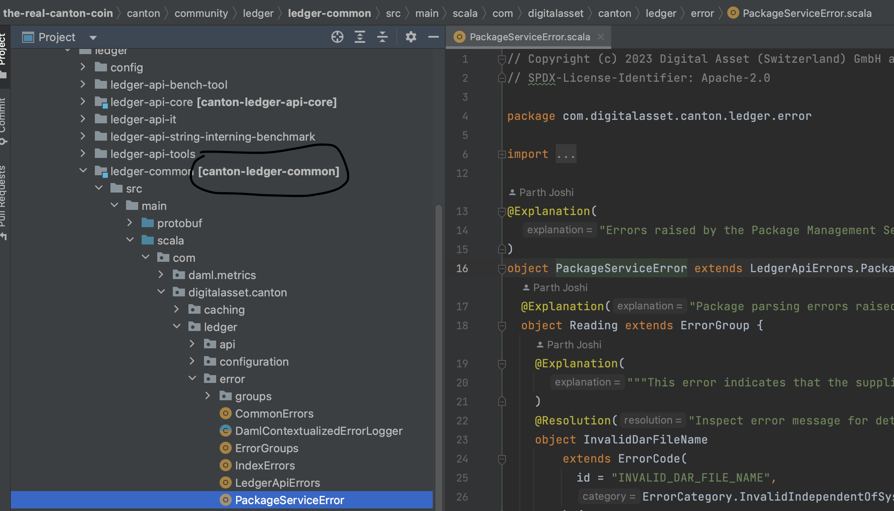

# Bumping External Dependencies

## Bumping CometBFT

1. Update the version in the `nix/cometbft-driver-sources.json` file
2. Download the corresponding `canton-drivers-proto-<version>.jar` file from
   JFrog, at `https://digitalasset.jfrog.io/ui/native/canton-drivers/com/digitalasset/canton/drivers/canton-drivers-proto/<version>/canton-drivers-proto-<version>.jar`,
   and save it under `nix/vendored`.
3. Update the symlink from `nix/vendored/canton-drivers-proto.jar` to point to the newly downloaded jar.
4. Delete the older `canton-drivers-proto-<old-version>.jar` file from `nix/vendored`.

// TODO(#1296): once we pull the file from s3 in nix instead of vendoring it in this repo, update the section above (should be just step 1).

## Bumping Canton

1. Generate a patch file of the JSON API v2 OpenAPI definition by running `diff-openapi.sh` in `token-standard/dependencies/canton-json-api-v2/openapi/`.
2. Choose the Canton version you wish to upgrade to. The currently published versions on
   Artifactory can be found [here](https://digitalasset.jfrog.io/ui/repos/tree/General/canton-enterprise).
3. Update the hashes in `nix/canton-sources.json` by running: `build-tools/bump-canton.sh <version>`
4. In case you have also made configuration changes to Canton in `simple-topology-canton.conf`, remember
   to also make the corresponding changes for our cluster deployments. It is recommended to test any configuration
   changes on scratchnet first.
5. Update the OpenAPI definitions from step 1 by running `update-openapi.sh` in `token-standard/dependencies/canton-json-api-v2/openapi/`.
6. Cleanup the `openapi.patch` file.
   Check `token-standard/dependencies/canton-json-api-v2/openapi/CHANGES.md` and apply any changes manually if CI breaks due to
   token standard CLI issues that look caused by bad OpenAPI definitions.

## Bumping Daml Compiler version

1. Update the `version` in `nix/daml-compiler-sources.json` to the new daml compiler version.
   The compiler version is then used in two places:
   1. To build all daml packages using `sbt damlBuild`
   2. To generate daml docs using `cluster/images/docs/gen-daml-docs.sh`

Note that changing the compiler version changes all package ids and should not be done
without a good reason to do so as changing Daml code requires a governance vote.
One option that often helps is upgrading the compiler if the Daml code is changed anyway
and the package ids change. That way there is no dedicated vote required.

## Bumping Our Canton fork

Initial setup:

1. Check out the [Canton **Open Source** repo](https://github.com/digital-asset/canton)
2. Define the environment variable used in the commands below using `export PATH_TO_CANTON_OSS=<your-canton-oss-repo-path>`. This can be added to your private env vars.

Current Canton commit: `50ef182732c8285cf1bdaeeceac8943b6784e304`

1. Checkout the **current Canton commit listed above** in the Canton open source repo from above, so we can diff our current fork against this checkout.
2. Change to your checkout of the Splice repo and execute the following steps:
   1. Create a branch named `canton-bump-<sprintnr>` in the Splice repo.
   2. Create a Canton patch file capturing all our changes relative to that `./scripts/diff-canton.sh $PATH_TO_CANTON_OSS/ > canton.patch`
   3. Undo our changes: `git apply '--exclude=canton/community/app/src/test/resources/examples/*' --directory=canton -R canton.patch`
      The exclusion is because those files are under a symlink and we don’t want to change them twice.
   4. Create a commit to ease review, `git add canton/ && git commit -s -m"Undo our changes" --no-verify`
3. Checkout the commit of the Canton OSS repo to which you have decided to upgrade in Step 1.1
   1. Learn the Daml SDK version used by Canton from `head -n15 $PATH_TO_CANTON_OSS/project/project/DamlVersions.scala`.
5. Execute the following steps in your Splice repo:
   1. Copy the Canton changes: `./scripts/copy-canton.sh $PATH_TO_CANTON_OSS`
   2. Create a commit to ease review, `git add canton/ && git commit -s -m"Bump Canton commit" --no-verify`
   3. Reapply our changes `git apply '--exclude=canton/community/app/src/test/resources/examples/*' --directory=canton --reject canton.patch`.
   4. Create a commit to ease review `git add canton/ && git reset '*.rej' && git commit -s -m"Reapply our changes" --no-verify`
   5. Bump the SDK/Canton versions in the following places:
      1. The current Canton commit in this `README.md`
      2. If we're also updating the sdk version (this can lead to dar changes so we might skip it)
        1. Set `version` in `CantonDependencies.scala` to the SDK version from Step 3.1
        2. Set `tooling_sdk_version` in `nix/canton-sources.json` to the SDK release version from Step 3.1.
        3. Find in [Daml releases](https://github.com/digital-asset/daml/releases) the daml release that is "based on SDK" with the SDK from Step 3.1.
           Set `daml_release` in `nix/cantno-sources.json` to that release.
        4. Bump the sdk version in our own `daml.yaml` and `*.nix` files via `./set-sdk.sh $sdkversion` to the same Daml SDK version.
        5. Change the hashes for both the linux and macos releases in `daml2js.nix`. To do so change a character of the `sha256` digest (e.g. "ef..." -> "0f...") in `daml2js.nix`,
           and then call `direnv reload` to make the hash validation fail. Adjust the `sha256` digest by copying back the new hash when Nix throws an error during validation.
           Note that nix may print the hash in base64, when you specified it in base16, or vice versa. Just copying the 'got' hash should work in either case.
   6. Create another commit, `git add -A && git reset '*.rej' && git commit -s -m"Bump Canton commit and Canton/SDK versions" --no-verify`
6. Check if the `protocolVersions` in our `BuildInfoKeys` in `BuildCommon.scala` needs to be bumped.
   - One way to do this is to run `start-canton.sh -w` with an updated Canton binary, and check `ProtocolVersion.latest` in the console.
7. Test whether things compile using `sbt Test/compile`.
   In case of problems, here are some tips that help:
   - Check whether there are related `*.rej` files for the parts of our changes that could not be applied.
     The previous PR that bumped our Canton fork can serve as a point of comparison here.
     Search [here](https://github.com/DACH-NY/canton-network-node/pulls?q=is%3Apr+%22bump+canton%22) to identify that PR and
     look at the commits from the "Reapply our changes" step onwards in that PR.
   - Some of our changes might have been upstreamed: adapt `CANTON_CODE_CHANGES.md` accordingly; and resolve the path
     conflicts in favor of the upstreamed code.
   - The file paths and hence import paths may have changed in the upstream code. Change such imports to reflect the new paths.
   - Find the related change in the **closed source Canton repo** and use the change and its commit message to adjust our code.
   - We have some files that we added ourselves to the `canton/` directory, and the above steps happen to delete these.
     See the previous PR for a recent list, and add them back using `git restore -s main <path-to-file>`.
   - In case you run into issues with missing classes, or you find that some code is using a different class to the one defined in the Canton OSS repo,
     then:
     - If the file defining the class exists in the OSS repo but not in our fork, copy it over manually. You should also fix `copy-canton.sh` to ensure it gets
       copied over correctly in the future.
     - If the file already exists in our fork, you may need to [update the build dependencies](#updating-canton-build-dependencies).
8. Step 5 may have made changes to `package-lock.json` files; commit all of these changes.
   Note that you might need to fix the file formatting or dars.lock files (see the next points), due to the usage of `--no-verify` when committing in steps 1-4.
9. Run `sbt damlDarsLockFileUpdate` and commit the changes to `daml/dars.lock`.
10. Make a PR with your changes, so CI starts churning.
11. If there are any, remove all `*.rej` files.
12. Once complete, close your "bump canton fork" issue, create a new one, and assign the new issue to a random person in the team (ideally on a different squad from you).

You can refer to https://github.com/DACH-NY/canton-network-node/pull/446/commits for an example of how the update PR should look like.

## Patching Our Canton fork
When we want to patch our Canton fork with a fix or improvement from a stable release of Canton,
we cherry-pick the relevant commit(s) from the Canton repo to our local branch:
```
    git cherry-pick COMMIT_HASH # you may sign-off the cherry-pick if original DCO is missing
```

### Updating Canton build dependencies

The relevant files defining our build are:
- `CantonDependencies.scala` - contains named constants for the various libraries used by Canton.
- `BuildCommon.scala` - specifies the module and library dependency graph for build targets common to most of our apps.
This is where you should find the dependencies for all the Canton related modules and where you will most likely need to make changes.
- `Dependencies.scala` - contains named constants for the various libraries used by the Splice repo apart from those defined in `CantonDependencies.scala`.
- `build.sbt` - tells SBT how to build the Splice apps making use of the definitions in the above files.

Updating the build dependencies can be a non-trivial and time-consuming process, so please reach out on Slack if you face issues.
It's recommended that you reload sbt and run `Test/compile` after each change to see if the build succeeds.

The following steps should be broadly useful when updating the build dependencies:

- Identify the module in the Splice repo that contains the class you're looking for. If you're an IntelliJ user, module names are
  always displayed in bold in the [Project Tool Window](https://www.jetbrains.com/help/idea/project-tool-window.html)
  (if the directory name is the same as the module name, it just appears bolded; if it is different, the module name appears in bold next
  to the directory name in square brackets). In our repo, the Canton modules are invariably named `canton-xxx`.
  Here is an example of identifying the module containing the class `PackageServiceError` in IntelliJ.
  
- Add a `dependsOn` relationship in `BuildCommon.scala` between the module where the class is being used and the one where it is defined.
- Recompile to check if the build succeeds.

Both Canton and Splice also extensively use Daml SDK libraries and these can at times conflict.

To identify which Daml SDK library defines a particular class:
- search for the class in the [daml OSS repo](https://github.com/digital-asset/daml?search=1)
- identify the module directory and locate the `BUILD.bazel` file inside it.
- search for `maven_coordinates` within the `BUILD.bazel` file to get the name of the library.

To add a new library as a dependency for some module:
- add the library name as a constant in `CantonDependencies.scala` or `Dependencies.scala` as appropriate
- add the library to the list of `libraryDependencies` within the build definition of the required module in `BuildCommon.scala` or `build.sbt`

### Triggering a daml snapshot release

In the [daml](https://github.com/digital-asset/daml/) repository:

1. Create a PR that changes the LATEST file on the main branch
   (i.e., the PR should be against the main branch).
   To prepare a change that requests a snapshot release from the `origin/release/3.0.x` branch,
   run `git fetch && ./release.sh snapshot origin/release/3.0.x 3.0.0`.
   The resulting release version should be something like `3.0.0-snapshot.20240327.12947.0.vdef6b798`.
2. Wait for CI to get green, rerun as necessary.
3. Merge the PR. Anyone with write access to the repo can merge the PR.
4. Wait for release to be published.

Once the release is published, update `CantonDependencies.scala`.

## Bumping base docker images

All docker images that we use as base layers are pinned by SHA.
To update their versions, edit the respective Dockerfiles with the new version to use and its SHA. Note to always use the
SHA of the multi-arch manifest (docker then resolves that to the correct architecture at build time). A good source of
official SHAs for images from docker.io is: https://github.com/docker-library/repo-info.
To inspect a manifest locally, you can run e.g. `docker buildx imagetools inspect nginx:stable`.
