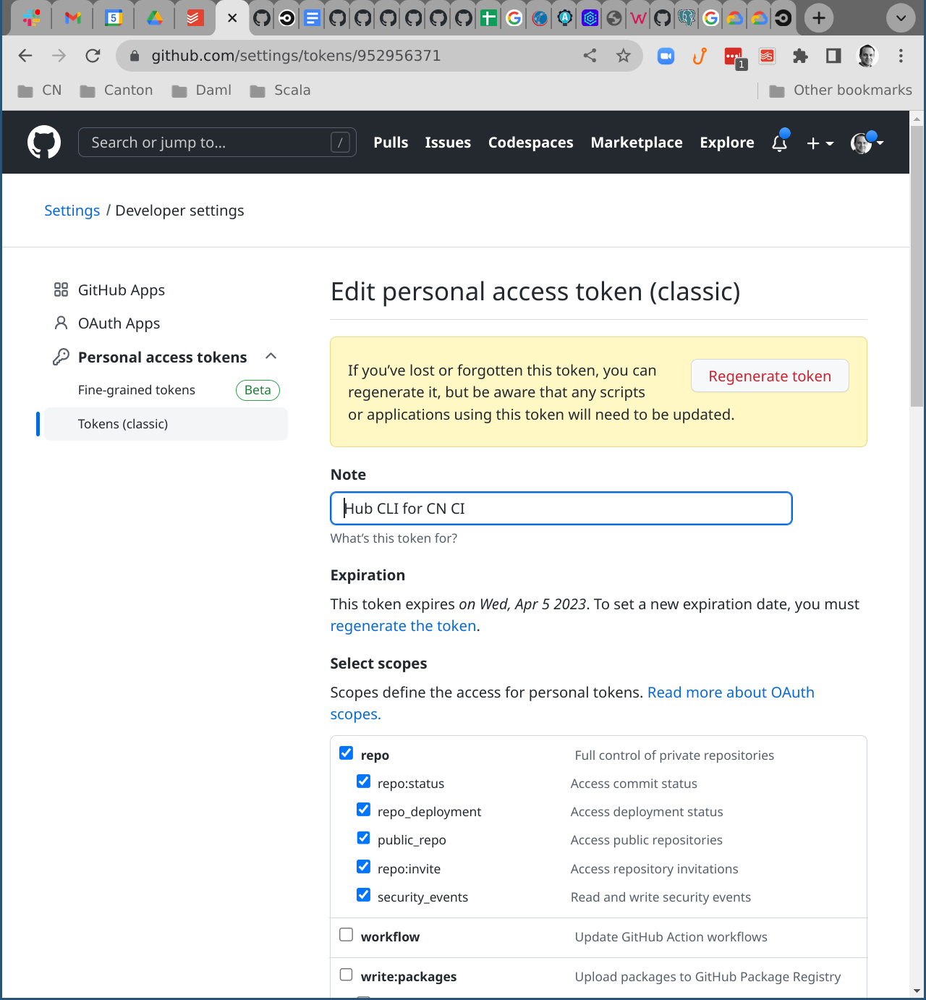
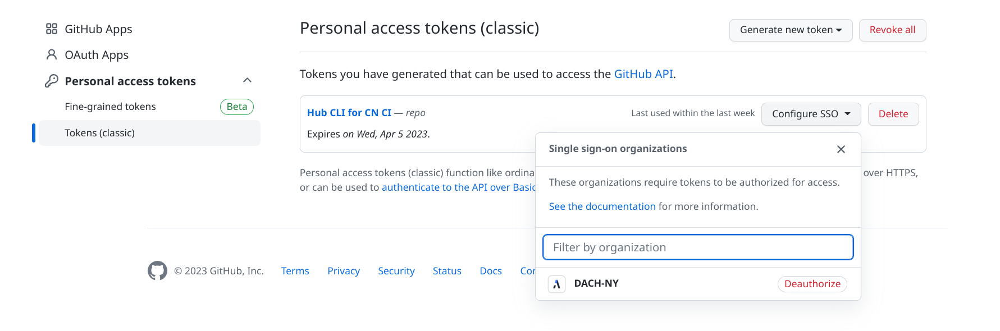

# Table of Contents

- [Table of Contents](#table-of-contents)
  - [Setting up Your Development Environment](#setting-up-your-development-environment)
    - [Private Environment Variables](#private-environment-variables)
    - [Directory Layout](#directory-layout)
    - [IntelliJ Setup](#intellij-setup)
    - [VS Code Setup](#vs-code-setup)
      - [Configuring VS Code for Daml Development](#configuring-vs-code-for-daml-development)
      - [Configuring VS Code for Scala Development](#configuring-vs-code-for-scala-development)
    - [Using `sbt`](#using-sbt)
      - [`sbt` settings](#sbt-settings)
      - [`sbt` Commands](#sbt-commands)
      - [`sbt` Tips\&Tricks](#sbt-tipstricks)
  - [Contributing Changes](#contributing-changes)
    - [Contributing as a New Joiner](#contributing-as-a-new-joiner)
    - [Monitoring Rotation](#monitoring-rotation)
    - [Contribution Guide](#contribution-guide)
    - [Branch naming](#branch-naming)
    - [Unused Import Warnings](#unused-import-warnings)
    - [TODO Comments](#todo-comments)
    - [Configuration](#configuration)
    - [DB migrations](#db-migrations)
    - [Daml Numerics](#daml-numerics)
    - [Editing Daml](#editing-daml)
      - [Backwards-compatible Daml changes](#backwards-compatible-daml-changes)
    - [Bumping External Dependencies](#bumping-external-dependencies)
      - [Bumping CometBFT](#bumping-cometbft)
      - [Bumping Canton](#bumping-canton)
      - [Bumping Daml Compiler version](#bumping-daml-compiler-version)
      - [Bumping Our Canton fork](#bumping-our-canton-fork)
        - [Updating Canton build dependencies](#updating-canton-build-dependencies)
        - [Triggering a daml snapshot release](#triggering-a-daml-snapshot-release)
    - [Message Definitions](#message-definitions)
    - [Config parameters](#config-parameters)
    - [Code Layout](#code-layout)
    - [Domain Specific Naming](#domain-specific-naming)
    - [App Architecture - Initialization](#app-architecture---initialization)
      - [Validator App](#validator-app)
      - [All Other Applications](#all-other-applications)
    - [Frontend Code](#frontend-code)
      - [Background](#background)
      - [New Packages](#new-packages)
      - [Common libs](#common-libs)
    - [Conversions between Java \& Scala types](#conversions-between-java--scala-types)
    - [Porting between branches](#porting-between-branches)
  - [Testing](#testing)
    - [Managing Canton for Tests](#managing-canton-for-tests)
      - [Issues on macOS](#issues-on-macos)
      - [Using a local build of Canton](#using-a-local-build-of-canton)
    - [Managing Frontends for Tests](#managing-frontends-for-tests)
    - [Running and Debugging Integration Tests](#running-and-debugging-integration-tests)
    - [Testing App Behaviour Outside of Tests Without Running Bundle](#testing-app-behaviour-outside-of-tests-without-running-bundle)
    - [Testing Auth0 Auth Flows Locally](#testing-auth0-auth-flows-locally)
    - [Running The Preflight Check](#running-the-preflight-check)
      - [Configure Auth0 Environment](#configure-auth0-environment)
      - [Configure SV Web UI Password](#configure-sv-web-ui-password)
      - [Setting up `lnav` to Inspect Canton and CometBFT logs](#setting-up-lnav-to-inspect-canton-and-cometbft-logs)
      - [Handling Errors in Integration Tests](#handling-errors-in-integration-tests)
    - [Testing CircleCI Deployment Config Changes](#testing-circleci-deployment-config-changes)
    - [Connecting external tools to the shared Canton instances](#connecting-external-tools-to-the-shared-canton-instances)
    - [Testing App Upgrades](#testing-app-upgrades)
    - [Testing cluster upgrades](#testing-cluster-upgrades)
  - [Building and Running the Wallet and Splitwell Apps](#building-and-running-the-wallet-and-splitwell-apps)
    - [Building the Wallet and Splitwell Frontend](#building-the-wallet-and-splitwell-frontend)
    - [Running the Wallet and Splitwell Frontend](#running-the-wallet-and-splitwell-frontend)
    - [NPM Lock file issues](#npm-lock-file-issues)
  - [Auth0 Configuration](#auth0-configuration)
  - [CircleCI Configuration](#circleci-configuration)
  - [CircleCI Tokens](#circleci-tokens)
    - [Auth0 Tokens](#auth0-tokens)
      - [Step 1: rotate all secrets that can be used to gain new access tokens](#step-1-rotate-all-secrets-that-can-be-used-to-gain-new-access-tokens)
      - [Step 2: revoke all existing access tokens by revoking the token signing key](#step-2-revoke-all-existing-access-tokens-by-revoking-the-token-signing-key)
      - [Step 3: restart all services](#step-3-restart-all-services)
    - [CircleCI Token](#circleci-token)
    - [GCP Token](#gcp-token)
    - [GCP Service Account Key for the cluster DNS challenge](#gcp-service-account-key-for-the-cluster-dns-challenge)
    - [Github Tokens](#github-tokens)
    - [VPN Secrets](#vpn-secrets)

For information on the runtime configuration of a Canton Network
cluster, please see the [cluster specific documentation](/cluster/README.md).
(This includes documentation of the process for
[granting access for external partners](/cluster/README.md#granting-vpn-access-to-external-partners) to those
clusters.)


## Setting up Your Development Environment

1. Clone the repository using `git clone git@github.com:DACH-NY/canton-network-node.git`.
1. Submodules:
   - Initialize and update the configs submodule using `git submodule update --init cluster/configs`
   - If you intend to deploy to any clusters, also initialize and update
     the runners container hooks submodule using
     `git submodule update --init .github/runners/runner-container-hooks`. In this case,
     you might want to set `git config submodule.recurse true` to make sure
     both submodules are updated automatically on `git pull` and similar operations.
   - If you intend to deploy to cluster exposed internally (dev, test, mainnet in particular),
     also initialize and update the private configs
     submodule using `git submodule update --init cluster/configs-private`.
1. Install [direnv](https://direnv.net/#basic-installation).
1. Install Nix by running: `bash <(curl -sSfL https://nixos.org/nix/install)`
1. Enable support for nix flakes and the nix command by adding to the
   following to your nix config (either `/etc/nix/nix.conf` if you
   have a multi-user install or `~/.config/nix/nix.conf`):
    ```
    extra-experimental-features = nix-command flakes
    ```
1. Configure artifactory credentials
   You can generate an artifactory Identity Token [here](https://digitalasset.jfrog.io/ui/admin/artifactory/user_profile).
   Your username is shown at the top of the page (under "User profile: XX").
   If you need permissions - please email help@digitalasset.com and ask for artifactory permissions.
   1. For Nix can download `canton`.
      To do so, add the following to `/etc/nix/netrc` (you might need to create that directory as root):
      ```
      machine digitalasset.jfrog.io
      login yourartifactoryusername
      password yourartifactoryidentitytoken
      ```
   1. For access to the canton enterprise docker repo and for sbt to download internal dependencies
      To do so, the `ARTIFACTORY_USER` and `ARTIFACTORY_PASSWORD` must be configured.
      Best would be to add the environment variables to the `.envrc.private` file like so:
      ```
      export ARTIFACTORY_USER="yourartifactoryusername"
      export ARTIFACTORY_PASSWORD="yourartifactoryidentitytoken"
      ```
1. Configure Github Container Registry (GHCR) credentials
   The build pushes images to GHCR. You need to create a personal access token if you want to push images from your local machine.
   From your profile on github, go to Settings, Developer Settings, Personal Access Tokens, Tokens (classic), and create a new token with the `write:packages` scope.
   Best would be to add the environment variables to the `.envrc.private` file like the following:
   ```
   export GH_USER="yourgithubusername"
   export GH_TOKEN="yourgithubtoken"
   ```
1. After switching to the CC repo you should see a line like
   ```
   direnv: error /home/moritz/daml-projects/canton-amulet/.envrc is blocked. Run `direnv allow` to approve its content
   ```
1. Run `direnv allow`. You should see a bunch of output including `direnv: using nix`.
1. If you get an authorization exception, like the following:
   ```
   direnv: using nix
   error: unable to download 'https://digitalasset.jfrog.io/artifactory/canton-enterprise/canton-enterprise-2.7.0-snapshot.20230614.10547.0.v03419b62.tar.gz': HTTP error 401 ('Unauthorized')
   ```
   1. Check that your access token is valid by running the following sample command:
      ```
      curl -vvv -L -u<yourartifactoryusername>:<yourartifactoryidentitytoken> "https://digitalasset.jfrog.io/artifactory/canton-enterprise/canton-enterprise-2.7.0-snapshot.20230614.10547.0.v03419b62.tar.gz" -o canton-enterprise-2.7.0-snapshot.20230614.10547.0.v03419b62.tar.gz
      ```
      If the download fails, check that your access token matches what is set in [Artifactory](https://digitalasset.jfrog.io/ui/admin/artifactory/user_profile).
      Also, check you have visability via the UI [here](https://digitalasset.jfrog.io/ui/repos/tree/General/canton-enterprise).
      If you don't have visability via the UI then check with [helpdesk](help@digitalasset.com).
   2. If the artifact successfully downloaded, check the access rights of the file `/etc/nix/netrc`.
      If the access rights are more restrictive than `-rw-rw-r--`, update them:
      ```
      chmod 664 /etc/nix/netrc
      ```
      Note - `sudo` may be required to run the above command.
   3. Switch the CC repo.
   4. If the authorization exception isn't resolved, investigate further with additional logging
      by running the following command at the root of the CC repo :
      ```
      nix develop --debug --verbose path:nix
      ```
1. (optional) Enable [pre-commit](https://pre-commit.com/) to enforce format rules automatically:
    ```
    pre-commit install
    # or:
    pre-commit install -t pre-push
    ```
    _Note_: if you want to skip specific pre-commit hooks, add the hook ids to the `SKIP` variable separated by commas,
            e.g. `export SKIP=scalafmt` (see https://pre-commit.com/#temporarily-disabling-hooks).
            Also, you can bypass running pre-commit hooks altogether using the `--no-verify` / `-n` git commit option.

     **Important:** start your IDE and other development tools from a console that
     has this `direnv` loaded; and thus has the proper version of all the
     project dependencies on its `PATH`.

     If you encounter issues, try exiting and reentering the directory to reactivate direnv.

1. On MacOS, please install the following globally:
   1. Firefox, by following the process here: <https://www.firefox.com>
1. Configure CircleCI.
    Open `./.circleci/cluster-lock-users.json`, and add a line of the format
    ```
    "<circleci-username>": ["<local-username>"],
    ```
    where `circleci-username` is the username you are using for logging into CircleCI
    (your GitHub username if you are logging into CircleCI using your GitHub account)
    and `local-username` is the local username on your machine (as returned by `whoami`).

    Open `./circleci/cluster-lock-slack-ids.json`, and add a line of the format
    ```
    "<local-username>": "<slack-user-id>",
    ```
    to receive slack pings when your cluster lock is ~1hr away from expiring. Determine your user ID
    from your profile settings, as described [here](https://www.workast.com/help/article/how-to-find-a-slack-user-id/).
1. On MacOS, activate admin privileges using the lock icon (🔒 → 🔓) in the Dock, go to
    System Settings → General → AirDrop & Handoff, and disable AirPlay Receiver. Otherwise
    you will see on `start-canton.sh` runs
    ```
    Exception in thread "main" java.io.UncheckedIOException: Could not create Prometheus HTTP server
    Caused by: java.net.BindException: Address already in use
    ```

### Private Environment Variables

There are a number of environment variables managed with `direnv` that
are used to contain private information. This includes credentials to
a range of external services, including Auth0 and Artifactory. To keep
this private information private, they are stored in a specific file
in the root of the project repository: `.envrc.private`. This file is
listed in `.gitignore` to prevent accidental commit to the repository.

Due to requirement to manually create and populate this file, there is
also checking to verify that the environment definitions expected to
be present in `.envrc.private` are in fact present. Missing
definitions will cause a warning to be reported when `.envrc` is
executed.

A list of expected environment definitions is as follows:

* Auth0 Management API credentials (taken from the *API Explorer* application defined within each Auth0 tenant)
   * `AUTH0_CN_MANAGEMENT_API_CLIENT_ID`/`AUTH0_CN_MANAGEMENT_API_CLIENT_SECRET` - Auth0 [API Explorer](https://manage.auth0.com/dashboard/us/canton-network-dev/applications/ECfosW3sLHUfHatCRLEGUQ9YG9XMs9aq/settings) settings page. (Note `canton-network-dev` tenant.)
   * `AUTH0_SV_MANAGEMENT_API_CLIENT_ID`/`AUTH0_SV_MANAGEMENT_API_CLIENT_SECRET` - Auth0 [API Explorer](https://manage.auth0.com/dashboard/us/canton-network-sv-test/applications/OjD90OemoxGYTLqzmbSTDJlmCi6nbUnu/settings) settings page. (Note `canton-network-sv-test` tenant.)
   * `AUTH0_VALIDATOR_MANAGEMENT_API_CLIENT_ID`/`AUTH0_VALIDATOR_MANAGEMENT_API_CLIENT_SECRET` - Auth0 [API Explorer](https://manage.auth0.com/dashboard/us/canton-network-validator-test/applications/afx3XOvqCQlP43M3MTNJMwgrgKXzXlBV/settings) settings page. (Note `canton-network-validator-test` tenant.)
   * `AUTH0_TESTS_MANAGEMENT_API_CLIENT_ID`/`AUTH0_TESTS_MANAGEMENT_API_CLIENT_SECRET` Auth0 [API Explorer](https://manage.auth0.com/dashboard/us/canton-network-test/applications/DnmjyCAmMHWVD0yS0jZLgBv8pKL7dVMM/settings) settings page. (Note `canton-network-test` tenant.)
* Artifactory credentials
   * `ARTIFACTORY_USER`: your username at digitalasset.jfrog.io (can be seen in the top-right corner after logging in with Google SSO)
   * `ARTIFACTORY_PASSWORD`: Your identity token at digitalasset.jfrog.io (can be obtained by generating an identity token in your user profile)
* Github credentials
   * `GH_USER`: your Github username
   * `GH_TOKEN`: your Github personal access token

Be aware: The Auth0 tokens allow the requester to perform any
administrative action against the Auth0 tenant! Use caution and keep
production values secure.

### Directory Layout

See the `README.md` files in the top-level directories for details.

Most top-level directories logically correspond to independent repositories,
which are currently maintained within this one repository for increased
delivery velocity using head-based development.

We expect to start splitting off repositories as part of the work to deliver
M3 - TestNet Launch.

### IntelliJ Setup

* The following instructions work for recent IntelliJ installs (tested on "IntelliJ IDEA 2024.3 (Community Edition)").
* Install the Scala plugin in IntelliJ if you don't have it yet.
* Clone the repository first, if you haven't yet, and setup `direnv`
  (otherwise the environment variables referenced below are not defined).
* **Important**: start IntelliJ from the repo directory so that it has access to all the environment variables
  and the `nix` packages defined using `direnv` .
  On macos, this can be done via the `open` command, for example: `open -a "IntelliJ IDEA CE"`.
* Open the repository via "File -> Open".
* IntelliJ should prompt you whether you want to import the `sbt` project. Answer yes. The import will fail
  though as the JDK and sbt launcher are not yet setup.
* Determine the path for the JDK by running `echo $JAVA_HOME` in the repo root and add it to IntelliJ using
  the "Add JDK from disk" action (can be found using Ctrl-Shift-A).
* Determine the path of the sbt launcher using `echo $SBT_LAUNCH_PATH` and add it
  using the "&launcher (sbt launch.jar)" config (can be found using Ctrl-Shift-A).
  See sbt explanations [here](https://www.jetbrains.com/help/idea/sbt.html) for more info.
* Your sbt settings should in the end roughly look like the ones in this [screenshot](https://i.imgur.com/B3yWCZ9.png)

You should then see a 'sbt shell' window in IntelliJ that allows you to build and test the Scala code while using the
same package references as nix. If IntelliJ asks you at the end if you want to overwrite any previous `.idea/*` files, say yes.

### VS Code Setup

There are a few extensions that improve the VS Code experience when working on various parts of the Canton Network codebase, or for general collaboration. The recommendation is to pick the ones that currently seem relevant or useful to you.

**Recommended Extensions**:
- [GitLens](https://marketplace.visualstudio.com/items?itemName=eamodio.gitlens): Nice integration of git history/metadata inside the editor, displays git authors inline
- [Open in GitHub](https://marketplace.visualstudio.com/items?itemName=ziyasal.vscode-open-in-github): Makes it easy to share specific links to code via an in-editor context menu option
- [Docker](https://marketplace.visualstudio.com/items?itemName=ms-azuretools.vscode-docker)
- [Makefile Tools](https://marketplace.visualstudio.com/items?itemName=ms-vscode.makefile-tools)
- [OpenAPI Editor](https://marketplace.visualstudio.com/items?itemName=42Crunch.vscode-openapi)
- [YAML](https://marketplace.visualstudio.com/items?itemName=redhat.vscode-yaml)
- [Prettier](https://marketplace.visualstudio.com/items?itemName=esbenp.prettier-vscode): Code formatter for webdev-related stacks (Typescript/React/...)
- [Scala Syntax](https://marketplace.visualstudio.com/items?itemName=scala-lang.scala): Syntax highlighting for Scala files, only; use `Metals` for adding IDE-like functionality
- [Scala Metals](https://marketplace.visualstudio.com/items?itemName=scalameta.metals)
- [Run it On](https://marketplace.visualstudio.com/items?itemName=fsevenm.run-it-on): Optional, if you want to add an automatic "scalafix on save" command while editing Scala files
- [Nix](https://marketplace.visualstudio.com/items?itemName=bbenoist.Nix)
- [vscode-proto3](https://marketplace.visualstudio.com/items?itemName=zxh404.vscode-proto3)

#### Configuring VS Code for Daml Development

- Install the Daml open source SDK by running
   ```
   ./build-tools/install-daml-sdk.sh
   ```
   or by following the instructions at https://docs.daml.com/getting-started/installation.html,
   while making sure that you install the version of the SDK referenced in `nix/canton-sources.json`.
   - The Daml SDK is not required for building our repository, but it's required for the Daml extension in VS Code.
- Install the Daml extension by running `daml studio` or by manually installing it from the VS Code extensions UI.

#### Configuring VS Code for Scala Development

It is possible to use VS Code for Scala development via the Metals extension (see above), if you'd prefer not to use IntelliJ (or just want to try it out). Setting this up requires some similar configuration as IntelliJ:

* **Metals: Java Home**: From a terminal inside the repository directory & direnv environment, run `echo $JAVA_HOME` which should give you your Java Home path from nix: `/nix/store/<nix-pkg-id>...`. If not, try `which java` which should give you the nix path `/nix/store/<nix-pkg-id>.../bin/java`; strip the `/bin/java` suffix and use that path.
* Follow any VS Code prompts to restart bloop/metals or reload the window
* Ensure the following is in your VS Code `settings.json` (search for `Preferences: Open User Settings (JSON)` in the command palette):

```json
   "files.exclude": {
      "**/.bloop": true
   },
   "files.watcherExclude": {
      "**/.bloop": true,
      "**/.metals": true,
      "**/.ammonite": true
   },
```

* Optional: To run `scalafix` on a file, you can either use the `Metals: Run all scalafix rules` command from the command palette, or add the following to `settings.json` to run scalafix automatically every time you save:

```json
  "runItOn": {
    "commands": [
      {
        "match": ".*.scala",
        "isShellCommand": false,
        "cmd": "metals.scalafix-run"
      }
    ]
  },
```

This configuration requires the `Run it On` plugin to be installed.

**Caveats**
- I haven't tested the `sbt` integration, instead opting for running builds/tests/etc from the command line. Metals is still useful for providing type hints, syntax error catching, auto-complete, "go-to-definition", etc. In theory, you should be able to provide the path of the `sbt` binary vended by nix (via `which sbt`) to the `Sbt Script` option in the Metals settings.
- The cache can be finnicky: be prepared to have to re-import the build or re-compile the workspace, particularly if checking out different branches to get symbols to resolve properly again

### Using `sbt`

#### `sbt` settings
Make sure to configure the JVM heap size to at least 4G when using IntelliJ. In particular:
- In Intellij, under Settings, search for "sbt" and then under JRE add `-Xmx4G -Xms2G` to VM Parameters.
- In Intellij in the same menu, set the maximum heap size to at least 4000M.

#### `sbt` Commands

This Section gives an overview of common sbt commands.
More commands can be found in build.sbt and BuildCommon.scala.
To run these commands, enter the `sbt` shell by running `sbt` in the repo root.

Alternatively, you can execute the commands outside the shell by running `sbt '<command>'`.
Note that the entire command must be quoted in this case, especially if it has spaces or special characters
(like the `testOnly` examples in the Test section below).

- `clean`: deletes all generated files (in the target directory)
- `clean-splice`: like clean but only for our own apps not for the Canton fork
- `compile`: compile production code (excluding test code)
- `Test/compile`: compile production and test code
- `apps-common/compile`: compile production code of the `apps-common` subproject
- `apps-frontends/compile`: compile and codegen only frontend code
- `apps-frontends/npmTest`: runs all frontend unit tests
- `apps-frontends/npmGenerateViteReport`: generates a html report of the vite frontend tests after the above was executed (named report.html located in the log folder)
- `apps-frontends/npmLint`: checks formatting of frontend code, but does not fix anything
- `apps-frontends/npmFix`: fixes formatting of frontend code
- `scalafixAll`: invoke scalafix across all configurations where scalafix is enabled.
    `scalafix` is a linting and rewrite tool. This may run for a long time as it needs to do a full compile.
- `format`: apply `scalafmt` to format source files
- `formatFix`: apply `scalafmt`, `sbt scalafixAll`, and `sbt apps-frontends/npmFix` to format source files
- `lint`: lint-check. Does not apply any fixes. Checks enforcement of `scalafmt`, `buf`, `scalafix`, `apps-frontends/npmLint`, and `shellcheck` rules
- `damlBuild`: create `.dar` files for all Daml projects
- `bundle`: create a release bundle in `apps/app/target/release/<version>`. The release binary is loaded into your PATH automatically via `direnv`. Simply run `amulet` to call it.
- `checkErrors`: check test log for errors and fail if there is one. Note that if you haven't deleted your local log file in a long time, this may find very old errors.

Test:
- `testOnly myWildcard`: runs all tests matching wildcard, e.g.,
  `testOnly com.digitalasset.myPackage.*` runs all tests in package `com.digitalasset.myPackage`.
  `testOnly *Wallet* -- -z "allow calling tap"` runs all tests with classname matching `*Wallet*` and test description matching `allow calling tap`.
- `test`: Note that it is [not currently advisable](https://github.com/DACH-NY/canton-network-node/issues/2098) to use this command. Use the `testOnly` commands described above to run specific tests and use the CI to run all tests.
- `damlTest`: run the Daml script tests included with the apps' Daml files

#### `sbt` Tips&Tricks

Things sometimes go wrong with `sbt` in ways that are hard to debug. This section will list common tips&tricks for getting `sbt` to do what we want it to.
- In case you see unexpected build failures after switching branches, run `sbt reload` to have sbt update its internal state.
- In case you continue to see unexpected build failures, despite following every other trick in this section, you probably need to delete the sbt build files. If you suspect the build failures come from CN build files, run `sbt clean-splice` to delete all CN build files. If the error might come from the build files of the OS Canton dependency, run `sbt clean` to delete all build files managed by sbt. Subsequent `sbt Test/compile`s should then succeed.
-

### Troubleshooting
- MacOS: If you previously installed nix and suddenly have no access to the command. As a result, when reloading the project environment, you may see something like `./.envrc:8: nix: command not found`. To fix this, first verify that the executable is available in `/nix/var/nix/profiles/default/bin/nix`. If yes, then you may want to add the folowing as seen [here](https://github.com/NixOS/nix/issues/3616#issuecomment-903869569) to your (bash|zsh)rc file.

```
  # Nix
    if [ -e '/nix/var/nix/profiles/default/etc/profile.d/nix-daemon.sh' ]; then
      source '/nix/var/nix/profiles/default/etc/profile.d/nix-daemon.sh'
    fi
  # End Nix
```

## Contributing Changes

### Contributing as a New Joiner
For your first issue, you can take a look at [issues labelled with the `starter` tag](https://github.com/DACH-NY/canton-network-node/issues?q=is%3Aissue+label%3Astarter). Else, please ask your onboarding
buddy for help with getting started on the code base.

### Monitoring Rotation

(The current incarnation of what we used to call "Support Rotation", "Flake Rotation", "Flaky Test Duty", ...)

The Canton Network team has a weekly monitoring rotation.
Two to four (depending on the overall stability situation) engineers are explicitly assigned each week (currently Wednesday to Wednesday) to be responsible for driving the resolution of failures that occur in our test and production environments.
For the engineers on monitoring duty, this work is their priority over any other issues on which they may be working,
with failures on partner-facing networks (especially `mainnet`, but also `testnet` and `devnet`) taking priority over other types of failures.

The job of an engineer on monitoring duty is to _drive the resolution_ of
failures. This does not mean that these engineers must
fix all problems themselves, nor does it mean that everything
should be fixed. Driving the resolution means clearly communicating
status of the issue as it progresses from beginning to end,
marshalling any other staff on the team needed for a resolution, and
then helping organize the work to fix. Canton Network is a team
effort, and the team should be brought in to resolve failures and flakes as it is
helpful. The team may also decide based on priorities and future plans
that a specific failure isn't worth the time to fix. This is fine, as
long as there is consensus on the decision and it is clearly
communicated.

In a nutshell, the responsibilities of an engineer on monitoring duty are:

1. Monitor and triage failures reported on (**in priority order**):
   1. [#team-canton-network-mainnet-deployment](https://daholdings.slack.com/archives/C0731SHS3HB)
   2. [#team-canton-network-dev-testnet-deployment](https://daholdings.slack.com/archives/C06SMCCBYQH)
   3. [#supervalidator-operations](https://daholdings.slack.com/archives/C085C3ESYCT) - engage on issues that could threaten overall stability and/or are possibly due to bugs in our software and/or documentation
   4. [#validator-ops](https://daholdings.slack.com/archives/C08AP9QR7K4) - engage on issues that are possibly due to bugs in our software and/or documentation
   5. [CN Cluster Failures](https://github.com/orgs/DACH-NY/projects/48) project (Inbox)
   6. [#team-canton-network-internal-ci](https://daholdings.slack.com/archives/C05DT77QF5M)
   7. [#team-canton-network-internal-alerts](https://daholdings.slack.com/archives/C064MTNQT88)
   8. [#team-canton-network-cilr-notifications](https://daholdings.slack.com/archives/C06VDG5RXNE)
2. Drive resolution of failures - delegate and/or alert others about frequent and disruptive failures.
3. Escalate to “manager on duty” if too much is going on and we need additional monitoring help.
4. (lower prio) Resolve issues yourself.
5. (at end of rotation) Do an explicit handover to the next monitoring team.

Note that while the channels to monitor are listed here in priority order, it is also acceptable for engineers on the same rotation to "split up" their monitoring and triaging efforts
(e.g.: two engineers focusing more on production clusters, the other two engineers more on CI failures and CI-managed clusters).
However: Each engineer on monitoring rotation is responsible for ensuring that the rotation as a whole operates based on above priorities; specifically that production clusters receive a level of attention that matches their current level of (in)stability.

Monitoring duty is organized based on the [CN Monitoring Rotation](https://docs.google.com/document/d/1VXC1RClOC9CLIjR4-so7sn12Tl9csqD7kGObj6QAZ0Q/edit) Google doc.
Each monitoring week has a manager assigned to it (typically Martin or Ray).
The manager on duty's responsibility is:

- Making sure that two or more engineers are scheduled to be on rotation for the week (and that those engineers are aware of this).
- Being a single point of contact in case of concerns about the current failures situation (both for the engineers on rotation and other team members).
- Assisting the engineers on monitoring rotation by marshalling additional resources (for both triaging and resolution work) when needed.

Monitoring rotation currently begins and ends on Wednesdays.
At each boundary, the outgoing and incoming engineers on monitoring duty rotation must have a brief touchpoint meeting to go over any issues still under resolution.

Important: we rely on there always being at least two engineers available on monitoring duty.
Engineers on monitoring duty that have a day off should ensure that another engineer will substitute for them.

For engineers on monitoring duty, the resolution process is as follows.

* When there is a Slack message or an automatically created issue that indicates a failure,
  follow the checklist [for flakes](support/FLAKE_CHECKLIST.md).
* PRs for any fixes should also be linked to the issue.
* For failures that are not frequent enough to warrant a fix, the
  issue in Github should be moved to the "Infrequent / no repro" column
  (if tracked via [the board](https://github.com/orgs/DACH-NY/projects/48/))
  or labeled "infrequent/no repro".
* For failures that are especially disruptive, the
  issue in Github can be labeled "now" to signal its importance.

At the end of a day of monitoring, please add to your **[standdown]** the current number of issues
in the "Inbox" and "Triaged" columns of the [CN Cluster Failures](https://github.com/orgs/DACH-NY/projects/48/) board.
This helps the team get a feeling for the current situation and acts as a reminder for you to check that Inbox frequently :)

Further reading:
- [alerts checklist](support/ALERTS_CHECKLIST.md)
- [flake checklist](support/FLAKE_CHECKLIST.md)
- [preflight checklist](support/PREFLIGHT_CHECKLIST.md)
- [network health](network-health/NETWORK_HEALTH.md)
- [operating on production clusters](OPERATIONS.md)
- [strategies for reacting to a failed TestNet or DevNet deployment](cluster/README.md#strategies-for-reacting-to-a-failed-testnet-or-devnet-deployment)

For **support** duty, also during off hours, see [CN L3 Support](https://docs.google.com/document/d/1mc60ha2SwiTsEzGDzpOcY4eh_RKFPy415FvB5K-4XkA/edit).

#### Technical helpers: tracking recent activity

We have a script `./scripts/monitor-flaky-tests.sh` that can be helpful for keeping track of new activity (e.g. team members reporting new occurrences of flakes on individual PRs) on flaky issues you may not be subscribed to on GitHub. A good way to use this is with the watch command for live updates, like `watch -n 120 ./scripts/monitor-flaky-tests.sh`. The `gh` command requires you to authenticate to GitHub. You can run `gh auth login` once, or add a repo-scoped personal access token in a var (`export GH_TOKEN=...`) in `.envrc.private`.

By default, the script returns the top 5 most recent issues. Use the `-l <int>` argument to fetch more issues.

#### Technical helpers: managing automatically generated issues

Issues on the [CN Cluster Failures](https://github.com/orgs/DACH-NY/projects/48/) are generated automatically.
This can sometimes lead to a large number of quasi-duplicate issues,
for example when `cidaily` failed to deploy on a (Sun-)day and all `cidaily` triggers failed for that reason.
To save you the many clicks need to close all of these issues via the UI, you can use the `gh` tool we have in our `nix` (see above).
For example to close all issues from #2279 to #2308 you could do (fish shell snippet):

```
for num in (seq 2279 2308); gh issue close -R https://github.com/DACH-NY/cn-test-failures --comment "cidaily was down" --reason "not planned" $num; end
```

### Contribution Guide

We share a lot of our tooling and processes with Canton.
We thus use [Canton's Contributing Guide](https://github.com/DACH-NY/canton/blob/main/contributing/README.md)
as a baseline, and list below only the points where we differ.

Please read the above guide in particular to learn about metrics, logging, tracing, Scala guidelines, Protobuf guidelines, TODO notes, formatting and git hooks.

Committed code must adhere to our formatting guidelines. To automatically reformat all code, run `sbt formatFix`.

### Branch naming

Branches should be prefixed by your name, followed by a slash and a descriptive name:

`<yourname>/<descriptivename>`

For example, if Bob is working on issue 4242 to "fix FooTest", he could name his branch:

`bob/fix-footest/4242`

### Unused Import Warnings

If the unused import, local variable or implicits warnings get in the way during development, you can locally turn them into
an info summary that just displays the number of warnings by creating the file `.disable-unused-warnings` and
calling `sbt reload`. Note that this requires a partial re-compile.

### TODO Comments

Call `./scripts/check-todos.sh` to extract a list of all TODO comments in the project,
and get a list of TODO comments that do not conform [Canton's TODO style guidelines](https://github.com/DACH-NY/canton/blob/main/contributing/README.md#todo-comments).
Note that in contrast to these guidelines, we
- disallow `FIXME` comments on `main`
- use a double-number milestone format, e.g. `M3-08`
- ignore `.. todo::` comments in .rst files
- use normal .rst comments, e.g., `.. TODO(M1-14): some left-over doc work`

Note that these guidelines are enforced in CI.

### Configuration

The applications are configured using [HOCON](https://github.com/lightbend/config/blob/main/HOCON.md) files.

Run `./scripts/print-config.sh FILE` in order to retrieve a canonical form of a given
config file, with includes and substitutions resolved and comments stripped.

**NOTE:** Although in some cases, the use of system props may work, only environment variables are fully supported
across the stack. As a result, please ensure that you use environment variables for all overrides.


### DB migrations

Refer to [the main README on migrations](apps/common/src/main/resources/db/migration/README.md).

### Daml Numerics

To represent Daml `Numeric`s for any user facing APIs (console commands), we use `scala.math.BigDecimal`s.
We use Scala BigDecimals instead of Java BigDecimals (that are used in the Daml repo) because
integers, floats etc. are automatically converted
to Scala BigDecimals by the Scala compiler unlike Java BigDecimals
(`wallet.tap(10)` vs `wallet.tap(new java.math.BigDecimal(10))`).

To represent Daml Numerics in Protobuf we use `string`s (there is no Protobuf BigDecimal type). Conversions to
and from `string`s should occur via `org.lfdecentralizedtrust.splice.util.Proto.encode/tryDecode`.

When interacting with the Ledger API, we convert the Scala BigDecimals to Java BigDecimals.

Overall, please refer to the `wallet.tap` command implementation for the canonical handling of Daml Numerics.

### Editing Daml

We use separate Daml projects for separate apps (e.g. CC, the Wallet, and the Directory).
You can find these projects in the `daml/` subfolders of the respective apps.
These Daml projects define the on-ledger API used to synchronize different parties in the apps' workflows.

We build and test these projects using the `sbt` commands `damlBuild` and `damlTest`.
The implementation of the `sbt` plugin can be found in [`/project/DamlPlugin.scala`](/project/DamlPlugin.scala).

To edit the files in a particular Daml project, for example, `/apps/wallet/daml`, proceed as follows:

1. Start `sbt` in the repo root to get access to an `sbt` shell (or use the one in IntelliJ).
2. Start `damlBuild` in your `sbt` shell to build the .dars for all Daml projects.
3. Start `daml studio` in the repo root, which starts VS code.
4. Open and edit the .daml files in `/apps/wallet/daml` in VS code. You should see them being typechecked on the fly.
5. See `/apps/wallet/daml/daml.yaml` for the .dar dependencies of `/apps/wallet/daml`.
   If you change any of them, then you can propagate these changes across the .dars as follows:
   1. redo Step 2
    3. use Ctrl-Shift-P "Developer: Reload Window" in VS code to restart the `daml studio` language server with the updated package dependencies.

*Tip:* if `damlBuild` fails with weird errors, then that might be due to stale `damlBuild` outputs.
Try forcing a clean rebuild by cleaning via SBT, e.g., `apps-common/clean` and similar for the dependent project.

To prevent accidental changes to dar files, we commit their current package IDs with the repo,
in daml/dars.lock. CI verifies that those package IDs are correct. If you intentionally make
changes in daml code, please run `sbt damlDarsLockFileUpdate` and commit the updated `dars.lock`
file along with your dar changes.

#### Backwards-compatible Daml changes

We require all Daml changes to be backwards-compatible. The best docs for that can currently be found
in this draft of the [Daml app upgrading guidelines](https://docs.google.com/document/d/10ttHyhufCI7hGEsd0CA2VCjsXPhAg7Hg-fVeMQOKS4U/edit#heading=h.m26v9yc5o96).

In the early days of Daml 3.0 upgrading of variants and enums was not supported, which is why there
are variant constructors with names like `ExtFoo` in our codebase. They used to be a workaround for
this lack of upgradeability. You can ignore them, and just add new enum and variant constructors directly.

Care still must be taken to not accidentally change an enum into a variant: enums are `data` type declarations
that only consist of nullary constructors. They are compiled to Daml-LF enums, which is nice as that
ensures that the codegens like the Java codegen define these as Jave enums as well. **Make sure to only add
further nullary constructors to types that only have nullary constructors.**


### Bumping External Dependencies

#### Bumping CometBFT

Update the version in the `nix/cometbft-driver-sources.json` file

#### Bumping Canton

1. Update the Canton Enterprise `version` in `nix/canton-sources.json`. The currently published versions on
   Artifactory can be found [here](https://digitalasset.jfrog.io/ui/repos/tree/General/canton-enterprise).
2. Update the `sha256` hash in the same file by first running `direnv reload` to make the hash validation fail
   and using the 'got' hash printed by nix. This is usually easier and more accurate than copying the sha256 hash
   displayed for the release version in Artifactory.
3. In case you have also made configuration changes to Canton in `simple-topology-canton.conf`, remember
   to also make the corresponding changes for our cluster deployments. It is recommended to test any configuration
   changes on scratchnet first.

#### Bumping Daml Compiler version

1. Update the `version` in `nix/daml-compiler-sources.json` to the new daml compiler version.
   The compiler version is then used in two places:
   1. To build all daml packages using `sbt damlBuild`
   2. To generate daml docs using `cluster/images/docs/gen-daml-docs.sh`

Note that changing the compiler version changes all package ids and should not be done
without a good reason to do so as changing Daml code requires a governance vote.
One option that often helps is upgrading the compiler if the Daml code is changed anyway
and the package ids change. That way there is no dedicated vote required.

#### Bumping Our Canton fork

Initial setup:

1. Check out the [Canton **Open Source** repo](https://github.com/digital-asset/canton)
2. Define the environment variable used in the commands below using `export PATH_TO_CANTON_OSS=<your-canton-oss-repo-path>`. This can be added to your private env vars.

Current Canton commit: `7613b111d4d2a6d60b9ef59d204781b99774094c`

1. Checkout the **current Canton commit listed above** in the Canton open source repo from above, so we can diff our current fork against this checkout.
2. Change to your checkout of the canton coin repo and execute the following steps:
   1. Create a branch named `canton-bump-<sprintnr>` in the Canton Coin repo.
   2. Create a Canton patch file capturing all our changes relative to that `./scripts/diff-canton.sh $PATH_TO_CANTON_OSS/ > canton.patch`
   3. Undo our changes: `git apply '--exclude=canton/community/app/src/test/resources/examples/*' --directory=canton -R canton.patch`
      The exclusion is because those files are under a symlink and we don’t want to change them twice.
   4. Create a commit to ease review, `git add canton/ && git commit -m"Undo our changes" --no-verify`
3. Checkout the commit of the Canton OSS repo to which you have decided to upgrade in Step 1.1
   1. Learn the Daml SDK version used by Canton from `head -n15 $PATH_TO_CANTON_OSS/project/project/DamlVersions.scala`.
5. Execute the following steps in your Canton Network Node repo:
   1. Copy the Canton changes: `./scripts/copy-canton.sh $PATH_TO_CANTON_OSS`
   2. Create a commit to ease review, `git add canton/ && git commit -m"Bump Canton commit" --no-verify`
   3. Reapply our changes `git apply '--exclude=canton/community/app/src/test/resources/examples/*' --directory=canton --reject canton.patch`.
   4. Create a commit to ease review `git add canton/ && git reset '*.rej' && git commit -m"Reapply our changes" --no-verify`
   5. Bump the SDK/Canton versions in the following places:
      1. The current Canton commit in this `README.md`
      2. If we're also updating the sdk version (this can lead to dar changes so we might skip it)
        1. Set `version` in `CantonDependencies.scala` to the SDK version from Step 3.1
        2. Set `sdk_version` in `nix/canton-sources.json` to the SDK release version from Step 3.1.
        3. Bump the sdk version in our own `daml.yaml` and `*.nix` files via `./set-sdk.sh $sdkversion` to the same Daml SDK version.
        4. Change the hashes for both the linux and macos releases in `daml2js.nix`. To do so change a character of the `sha256` digest (e.g. "ef..." -> "0f...") in `daml2js.nix`,
           and then call `direnv reload` to make the hash validation fail. Adjust the `sha256` digest by copying back the new hash when Nix throws an error during validation.
           Note that nix may print the hash in base64, when you specified it in base16, or vice versa. Just copying the 'got' hash should work in either case.
   6. Create another commit, `git add -A && git reset '*.rej' && git commit -m"Bump Canton commit and Canton/SDK versions" --no-verify`
6. Check if the `protocolVersions` in our `BuildInfoKeys` in `BuildCommon.scala` needs to be bumped.
   - One way to do this is to run `start-canton.sh -w` with an updated Canton binary, and check `ProtocolVersion.latest` in the console.
7. Test whether things compile using `sbt Test/compile`.
   In case of problems, here are some tips that help:
   - Check whether there are related `*.rej` files for the parts of our changes that could not be applied.
     The previous PR that bumped our Canton fork can serve as a point of comparison here.
     Search [here](https://github.com/DACH-NY/canton-network-node/pulls?q=is%3Apr+%22bump+canton%22) to identify that PR and
     look at the commits from the "Reapply our changes" step onwards in that PR.
   - Some of our changes might have been upstreamed: adapt `CANTON_CODE_CHANGES.md` accordingly; and resolve the path
     conflicts in favor of the upstreamed code.
   - The file paths and hence import paths may have changed in the upstream code. Change such imports to reflect the new paths.
   - Find the related change in the **closed source Canton repo** and use the change and its commit message to adjust our code.
   - We have some files that we added ourselves to the `canton/` directory, and the above steps happen to delete these.
     See the previous PR for a recent list, and add them back using `git restore -s main <path-to-file>`.
   - In case you run into issues with missing classes, or you find that some code is using a different class to the one defined in the Canton OSS repo,
     then:
     - If the file defining the class exists in the OSS repo but not in our fork, copy it over manually. You should also fix `copy-canton.sh` to ensure it gets
       copied over correctly in the future.
     - If the file already exists in our fork, you may need to [update the build dependencies](#updating-canton-build-dependencies).
8. Step 5 may have made changes to `package-lock.json` files; commit all of these changes.
   Note that you might need to fix the file formatting or dars.lock files (see the next points), due to the usage of `--no-verify` when committing in steps 1-4.
9. Run `sbt damlDarsLockFileUpdate` and commit the changes to `daml/dars.lock`.
10. Make a PR with your changes, so CI starts churning.
11. If there are any, remove all `*.rej` files.
12. Once complete, close your "bump canton fork" issue, create a new one, and assign the new issue to a random person in the team (ideally on a different squad from you).

You can refer to https://github.com/DACH-NY/canton-network-node/pull/446/commits for an example of how the update PR should look like.


##### Updating Canton build dependencies

The relevant files defining our build are:
- `CantonDependencies.scala` - contains named constants for the various libraries used by Canton.
- `BuildCommon.scala` - specifies the module and library dependency graph for build targets common to most of our apps.
This is where you should find the dependencies for all the Canton related modules and where you will most likely need to make changes.
- `Dependencies.scala` - contains named constants for the various libraries used by the Canton Coin repo apart from those defined in `CantonDependencies.scala`.
- `build.sbt` - tells SBT how to build the Canton Network apps making use of the definitions in the above files.

Updating the build dependencies can be a non-trivial and time-consuming process, so please reach out on Slack if you face issues.
It's recommended that you reload sbt and run `Test/compile` after each change to see if the build succeeds.

The following steps should be broadly useful when updating the build dependencies:

- Identify the module in the Canton Coin repo that contains the class you're looking for. If you're an IntelliJ user, module names are
  always displayed in bold in the [Project Tool Window](https://www.jetbrains.com/help/idea/project-tool-window.html)
  (if the directory name is the same as the module name, it just appears bolded; if it is different, the module name appears in bold next
  to the directory name in square brackets). In our repo, the Canton modules are invariably named `canton-xxx`.
  Here is an example of identifying the module containing the class `PackageServiceError` in IntelliJ.
  
- Add a `dependsOn` relationship in `BuildCommon.scala` between the module where the class is being used and the one where it is defined.
- Recompile to check if the build succeeds.

Both Canton and Canton Coin also extensively use Daml SDK libraries and these can at times conflict.

To identify which Daml SDK library defines a particular class:
- search for the class in the [daml OSS repo](https://github.com/digital-asset/daml?search=1)
- identify the module directory and locate the `BUILD.bazel` file inside it.
- search for `maven_coordinates` within the `BUILD.bazel` file to get the name of the library.

To add a new library as a dependency for some module:
- add the library name as a constant in `CantonDependencies.scala` or `Dependencies.scala` as appropriate
- add the library to the list of `libraryDependencies` within the build definition of the required module in `BuildCommon.scala` or `build.sbt`

##### Triggering a daml snapshot release

In the [daml](https://github.com/digital-asset/daml/) repository:

1. Create a PR that changes the LATEST file on the main branch
   (i.e., the PR should be against the main branch).
   To prepare a change that requests a snapshot release from the `origin/release/3.0.x` branch,
   run `git fetch && ./release.sh snapshot origin/release/3.0.x 3.0.0`.
   The resulting release version should be something like `3.0.0-snapshot.20240327.12947.0.vdef6b798`.
2. Wait for CI to get green, rerun as necessary.
3. Merge the PR. Anyone with write access to the repo can merge the PR.
4. Wait for release to be published.

Once the release is published, update `CantonDependencies.scala`.


### Message Definitions

* All Protobuf definitions should be using [`proto3`](https://developers.google.com/protocol-buffers/docs/proto3)
* Avoid wrapping primitive types in a message structure unless future extensibility will likely be required
* Use a plural name for `repeated` fields
* Use `string` fields with a suffix `contract_id` to store contract ids
* Use `string` fields with a suffix `party_id` to store party ids

### Config parameters

* name flags as `enableXXX` instead of `disableXXX` to avoid a double negation

### Code Layout

* Ensure that the generated stubs will be in their own package separate from any implementations
* Prefer java/maven like structuring for the package and directory layout
* Place `.proto` files in `src/main/protobuf`
* Prefer having a single `.proto` definition per service.
* Refer to generated Protobuf classes with a package prefix, e.g., `v0.MyMessage` instead of `MyMessage`.
  This avoids name conflicts with our hand-written classes.

### Domain Specific Naming

* Use `listXXX`, `acceptXXX`, `rejectXXX`, `withdrawXXX` for managing proposals, requests etc.
* [Beware of the differences](https://www.bkacontent.com/gs-commonly-confused-words-amount-number-and-quantity)
  between `amount`, `quantity` and `number`: To keep things simple across the repository,
  we consistently use only the term **`amount`**
* Between `sender`/`receiver` and `payer`/`payee`: please use **`sender`/`receiver`**

### App Architecture - Initialization

#### Validator App

The validator app is the only application with admin claims and is
responsible for allocating parties/users and uploading DARs for all
other apps including the wallet. The wallet user and the DARs and
users for other applications are specified in the static config of the
validator app.

The user of the validator app itself is allocated outside of the app
by the validator operator. This is required because the validator app
does not have authorization to allocate its own user.

Startup proceeds as follows:

1. Wait for the validator user to be created and query the primary party.
2. Create users and their primary parties for the wallet and all other applications
   specified in the config provided these users and their parties have not already been created.
3. Upload DARs for wallet and all other applications.
4. Perform one-time initialization, e.g., create validator right for
   the validator party itself
5. Launch gRPC service

#### All Other Applications

All other applications have one service user and do not have admin claims.

Startup proceeds as follows:

1. Wait for the user to be created and query the primary party.
2. Wait for the DARs to be uploaded
3. Run one-time initialization, e.g., create certain contracts.
4. Start automation
5. Start gRPC service

### Frontend Code

#### Background

This section discusses how to contribute, or add new frontend code for an app. To understand how to run frontends locally, see [Building and Running the Wallet and Splitwell Apps](#building-and-running-the-wallet-and-splitwell-apps).

Frontend code projects are managed via [`npm workspaces`](https://docs.npmjs.com/cli/v8/using-npm/workspaces). This gives us a way to manage multiple distinct NPM packages all co-located in the same monorepo, and confers several benefits:

- One local monorepo package can be installed as a dependency of another, enabling "easy" code-sharing.
- With `npm install`, all dependencies of all workspace projects are installed in the root `node_modules` folders, giving us de-deduplication.
- If all workspace projects share common scripts, you can easily run that script across all workspaces in one command.
- All required `npm` commands are issued from `sbt compile`, so there should not be a need to run e.g. `npm install` directly.

#### New Packages

In this section only, the term "root-level directory" will describe the workspace root, which is inside `apps/` (**not** the _repo_ root directory).

If you want to add a new package to the workspace, first register its directory in the root-level `apps/package.json` workspaces key. The directory referenced here must contain a `package.json` of its own defining the workspace package itself -- name, dependencies, etc.

Then add the new package to `build.sbt` following the examples from the existing frontend packages.

Running `sbt compile` (or manually `npm install` from the root) installs the dependencies of all registered workspace packages.

Make sure your package contains at least the scripts `build`, `fix`, `check`, and `start`. This enables the use of (e.g.) `npm run build --workspaces` to run the build script for all packages in the workspace at once, as well as proper integration with `sbt`.

Your new package will need its own `tsconfig.json` file that inherits from the root tsconfig. See any existing workspace package for an example.

#### Common libs

In `apps/common/frontend` we have an NPM package containing common code. This package (named `common-frontend`) can be installed with `npm install @lfdecentralizedtrust/splice-common-frontend -w my-workspace-pkg`. You can import anything from it with `import { ... } from '@lfdecentralizedtrust/splice-common-frontend'` in your package's source code.

You're also free to add more things in `common-frontend` to use across multiple frontend apps. This can really include anything: utility functions, reusable React components, shared config, etc. Just ensure whatever you add is exposed via the lib's entrypoint, `index.ts` (we use the [barreling](https://basarat.gitbook.io/typescript/main-1/barrel) technique to expose all modules from the root of the library).

### Conversions between Java & Scala types

Because we use the Java bindings and codegen, we need to convert
between Java and Scala types, e.g., `Seq` and `java.util.List`.  We
try to use Scala types whereever possible so we delay the conversion
to Java types until the last possible point and convert from Scala to
Java as early as possible.

To convert, import `scala.jdk.CollectionConverters.*`. You can then use `asScala` and `asJava` methods.

### Porting between branches

Note that we often maintain multiple branches in parallel, e.g. ones for the release-lines
that are deployed on Prod clusters, or ones for previous or coming major releases. It is
therefore quite common that we need to port commits between the different branches.

This can of course be done manually using `git` commands and github UI, but we also have
automation to support it:

Automatically on PRs:
- On every PR that satisfies a set of conditions, you will automatically get a reminder
  with a list of suggested branches you may wish to port this PR to. Check the boxes of
  those that fit (you can also edit the comment and add other branches if needed).
- Once the PR is merged, automation (in GitHub Actions) will pick up that reminder comment
  and attempt to port this commit to the selected branches. If successful, you will be
  asked to review the port PRs. Upon failure, a comment will be added to the original PR.
- Note that on any unmerged PR, you can add a comment yourself that includes the string
  `[backport]`, and any checked check box in that comment will be assumed to be a branch
  to which you wish to port this PR, e.g. a comment:

  [backport]

  \- [x] my-branch

  will cause your PR to be ported to the "my-branch" branch once merged.

Manually:
- There is also a manually triggered workflow for porting PRs that have already been merged.
  To use that, navigate to the ["Backport a commit or PR across branches" workflow in the repo's Actions page](https://github.com/DACH-NY/canton-network-node/actions/workflows/backport.yml),
  and press "Run workflow". You will be asked for a merged PR or a Git commit hash to port from,
  the branch to port to, and the reviewer to request the review from. Run the workflow to create
  a PR to port your contributions.


## Testing

### Opting-in to CI

At the moment, CI is by default being cancelled on commits, unless explicitly opted in. (CI jobs will report
the error `Build was canceled`.) To enable CI for your commit, please include the text `[ci]` in your commit
message.

### Opting-out of CI

In certain cases, it may be valid to allow a PR to be merged without going through CI.
While `[skip ci]` is supported, it does not allow the PR to be merged. To skip testing but
stil allow the PR to be merged, please include the text `[force]` in your commit message.

Alternatively, to run only static tests (and skip e.g. integration tests) on your PR,
include the text `[static]` in your commit message. This is recommended for, e.g. changes in
Pulumi deployment configurations, deployment scripts, etc.

### Managing Canton for Tests

To speed up our tests run against a long-running Canton instance.
To start the instance run `./start-canton.sh` for backend test and `./start-canton.sh -m` for frontend test.
It can be stopped via `./stop-canton.sh`.

There are 3 tmux windows open in the tmux session for Canton in wallclock time, Canton in simtime and
toxyproxy. You can switch between those with `Ctrl-b w`.

You should only need to restart it if you change
`apps/app/src/test/resources/simple-topology-canton.conf`. If you
encounter an error like the following, there might have been a problem
with the running Canton instance so try restarting.

```
ERROR c.d.n.e.CNNodeLedgerConnection$$anon$1:WalletIntegrationTest/DSO=dso-app - Failed to instantiate ledger client due to connection failure, exiting...
```

#### Issues on macOS

In case you run into an issue with tmux on macOS and tmux-256color terminfo (unknown terminal "tmux-256color"),
put this command into ~/.tmux.conf or ~/.config/tmux/tmux.conf (for version 3.1 and later):

```
set-option default-terminal "screen-256color"
```

This is sufficient for most cases. If you insist on using `tmux-256color` instead of switching to `screen-256color`,
you will need to install ncurses and setup terminfo following the instructions [here](https://gist.github.com/bbqtd/a4ac060d6f6b9ea6fe3aabe735aa9d95).

Another issue that you can experience on macOS is tmux being unresponsive (unable to switch windows) in the Terminal
app (default). Then, you may need to switch to iTerm, for example.

#### Using a local build of Canton

When debugging and fixing issues in Canton itself, it can be useful to run a local build of Canton.
You can do so as follows:
1. Checkout `https://github.com/DACH-NY/canton` and follow its `contributing/README.md` to get it to build.
2. Call `sbt bundle` to build a Canton enterprise release in `<YOUR_CANTON_REPO>/enterprise/app/target/release`.
3. Call `start-canton.sh -c <YOUR_CANTON_REPO>/enterprise/app/target/release/canton-enterprise-<VERSION>-SNAPSHOT/bin/canton`

### Frontend Testing

Frontend integration tests are either run with _sbt_ against local canton and canton network instances from the repository root directory using:
- `./start-canton.sh` to start canton,
- `./scripts/start-backends-for-local-frontend-testing.sh` to start the canton network backends,
- `./start-frontends.sh` to start the UIs,
- `sbt testOnly *FrontendIntegrationTest*` to run the tests.

or done with _vitest_ against mock data from the corresponding UI frontend directory using:
- `npm test` to run the tests,
- `npm run dev` to start the frontend and navigate the UI against mock handlers.

### Managing Frontends for Tests

Some integration tests use our web frontends. Similarly to Canton described above, we also serve the frontends outside of the tests themselves.
To start serving the frontends run `./start-frontends.sh` (add `-d` if you prefer to avoid attaching the terminal to the npm server).
It can be stopped via `./stop-frontends.sh`.

### Running and Debugging Integration Tests

The integration tests are located at [`/apps/app/src/test/scala/org/lfdecentralizedtrust/splice/integration/tests/`](/apps/app/src/test/scala/org/lfdecentralizedtrust/splice/integration/tests).
They work by defining and starting a Canton network topology and running Canton console commands against that topology,
see for example the [`DirectoryIntegrationTest.scala`](/apps/app/src/test/scala/org/lfdecentralizedtrust/splice/integration/tests/DirectoryIntegrationTest.scala).
Also see the Scaladocs on Canton's [`BaseIntegrationTest.scala`](/canton/community/app/src/test/scala/com/digitalasset/canton/integration/BaseIntegrationTest.scala) for more information about the intended usage of the test framework.

Many tests use the topology and base configuration defined in [`/apps/app/src/test/resources/simple-topology.conf`](apps/app/src/test/resources/simple-topology.conf), or a variant thereof.
Adjusting these configurations can sometimes help with debugging.
See for example https://docs.daml.com/canton/usermanual/monitoring.html on how to adjust logging and monitoring for Canton nodes.

Frontend tests use selenium for launching a (usually headless) browser (currently we use Firefox), and interacting with it as a user would.
To make it run with a UI, for debugging - turn the headless flag in [`FrontendIntegrationTest.scala`](/apps/app/src/test/scala/org/lfdecentralizedtrust/splice/integration/tests/FrontendIntegrationTest.scala) to false.
To take screenshots (also in headless mode) of the browser at certain points of the tests - call `screenshot()` from [`FrontendIntegrationTest.scala`](/apps/app/src/test/scala/org/lfdecentralizedtrust/splice/integration/tests/FrontendIntegrationTest.scala) in your test.

You can run integration tests from IntelliJ by navigating to the file and clicking the little green "run-triangle"
in the gutter at the start of the test definition.
You can also run them from `sbt` as explained in the section on `sbt` below.
The logs from test executions are output to `/log/canton_network_test.clog`.
Use `lnav` to view these logs for debugging failing test cases.
No installation of `lnav` is required, as it is provided by default by our `direnv`.

Documentation about common pitfalls when writing new integration tests and debugging existing ones can be found [here](/apps/app/src/test/scala/org/lfdecentralizedtrust/splice/integration/tests/README.md).
If you wish to extend our testing topology please also consult [this README](/apps/app/src/test/resources/README.md) about name and port allocation.

### Testing App Behaviour Outside of Tests Without Running Bundle

Sometimes, you may need to debug startup behaviour of the Canton coin apps that is causing issues for the
initialization of the [`CNNodeEnvironment`](apps/app/src/main/scala/org/lfdecentralizedtrust/splice/environment/CNNodeEnvironment.scala).
You usually can't debug this behaviour
via our integration tests because the integration tests require an initialized `CNNodeEnvironment`.
At other times, you may want to start an interactive console without having to run `sbt bundle`.

You can achieve this by using the ['Simple topology' runtime configuration](https://i.imgur.com/dPgUd2Q.png) from IntelliJ.
After starting it, a `Run` window with an interactive console should open: [console](https://i.imgur.com/zQfbVvs.png).
Using the runtime configuration, you can also set breakpoints as you could when executing a test from Intellij and
see the results of adding log statements without needing to run `sbt bundle`.

All screenshots are from IntelliJ IDEA 2020.1.4 on Ubuntu.

If you don't use IntellIJ, a workaround is running `sbt apps-app/runMain org.lfdecentralizedtrust.splice.SpliceApp -c <conf-files>`, however,
this doesn't give you a debugger.

### Testing Auth0 Auth Flows Locally

If you want to run one of the integration tests with a
`LocalAuth0Test` tag, you will need to pass Auth0 management API
credentials for our `canton-network-test` tenant to `sbt`. This is
done using environment variables that are most easily maintained in
`.envrc.private`. Instructions on how to populate that file are
[here](#private-environment-variables).

```
export AUTH0_TESTS_MANAGEMENT_API_CLIENT_ID=…
export AUTH0_TESTS_MANAGEMENT_API_CLIENT_SECRET=…
```

Note that [Running The Preflight Check](#running-the-preflight-check)
also requires Auth0 management API credentials, but for a different
tenant. Following the linked instructions above will provide
definitions in `.envrc.private`.

```
export AUTH0_CN_MANAGEMENT_API_CLIENT_ID=…
export AUTH0_CN_MANAGEMENT_API_CLIENT_SECRET=…
```

### Running The Preflight Check

The preflight check runs an integration test where a local validator
connects to a global canton network. To run the check against a
cluster (see section `GCE Clusters`), change into the cluster's
deployment directory, and run `cncluster preflight`:

```
cd cluster/deployment/devnet
cncluster preflight
```

Note:
- The preflight check will fail if your branch is sufficiently divergent from the main branch (in particular, if you made any changes to the Daml model).

You can also launch an SBT shell that is configured to run the
preflight checks. This is useful if you want to iterate more quickly
on the preflight checks or filter them down to only a subset of the
preflight check:

```
cd cluster/deployment/devnet
cncluster sbt_for_preflight
sbt:amulet> testOnly *Preflight* -- -z validator1 # only run the tests against validator1
```

#### Configure Auth0 Environment

The preflight check also requires access to Auth0's management
API. This access is granted via credentials to the API Explorer
Application defined within of the Auth0 tenant, which are stored in
`.envrc.private` and populated as described
[here](#private-environment-variables).

Be aware: these tokens allow the requester to perform any
administrative action against the Auth0 tenant! Use caution and keep
production values secure.

#### Configure SV Web UI Password

For testing that we can interact with the web UIs of our own SVs (sv1-4), the preflight check needs to know about the passwords for logging in to those UIs.
At the moment all 4 SVs share the same password, which needs to be configured via the `SV_DEV_NET_WEB_UI_PASSWORD` environment variable.
See [here](https://docs.google.com/document/d/1ajR8_SsSybl6GSrhGggOHEZPfCF0hzk0MDJMyziV7Vc/edit#heading=h.h81kh9iplwtp) for the currently used password.

#### Setting up `lnav` to Inspect Canton and CometBFT logs

If you have never used `lnav` to inspect Canton or CometBFT logs, then we recommend:
1. Call `lnav --help` to determine the configuration directory. It should be something like `~/.lnav` or `~/.config/lnav`.
2. Set `export LNAV_CONFIG_DIR=<the directory output by the help text above>`
3. Create the following symlinks to automatically keep the format definitions up to date:
   ```
   ln -sf $PWD/canton/canton-json.lnav.json $LNAV_CONFIG_DIR/formats/installed/canton_logstash_json.json
   ln -sf $PWD/support/cometbft-json.lnav.json $LNAV_CONFIG_DIR/formats/installed/cometbft-json.json
   ```
4. Type `lnav log/canton_network_test.clog` to inspect the test logs.
5. Take the time to familiarize yourself with docs for the `lnav` [UI](https://docs.lnav.org/en/latest/ui.html#ui)
   and [HotKeys](https://docs.lnav.org/en/latest/hotkeys.html), and learn to effectively navigate the test logs.
   The Canton docs also contain a [short tutorial](https://docs.daml.com/canton/usermanual/monitoring.html#viewing-logs) highlighting the most relevant features and hotkeys.
6. In addition to the above documentation, here are some Canton Network specific tips:
   1. Some of our debug log messages contain a lot of data including newlines and can take up quite a bit of vertical space.
      Use `:filter-out` to remove verbose loggers, for instance logging for incoming and outgoing network requests: `:filter-out RequestLogger`.
   2. Most (but not all!) log messages are tagged with the ID of the configuration (the config ID is appended to the logger name).
      Since each test uses a random configuration ID, you can use `:filter-in config=9463beca` to only keep log messages generated by
      the test with configuration ID `9463beca`.

#### Handling Errors in Integration Tests

Generally, errors in integration tests should be handled through using Canton's `com.digitalasset.canton.logging.SuppressingLogger`.
The suppressing logger allows you to, e.g., specify a warning you expect to see and then ensures that it is isn't emitted
as a warning to the log.
If it would be emitted as a warning to a log, CI would fail as we ensure via `check-logs.sh` (or analogue: `sbt checkErrors`)
and `check-sbt-output.sh` that no unexpected warnings or errors that our integration tests log no unexpected warnings
or errors.

The easiest way to how to use `SuppressingLogger` is by looking at existing usages of its methods.
If you don't find an usage of a given method within the CN network repo, you can look for usages in the Canton repo.

### Testing CircleCI Deployment Config Changes

If you've made changes to the logic of jobs in `.circleci/config.yaml` involved in a standard CI cluster deploy workflow (i.e., the docker build, preflight check, etc) then the only way to validate those changes is to run them on CircleCI.

To do so before merging your changes into main, open CircleCI's UI to your PR's branch and manually approve one of the three scratchnet deploy holds corresponding to the cluster you've reserved via [`cncluster lock`](/cluster/README.md#deploy-a-build-to-a-cluster).
Don't forget to `cncluster unlock` the cluster once you are finished!

### Connecting external tools to the shared Canton instances

Our shared Canton participants (the ones started with`./start-canton.sh`) use an authenticated ledger API.
If you have an external tool that needs to access one of the participants using the ledger API,
you will need to configure the app to supply a valid JWT token to each request.

If the tool can be configured to use a static token, generate one on https://jwt.io with the following payload
```
{
  "sub": "<ledger api user name>",
  "aud": "https://canton.network.global",
}
```
and use HS256 as the signing algorithm with the HMAC secret set to "test".

If the tool can be configured to fetch tokens from an OAuth2 server using client credentials,
run
```
./scripts/test-oauth-server.sh
```
and point your tool to the displayed URL.
Set the client id to the desired ledger API user name, and use an arbitrary value for the client secret.

### Testing App Upgrades

Upgrades of the CN apps are tested automatically in CI using AppUpgradeIntegrationTest.

- Every PR is tested for upgrade from the commit in `main` from which it branched
- Every commit to `main` is tested for upgrade from the previous commit

PRs/commits that include `[breaking]` in their commit message, or that bump the Canton binary are excluded from this test.

The test spins up a full network in the source version, creates some activity, then gradually upgrades several of the components (SVs and validators)
one-by-one to the current commit's version.

### Testing cluster upgrades

You can run upgrade tests like the ones in ciupgrade on CircleCI by running `cncluster cci_upgrade_test`.
Check the `--help` for more options.

### Testing hard migrations

To test a full hard migration flow, you need to run the custom hard migration workflow in CI. To do so, trigger a CI pipeline on the branch you want to test with the following variables:

- `run-job`: `deploy-hdm-operator`
- `cluster`: the scratch you want to use, eg: `scratchneta`
- `base-version`: the Git reference from which to upgrade; for testing what is currently being run on `ciperiodic`, use the output of `build-tools/find_latest_hard_migration_base_version.sh`

The workflow will deploy everything required for the `base-version`, run the preflights, prepare and execute a hard migration to the artifacts built from the branch, and run the preflights again to ensure the migration was successful.
All that using the Pulumi operator, just like on `ciperiodic` and our long-running clusters.

In case you want to test an upgrade to a specific (snapshot) release that is different from the latest state on your branch, you can pick this release via the optional `upgrade-version` parameter.

## Building and Running the Wallet and Splitwell Apps

### Building the Wallet and Splitwell Frontend

Run `sbt apps-frontends/compile`, or the more general `sbt compile` to generate all auto-generated code required for the frontends
(specifically, all ts code for our daml models and protobuf definitions), and build anything required for the frontends (e.g. install dependencies in `node_modules`).

### Running the Wallet and Splitwell Frontend

To test out the wallet frontend, you first need to start Canton and
our own apps. Here we use the topology from our tests:

1. Start Canton with minimal topology for front-end test.
```
./start-canton.sh -m
```

2. Start the Amulet apps and run the bootstrap script to
   initialize. This starts the necessary Canton Coin apps (in a single
   process) to run the front ends.
   The logs from these apps are output to `log/splice-node_local_frontend_testing.clog`.

```
./scripts/start-backends-for-local-frontend-testing.sh
```

Note you can add the flag ``-s`` to skip ``sbt --batch bundle``.

3. To build and start the frontends, type:
```
./start-frontends.sh
```

Once this is complete, the front ends will be running on the ports on localhost as follows:

3<frontend><user>, where:

- <frontend> is as follows:
  - 0 for wallet
  - 1 for directory
  - 2 for sv UI
  - 3 for scan
  - 4 for splitwell
- <user> is as follows:
  - 00 for alice
  - 01 for bob
  - 02 for charlie
  - 11 for sv1
  - 12 for sv2
  - 20 for splitwell

See the start-frontends.sh script for the full explicit list of frontends and their port numbers.

For the UI's running as Alice and Bob, you can login as the
`alice_wallet_user` and `bob_wallet_user` users respectively.

Note that `start-frontents.sh` serves the different frontends from separate tmux screens,
and then attaches the terminal to that tmux session. To detach from tmux, type `Ctrl+B D`.
To switch between screens, type `Ctrl+B <screen>`.

### NPM Lock file issues

CI enforces that the checked in lock files are up2date. However, for
the generated JS codegen, you might see issues where CI claims those
are not up2date.

The cause of this is a damlc issue where incremental builds do not
produce the same package id. This will be fixed in later versions.

To make sure your lock files match CI, run the following steps:

1. `find . -name '.daml' | xargs rm -r`
2. `sbt compile`
3. Check-in the updated lock file which should now match CI.

## Auth0 Configuration

We use Auth0 as our IAM integration & OAuth provider for applications we (as DA/the Canton Network team) run in our Google Cloud cluster(s). [This section](./cluster/README.md#auth0-tenantsapplications) elucidates how this is currently set up, but keep in mind this is not necessarily how we'd advise users of self-hosted validators to set up an Auth0 integration. For that, they should look at the relevant runbook docs section.

If you don't have access to any listed tenant, give a shout in the `#team-canton-network-internal` Slack channel. Any admin of the tenant may invite anyone else (and everyone is an admin by default).

We also have a few username-password combinations in use in our clusters, who are maintained as users in the tenants we use. Their details are in [this Google doc](https://docs.google.com/document/d/1ajR8_SsSybl6GSrhGggOHEZPfCF0hzk0MDJMyziV7Vc/edit#).

## CircleCI Configuration

The runtime CircleCI configuration for Canton Network is assembled from
component pieces using using a shell script in
[`build-config.sh`](/.circleci/build-config.sh). This script
composes configuration fragments stored in [`.circleci/config`](/.circleci/config)
to the final output file `.circleci/config.yml`, which is checked
in to git and processed as usual by CircleCI.

To change the CircleCI configuration, you need to edit the appropriate
fragment or fragments in [`.circleci/config`](/.circleci/config) and
re-run `build-config.sh` to apply those changes to the actual
configuration.

## CircleCI Tokens

Our CI setup requires access to a number of secrets. This section documents how they have been created
so they can easily be rotated if needed.

All secrets are managed through https://app.circleci.com/settings/project/github/DACH-NY/canton-network-node/environment-variables.

### Auth0 Tokens

Required by some of our tests to access the auth0 admin APIs.

We have:

- `AUTH0_CN_MANAGEMENT_API_CLIENT_ID` and `_SECRET` which are used for tests against our clusters and currently correspond to the `API Explorer Application` configured in our `canton-network-dev` auth0 tenant
- `AUTH0_TESTS_MANAGEMENT_API_CLIENT_ID` and `_SECRET` which are used for integration tests and currently correspond to the `API Explorer Application` configured in our `canton-test-dev` auth0 tenant
- `AUTH0_SV_MANAGEMENT_API_CLIENT_ID` and `_SECRET` which are used for tests against an SV deployment in our clusters and currently correspond to the `API Explorer Application` configured in our `canton-network-sv-test` auth0 tenant

For all three, you can get the ID and the secret from the settings
page of the respective auth0 application, where you can also rotate
the secret (bottom of the page).

An important note on security: If one of above credentials was
compromised, then you should treat all auth0 based authentication as
compromised.

This is because the auth0 management API that can be accessed with these credentials can be used by an attacker to [obtain client secrets](https://auth0.com/docs/api/management/v2#!/Clients/get_clients_by_id), which can then be exchanged for long-living access tokens.

To restore security, you must perform the following steps:

#### Step 1: rotate all secrets that can be used to gain new access tokens

On the auth0 web page, go to "Application" and press the button at the bottom of each applications settings page to rotate the client secret for that application.

After rotating all client secrets in this way, update all clusters via `cncluster update_secrets`.

#### Step 2: revoke all existing access tokens by revoking the token signing key

Our M2M access tokens are valid for a long time (currently 30 days). If you suspect that an attacker might have gained a M2M access token, you need to revoke all of them.

Use "Tenant Settings" -> "Signing Keys" -> "Rotate & Revoke Key" on the auth0 web page to revoke and rotate the secret used to digitally sign access tokens.

Note that unless you restart the participant servers (next step),
it can take up to 10h before the ledger API server stops accepting tokens signed with revoked keys,
because of [caching of JWKS documents](https://github.com/digital-asset/daml/blob/main/libs-scala/jwt/src/main/scala/com/digitalasset/jwt/JwksVerifier.scala#L36).

#### Step 3: restart all services

To ensure that all services use the updated secrets and distrust the revoked keys, perform a `cncluster reset` for each cluster.

### CircleCI Token

Required by the `wait_for_previous_pipeline` job.

Create a new token from
https://app.circleci.com/settings/user/tokens. Make sure that you are
logged in as a user that has access to this repository.

### GCP Token

Required for cluster deployments.

Go to https://console.cloud.google.com/iam-admin/serviceaccounts?referrer=search&project=da-cn-shared, select the `circleci@*` service account
and create a new key through `manage keys` and revoke the old one. The full JSON file needs to be put in the corresponding circleci environment variables.

The above creates the key for `GCP_DA_CN_SHARED_KEY`, for `GCP_DA_CN_DEVNET_KEY` and `GCP_DA_CN_SCRATCHNET_KEY` change the project in the drop down at the top
and go through the same steps.

### GCP Service Account Key for the cluster DNS challenge

The certficates managed by `cert-manager` are confirmed via DNS
challenge/response to confirm we have authority over the domain
name. For this to work, the cluster must have credentials to
manipulate its own DNS records. This is accomplished by allocating a
service account key for the appropriate Google Cloud service account
and making it available as a Kubernetes secret.  To avoid running into
Google Cloud's limit of 10 keys per service account, these keys are
allocated on a Google Cloud _project_ basis. Allocating keys
per-project allows the same key to be used for all Canton Network
clusters in a given project.

This process is usually handled automatically in the following way:

* When the cluster is created (`cncluster create`), the infrastructure
  Pulumi stack is applied with `cncluster infra_up`.
* `cncluster infra_up` uses `cncluster install_dns01_key` to install a
  DNS key for the project if one is missing. Key installation is
  idempotent, so a key will not be re-created if not necessary.
* `cncluster infra_up` makes the DNS key's JSON available to Pulumi via a
  Pulumi configuration setting (`pulumi config set`).

If there is need for manual intervention, there are several commands that can
be used to inspect and manage the current key state for the project:

* `cncluster install_dns01_key` - Idempotently allocate a new SA key for the DNS
  account, and install it as a Google Cloud Secret.
* `cncluster uninstall_dns01_key` - Delete the DNS SA key for the
  project and remove the secret.
* `cncluster get_dns01_key_id` - Print the ID of the key currently
  stored in the Google Cloud secret for the project.

Communication of the project scoped key into a specific cluster is
done via the infrastructure Pulumi stack. `cncluster install_dns01_key`
is not enough to enough to update a cluster. You must also update the
infrastructure stack for the cluster with `cncluster infra_up`.

Because we do not have script for creating and deleting Google Cloud
projects, we have no automatic deletion of SA keys for the DNS
account. This must be done manually when deleting a project through
`cncluster uninstall_dns01_key`.

To the keys currently allocated, you can go to  https://console.cloud.google.com/iam-admin/serviceaccounts/details/111557570113518692244/keys?project=da-gcp-canton-domain.

To see which key is used for a given cluster, go to the cluster
directory and run this command. The DNS SA key is stored under `DNS01_SA_KEY_JSON`:

```
cncluster pulumi infra config
```

### Github Tokens

The `GH_TOKEN` is used by the [TODO checker](.circleci/todo/src/checkTodos.sc) to access the issue and PR list
of the https://github.com/DACH-NY/canton-network-node repo.

1. Go to https://github.com/settings/tokens, which you can reach by navigating
   the GitHub UI as follows:

   1. Click on your user icon and select "Settings" in the dropdown menu to go to your profile page: https://github.com/settings/profile
   2. Click on "Developer Settings" on the bottom-left item to go to https://github.com/settings/apps
   3. Click on "Personal access tokens > Tokens (classic)" to go to https://github.com/settings/tokens

2. Click on "Generate new token" to generate an access token with full access
   to private repos. Choose an expiration time of 90
   days and set a reminder in your own TODO manager to refresh it.
   

3. Create the token and copy its content to the clipboard.

4. Enable SSO for the `DACH-NY` organization in the token overview page by
   clicking on the "Configure SSO" button. The result should look as follows:
   

5. Create or replace the `GH_TOKEN` environment variable in CircleCI
   and set its value to the copied token as-is.

### VPN Secrets

Some CircleCI jobs require connecting to a remote Canton Network cluster, protected behind a firewall. To access those services,
the CI job establishes a connection to a VPN whose IP is whitelisted by the cluster (see: `setup_vpn` job). The VPN credentials,
a username/password pair, are stored in the `canton-network-vpn` CircleCI Context.

To rotate the VPN password, send an email to `help@digitalasset.com`, and IT will swap out the password in the context.
No further changes to the CI config file should be necessary.

### Dev Docs

We publish docs from each commit from `main` to
https://digital-asset.github.io/decentralized-canton-sync/. This can
often be useful to answer support requests with a docs link even if
those docs are still very recent.
