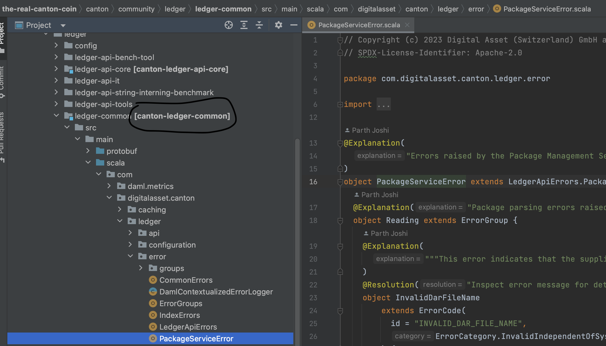
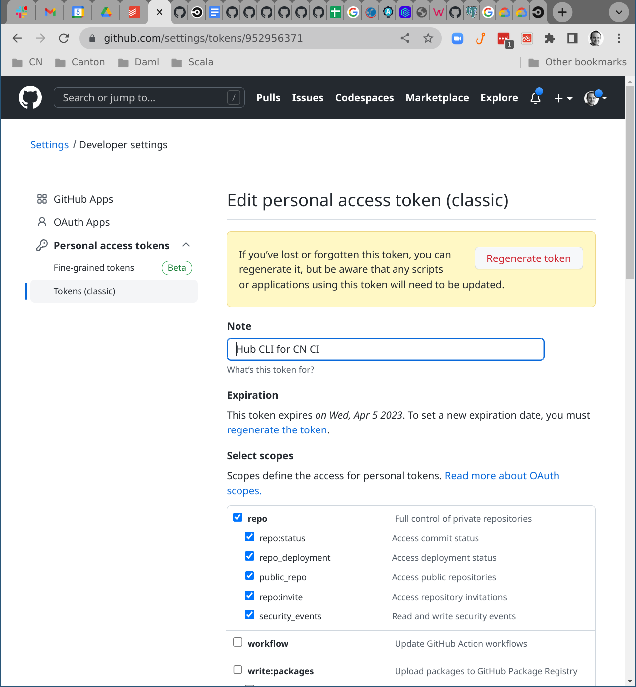
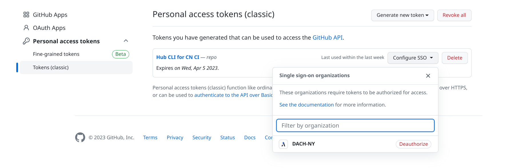

# Table of Contents

1. [Setting up Your Development Environment](#setting-up-your-development-environment)
    1. [Directory Layout](#directory-layout)
    1. [IntelliJ Setup](#intellij-setup)
    1. [VS Code Setup](#vs-code-setup)
        1. [VS Code for Scala](#configuring-vs-code-for-scala-development)
    1. [Using `sbt`](#using-sbt)
        1. [`sbt` settings](#sbt-settings)
        1. [`sbt` Commands](#sbt-commands)
        1. [`sbt` Tips\&Tricks](#sbt-tipstricks)
1. [Contributing Changes](#contributing-changes)
    1. [Contributing as a New Joiner](#contributing-as-a-new-joiner)
    1. [The Flake Rotation](#the-flake-rotation)
    1. [Contribution Guide](#contribution-guide)
    1. [Branch naming](#branch-naming)
    1. [Unused Import Warnings](#unused-import-warnings)
    1. [TODO Comments](#todo-comments)
    1. [Configuration](#configuration)
    1. [Daml Numerics](#daml-numerics)
    1. [Protobuf and GRPC Guidelines](#protobuf-and-grpc-guidelines)
    1. [Editing Daml](#editing-daml)
    1. [Bumping Our Canton fork](#bumping-our-canton-fork)
        1. [Message Definitions](#message-definitions)
    1. [Code Layout](#code-layout)
    1. [Domain Specific Naming](#domain-specific-naming)
    1. [App Architecture - Initialization](#app-architecture---initialization)
        1. [SVC App](#svc-app)
        1. [Validator App](#validator-app)
        1. [All Other Applications](#all-other-applications)
    1. [Frontend Code](#frontend-code)
        1. [Background](#background)
        1. [New Packages](#new-packages)
        1. [Common libs](#common-libs)
    1. [Conversions between Java \& Scala types](#conversions-between-java--scala-types)
1. [Testing](#testing)
    1. [Managing Canton for Tests](#managing-canton-for-tests)
    1. [Managing Frontends for Tests](#managing-frontends-for-tests)
    1. [Running and Debugging Integration Tests](#running-and-debugging-integration-tests)
    1. [Testing App Behaviour Outside of Tests Without Running Bundle](#testing-app-behaviour-outside-of-tests-without-running-bundle)
    1. [Testing Auth0 Auth Flows Locally](#testing-auth0-auth-flows-locally)
    1. [Running The Preflight Check](#running-the-preflight-check)
        1. [Configure Auth0 Environment](#configure-auth0-environment)
        1. [Configure SV Web UI Password](#configure-sv-web-ui-password)
        1. [Setting up `lnav` to Inspect Canton logs](#setting-up-lnav-to-inspect-canton-logs)
        1. [Handling Errors in Integration Tests](#handling-errors-in-integration-tests)
    1. [Testing CircleCI Deployment Config Changes](#testing-circleci-deployment-config-changes)
1. [Building and Running the Wallet and Splitwell Apps](#building-and-running-the-wallet-and-splitwell-apps)
    1. [Building the Wallet and Splitwell Frontend](#building-the-wallet-and-splitwell-frontend)
    1. [Running the Wallet and Splitwell Frontend](#running-the-wallet-and-splitwell-frontend)
    1. [NPM Lock file issues](#npm-lock-file-issues)
1. [Auth0 Configuration](#auth0-configuration)
    1. [Tenant & Application Layout](#tenant-application-layout)
1. [CircleCI Tokens](#circleci-tokens)
    1. [Auth0 Tokens](#auth0-tokens)
        1. [Step 1: rotate all secrets that can be used to gain new access tokens](#step-1-rotate-all-secrets-that-can-be-used-to-gain-new-access-tokens)
        1. [Step 2: revoke all existing access tokens by revoking the token signing key](#step-2-revoke-all-existing-access-tokens-by-revoking-the-token-signing-key)
        1. [Step 3: restart all services](#step-3-restart-all-services)
    1. [CircleCI Token](#circleci-token)
    1. [GCP Token](#gcp-token)
    1. [Github Tokens](#github-tokens)
    1. [VPN Secrets](#vpn-secrets)

For information on the runtime configuration of a Canton Network
cluster, please see the [cluster specific documentation](/cluster/README.md).
(This includes documentation of the process for
[granting access for external partners](/cluster/README.md#granting-vpn-access-to-external-partners) to those
clusters.)


## Setting up Your Development Environment

1. Install [direnv](https://direnv.net/#basic-installation).
2. Install Nix by running: `bash <(curl -sSfL https://nixos.org/nix/install)`
3. Enable support for nix flakes and the nix command by adding to the
   following to your nix config (either `/etc/nix/nix.conf` if you
   have a multi-user install or `~/.config/nix/nix.conf`):
    ```
    extra-experimental-features = nix-command flakes
    ```
4. Configure artifactory credentials
   You can create an artifactory API key [here](https://digitalasset.jfrog.io/ui/admin/artifactory/user_profile).
   Your username is shown at the top of the page (under "User profile: XX").
   If you need permissions - please email help@digitalasset.com and ask for artifactory permissions.
   1. For Nix can download `canton-research`.
      To do so, add the following to `/etc/nix/netrc` (you might need to create that directory as root):
      ```
      machine digitalasset.jfrog.io
      login yourartifactoryusername
      password yourartifactoryapikey
      ```
   2. For access to the canton enterprise docker repo and for sbt to download internal dependencies
      To do so, the `ARTIFACTORY_USER` and `ARTIFACTORY_PASSWORD` must be configured.
      Best would be to add the to the `.envrc.private` file like so:
      ```
      export ARTIFACTORY_USER="yourartifactoryusername"
      export ARTIFACTORY_PASSWORD="yourartifactoryapikey"
      ```
5. After switching to the CC repo you should see a line like
   ```
   direnv: error /home/moritz/daml-projects/canton-coin/.envrc is blocked. Run `direnv allow` to approve its content
   ```
6. Run `direnv allow`. You should see a bunch of output including `direnv: using nix`.
7. If you get an authorization exception, like the following:
   ```
   direnv: using nix
   error: unable to download 'https://digitalasset.jfrog.io/artifactory/canton-research/snapshot/canton-research-20230106.tar.gz': HTTP error 401 ('Unauthorized')
   ```
   1. Check that your access token is valid by running the following sample command:
      ```
      curl -vvv -L -u<yourartifactoryusername>:<yourartifactoryapikey> "https://digitalasset.jfrog.io/artifactory/canton-research/snapshot/canton-research-20230106.tar.gz" -o canton-research-20230106.tar.gz
      ```
      If the download fails, check that your access token matches what is set in [Artifactory](https://digitalasset.jfrog.io/ui/admin/artifactory/user_profile).
      Also, check you have visability via the UI [here](https://digitalasset.jfrog.io/ui/repos/tree/General/canton-research/snapshot) (ie., the `canton-research` snapshot folder).
      If you don't have visability via the UI then check with [helpdesk](help@digitalasset.com).
   2. If the artifact successfully downloaded, check the access rights of the file `/etc/nix/netrc`.
      If the access rights are more restrictive than `-rw-rw-r--`, update them:
      ```
      chmod 664 /etc/nix/netrc
      ```
      Note - `sudo` may be required to run the above command.
   3. Switch the CC repo.
   4. If the authorization exception isn't resolved, investigate further with additional logging
      by running the following command at the root of the CC repo :
      ```
      nix develop --debug --verbose path:nix
      ```
8. (optional) Enable [pre-commit](https://pre-commit.com/) to enforce format rules automatically:
   ```
   pre-commit install
   # or:
   pre-commit install -t pre-push
   ```
   _Note_: if you want to skip specific pre-commit hooks, add the hook ids to the `SKIP` variable separated by commas,
           e.g. `export SKIP=scalafmt` (see https://pre-commit.com/#temporarily-disabling-hooks).

           Also, you can bypass running pre-commit hooks altogether using the `--no-verify` / `-n` git commit option.

    **Important:** start your IDE and other development tools from a console that
    has this `direnv` loaded; and thus has the proper version of all the
    project dependencies on its `PATH`.

    If you encounter issues, try exiting and reentering the directory to reactivate direnv.

9. On MacOS, please install the following globally:
   1. Envoy, by running: `brew update ; brew install envoy`
   2. Firefox, by following the process here: <https://www.firefox.com>

### Directory Layout

See the `README.md` files in the top-level directories for details.

Most top-level directories logically correspond to independent repositories,
which are currently maintained within this one repository for increased
delivery velocity using head-based development.

We expect to start splitting off repositories as part of the work to deliver
M3 - TestNet Launch.

### IntelliJ Setup

* Clone the repository first, if you haven't yet
* Run `which java` and `which sbt` within `canton-network-node` directory to respectively find the JRE/SDK
    and sbt versions used by nix. The outputs should roughly look as follows:
    ```
    canton-network-node$ which java
    /nix/store/rqii97havwmrzan6wk1lbh5nc48w821y-openjdk-11.0.15+10/bin/java
    canton-network-node$ which sbt
    /nix/store/9q28hwzz8yy75l317k2v2mdq485hgja0-sbt-1.6.2/bin/sbt
    ```
* Add the Java SDK from nix per the instructions [in the Daml repo.](https://github.com/digital-asset/daml/blob/main/BAZEL.md#configuring-the-jdk-in-intellij)
 In the example above, the JDK would be at `/nix/store/rqii97havwmrzan6wk1lbh5nc48w821y-openjdk-11.0.15+10/lib/openjdk`.
* Open the repository via 'File -> New -> Project from existing sources'
* 'Import project from external model' and select sbt. If you don't see sbt, make sure you have the `Scala` IntelliJ plugins installed.
* Point IntelliJ to the JRE home and sbt-launch jar. From the example above, these should respectively be
        `/nix/store/rqii97havwmrzan6wk1lbh5nc48w821y-openjdk-11.0.15+10/` and
        `/nix/store/9q28hwzz8yy75l317k2v2mdq485hgja0-sbt-1.6.2/share/sbt/bin/sbt-launch.jar`.
* Also configure it with the JDK you added above. If the JDK doesn't show up as one of the options, you may need to
    choose any other SDK and set up the correct SDK for the project after following the rest of the steps.
    In that case, you will need to verify that all usages of the JDK in 'Settings' and 'Project Structure' use the correct
    SDK.
* Otherwise choose [these settings in the dialogue](https://i.imgur.com/B3yWCZ9.png) (see sbt explanations [here](https://www.jetbrains.com/help/idea/sbt.html))
* Note that intellij must be started from within the project directory so the tools from Nix are in PATH.

You should then see a 'sbt shell' window in IntelliJ that allows you to build and test the Scala code while using the
same package references as nix. If IntelliJ asks you at the end if you want to overwrite any previous `.idea/*` files, say yes.

### VS Code Setup

There are a few extensions that improve the VS Code experience when working on various parts of the Canton Network codebase, or for general collaboration. The recommendation is to pick the ones that currently seem relevant or useful to you.

**Recommended Extensions**:
- [GitLens](https://marketplace.visualstudio.com/items?itemName=eamodio.gitlens): Nice integration of git history/metadata inside the editor, displays git authors inline
- [Open in GitHub](https://marketplace.visualstudio.com/items?itemName=ziyasal.vscode-open-in-github): Makes it easy to share specific links to code via an in-editor context menu option
- [Docker](https://marketplace.visualstudio.com/items?itemName=ms-azuretools.vscode-docker)
- [Makefile Tools](https://marketplace.visualstudio.com/items?itemName=ms-vscode.makefile-tools)
- [OpenAPI Editor](https://marketplace.visualstudio.com/items?itemName=42Crunch.vscode-openapi)
- [YAML](https://marketplace.visualstudio.com/items?itemName=redhat.vscode-yaml)
- [Prettier](https://marketplace.visualstudio.com/items?itemName=esbenp.prettier-vscode): Code formatter for webdev-related stacks (Typescript/React/...)
- [Scala Syntax](https://marketplace.visualstudio.com/items?itemName=scala-lang.scala): Syntax highlighting for Scala files, only; use `Metals` for adding IDE-like functionality
- [Scala Metals](https://marketplace.visualstudio.com/items?itemName=scalameta.metals)
- [Run it On](https://marketplace.visualstudio.com/items?itemName=fsevenm.run-it-on): Optional, if you want to add an automatic "scalafix on save" command while editing Scala files
- [Nix](https://marketplace.visualstudio.com/items?itemName=bbenoist.Nix)
- [vscode-proto3](https://marketplace.visualstudio.com/items?itemName=zxh404.vscode-proto3)

#### Configuring VS Code for Scala Development

It is possible to use VS Code for Scala development via the Metals extension (see above), if you'd prefer not to use IntelliJ (or just want to try it out). Setting this up requires some similar configuration as IntelliJ:

* **Metals: Java Home**: From a terminal inside the repository directory & direnv environment, run `echo $JAVA_HOME` which should give you your Java Home path from nix: `/nix/store/<nix-pkg-id>...`. If not, try `which java` which should give you the nix path `/nix/store/<nix-pkg-id>.../bin/java`; strip the `/bin/java` suffix and use that path.
* Follow any VS Code prompts to restart bloop/metals or reload the window
* Ensure the following is in your VS Code `settings.json` (search for `Preferences: Open User Settings (JSON)` in the command palette):

```json
   "files.exclude": {
      "**/.bloop": true
   },
   "files.watcherExclude": {
      "**/.bloop": true,
      "**/.metals": true,
      "**/.ammonite": true
   },
```

* Optional: To run `scalafix` on a file, you can either use the `Metals: Run all scalafix rules` command from the command palette, or add the following to `settings.json` to run scalafix automatically every time you save:

```json
  "runItOn": {
    "commands": [
      {
        "match": ".*.scala",
        "isShellCommand": false,
        "cmd": "metals.scalafix-run"
      }
    ]
  },
```

This configuration requires the `Run it On` plugin to be installed.

**Caveats**
- I haven't tested the `sbt` integration, instead opting for running builds/tests/etc from the command line. Metals is still useful for providing type hints, syntax error catching, auto-complete, "go-to-definition", etc. In theory, you should be able to provide the path of the `sbt` binary vended by nix (via `which sbt`) to the `Sbt Script` option in the Metals settings.
- The cache can be finnicky: be prepared to have to re-import the build or re-compile the workspace, particularly if checking out different branches to get symbols to resolve properly again

### Using `sbt`

#### `sbt` settings
Make sure to configure the JVM heap size to at least 4G when using IntelliJ. In particular:
- In Intellij, under Settings, search for "sbt" and then under JRE add `-Xmx4G -Xms2G` to VM Parameters.
- In Intellij in the same menu, set the maximum heap size to at least 4000M.

#### `sbt` Commands

This Section gives an overview of common sbt commands.
More commands can be found in build.sbt and BuildCommon.scala.
To run these commands, enter the `sbt` shell by running `sbt` in the repo root.

Alternatively, you can execute the commands outside the shell by running `sbt '<command>'`.
Note that the entire command must be quoted in this case, especially if it has spaces or special characters
(like the `testOnly` examples in the Test section below).

- `clean`: deletes all generated files (in the target directory)
- `clean-cn`: like clean but only for our own apps not for the Canton fork
- `compile`: compile production code (excluding test code)
- `Test/compile`: compile production and test code
- `apps-common/compile`: compile production code of the `apps-common` subproject
- `apps-frontends/compile`: compile and codegen only frontend code
- `apps-frontends/npmLint`: checks formatting of frontend code, but does not fix anything
- `apps-frontends/npmFix`: fixes formatting of frontend code
- `scalafixAll`: invoke scalafix across all configurations where scalafix is enabled.
    `scalafix` is a linting and rewrite tool. This may run for a long time as it needs to do a full compile.
- `format`: apply `scalafmt` to format source files
- `formatFix`: apply `scalafmt`, `sbt scalafixAll`, and `sbt apps-frontends/npmFix` to format source files
- `lint`: lint-check. Does not apply any fixes. Checks enforcement of `scalafmt`, `buf`, `scalafix`, `apps-frontends/npmLint`, and `shellcheck` rules
- `damlBuild`: create `.dar` files for all Daml projects
- `protobufLint`: to lint our protobuf files using `buf`
- `bundle`: create a release bundle in `apps/app/target/release/<version>`. The release binary is loaded into your PATH automatically via `direnv`. Simply run `coin` to call it.
- `checkErrors`: check test log for errors and fail if there is one. Note that if you haven't deleted your local log file in a long time, this may find very old errors.

Test:
- `testOnly myWildcard`: runs all tests matching wildcard, e.g.,
  `testOnly com.digitalasset.myPackage.*` runs all tests in package `com.digitalasset.myPackage`.
  `testOnly *Wallet* -- -z "allow calling tap"` runs all tests with classname matching `*Wallet*` and test description matching `allow calling tap`.
- `test`: Note that it is [not currently advisable](https://github.com/DACH-NY/canton-network-node/issues/2098) to use this command. Use the `testOnly` commands described above to run specific tests and use the CI to run all tests.
- `damlTest`: run the Daml script tests included with the apps' Daml files

#### `sbt` Tips&Tricks

Things sometimes go wrong with `sbt` in ways that are hard to debug. This section will list common tips&tricks for getting `sbt` to do what we want it to.
- In case you see unexpected build failures after switching branches, run `sbt reload` to have sbt update its internal state.
- In case you continue to see unexpected build failures, despite following every other trick in this section, you probably need to delete the sbt build files. If you suspect the build failures come from CN build files, run `sbt clean-cn` to delete all CN build files. If the error might come from the build files of the OS Canton dependency, run `sbt clean` to delete all build files managed by sbt. Subsequent `sbt Test/compile`s should then succeed.

## Contributing Changes

### Contributing as a New Joiner
For your first issue, you can take a look at [issues labelled with the `starter` tag](https://github.com/DACH-NY/canton-network-node/issues?q=is%3Aissue+label%3Astarter). Else, please ask your onboarding
buddy for help with getting started on the code base.

### The Flake Rotation

The Canton Network team has a formal support rotation in the form of
our flake process.  Each of our weekly sprints has a pair of engineers
assigned to be responsible during the sprint for driving the
resolution of test failures that occur in our test environments
(`Staging`, `DevNet`, and `TestNet`) during that sprint.  For the
engineers on flake duty, this work is their priority over any other
issues on which they may be working.

The job of an engineer on flake duty is to _drive the resolution_ of
failures. This does not mean these engineers are responsible for
fixing all problems themselves, nor does it even mean everything
should be fixed. Driving the resolution means clearly communicating
status of the issue as it progresses from beginning to end,
marshalling any other staff on the team needed for a resolution, and
then helping organize the work to fix. Canton Network is a team
effort, and the team should be brought in to resolve flakes as it is
helpful. The team may also decide based on priorities and future plans
that a specific failure isn't worth the time to fix. This is fine, as
long as there is consensus on the decision and it is clearly
communicated.

This is an excellent opportunity to learn about parts of the Canton
Network that may be outside your usual area of expertise. This
includes other parts of the software stack, our build and deployment
mechanisms, networking design, and debugging techniques. It is also a
way to be intentional about addressing the current 'least stable'
parts of our code base, with an idea of improving reliability for our
customers.

Flake duty is assigneed based on the [team holiday calendar](https://docs.google.com/spreadsheets/d/1Sp12aNj-bPAuPD9aEnH_xk031dADiGHdQdJlCGxhW3k/edit#gid=1174224054).
Please consult this spreadsheet to understand when you are on duty. There are
pairs of weeks highlighted to indicate the schedule - flake duty
begins with the sprint starting on the Wednesday of the first week and
ends with the sprint on Wednesday of the second week. At each boundary,
the outgoing and incoming engineers on flake duty rotation must
have a brief touchpoint meeting to go over any issues still under resolution.

Important: we rely on there always being two engineers available on flake duty.
Thus, engineers on flake duty that have a day off are required to
ask another engineer to substitute for them.

For engineers on flake duty, the resolution process is as follows.

* When there is a Slack message indicating a test failure, investigate
  and assess if it's a new or existing failure. For new failures, create
  a new tracking issue in the [Flaky Test](https://github.com/DACH-NY/canton-network-node/milestone/19)
  GitHub milestone.  The issue for a given failure should be linked in the Slack
  thread for the failure itself.
* All relevent information should be tracked to the extent possible in the
  Github issue. This includes logs, screenshots, links to CI jobs, and any
  observations or notes that might be useful as the issue is investigated.
* After assessing the issue, reach out to other team members as is useful to
  resolve the issue. Once the root cause has been identified, note that in the
  Github issue, along with any reproduction instructions if possible.
  Where possible fix the root cause, or drive the fixing of the root cause
  to keep the number of active flakes low and team productivity high.
* PR's for any fixes should also be linked to the issue.
* For failures that are not frequent enough to warrant a fix, the
  issue in Github should be labeled "infrequent/no repo".


We will periodically review the flaky test log in the Github milestone
to look for systemic issues that might be underlying more than one
flaky test and can be more holistically resolved.

### Contribution Guide

We share a lot of our tooling and processes with Canton.
We thus use [Canton's Contributing Guide](https://github.com/DACH-NY/canton/blob/main/contributing/README.md)
as a baseline, and list below only the points where we differ.

Please read the above guide in particular to learn about metrics, logging, tracing, Scala guidelines, Protobuf guidelines, TODO notes, formatting and git hooks.

Committed code must adhere to our formatting guidelines. To automatically reformat all code, run `sbt formatFix`.

### Branch naming

Branches should be prefixed by your name, followed by a slash and a descriptive name:

`<yourname>/<descriptivename>`

For example, if Bob is working on issue 4242 to "fix FooTest", he could name his branch:

`bob/fix-footest/4242`

### Unused Import Warnings

If the unused import, local variable or implicits warnings get in the way during development, you can locally turn them into
an info summary that just displays the number of warnings by creating the file `.disable-unused-warnings` and
calling `sbt reload`. Note that this requires a partial re-compile.

### TODO Comments

Call `./scripts/check-todos.sh` to extract a list of all TODO comments in the project,
and get a list of TODO comments that do not conform [Canton's TODO style guidelines](https://github.com/DACH-NY/canton/blob/main/contributing/README.md#todo-comments).
Note that in contrast to these guidelines, we
- disallow `FIXME` comments on `main`
- use a double-number milestone format, e.g. `M3-08`
- ignore `.. todo::` comments in .rst files
- use normal .rst comments, e.g., `.. TODO(M1-14): some left-over doc work`

Note that these guidelines are enforced in CI.

### Configuration

The applications are configured using [HOCON](https://github.com/lightbend/config/blob/main/HOCON.md) files.

Run `./scripts/print-config.sh FILE` in order to retrieve a canonical form of a given
config file, with includes and substitutions resolved and comments stripped.

**NOTE:** Although in some cases, the use of system props may work, only environment variables are fully supported
across the stack. As a result, please ensure that you use environment variables for all overrides.


### Daml Numerics

To represent Daml `Numeric`s for any user facing APIs (console commands), we use `scala.math.BigDecimal`s.
We use Scala BigDecimals instead of Java BigDecimals (that are used in the Daml repo) because
integers, floats etc. are automatically converted
to Scala BigDecimals by the Scala compiler unlike Java BigDecimals
(`wallet.tap(10)` vs `wallet.tap(new java.math.BigDecimal(10))`).

To represent Daml Numerics in Protobuf we use `string`s (there is no Protobuf BigDecimal type). Conversions to
and from `string`s should occur via `com.daml.network.util.Proto.encode/tryDecode`.

When interacting with the Ledger API, we convert the Scala BigDecimals to Java BigDecimals.

Overall, please refer to the `wallet.tap` command implementation for the canonical handling of Daml Numerics.

### Protobuf and GRPC Guidelines

Generally endeavor to model your [GRPC and Protobuf definitions using Google's guidelines](https://cloud.google.com/apis/design/naming_convention).
We use [`buf`](https://docs.buf.build/tour/lint-your-api)'s `DEFAULT` linting rules to enforce many of these guidelines in CI using the `protobufLint` `sbt` task.
See [their documentation](https://docs.buf.build/lint/rules#default) for what these are and why they are beneficial.

Below we list additional rules specific to our project:

### Editing Daml

We use separate Daml projects for separate apps (e.g. CC, the Wallet, and the Directory).
You can find these projects in the `daml/` subfolders of the respective apps.
These Daml projects define the on-ledger API used to synchronize different parties in the apps' workflows.

We build and test these projects using the `sbt` commands `damlBuild` and `damlTest`.
The implementation of the `sbt` plugin can be found in [`/project/DamlPlugin.scala`](/project/DamlPlugin.scala).

To edit the files in a particular Daml project, for example, `/apps/wallet/daml`, proceed as follows:

1. Start `sbt` in the repo root to get access to an `sbt` shell (or use the one in IntelliJ).
2. Start `damlBuild` in your `sbt` shell to build the .dars for all Daml projects.
3. Start `daml studio` in the repo root, which starts VS code.
4. Open and edit the .daml files in `/apps/wallet/daml` in VS code. You should see them being typechecked on the fly.
5. See `/apps/wallet/daml/daml.yaml` for the .dar dependencies of `/apps/wallet/daml`.
   If you change any of them, then you can propagate these changes across the .dars as follows:
   1. redo Step 2
    3. use Ctrl-Shift-P "Developer: Reload Window" in VS code to restart the `daml studio` language server with the updated package dependencies.

*Tip:* if `damlBuild` fails with weird errors, then that might be due to stale `damlBuild` outputs.
Try forcing a clean rebuild by cleaning via SBT, e.g., `apps-common/clean` and similar for the dependent project.

To prevent accidental changes to dar files, we commit their current package IDs with the repo,
in daml/dars.lock. CI verifies that those package IDs are correct. If you intentionally make
changes in daml code, please run `sbt damlDarsLockFileUpdate` and commit the updated `dars.lock`
file along with your dar changes.

### Bumping Our Canton fork

Current Canton commit: `37a1ced9e5272fd0116377b058cd164dc8b6f66f`


1. Check out the [Canton **Open Source** repo](https://github.com/digital-asset/canton)
   In that repo, execute the following steps:
   1. Define the environment variable used in the commands below using `export PATH_TO_CANTON_OSS=<your-canton-oss-repo-path>`
   2. Checkout `main` and learn the Daml SDK version used by Canton from `head -n15 $PATH_TO_CANTON_OSS/project/project/DamlVersions.scala`.
   3. Check that a release for this Daml SDK version is available on https://github.com/digital-asset/daml/releases.
      If not ask on #team-daml when it will land.
      In case we have not bumped our Canton fork recently, consider upgrading to an
      earlier Canton OSS version for which a Daml SDK release is available.
   4. Checkout the **current Canton commit listed above**, so we can diff our current fork against this checkout.
      NOTE: if you can't find the commit, then you are probably using the closed source https://github.com/DACH-NY/canton repo.
      That won't work. You need the Canton OSS repo linked above.
2. Change to your checkout of the canton coin repo and execute the following steps:
   1. Create a branch named `canton-bump-<sprintnr>` in the Canton Coin repo.
   2. Create a Canton patch file capturing all our changes relative to that `./scripts/diff-canton.sh $PATH_TO_CANTON_OSS/ > canton.patch`
   3. Undo our changes: `git apply '--exclude=canton/community/app/src/test/resources/examples/*' --directory=canton -R canton.patch`
      The exclusion is because those files are under a symlink and we don’t want to change them twice.
   4. Create a commit to ease review, `git add canton/ && git commit -m"Undo our changes"`
3. Checkout the commit of the Canton OSS repo to which you have decided to upgrade in Step 1.2
4. Execute the following steps in your Canton Coin repo:
   1. Copy the Canton changes: `./scripts/copy-canton.sh $PATH_TO_CANTON_OSS`
   2. Create a commit to ease review, `git add canton/ && git commit -m"Bump Canton commit"`
   3. Reapply our changes `git apply '--exclude=canton/community/app/src/test/resources/examples/*' --directory=canton --reject canton.patch`.
   4. Create a commit to ease review `git add canton/ && git reset '*.rej' && git commit -m"Reapply our changes"`
   5. Bump the SDK/Canton versions in the following places:
      1. The current Canton commit in this `README.md`
      2. Set `version` in `CantonDependencies.scala` to the SDK version from Step 1.2
      3. Set `daml_version` in `nix/canton-sources.json` to the SDK version from Step 1.2
      4. Bump the sdk version in our own `daml.yaml` and `*.nix` files via `./set-sdk.sh $sdkversion` to the same version.
      5. Change the JSON API hash in `jsonapi.nix`. To do so change a character of the `sha256` digest (e.g. "ef..." -> "0f...") in `jsonapi.nix`, and then call `direnv reload`,
         to make the hash validation fail. Adjust the `sha256` digest by copying back the new hash when Nix throws an error during validation.
         Note that nix may print the hash in base64, when you specified it in base16, or vice versa. Just copying the 'got' hash should work in either case.
      6.  Repeat the same with the sha256 of the protobufs in `daml_pbs.nix`.
   6. Create another commit, `git add -A && git reset '*.rej' && git commit -m"Bump Canton commit and Canton/SDK versions"`
5. Test whether things compile using `sbt Test/compile`.
   In case of problems, here are some tips that help:
   - Check whether there are related `*.rej` files for the parts of our changes that could not be applied.
     The previous PR that bumped our Canton fork can serve as a point of comparison here.
     Search [here](https://github.com/DACH-NY/canton-network-node/pulls?q=is%3Apr+%22bump+canton%22) to identify that PR and
     look at the commits from the "Reapply our changes" step onwards in that PR.
   - Some of our changes might have been upstreamed: adapt `CANTON_CODE_CHANGES.md` accordingly; and resolve the path
     conflicts in favor of the upstreamed code.
   - The file paths and hence import paths may have changed in the upstream code. Change such imports to reflect the new paths.
   - Find the related change in the **closed source Canton repo** and use the change and its commit message to adjust our code.
   - We have some files that we added ourselves to the `canton/` directory, and the above steps happen to delete these.
     See the previous PR for a recent list, and add them back using `git restore -s main <path-to-file>`.
   - If you encounter issues with daml2ts, you might need to [rebase our TS fork](nix/vendored/README.md).
   - In case you run into issues with missing classes, or you find that some code is using a different class to the one defined in the Canton OSS repo,
     then:
     - If the file defining the class exists in the OSS repo but not in our fork, copy it over manually. You should also fix `copy-canton.sh` to ensure it gets
       copied over correctly in the future.
     - If the file already exists in our fork, you may need to [update the build dependencies](#updating-canton-build-dependencies).
6. Step 5 may have made changes to `package-lock.json` files; commit all of these changes.
7. Run `sbt damlDarsLockFileUpdate` and commit the changes to `daml/dars.lock`.
8. Make a PR with your changes, so CI starts churning.
9. If there are any, remove all `*.rej` files.

You can refer to https://github.com/DACH-NY/canton-network-node/pull/446/commits for an example of how the update PR should look like.


#### Updating Canton build dependencies

The relevant files defining our build are:
- `CantonDependencies.scala` - contains named constants for the various libraries used by Canton.
- `BuildCommon.scala` - specifies the module and library dependency graph for build targets common to most of our apps.
This is where you should find the dependencies for all the Canton related modules and where you will most likely need to make changes.
- `Dependencies.scala` - contains named constants for the various libraries used by the Canton Coin repo apart from those defined in `CantonDependencies.scala`.
- `build.sbt` - tells SBT how to build the Canton Network apps making use of the definitions in the above files.

Updating the build dependencies can be a non-trivial and time-consuming process, so please reach out on Slack if you face issues.
It's recommended that you reload sbt and run `Test/compile` after each change to see if the build succeeds.

The following steps should be broadly useful when updating the build dependencies:

- Identify the module in the Canton Coin repo that contains the class you're looking for. If you're an IntelliJ user, module names are
  always displayed in bold in the [Project Tool Window](https://www.jetbrains.com/help/idea/project-tool-window.html)
  (if the directory name is the same as the module name, it just appears bolded; if it is different, the module name appears in bold next
  to the directory name in square brackets). In our repo, the Canton modules are invariably named `canton-xxx`.
  Here is an example of identifying the module containing the class `PackageServiceError` in IntelliJ.
  
- Add a `dependsOn` relationship in `BuildCommon.scala` between the module where the class is being used and the one where it is defined.
- Recompile to check if the build succeeds.

Both Canton and Canton Coin also extensively use Daml SDK libraries and these can at times conflict.

To identify which Daml SDK library defines a particular class:
- search for the class in the [daml OSS repo](https://github.com/digital-asset/daml?search=1)
- identify the module directory and locate the `BUILD.bazel` file inside it
- search for `maven_coordinates` within the `BUILD.bazel` file to get the name of the library.

To add a new library as a dependency for some module:
- add the library name as a constant in `CantonDependencies.scala` or `Dependencies.scala` as appropriate
- add the library to the list of `libraryDependencies` within the build definition of the required module in `BuildCommon.scala` or `build.sbt`

### Message Definitions

* All Protobuf definitions should be using [`proto3`](https://developers.google.com/protocol-buffers/docs/proto3)
* Avoid wrapping primitive types in a message structure unless future extensibility will likely be required
* Use a plural name for `repeated` fields
* Use `string` fields with a suffix `contract_id` to store contract ids
* Use `string` fields with a suffix `party_id` to store party ids

### Config parameters

* name flags as `enableXXX` instead of `disableXXX` to avoid a double negation

### Code Layout

* Ensure that the generated stubs will be in their own package separate from any implementations
* Prefer java/maven like structuring for the package and directory layout
* Place `.proto` files in `src/main/protobuf`
* Prefer having a single `.proto` definition per service.
* Refer to generated Protobuf classes with a package prefix, e.g., `v0.MyMessage` instead of `MyMessage`.
  This avoids name conflicts with our hand-written classes.

### Domain Specific Naming

* Use `listXXX`, `acceptXXX`, `rejectXXX`, `withdrawXXX` for managing proposals, requests etc.
* [Beware of the differences](https://www.bkacontent.com/gs-commonly-confused-words-amount-number-and-quantity)
  between `amount`, `quantity` and `number`: To keep things simple across the repository,
  we consistently use only the term **`amount`**
* Between `sender`/`receiver` and `payer`/`payee`: please use **`sender`/`receiver`**

### App Architecture - Initialization

#### SVC App

*Warning: The SVC App is being phased out; below infos are at least partially outdated.*

The SVC app is special since it creates the SVC party which eventually
needs to be decentralized and because other apps rely on the SVC app
being up so they can query the SVC party identity.

Startup proceeds as follows:

1. Allocate SVC party and user
2. Upload DAR file
3. Create initial coin rules
4. Start automation
5. Start gRPC service

#### Validator App

The validator app is the only application with admin claims and is
responsible for allocating parties/users and uploading DARs for all
other apps including the wallet. The wallet user and the DARs and
users for other applications are specified in the static config of the
validator app.

The user of the validator app itself is allocated outside of the app
by the validator operator. This is required because the validator app
does not have authorization to allocate its own user.

Startup proceeds as follows:

1. Wait for the validator user to be created and query the primary party.
2. Create users and their primary parties for the wallet and all other applications
   specified in the config provided these users and their parties have not already been created.
3. Upload DARs for wallet and all other applications.
4. Perform one-time initialization, e.g., create validator right for
   the validator party itself
5. Launch gRPC service

#### All Other Applications

All other applications have one service user and do not have admin claims.

Startup proceeds as follows:

1. Wait for the user to be created and query the primary party.
2. Wait for the DARs to be uploaded
3. Run one-time initialization, e.g., create certain contracts.
4. Start automation
5. Start gRPC service

### Frontend Code

#### Background

This section discusses how to contribute, or add new frontend code for an app. To understand how to run frontends locally, see [Building and Running the Wallet and Splitwell Apps](#building-and-running-the-wallet-and-splitwell-apps).

Frontend code projects are managed via [`npm workspaces`](https://docs.npmjs.com/cli/v8/using-npm/workspaces). This gives us a way to manage multiple distinct NPM packages all co-located in the same monorepo, and confers several benefits:

- One local monorepo package can be installed as a dependency of another, enabling "easy" code-sharing.
- With `npm install`, all dependencies of all workspace projects are installed in the root `node_modules` folders, giving us de-deduplication.
- If all workspace projects share common scripts, you can easily run that script across all workspaces in one command.
- All required `npm` commands are issued from `sbt compile`, so there should not be a need to run e.g. `npm install` directly.

#### New Packages

In this section only, the term "root-level directory" will describe the workspace root, which is inside `apps/` (**not** the _repo_ root directory).

If you want to add a new package to the workspace, first register its directory in the root-level `apps/package.json` workspaces key. The directory referenced here must contain a `package.json` of its own defining the workspace package itself -- name, dependencies, etc.

Then add the new package to `build.sbt` following the examples from the existing frontend packages.

Running `sbt compile` (or manually `npm install` from the root) installs the dependencies of all registered workspace packages.

Make sure your package contains at least the scripts `build`, `fix`, `check`, and `start`. This enables the use of (e.g.) `npm run build --workspaces` to run the build script for all packages in the workspace at once, as well as proper integration with `sbt`.

Your new package will need its own `tsconfig.json` file that inherits from the root tsconfig. See any existing workspace package for an example.

#### Common libs

In `apps/common/frontend` we have an NPM package containing common code. This package (named `common-frontend`) can be installed with `npm install common-frontend -w my-workspace-pkg`. You can import anything from it with `import { ... } from 'common-frontend'` in your package's source code.

You're also free to add more things in `common-frontend` to use across multiple frontend apps. This can really include anything: utility functions, reusable React components, shared config, etc. Just ensure whatever you add is exposed via the lib's entrypoint, `index.ts` (we use the [barreling](https://basarat.gitbook.io/typescript/main-1/barrel) technique to expose all modules from the root of the library).

There is also a package available named `common-protobuf`, located in `apps/common/frontend-protobuf`. This simply contains all the web-gRPC protobuf bindings for all our services in Typescript.

### Conversions between Java & Scala types

Because we use the Java bindings and codegen, we need to convert
between Java and Scala types, e.g., `Seq` and `java.util.List`.  We
try to use Scala types whereever possible so we delay the conversion
to Java types until the last possible point and convert from Scala to
Java as early as possible.

To convert, import `scala.jdk.CollectionConverters.*`. You can then use `asScala` and `asJava` methods.

## Testing

### Managing Canton for Tests

To speed up our tests run against a long-running Canton instance.
To start the instance run `./start-canton.sh` for backend test and `./start-canton.sh -m` for frontend test.
It can be stopped via `./stop-canton.sh`.

There are 3 tmux windows open in the tmux session for Canton in wallclock time, Canton in simtime and
toxyproxy. You can switch between those with `Ctrl-b w`.

You should only need to restart it if you change
`apps/app/src/test/resources/simple-topology-canton.conf`. If you
encounter an error like the following, there might have been a problem
with the running Canton instance so try restarting.

```
ERROR c.d.n.e.CNNodeLedgerConnection$$anon$1:WalletIntegrationTest/SVC=svc-app - Failed to instantiate ledger client due to connection failure, exiting...
```

NOTE: In case you run into an issue with tmux on macOS and tmux-256color terminfo (unknown terminal "tmux-256color"),
put this command into ~/.tmux.conf or ~/.config/tmux/tmux.conf (for version 3.1 and later):

```
set-option default-terminal "screen-256color"
```

This is sufficient for most cases. If you insist on using `tmux-256color` instead of switching to `screen-256color`,
you will need to install ncurses and setup terminfo following the instructions [here](https://gist.github.com/bbqtd/a4ac060d6f6b9ea6fe3aabe735aa9d95).

#### Using a local build of Canton

When debugging and fixing issues in Canton itself, it can be useful to run a local build of Canton.
You can do so as follows:
1. Checkout `https://github.com/DACH-NY/canton` and follow its `contributing/README.md` to get it to build.
2. Call `sbt bundle` to build a **research** release in `<YOUR_CANTON_REPO>/research/app/target/release`.
3. Call `start-canton.sh -c <YOUR_CANTON_REPO>/research/app/target/release/canton-research-<VERSION>-SNAPSHOT/bin/canton`

### Managing Frontends for Tests

Some integration tests use our web frontends. Similarly to Canton described above, we also serve the frontends outside of the tests themselves.
To start serving the frontends run `./start-frontends.sh` (add `-d` if you prefer to avoid attaching the terminal to the npm server).
It can be stopped via `./stop-frontends.sh`.

### Running and Debugging Integration Tests

The integration tests are located at [`/apps/app/src/test/scala/com/daml/network/integration/tests/`](/apps/app/src/test/scala/com/daml/network/integration/tests).
They work by defining and starting a Canton network topology and running Canton console commands against that topology,
see for example the [`DirectoryIntegrationTest.scala`](/apps/app/src/test/scala/com/daml/network/integration/tests/DirectoryIntegrationTest.scala).
Also see the Scaladocs on Canton's [`BaseIntegrationTest.scala`](/canton/community/app/src/test/scala/com/digitalasset/canton/integration/BaseIntegrationTest.scala) for more information about the intended usage of the test framework.

Many tests use the topology and base configuration defined in [`/apps/app/src/test/resources/simple-topology.conf`](apps/app/src/test/resources/simple-topology.conf), or a variant thereof.
Adjusting these configurations can sometimes help with debugging.
See for example https://docs.daml.com/canton/usermanual/monitoring.html on how to adjust logging and monitoring for Canton nodes.

Frontend tests use selenium for launching a (usually headless) browser (currently we use Firefox), and interacting with it as a user would.
To make it run with a UI, for debugging - turn the headless flag in [`FrontendIntegrationTest.scala`](/apps/app/src/test/scala/com/daml/network/integration/tests/FrontendIntegrationTest.scala) to false.
To take screenshots (also in headless mode) of the browser at certain points of the tests - call `screenshot()` from [`FrontendIntegrationTest.scala`](/apps/app/src/test/scala/com/daml/network/integration/tests/FrontendIntegrationTest.scala) in your test.

You can run integration tests from IntelliJ by navigating to the file and clicking the little green "run-triangle"
in the gutter at the start of the test definition.
You can also run them from `sbt` as explained in the section on `sbt` below.
The logs from test executions are output to `/log/canton_network_test.clog`.
Use `lnav` to view these logs for debugging failing test cases.
No installation of `lnav` is required, as it is provided by default by our `direnv`.

Documentation about common pitfalls when writing new integration tests and debugging existing ones can be found [here](/apps/app/src/test/scala/com/daml/network/integration/tests/README.md).
If you wish to extend our testing topology please also consult [this README](/apps/app/src/test/resources/README.md) about name and port allocation.

### Testing App Behaviour Outside of Tests Without Running Bundle

Sometimes, you may need to debug startup behaviour of the Canton coin apps that is causing issues for the
initialization of the [`CNNodeEnvironment`](apps/app/src/main/scala/com/daml/network/environment/CNNodeEnvironment.scala).
You usually can't debug this behaviour
via our integration tests because the integration tests require an initialized `CNNodeEnvironment`.
At other times, you may want to start an interactive console without having to run `sbt bundle`.

You can achieve this by using the ['Simple topology' runtime configuration](https://i.imgur.com/dPgUd2Q.png) from IntelliJ.
After starting it, a `Run` window with an interactive console should open: [console](https://i.imgur.com/zQfbVvs.png).
Using the runtime configuration, you can also set breakpoints as you could when executing a test from Intellij and
see the results of adding log statements without needing to run `sbt bundle`.

All screenshots are from IntelliJ IDEA 2020.1.4 on Ubuntu.

If you don't use IntellIJ, a workaround is running `sbt apps-app/runMain com.daml.network.CNNodeApp -c <conf-files>`, however,
this doesn't give you a debugger.

### Testing Auth0 Auth Flows Locally

If you want to run one of the integration tests with a `LocalAuth0Test` tag, you likely need to pass Auth0 management API credentials for our `canton-network-test` tenant to `sbt`.
You can set them in your `.envrc.private` file via:
```
export AUTH0_TESTS_MANAGEMENT_API_CLIENT_ID=…
export AUTH0_TESTS_MANAGEMENT_API_CLIENT_SECRET=…
```
Note that [Running The Preflight Check](#running-the-preflight-check) also requires you to obtain Auth0 management API credentials, but for a different tenant.
To switch tenants, run `sbt -DAUTH0_TENANT=dev`. The tests will then read the environment variables without the `_TESTS` suffix. `cncluster preflight` sets this automatically
so in most cases you should not have to do this manually.

```
export AUTH0_MANAGEMENT_API_CLIENT_ID=…
export AUTH0_MANAGEMENT_API_CLIENT_SECRET=…
```

### Running The Preflight Check

The preflight check runs an integration test where a local validator
connects to a global canton network. To run the check against a
cluster (see section `GCE Clusters`), change into the cluster's
deployment directory, and run `cncluster preflight`:

```
cd cluster/deployment/devnet
cncluster preflight
```

Note:
- The preflight command automatically starts & stops the self-hosted frontends needed for `SelfHostedPreflightIntegrationTest`.
- The preflight check will fail if your branch is sufficiently divergent from the main branch (in particular, if you made any changes to the Daml model).

You can also launch an SBT shell that is configured to run the
preflight checks. This is useful if you want to iterate more quickly
on the preflight checks or filter them down to only a subset of the
preflight check:

```
cd cluster/deployment/devnet
cncluster start_frontends # optional: sbt_for_preflight will not automatically manage the self-hosted frontends
cncluster sbt_for_preflight
sbt:coin> testOnly *Preflight* -- -z validator1 # only run the tests against validator1
```

After the test, you have to manually stop the frontends using the typical `stop-frontends.sh` script in the repo root.

#### Configure Auth0 Environment

The preflight check also requires access to auth0's management API (`canton-network-dev` tenant). To enable that, please go
to the Auth0 [API Explorer Application](https://manage.auth0.com/dashboard/us/canton-network-dev/applications/ECfosW3sLHUfHatCRLEGUQ9YG9XMs9aq/settings).

Copy the Client ID and Client Secret into the following environment variables, respectively:

- `AUTH0_MANAGEMENT_API_CLIENT_ID`
- `AUTH0_MANAGEMENT_API_CLIENT_SECRET`

For convenience, you can `export` these from your `.envrc.private` which is ignored by git, to always be available for subsequent runs.

Be aware: these tokens allow the requester to perform any administrative action against the Auth0 tenant! Use caution and keep production values secure.

#### Configure SV Web UI Password

For testing that we can interact with the web UIs of our own SVs (sv1-4), the preflight check needs to know about the passwords for logging in to those UIs.
At the moment all 4 SVs share the same password, which needs to be configured via the `SV_WEB_UI_PASSWORD` environment variable.
See [here](https://docs.google.com/document/d/1ajR8_SsSybl6GSrhGggOHEZPfCF0hzk0MDJMyziV7Vc/edit#heading=h.h81kh9iplwtp) for the currently used password.

#### Setting up `lnav` to Inspect Canton and CometBFT logs

If you have never used `lnav` to inspect Canton or CometBFT logs, then we recommend:
1. Call `lnav --help` to determine the configuration directory. It should be something like `~/.lnav` or `~/.config/lnav`.
2. Set `export LNAV_CONFIG_DIR=<the directory output by the help text above>`
3. Create the following symlinks to automatically keep the format definitions up to date:
   ```
   ln -sf $PWD/canton/canton-json.lnav.json $LNAV_CONFIG_DIR/formats/installed/canton_logstash_json.json
   ln -sf $PWD/apps/cometbft/cometbft-json.lnav.json $LNAV_CONFIG_DIR/formats/installed/cometbft-json.json
   ```
4. Type `lnav log/canton_network_test.clog` to inspect the test logs.
5. Take the time to familiarize yourself with docs for the `lnav` [UI](https://docs.lnav.org/en/latest/ui.html#ui)
   and [HotKeys](https://docs.lnav.org/en/latest/hotkeys.html), and learn to effectively navigate the test logs.
   The Canton docs also contain a [short tutorial](https://docs.daml.com/canton/usermanual/monitoring.html#viewing-logs) highlighting the most relevant features and hotkeys.
6. In addition to the above documentation, here are some Canton Network specific tips:
   1. Some of our debug log messages contain a lot of data including newlines and can take up quite a bit of vertical space.
      Here are examples of verbose loggers that can be disabled to remove multi-line messages:
      1. Logging incoming and outgoing network requests: `:filter-out RequestLogger`
      2. Logging updates to the acs/txLog stores: `:filter-out InMemoryAcsWithTxLogStore`
   2. Most (but not all!) log messages are tagged with the ID of the configuration (the config ID is appended to the logger name).
      Since each test uses a random configuration ID, you can use `:filter-in config=9463beca` to only keep log messages generated by
      the test with configuration ID `9463beca`.

#### Handling Errors in Integration Tests

Generally, errors in integration tests should be handled through using Canton's `com.digitalasset.canton.logging.SuppressingLogger`.
The suppressing logger allows you to, e.g., specify a warning you expect to see and then ensures that it is isn't emitted
as a warning to the log.
If it would be emitted as a warning to a log, CI would fail as we ensure via `check-logs.sh` (or analogue: `sbt checkErrors`)
and `check-sbt-output.sh` that no unexpected warnings or errors that our integration tests log no unexpected warnings
or errors.

The easiest way to how to use `SuppressingLogger` is by looking at existing usages of its methods.
If you don't find an usage of a given method within the CN network repo, you can look for usages in the Canton repo.

### Testing CircleCI Deployment Config Changes

If you've made changes to the logic of jobs in `.circleci/config.yaml` involved in a standard CI cluster deploy workflow (i.e., the docker build, preflight check, etc) then the only way to validate those changes is to run them on CircleCI.

To do so before merging your changes into main, open CircleCI's UI to your PR's branch and manually approve one of the three scratchnet deploy holds corresponding to the cluster you've reserved via [`cncluster lock`](/cluster/README.md#deploy-a-build-to-a-cluster).
Don't forget to `cncluster unlock` the cluster once you are finished!

## Building and Running the Wallet and Splitwell Apps

### Building the Wallet and Splitwell Frontend

Run `sbt apps-frontends/compile`, or the more general `sbt compile` to generate all auto-generated code required for the frontends
(specifically, all ts code for our daml models and protobuf definitions), and build anything required for the frontends (e.g. install dependencies in `node_modules`).

### Running the Wallet and Splitwell Frontend

To test out the wallet frontend, you first need to start Canton and
our own apps. Here we use the topology from our tests:

1. Start Canton with minimal topology for front-end test.
```
./start-canton.sh -m
```

2. Start the Coin apps and run the bootstrap script to
   initialize. This starts the necessary Canton Coin apps (in a single
   process) to run the front ends.
   The logs from these apps are output to `log/cn-node_local_frontend_testing.clog`.

```
./scripts/start-backends-for-local-frontend-testing.sh
```

3. To build and start the frontends, type:
```
./start-frontends.sh
```

Once this is complete, the front ends will be running on the following URL's:

| App       | Alice                     | Bob                      | Charlie                 |
|:----------|:-------------------------:|:------------------------:|:-----------------------:|
| Wallet    | <http://localhost:3000>   | <http://localhost:3001>  |                         |
| Splitwell | <http://localhost:3002>   | <http://localhost:3003>  | <http://localhost:3005> |
| Directory | <http://localhost:3004>   |                          |                         |

For the UI's running as Alice and Bob, you can login as the
`alice_wallet_user` and `bob_wallet_user` users respectively.

Note that `start-frontents.sh` serves the different frontends from separate tmux screens,
and then attaches the terminal to that tmux session. To detach from tmux, type `Ctrl+B D`.
To switch between screens, type `Ctrl+B <screen>`.

### NPM Lock file issues

CI enforces that the checked in lock files are up2date. However, for
the generated JS codegen, you might see issues where CI claims those
are not up2date.

The cause of this is a damlc issue where incremental builds do not
produce the same package id. This will be fixed in later versions.

To make sure your lock files match CI, run the following steps:

1. `find . -name '.daml' | xargs rm -r`
2. `sbt compile`
3. Check-in the updated lock file which should now match CI.

## Auth0 Configuration

We use Auth0 as our IAM integration & OAuth provider for applications we (as DA/the Canton Network team) run in our Google Cloud cluster(s). This section elucidates how this is currently set up, but keep in mind this is not necessarily how we'd advise users of self-hosted validators to set up an Auth0 integration. For that, they should look at the relevant runbook docs section.

### Tenant & Application Layout

Currently we maintain two tenants with some application clients in them:

1. `canton-network-test`: A tenant dedicated for test environments
    - `API Explorer Application`: We use this for getting auth0 management tokens, which we need for creating test users for integration tests.
    - `Local Auth`: An application to support auth0 auth for all frontends running on localhost
2. `canton-network-dev`: The tenant dedicated for our cluster deployments
    - `API Explorer Application`: We use this for getting auth0 management tokens, which we need for creating test users for the preflight check.
    - `CN validator backend`: An application for all validator app backends running on all cluster deployments (scratch, staging, dev, and test)
    - `CN wallet backend`: An application for all wallet app backends running on all cluster deployments (scratch, staging, dev, and test)
    - `SPA Experiment`: An application for the SPA experiment located in `/experiments/auth0-spa` in this repository
    - `Validator1 Auth`: A monolith application that supports all validator1-hosted UIs (Splitwell, Directory, and Wallet) running on all cluster deployments (scratch, staging, dev, and test)

If you don't have access to either tenant, give a shout in the #team-canton-network-internal Slack channel. Any admin of the tenant may invite anyone else (and everyone is an admin by default).

We also have a few username-password combinations in use in our clusters, who are maintained as users in the `canton-network-dev` tenant. Their details are in [this Google doc](https://docs.google.com/document/d/1ajR8_SsSybl6GSrhGggOHEZPfCF0hzk0MDJMyziV7Vc/edit#).

## CircleCI Tokens

Our CI setup requires access to a number of secrets. This section documents how they have been created
so they can easily be rotated if needed.

All secrets are managed through https://app.circleci.com/settings/project/github/DACH-NY/canton-network-node/environment-variables.

### Auth0 Tokens

Required by some of our tests to access the auth0 admin APIs.

We have:

- `AUTH0_MANAGEMENT_API_CLIENT_ID` and `_SECRET` which are used for tests against our clusters and currently correspond to the `API Explorer Application` configured in our `canton-network-dev` auth0 tenant
- `AUTH0_TESTS_MANAGEMENT_API_CLIENT_ID` and `_SECRET` which are used for integration tests and currently correspond to the `API Explorer Application` configured in our `canton-test-dev` auth0 tenant

For both, you can get the ID and the secret from the settings page of the respective auth0 application,
where you can also rotate the secret (bottom of the page).

An important note on security:
If one of above credentials was compromised, then you should treat all auth0 based authentication as compromised.

This is because the auth0 management API that can be accessed with these credentials can be used by an attacker to [obtain client secrets](https://auth0.com/docs/api/management/v2#!/Clients/get_clients_by_id), which can then be exchanged for long-living access tokens.

To restore security, you must perform the following steps:

#### Step 1: rotate all secrets that can be used to gain new access tokens

On the auth0 web page, go to "Application" and press the button at the bottom of each applications settings page to rotate the client secret for that application.

After rotating all client secrets in this way, update all clusters via `cncluster update_secrets`.

#### Step 2: revoke all existing access tokens by revoking the token signing key

Our M2M access tokens are valid for a long time (currently 30 days). If you suspect that an attacker might have gained a M2M access token, you need to revoke all of them.

Use "Tenant Settings" -> "Signing Keys" -> "Rotate & Revoke Key" on the auth0 web page to revoke and rotate the secret used to digitally sign access tokens.

Note that unless you restart the participant servers (next step),
it can take up to 10h before the ledger API server stops accepting tokens signed with revoked keys,
because of [caching of JWKS documents](https://github.com/digital-asset/daml/blob/main/libs-scala/jwt/src/main/scala/com/digitalasset/jwt/JwksVerifier.scala#L36).

#### Step 3: restart all services

To ensure that all services use the updated secrets and distrust the revoked keys, perform a `cncluster reset` for each cluster.

### CircleCI Token

Required by the `wait_for_previous_pipeline` job.

Create a new token from
https://app.circleci.com/settings/user/tokens. Make sure that you are
logged in as a user that has access to this repository.

### GCP Token

Required for cluster deployments.

Go to https://console.cloud.google.com/iam-admin/serviceaccounts?referrer=search&project=da-cn-images, select the `circleci@*` service account
and create a new key through `manage keys` and revoke the old one. The full JSON file needs to be put in the corresponding circleci environment variables.

The above creates the key for `GCP_DA_CN_IMAGES_KEY`, for `GCP_DA_CN_DEVNET_KEY` and `GCP_DA_CN_SCRATCHNET_KEY` change the project in the drop down at the top
and go through the same steps.

### GCP Token in the cluster DNS challenge

cert-manager on the cluster uses gcloud to solve the DNS challenge. It therefore needs the latest gcloud credentials. These are stored in a secret clouddns-dns01-solver-svc-acct.
You can view the keys currently in use at https://console.cloud.google.com/iam-admin/serviceaccounts/details/111557570113518692244/keys?project=da-gcp-canton-domain.

To see which key is used for a given cluster, go to the cluster directory and run this command:

```
cncluster get_dns01_key_id
```

The resulting key id matches the one you see in gcloud console.

To update the secret, run this command. Afterwards, you can delete the
old key from the gcloud console. Note that at any point in time, there
can only be 10 keys. Otherwise you will see `precondition failed` errors.

```
cncluster update_dns01_secret
```

### Github Tokens

The `GITHUB_TOKEN` is used by the [TODO checker](.circleci/todo-script/src/checkTodos.sc) to access the issue and PR list
of the https://github.com/DACH-NY/canton-network-node repo.

1. Go to https://github.com/settings/tokens, which you can reach by navigating
   the GitHub UI as follows:

   1. Click on your user icon and select "Settings" in the dropdown menu to go to your profile page: https://github.com/settings/profile
   2. Click on "Developer Settings" on the bottom-left item to go to https://github.com/settings/apps
   3. Click on "Personal access tokens > Tokens (classic)" to go to https://github.com/settings/tokens

2. Click on "Generate new token" to generate an access token with full access
   to private repos. Choose an expiration time of 90
   days and set a reminder in your own TODO manager to refresh it.
   

3. Create the token and copy its content to the clipboard.

4. Enable SSO for the `DACH-NY` organization in the token overview page by
   clicking on the "Configure SSO" button. The result should look as follows:
   

5. Create or replace the `GITHUB_TOKEN` environment variable in CircleCI
   and set its value to the copied token as-is.

### VPN Secrets

Some CircleCI jobs require connecting to a remote Canton Network cluster, protected behind a firewall. To access those services,
the CI job establishes a connection to a VPN whose IP is whitelisted by the cluster (see: `setup_vpn` job). The VPN credentials,
a username/password pair, are stored in the `canton-network-vpn` CircleCI Context.

To rotate the VPN password, send an email to `help@digitalasset.com`, and IT will swap out the password in the context.
No further changes to the CI config file should be necessary.
