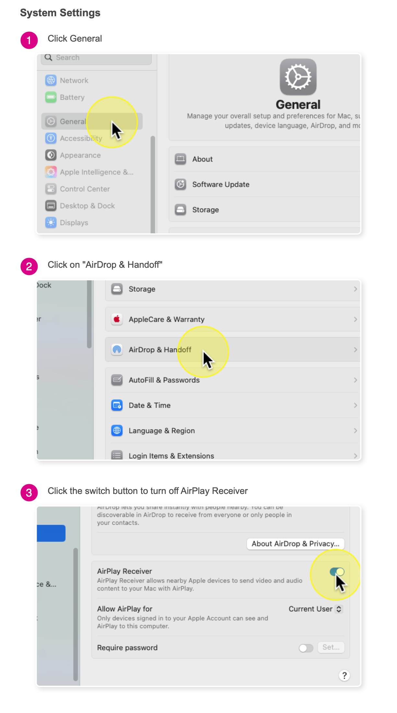

# Troubleshooting guide for bundling issues in Splice

This guide outlines steps to resolve common issues that a contributor might encounter during Splice's bundling process.

## Prerequisites

- Install **`nix`**, **`direnv`**, and **`sbt`** as per [DEVELOPMENT.md](./DEVELOPMENT.md)
- Ensure access to JFrog Artifactory (`splice-developers` team). Contact your team lead if access is denied.

## Steps

### 1. Setup Environment

- Clone the repository: `git clone https://github.com/hyperledger-labs/splice.git`.
- Navigate to the project directory: `cd splice`.
- Enable **`direnv`** to load environment variables (e.g., `DAML_COMPILER_VERSION`):

    ```bash
    direnv allow
    ```

- Verify: `echo $DAML_COMPILER_VERSION` should match the value in [daml-compiler-sources.json](./nix/daml-compiler-sources.json).

### 2. Clean Build Artifacts

- Remove stale artifacts to fix deduplication errors:

    ```bash
    make clean-all
    ```

- The following commands can also be ran alternatively: `sbt clean; sbt cleanCnDars`

### 3. Unset custom DAML SDK version

- Prevent version conflicts by disposing manual overrides in **`$DAML_SDK_VERSION`**

    ```bash
    unset DAML_SDK_VERSION
    ```

- Verify in SBT:

    ```bash
    sbt
    ```

- Wait for the SBT server to start, then:

    ```bash
    eval sys.env.foreach(println(_))
    ```

  Ensure **`DAML_SDK_VERSION`** is absent or matches the value in `daml.yaml`.

### 4. Bundle

- Execute in a **`direnv`**-enabled terminal:

    ```bash
    sbt bundle
    ```

- If deduplication errors persist, repeat step 2.

### 5. Handle Sphinx Errors (if encountered)

If you see **`Environment variable VERSION must be set`** or **`locale.Error: unsupported locale setting`** from **`sphinx-build`**, these may occur during documentation generation. To troubleshoot:

- Set the **`VERSION`** environment variable to match the `-D version` value (e.g., `0.4.0`):

    ```bash
    export VERSION=0.4.0
    ```

- Set a valid locale to resolve **`unsupported locale setting`** errors (common on macOS):

    ```bash
    export LC_ALL=en_US.UTF-8
    export LANG=en_US.UTF-8
    ```

- Run the **`sphinx-build`** command manually to verify:

    ```bash
    sphinx-build -M html ./docs/src ./docs/html -D version=0.4.0 -W
    ```

- Check the output in `./docs/html` to confirm documentation generation.
- If the error persists, ensure you are in the **`nix`** shell environment (`direnv allow`) and verify the Python/Sphinx version matches `nix/shell.nix` (e.g., `python3.12-sphinx-7.4.7`).

> Note: The Sphinx error may not block the core sbt bundle process, so you can proceed unless other critical errors arise.

### 6. Start Canton for testing

- After a successful **`sbt bundle`**, start the Canton instance for testing:

    ```bash
    ./scripts/start-canton.sh
    ```

- If you encounter a **`java.net.BindException: Address already in use`** error:
  - Check for processes using port `5000`

    ```bash
    lsof -i :5000
    ```

  - On **macOS**, disable `AirPlay Receiver` in `System Settings > General > AirDrop & Handoff`, as it may occupy port **`5000`**. Refer to the screenshot below for guidance (**macOS 13 Ventura** and newer).

  

  - An alternative option is to modify **`apps/app/src/test/resources/simple-topology-canton.conf`** and set a different port for the monitoring service (e.g., `port = 5001`).

    ```yaml
    canton.monitoring {
        metrics {
            jvm-metrics.enabled = true
            reporters = [{
            type = prometheus
            address = "0.0.0.0"
            port = 5001
            }]
        }
    }
    ```

  - Stop any running Canton instances:

    ```bash
    ./scripts/stop-canton.sh
    ```

  - Verify no residual Canton processes are running:

    ```bash
    ./scripts/list-background-processes.sh
    ```

  - If Canton processes persist, kill them manually:

    ```bash
    kill <PID>
    ```

- Verify successful startup:
  - Check the **`tmux`** session for Canton output:

    ```bash
    tmux attach
    ```

  - Look for logs in log/canton.out or log/canton-simtime.out to confirm the Canton instance is running.
  - Ensure the Canton instance starts without errors (e.g., no port conflicts).

### Additional notes

- Always run SBT commands from a terminal with `direnv` enabled to ensure the `nix` environment is correctly set up.
- If JFrog access issues persist, confirm with your team lead that all necessary team members have been added to the `splice-developers` group.
- For persistent issues, consult the Splice repository’s documentation or raise an issue in the repository for further assistance.
