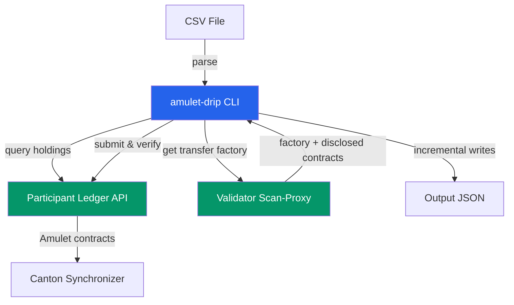
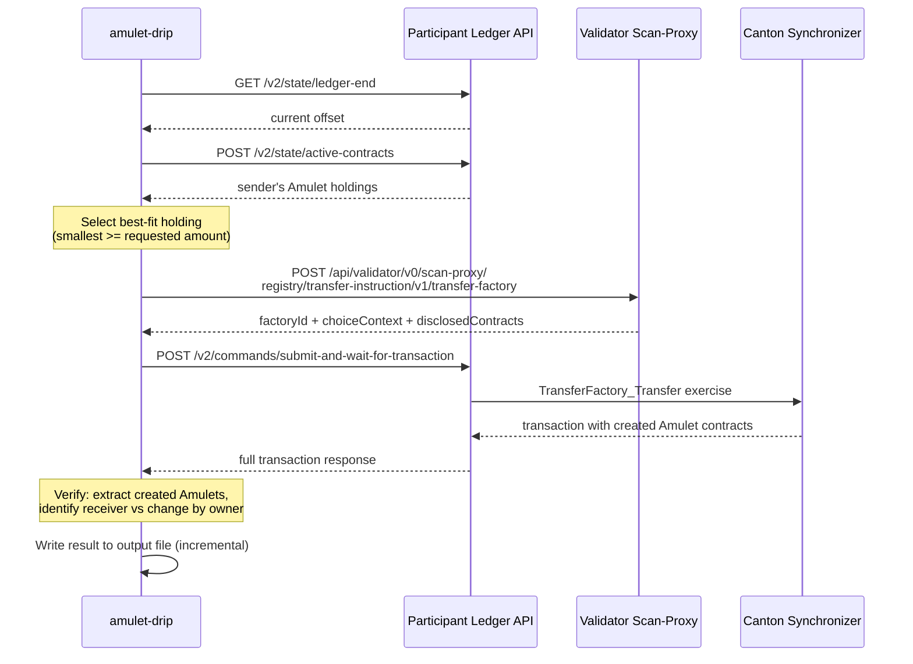
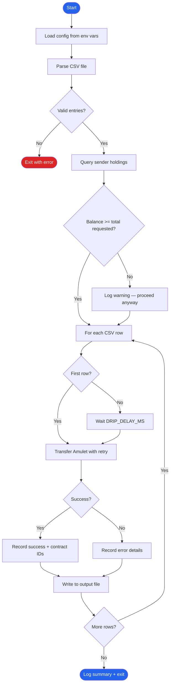
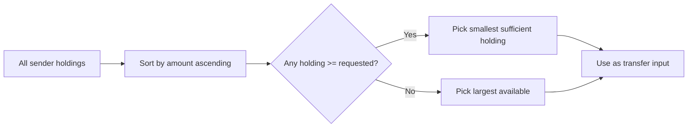

# amulet-drip

A general-purpose CLI tool for batch-distributing Amulet ($CC) tokens to multiple recipients on a Canton/Splice network.

Reads a CSV of party IDs (with optional amounts), transfers Amulet from a funded internal sender party to each recipient using the Splice Token Standard v1 TransferFactory API, and writes a JSON report of the results.

## Architecture



### Components

| Component | Role |
|-----------|------|
| **CLI** (`index.ts`) | Parses CSV, validates input, runs balance pre-check, orchestrates batch loop with retry and throttling, writes incremental output |
| **Transfer module** (`amulet-transfer.ts`) | Queries sender holdings, calls TransferFactory registry, submits exercise command, verifies transaction result |
| **Holdings utils** (`holdings.ts`) | UTXO-aware holding selection, transaction result parsing (receiver vs change identification) |
| **Config** (`config.ts`) | Loads and validates environment variables via Zod schema |
| **CSV parser** (`csv-parser.ts`) | Flexible CSV parsing with header auto-detection |

## Transfer Sequence



## Batch Processing Flow



## UTXO Holding Selection

When transferring Amulet, the tool selects a single holding rather than passing all holdings:



This minimizes unnecessary change outputs and avoids splitting holdings across multiple inputs.

## Prerequisites

- A running Canton/Splice network with a participant node
- A funded internal sender party with Amulet holdings
- Self-signed JWTs (HMAC256) for the Participant Ledger API and Validator scan-proxy API (see [TESTING.md](TESTING.md) for token generation)
- Node.js >= 18

## Installation

```bash
cd amulet-drip
npm install
npm run build
```

## Usage

### 1. Configure environment

Create a `.env` file or export environment variables:

```bash
# Required
export PARTICIPANT_LEDGER_API="http://localhost:6501"
export LEDGER_ACCESS_TOKEN="<self-signed-jwt>"
export VALIDATOR_API_URL="http://localhost:5503/api/validator/v0/scan-proxy"
export VALIDATOR_ACCESS_TOKEN="<self-signed-jwt>"
export ADMIN_USER="alice_validator_user"
export SYNCHRONIZER_ID="global-domain::1220..."
export SENDER_PARTY_ID="alice-validator-1::1220..."
export INSTRUMENT_ADMIN="DSO::1220..."

# Optional
export INSTRUMENT_ID="Amulet"          # default: Amulet
export DRIP_AMOUNT="1.0"               # default per-row amount
export DRIP_DELAY_MS="300"             # delay between transfers (ms)
export DRIP_RETRY_COUNT="2"            # retries per failed transfer
export DRIP_META_REASON="Amulet distribution"  # on-chain reason metadata
export LOG_LEVEL="info"                # pino log level
```

### 2. Prepare a CSV file

```csv
party,amount
trader-0::1220abc...,10.0
trader-1::1220def...,20.0
trader-2::1220ghi...,5.0
```

The CSV supports several formats:
- `party,amount` — explicit amount per row
- `party,expected_amount` — alternative header name
- `party` only — uses `DRIP_AMOUNT` for every row
- No header — auto-detected

Lines starting with `#` are treated as comments and skipped.

### 3. Run

```bash
# Output to stdout
node build/bundle.js drip parties.csv

# Output to file (incremental — survives crashes)
node build/bundle.js drip parties.csv --output results.json
```

### 4. Output format

The output JSON includes metadata and per-transfer results:

```json
{
  "generatedAt": "2026-04-23T10:00:00.000Z",
  "senderParty": "sender::1220...",
  "csvFile": "/path/to/parties.csv",
  "totalRequested": 35.0,
  "transfers": [
    {
      "party": "trader-0::1220abc...",
      "amount": "10.0",
      "status": "success",
      "updateId": "...",
      "receiverAmuletCid": "00abcd...",
      "changeCid": "00efgh...",
      "changeAmount": 90.0
    },
    {
      "party": "trader-1::1220def...",
      "amount": "20.0",
      "status": "error",
      "error": "PARTY_NOT_KNOWN_ON_DOMAIN: ..."
    }
  ]
}
```

## Environment Variables

| Variable | Required | Default | Description |
|----------|----------|---------|-------------|
| `PARTICIPANT_LEDGER_API` | Yes | — | Canton HTTP JSON API URL (e.g., `http://localhost:6501`) |
| `LEDGER_ACCESS_TOKEN` | Yes | — | Self-signed JWT (HMAC256) for Ledger API |
| `VALIDATOR_API_URL` | Yes | — | Validator scan-proxy base URL (e.g., `http://localhost:5503/api/validator/v0/scan-proxy`) |
| `VALIDATOR_ACCESS_TOKEN` | Yes | — | Self-signed JWT (HMAC256) for Validator API |
| `ADMIN_USER` | Yes | — | Canton user ID for command submission |
| `SYNCHRONIZER_ID` | Yes | — | Synchronizer ID for commands |
| `SENDER_PARTY_ID` | Yes | — | Funded internal sender party |
| `INSTRUMENT_ADMIN` | Yes | — | Amulet instrument admin (DSO party) |
| `INSTRUMENT_ID` | No | `Amulet` | Token instrument identifier |
| `DRIP_AMOUNT` | No | `1.0` | Default amount when CSV omits amount column |
| `DRIP_DELAY_MS` | No | `300` | Delay (ms) between transfers |
| `DRIP_RETRY_COUNT` | No | `2` | Retries per failed transfer |
| `DRIP_META_REASON` | No | `Amulet distribution` | On-chain transfer reason |
| `LOG_LEVEL` | No | `info` | Pino log level (`debug`, `info`, `warn`, `error`) |

## Error Handling

- **Retry**: Each transfer is retried up to `DRIP_RETRY_COUNT` times before recording a failure.
- **Partial failure**: A failed transfer does not stop the batch — remaining transfers continue. The process exits with code 1 if any transfer failed.
- **Crash recovery**: When using `--output`, results are written after every transfer. If the process crashes mid-batch, the output file contains all completed transfers up to that point.
- **Balance warning**: Before starting, the tool queries the sender's total balance and warns if it appears insufficient for the total requested amount (fees make exact comparison unreliable, so this is advisory only).
