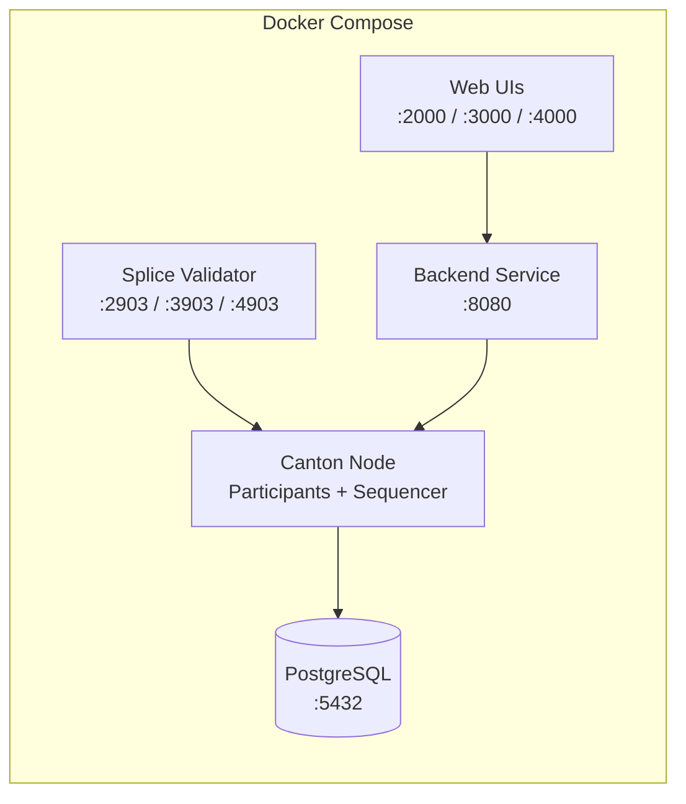
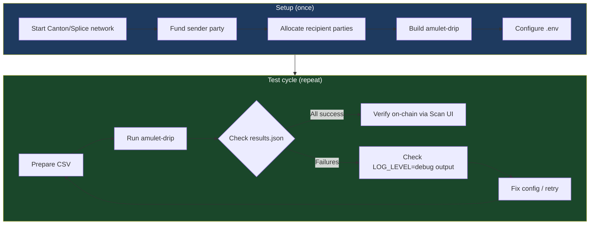

# Testing amulet-drip Locally

This guide walks through setting up a local Canton/Splice network and running `amulet-drip` against it end-to-end.

Two approaches are documented:
- **Option A: Quickstart Docker** — fastest path, no Splice source build required
- **Option B: Splice source build** — full development setup, needed for contributing to Splice

---

## Prerequisites (both options)

- **Node.js** >= 18 (for building and running amulet-drip)
- **Docker** & **Docker Compose** (for Canton/Splice network)
- **jq** (for inspecting JSON output)
- **curl** (for API verification)

---

## Option A: Quickstart Docker Setup

The Quickstart provides a fully containerized Canton/Splice network with pre-configured participants, validators, and web UIs.

### A.1. Clone and configure the Quickstart

```bash
git clone <quickstart-repo-url> ~/Quickstart
cd ~/Quickstart/quickstart
make setup
```

During interactive setup:
- **Network**: Choose `LocalNet` (self-contained, no external DevNet dependency)
- **Observability**: Choose `No` (not needed for testing amulet-drip)
- **Auth mode**: Choose `shared-secret` (simplest for local testing)
- **Test mode**: Choose `off`

### A.2. Build and start the Quickstart

```bash
make build
make start
```

This starts all services (~2-3 minutes):



Verify services are healthy:

```bash
make status
```

### A.3. Key ports for amulet-drip

| Service | Port | Usage |
|---------|------|-------|
| Canton JSON API (App User) | `2975` | `PARTICIPANT_LEDGER_API` |
| Validator Admin API (App User) | `2903` | `VALIDATOR_API_URL` |
| Canton JSON API (App Provider) | `3975` | Alternative participant |
| Scan UI | `scan.localhost:4000` | Verify transactions in browser |

### A.4. Obtain access tokens and party IDs

With `shared-secret` auth mode, generate a JWT for the ledger API:

```bash
# Generate a shared-secret JWT (HS256)
# The default secret is "unsafe" and audience is "https://canton.network.global"
SECRET="unsafe"
AUDIENCE="https://canton.network.global"
USER="ledger-api-user"

HEADER=$(printf '{"alg":"HS256","typ":"JWT"}' | openssl enc -base64 -A | tr '+/' '-_' | tr -d '=')
NOW=$(date +%s)
EXP=$((NOW + 86400))
PAYLOAD=$(printf '{"sub":"%s","aud":"%s","iat":%d,"exp":%d,"iss":"unsafe-auth"}' "$USER" "$AUDIENCE" "$NOW" "$EXP" | openssl enc -base64 -A | tr '+/' '-_' | tr -d '=')
SIGNATURE=$(printf '%s.%s' "$HEADER" "$PAYLOAD" | openssl dgst -sha256 -hmac "$SECRET" -binary | openssl enc -base64 -A | tr '+/' '-_' | tr -d '=')
TOKEN="${HEADER}.${PAYLOAD}.${SIGNATURE}"

echo "Token: $TOKEN"
```

Resolve the sender party (the validator's primary party):

```bash
PARTICIPANT_JSON_API="http://localhost:2975"

# Get the admin user's primary party
SENDER_PARTY=$(curl -s "$PARTICIPANT_JSON_API/v2/users/ledger-api-user" \
  -H "Authorization: Bearer $TOKEN" \
  -H "Content-Type: application/json" \
  | jq -r '.user.primaryParty')

echo "Sender party: $SENDER_PARTY"
```

Resolve the DSO party (instrument admin):

```bash
VALIDATOR_API="http://localhost:2903"

DSO_PARTY=$(curl -s "$VALIDATOR_API/api/validator/v0/scan-proxy/dso-party-id" \
  -H "Authorization: Bearer $TOKEN" \
  -H "Content-Type: application/json" \
  | jq -r '.dso_party_id')

echo "DSO party: $DSO_PARTY"
```

Resolve the synchronizer ID:

```bash
SYNCHRONIZER_ID=$(curl -s "$PARTICIPANT_JSON_API/v2/state/connected-synchronizers" \
  -H "Authorization: Bearer $TOKEN" \
  -H "Content-Type: application/json" \
  | jq -r '.connectedSynchronizers[0].synchronizerId')

echo "Synchronizer: $SYNCHRONIZER_ID"
```

### A.5. Fund the sender party (DevNet tap)

The sender needs Amulet holdings before it can distribute. On LocalNet, use the faucet:

```bash
cd ~/Quickstart/quickstart/docker/setup-internal-parties
cp .env.example .env
# Edit .env if needed (defaults usually work for LocalNet)
./04-faucet-amulet.sh
```

Or use the Quickstart's built-in faucet via the wallet UI at `http://wallet.localhost:2000`.

### A.6. Create recipient parties

Allocate internal parties to receive Amulet:

```bash
cd ~/Quickstart/quickstart/docker/setup-internal-parties

# Allocate 5 parties with prefix "test-recipient"
NUM_PARTIES=5 PARTY_HINT_PREFIX=test-recipient ./01-allocate-internal-parties.sh
```

This produces `internal-parties.json` with party IDs.

### A.7. Build and configure amulet-drip

```bash
cd amulet-drip
npm install
npm run build
```

Create a `.env` file using the values obtained above:

```bash
cat > .env << EOF
PARTICIPANT_LEDGER_API=http://localhost:2975
LEDGER_ACCESS_TOKEN=$TOKEN
VALIDATOR_API_URL=http://localhost:2903/api/validator
VALIDATOR_ACCESS_TOKEN=$TOKEN
ADMIN_USER=ledger-api-user
SYNCHRONIZER_ID=$SYNCHRONIZER_ID
SENDER_PARTY_ID=$SENDER_PARTY
INSTRUMENT_ADMIN=$DSO_PARTY
DRIP_AMOUNT=10.0
DRIP_DELAY_MS=500
LOG_LEVEL=debug
EOF
```

### A.8. Prepare the CSV and run

```bash
# Extract party IDs from the allocated parties into a CSV
jq -r '.parties[].partyId' \
  ~/Quickstart/quickstart/docker/setup-internal-parties/internal-parties.json \
  | awk '{print $1",10.0"}' > parties.csv

# Add header
sed -i '' '1i\
party,amount
' parties.csv

# Run amulet-drip
node build/bundle.js drip parties.csv --output results.json
```

### A.9. Verify the results

```bash
# Check the output file
cat results.json | jq '.transfers[] | {party, status, receiverAmuletCid}'

# Count successes/failures
echo "Succeeded: $(jq '[.transfers[] | select(.status=="success")] | length' results.json)"
echo "Failed: $(jq '[.transfers[] | select(.status=="error")] | length' results.json)"
```

Verify on-chain via the Scan UI at `http://scan.localhost:4000` or query holdings directly:

```bash
# Check a recipient's holdings
RECIPIENT=$(jq -r '.parties[0].partyId' \
  ~/Quickstart/quickstart/docker/setup-internal-parties/internal-parties.json)

curl -s "$PARTICIPANT_JSON_API/v2/state/active-contracts" \
  -H "Authorization: Bearer $TOKEN" \
  -H "Content-Type: application/json" \
  -d "{
    \"filter\": {
      \"filtersByParty\": {
        \"$RECIPIENT\": {
          \"cumulative\": [{
            \"identifierFilter\": {
              \"TemplateFilter\": {
                \"value\": {
                  \"templateId\": \"#splice-amulet:Splice.Amulet:Amulet\",
                  \"includeCreatedEventBlob\": false
                }
              }
            }
          }]
        }
      }
    },
    \"verbose\": true,
    \"activeAtOffset\": $(curl -s "$PARTICIPANT_JSON_API/v2/state/ledger-end" \
      -H "Authorization: Bearer $TOKEN" | jq '.offset')
  }" | jq '.[] | .contractEntry.JsActiveContract.createdEvent.createArguments.amount'
```

### A.10. Cleanup

```bash
cd ~/Quickstart/quickstart
make stop        # Stop containers (preserve volumes)
make clean-all   # Full cleanup including volumes
```

---

## Option B: Splice Source Build

For contributors working directly in the Splice repository. Requires Nix and direnv.

### B.1. Prerequisites

```bash
# Install Nix (if not already installed)
# See https://nixos.org/download

# Enable experimental features
mkdir -p ~/.config/nix
echo "experimental-features = nix-command flakes" >> ~/.config/nix/nix.conf

# Install direnv
# See https://direnv.net/docs/installation.html
```

### B.2. Set up the environment

```bash
cd ~/Working/FETCH/Angelhack/Canton/Splice
direnv allow
```

This loads the Nix environment with all required tools (Java, sbt, Node.js, etc.).

### B.3. Build Splice

```bash
# Full build (creates the release bundle)
sbt bundle
```

This takes significant time on first run. Subsequent builds are incremental.

### B.4. Start Canton

```bash
# Start Canton in detached mode
./start-canton.sh -d

# Wait for it to be ready
./wait-for-canton.sh
```

Canton starts in a tmux session with:
- Multiple participant nodes (SV1-4, Alice, Bob)
- Sequencers and mediators
- PostgreSQL (via Docker)

### B.5. Start Splice backend applications

```bash
./scripts/start-backends-for-local-frontend-testing.sh
```

This starts the Splice validator, scan, wallet, and other backend services.

### B.6. Get access tokens

Canton writes admin tokens to `canton.tokens` in the repo root:

```bash
# Format: <port> <token>
cat canton.tokens

# Extract the token for a specific participant (e.g., Alice on port 5501)
TOKEN=$(grep 5501 canton.tokens | awk '{print $2}')
```

### B.7. Resolve configuration values

```bash
# Participant Ledger API (Alice's HTTP JSON API)
PARTICIPANT_JSON_API="http://localhost:6501"

# Get sender party
SENDER_PARTY=$(curl -s "$PARTICIPANT_JSON_API/v2/users/alice_validator_user" \
  -H "Authorization: Bearer $TOKEN" \
  -H "Content-Type: application/json" \
  | jq -r '.user.primaryParty')

# Get DSO party from Scan API
DSO_PARTY=$(curl -s "http://localhost:5012/api/scan/v0/dso-party-id" \
  -H "Content-Type: application/json" \
  | jq -r '.dso_party_id')

# Get synchronizer ID
SYNCHRONIZER_ID=$(curl -s "$PARTICIPANT_JSON_API/v2/state/connected-synchronizers" \
  -H "Authorization: Bearer $TOKEN" \
  -H "Content-Type: application/json" \
  | jq -r '.connectedSynchronizers[0].synchronizerId')
```

### B.8. Build amulet-drip and test

```bash
cd amulet-drip
npm install
npm run build

# Configure
cat > .env << EOF
PARTICIPANT_LEDGER_API=http://localhost:6501
LEDGER_ACCESS_TOKEN=$TOKEN
VALIDATOR_API_URL=http://localhost:5503/api/validator
VALIDATOR_ACCESS_TOKEN=$TOKEN
ADMIN_USER=alice_validator_user
SYNCHRONIZER_ID=$SYNCHRONIZER_ID
SENDER_PARTY_ID=$SENDER_PARTY
INSTRUMENT_ADMIN=$DSO_PARTY
DRIP_AMOUNT=5.0
LOG_LEVEL=debug
EOF

# Create a test CSV (you'll need to allocate test parties first via party-allocator or Canton console)
echo "party,amount" > test-parties.csv
echo "$SENDER_PARTY,1.0" >> test-parties.csv  # Transfer to self as smoke test

# Run
node build/bundle.js drip test-parties.csv --output test-results.json
cat test-results.json | jq '.'
```

### B.9. Run the unit tests

```bash
cd amulet-drip
npm run test:sbt
```

Expected: all 26 unit tests pass (config, csv-parser, holdings).

### B.10. Cleanup

```bash
# From repo root
./stop-canton.sh
```

---

## Testing Workflow Diagram



## Troubleshooting

| Symptom | Cause | Fix |
|---------|-------|-----|
| `Sender has no Amulet holdings` | Sender party not funded | Run faucet script or tap via wallet UI |
| `Failed to get transfer factory` | Validator scan-proxy unreachable | Check `VALIDATOR_API_URL` and that validator is running |
| `HTTP 401` on any API call | Token expired or wrong audience | Regenerate JWT token (valid for 24h) |
| `PARTY_NOT_KNOWN_ON_DOMAIN` | Recipient not allocated on this participant | Allocate parties on the same participant node |
| `No connected synchronizer` | Canton not fully initialized | Wait longer after `start-canton.sh` or re-run `wait-for-canton.sh` |
| Connection refused on port 2975 | JSON API not started | Quickstart: `make status`; Splice: check Canton tmux session |
| `INSTRUMENT_ADMIN` mismatch | DSO party ID is wrong | Re-query via scan-proxy `/dso-party-id` endpoint |
