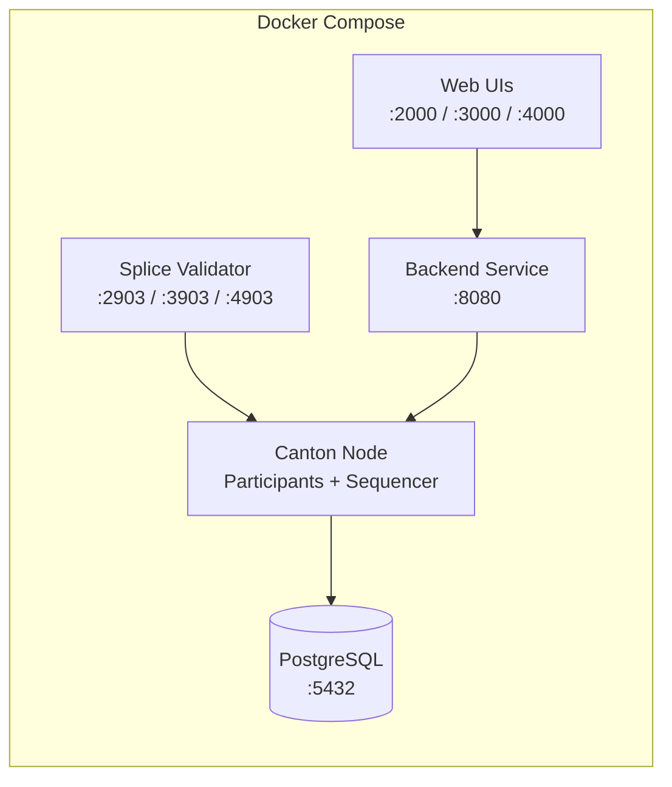
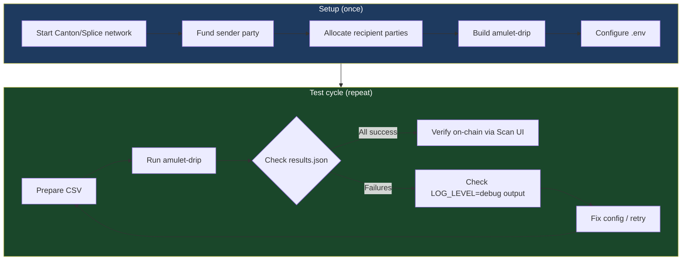

# Testing amulet-drip Locally

This guide walks through setting up a local Canton/Splice network and running `amulet-drip` against it end-to-end.

Two approaches are documented:
- **Option A: Quickstart Docker** — fastest path, no Splice source build required
- **Option B: Splice source build** — full development setup, needed for contributing to Splice

---

## Prerequisites (both options)

- **Node.js** >= 18 (for building and running amulet-drip)
- **Docker** & **Docker Compose** (for Canton/Splice network)
- **jq** (for inspecting JSON output)
- **curl** (for API verification)

---

## Option A: Quickstart Docker Setup

The Quickstart provides a fully containerized Canton/Splice network with pre-configured participants, validators, and web UIs.

### A.1. Clone and configure the Quickstart

```bash
git clone <quickstart-repo-url> ~/Quickstart
cd ~/Quickstart/quickstart
make setup
```

During interactive setup:
- **Network**: Choose `LocalNet` (self-contained, no external DevNet dependency)
- **Observability**: Choose `No` (not needed for testing amulet-drip)
- **Auth mode**: Choose `shared-secret` (simplest for local testing)
- **Test mode**: Choose `off`

### A.2. Build and start the Quickstart

```bash
make build
make start
```

This starts all services (~2-3 minutes):



Verify services are healthy:

```bash
make status
```

### A.3. Key ports for amulet-drip

| Service | Port | Usage |
|---------|------|-------|
| Canton JSON API (App User) | `2975` | `PARTICIPANT_LEDGER_API` |
| Validator Scan-Proxy (App User) | `2903` | `VALIDATOR_API_URL` (base: `.../api/validator/v0/scan-proxy`) |
| Canton JSON API (App Provider) | `3975` | Alternative participant |
| Scan UI | `scan.localhost:4000` | Verify transactions in browser |

### A.4. Obtain access tokens and party IDs

With `shared-secret` auth mode, generate a JWT for the ledger API:

```bash
# Generate a shared-secret JWT (HS256)
# The default secret is "unsafe" and audience is "https://canton.network.global"
SECRET="unsafe"
AUDIENCE="https://canton.network.global"
USER="ledger-api-user"

HEADER=$(printf '{"alg":"HS256","typ":"JWT"}' | openssl enc -base64 -A | tr '+/' '-_' | tr -d '=')
NOW=$(date +%s)
EXP=$((NOW + 86400))
PAYLOAD=$(printf '{"sub":"%s","aud":"%s","iat":%d,"exp":%d,"iss":"unsafe-auth"}' "$USER" "$AUDIENCE" "$NOW" "$EXP" | openssl enc -base64 -A | tr '+/' '-_' | tr -d '=')
SIGNATURE=$(printf '%s.%s' "$HEADER" "$PAYLOAD" | openssl dgst -sha256 -hmac "$SECRET" -binary | openssl enc -base64 -A | tr '+/' '-_' | tr -d '=')
TOKEN="${HEADER}.${PAYLOAD}.${SIGNATURE}"

echo "Token: $TOKEN"
```

Resolve the sender party (the validator's primary party):

```bash
PARTICIPANT_JSON_API="http://localhost:2975"

# Get the admin user's primary party
SENDER_PARTY=$(curl -s "$PARTICIPANT_JSON_API/v2/users/ledger-api-user" \
  -H "Authorization: Bearer $TOKEN" \
  -H "Content-Type: application/json" \
  | jq -r '.user.primaryParty')

echo "Sender party: $SENDER_PARTY"
```

Resolve the DSO party (instrument admin):

```bash
VALIDATOR_API="http://localhost:2903"

DSO_PARTY=$(curl -s "$VALIDATOR_API/api/validator/v0/scan-proxy/dso-party-id" \
  -H "Authorization: Bearer $TOKEN" \
  -H "Content-Type: application/json" \
  | jq -r '.dso_party_id')

echo "DSO party: $DSO_PARTY"
```

Resolve the synchronizer ID:

```bash
SYNCHRONIZER_ID=$(curl -s "$PARTICIPANT_JSON_API/v2/state/connected-synchronizers" \
  -H "Authorization: Bearer $TOKEN" \
  -H "Content-Type: application/json" \
  | jq -r '.connectedSynchronizers[0].synchronizerId')

echo "Synchronizer: $SYNCHRONIZER_ID"
```

### A.5. Fund the sender party

The sender party needs Amulet holdings before it can distribute. Use the wallet UI to tap Amulet via the DevNet faucet:

1. Open the wallet UI at `http://wallet.localhost:2000`
2. Use the DevNet tap feature to fund the sender party

Alternatively, use the `party-allocator` tool from the Splice repo, which supports DevNet tap via `AmuletRules_DevNet_Tap`.

Verify the sender has holdings:

```bash
curl -s "$PARTICIPANT_JSON_API/v2/state/active-contracts" \
  -H "Authorization: Bearer $TOKEN" \
  -H "Content-Type: application/json" \
  -d "{
    \"filter\": {
      \"filtersByParty\": {
        \"$SENDER_PARTY\": {
          \"cumulative\": [{
            \"identifierFilter\": {
              \"TemplateFilter\": {
                \"value\": {
                  \"templateId\": \"#splice-amulet:Splice.Amulet:Amulet\",
                  \"includeCreatedEventBlob\": false
                }
              }
            }
          }]
        }
      }
    },
    \"verbose\": true,
    \"activeAtOffset\": $(curl -s "$PARTICIPANT_JSON_API/v2/state/ledger-end" \
      -H "Authorization: Bearer $TOKEN" | jq '.offset')
  }" | jq '.[] | .contractEntry.JsActiveContract.createdEvent.createArguments.amount'
```

### A.6. Create recipient parties

Allocate test parties directly via the Ledger API:

```bash
# Allocate 3 test recipient parties
for i in $(seq 1 3); do
  PARTY_ID=$(curl -s "$PARTICIPANT_JSON_API/v2/parties/allocate" \
    -H "Authorization: Bearer $TOKEN" \
    -H "Content-Type: application/json" \
    -d "{\"partyIdHint\": \"test-recipient-$i\"}" \
    | jq -r '.partyId')
  echo "$PARTY_ID,10.0" >> recipients.csv
  echo "Allocated: $PARTY_ID"
done

# Add header
sed -i '' '1i\
party,amount
' recipients.csv
```

### A.7. Build and configure amulet-drip

```bash
cd amulet-drip
npm install
npm run build
```

Create a `.env` file using the values obtained above:

```bash
cat > .env << EOF
PARTICIPANT_LEDGER_API=http://localhost:2975
LEDGER_ACCESS_TOKEN=$TOKEN
VALIDATOR_API_URL=http://localhost:2903/api/validator/v0/scan-proxy
VALIDATOR_ACCESS_TOKEN=$TOKEN
ADMIN_USER=ledger-api-user
SYNCHRONIZER_ID=$SYNCHRONIZER_ID
SENDER_PARTY_ID=$SENDER_PARTY
INSTRUMENT_ADMIN=$DSO_PARTY
DRIP_AMOUNT=10.0
DRIP_DELAY_MS=500
LOG_LEVEL=debug
EOF
```

### A.8. Run amulet-drip

```bash
# Run with the recipients CSV from step A.6
node build/bundle.js drip recipients.csv --output results.json

# Or do a self-transfer smoke test first
echo "party,amount" > smoke-test.csv
echo "$SENDER_PARTY,1.0" >> smoke-test.csv
node build/bundle.js drip smoke-test.csv --output results.json
```

### A.9. Verify the results

```bash
# Check the output file
cat results.json | jq '.transfers[] | {party, status, receiverAmuletCid}'

# Count successes/failures
echo "Succeeded: $(jq '[.transfers[] | select(.status=="success")] | length' results.json)"
echo "Failed: $(jq '[.transfers[] | select(.status=="error")] | length' results.json)"
```

Verify on-chain via the Scan UI at `http://scan.localhost:4000`.

### A.10. Cleanup

```bash
cd ~/Quickstart/quickstart
make stop        # Stop containers (preserve volumes)
make clean-all   # Full cleanup including volumes
```

---

## Option B: Splice Source Build

For contributors working directly in the Splice repository. Requires Nix and direnv.

### B.1. Prerequisites

```bash
# Install Nix (if not already installed)
# See https://nixos.org/download

# Enable experimental features
mkdir -p ~/.config/nix
echo "experimental-features = nix-command flakes" >> ~/.config/nix/nix.conf

# Install direnv
# See https://direnv.net/docs/installation.html
```

### B.2. Set up the environment

```bash
cd ~/Working/FETCH/Angelhack/Canton/Splice
direnv allow
```

This loads the Nix environment with all required tools (Java, sbt, Node.js, etc.).

### B.3. Build Splice

```bash
# Full build (creates the release bundle)
sbt bundle
```

This takes significant time on first run. Subsequent builds are incremental.

### B.4. Start Canton

```bash
# Start Canton in detached mode (wall clock only — saves memory)
# Note: start-canton.sh calls wait-for-canton.sh internally, no need to run it separately
./start-canton.sh -d -w
```

Canton starts in a tmux session with:
- Multiple participant nodes (SV1-4, Alice, Bob)
- Sequencers and mediators
- PostgreSQL (via Docker)

> **Troubleshooting:** If Canton fails to start, check for shell aliases shadowing the `canton` binary (`alias | grep canton`). Canton needs a clean database — if restarting after a failed run, stop and recreate Postgres first: `./scripts/postgres.sh docker stop && ./start-canton.sh -d -w`.

Once Canton is healthy, it generates `canton.tokens` and `canton.participants` in the repo root.

### B.5. Start Splice backend applications

```bash
./scripts/start-backends-for-local-frontend-testing.sh
```

This starts the Splice validator, scan, wallet, and other backend services. It reads `canton.tokens` to configure auth, so Canton must be running first.

Optionally, start the frontend UIs:

```bash
./start-frontends.sh
```

### Local Splice Port Reference

Once Canton and backends are running, the following services are available. Ports follow a numbering pattern where the hundreds digit identifies the node (1=SV1, 2=SV2, ..., 5=Alice, 6=Bob, 7=Splitwell) and the last two digits identify the service type.

> **Note:** `start-backends-for-local-frontend-testing.sh` starts a subset of backends (SV1, Alice, Splitwell). Not all ports listed below will be active unless the corresponding backend is started.

#### Canton Participant Nodes

| Node | Ledger API (gRPC) | Admin API | HTTP JSON API | User ID |
|------|-------------------|-----------|---------------|---------|
| SV1 | `5101` | `5102` | `6101` | `sv1` |
| SV2 | `5201` | `5202` | `6201` | `sv2` |
| SV3 | `5301` | `5302` | `6301` | `sv3` |
| SV4 | `5401` | `5402` | `6401` | `sv4` |
| Alice | `5501` | `5502` | `6501` | `alice_validator_user` |
| Bob | `5601` | `5602` | `6601` | `bob_validator_user` |
| Splitwell | `5701` | `5702` | `6701` | `splitwell_validator_user` |

#### Splice Backend Services

| Service | Port | URL | Started by default |
|---------|------|-----|--------------------|
| Scan API | `5012` | `http://localhost:5012/api/scan` | Yes |
| SV1 Validator API | `5103` | `http://localhost:5103/api/validator` | Yes |
| SV1 App API | `5114` | `http://localhost:5114/api/sv` | Yes |
| Alice Validator API | `5503` | `http://localhost:5503/api/validator` | Yes |
| Splitwell Validator API | `5703` | `http://localhost:5703/api/validator` | Yes |
| Splitwell Backend | `5113` | `http://localhost:5113/api/splitwell` | Yes |
| Bob Validator API | `5603` | `http://localhost:5603/api/validator` | No |
| SV2-4 Validator APIs | `5203`/`5303`/`5403` | `http://localhost:5x03/api/validator` | No |

#### Frontend UIs (via `start-frontends.sh`)

| UI | Port | URL |
|----|------|-----|
| Alice Wallet | `3000` | `http://localhost:3000` |
| Bob Wallet | `3001` | `http://localhost:3001` |
| SV1 Wallet | `3011` | `http://localhost:3011` |
| Amulet Name Service (Alice) | `3100` | `http://localhost:3100` |
| SV1 App | `3211` | `http://localhost:3211` |
| Scan Explorer | `3311` | `http://localhost:3311` |
| Splitwell (Alice) | `3400` | `http://localhost:3400` |
| Splitwell (Bob) | `3401` | `http://localhost:3401` |

#### Ports used by amulet-drip

| Env Variable | Port | Service |
|--------------|------|---------|
| `PARTICIPANT_LEDGER_API` | `6501` | Alice's HTTP JSON API |
| `VALIDATOR_API_URL` | `5503` | Alice's validator scan-proxy (`/api/validator/v0/scan-proxy`) |

### B.6. Get access tokens

The Splice backend services use **self-signed HMAC256 JWTs** for authentication — not the raw hex tokens from `canton.tokens`. The JWT secret is `"test"` and the audience is set by the `OIDC_AUTHORITY_LEDGER_API_AUDIENCE` environment variable (typically `https://canton.network.global` in the Nix dev shell).

There are two types of tokens:

| Token type | Used for | How to obtain |
|-----------|----------|---------------|
| **Canton admin token** (raw hex) | Canton admin gRPC API (ports 5x01) | Read from `canton.tokens` |
| **Self-signed JWT** | Ledger JSON API (ports 6x01) and Validator/Scan APIs (ports 5x03, 5012) | Generate with HMAC256 |

Generate a self-signed JWT for Alice's validator user:

```bash
# Auth parameters for the local dev environment
AUTH_SECRET="test"
AUTH_AUDIENCE="https://canton.network.global"
AUTH_USER="alice_validator_user"

# Generate HMAC256-signed JWT
HEADER=$(printf '{"alg":"HS256","typ":"JWT"}' | base64 | tr '+/' '-_' | tr -d '=\n')
PAYLOAD=$(printf '{"sub":"%s","aud":"%s","scope":"daml_ledger_api"}' \
  "$AUTH_USER" "$AUTH_AUDIENCE" | base64 | tr '+/' '-_' | tr -d '=\n')
SIGNATURE=$(printf '%s.%s' "$HEADER" "$PAYLOAD" \
  | openssl dgst -sha256 -hmac "$AUTH_SECRET" -binary \
  | base64 | tr '+/' '-_' | tr -d '=\n')
TOKEN="${HEADER}.${PAYLOAD}.${SIGNATURE}"

echo "JWT Token: $TOKEN"
```

This token works for both the Ledger JSON API and the Validator scan-proxy API.

Verify the token works:

```bash
# Should return Alice's user info with primaryParty
curl -s "http://localhost:6501/v2/users/alice_validator_user" \
  -H "Authorization: Bearer $TOKEN" \
  -H "Content-Type: application/json" | jq .
```

### B.7. Resolve configuration values

```bash
PARTICIPANT_JSON_API="http://localhost:6501"

# Get sender party
SENDER_PARTY=$(curl -s "$PARTICIPANT_JSON_API/v2/users/alice_validator_user" \
  -H "Authorization: Bearer $TOKEN" \
  -H "Content-Type: application/json" \
  | jq -r '.user.primaryParty')
echo "Sender party: $SENDER_PARTY"

# Get DSO party from Scan API
DSO_PARTY=$(curl -s "http://localhost:5012/api/scan/v0/dso-party-id" \
  -H "Authorization: Bearer $TOKEN" \
  -H "Content-Type: application/json" \
  | jq -r '.dso_party_id')
echo "DSO party: $DSO_PARTY"

# Get synchronizer ID
SYNCHRONIZER_ID=$(curl -s "$PARTICIPANT_JSON_API/v2/state/connected-synchronizers" \
  -H "Authorization: Bearer $TOKEN" \
  -H "Content-Type: application/json" \
  | jq -r '.connectedSynchronizers[0].synchronizerId')
echo "Synchronizer: $SYNCHRONIZER_ID"
```

### B.8. Build amulet-drip and test

```bash
cd amulet-drip
npm install
npm run build

# Configure
cat > .env << EOF
PARTICIPANT_LEDGER_API=http://localhost:6501
LEDGER_ACCESS_TOKEN=$TOKEN
VALIDATOR_API_URL=http://localhost:5503/api/validator/v0/scan-proxy
VALIDATOR_ACCESS_TOKEN=$TOKEN
ADMIN_USER=alice_validator_user
SYNCHRONIZER_ID=$SYNCHRONIZER_ID
SENDER_PARTY_ID=$SENDER_PARTY
INSTRUMENT_ADMIN=$DSO_PARTY
DRIP_AMOUNT=5.0
LOG_LEVEL=debug
EOF

# Create a test CSV (you'll need to allocate test parties first via party-allocator or Canton console)
echo "party,amount" > test-parties.csv
echo "$SENDER_PARTY,1.0" >> test-parties.csv  # Transfer to self as smoke test

# Run
node build/bundle.js drip test-parties.csv --output test-results.json
cat test-results.json | jq '.'
```

### B.9. Run the unit tests

```bash
cd amulet-drip
npm run test:sbt
```

Expected: all 26 unit tests pass (config, csv-parser, holdings).

### B.10. Cleanup

```bash
# From repo root
./stop-canton.sh
```

---

## Testing Workflow Diagram



## Troubleshooting

| Symptom | Cause | Fix |
|---------|-------|-----|
| `Sender has no Amulet holdings` | Sender party not funded | Run faucet script or tap via wallet UI |
| `HTTP 404` on transfer factory | `VALIDATOR_API_URL` path is wrong | Must end with `/api/validator/v0/scan-proxy` (the OpenAPI client appends `/registry/...`) |
| `Failed to get transfer factory` | Validator scan-proxy unreachable | Check `VALIDATOR_API_URL` and that validator is running |
| `The supplied authentication is invalid` | Wrong token type for the API | Use self-signed JWT (HMAC256, secret `"test"`), not raw hex from `canton.tokens` |
| `HTTP 401` on any API call | Token expired or wrong audience | Regenerate JWT with audience `https://canton.network.global` |
| `cd: too many arguments` in Canton tmux | Shell alias shadows `canton` binary | Remove `alias canton=...` from `~/.zshrc` and restart tmux session |
| Canton timeout (300s) then fails | Stale database from previous run | `./scripts/postgres.sh docker stop` then restart Canton |
| `canton.tokens` not found | Canton not started or crashed | Start Canton first: `./start-canton.sh -d -w` |
| `PARTY_NOT_KNOWN_ON_DOMAIN` | Recipient not allocated on this participant | Allocate parties on the same participant node |
| `No connected synchronizer` | Canton not fully initialized | Wait longer after `start-canton.sh` |
| Connection refused on port 6501 | JSON API not started | Check Canton tmux session: `tmux attach -t canton` |
| `INSTRUMENT_ADMIN` mismatch | DSO party ID is wrong | Re-query via scan-proxy `/dso-party-id` endpoint |
