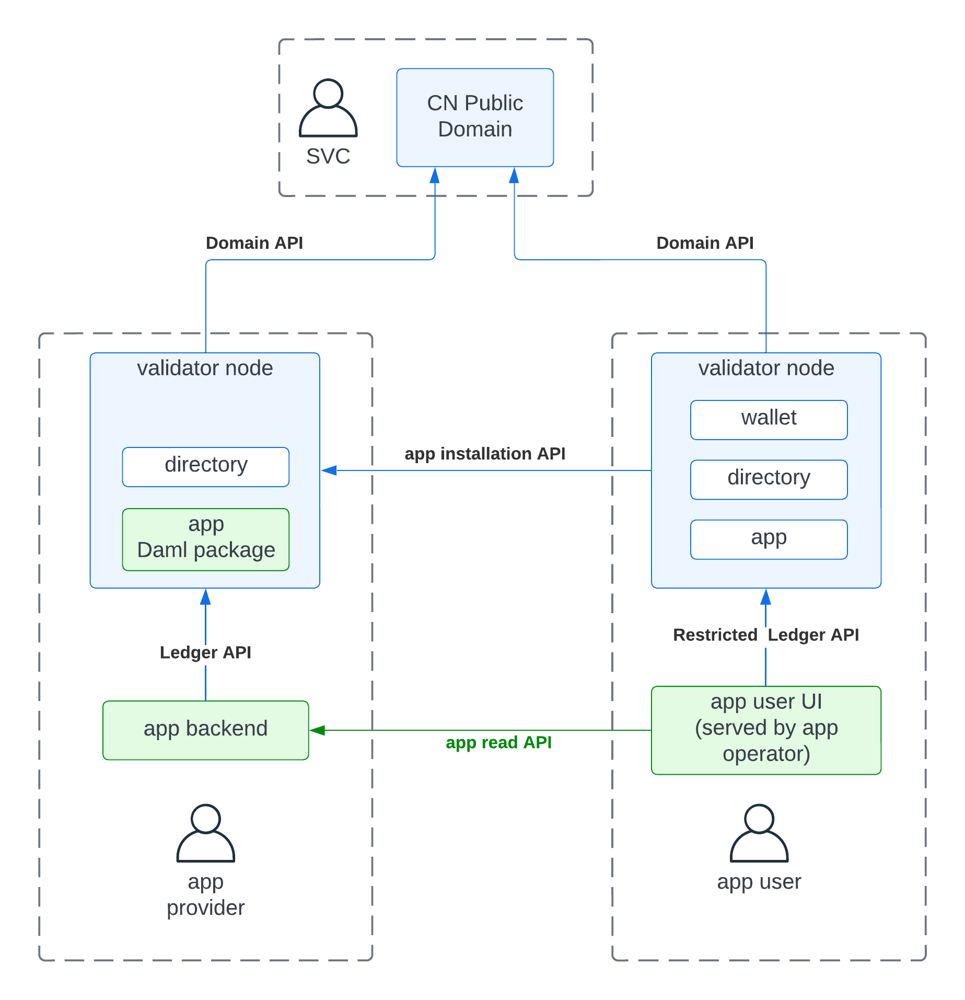

Topology
========

Default Application Topology
----------------------------

* there are many topologies possible
* the topology shown below fits many usecases and is thus a good starting
  point for building and operating a CN app
* we discuss its limits and characteristics in later sections together with
  explaining how to change the topology to increase limits and characteristics
  that are problematic for some usecases
* the topology assumes that there is an **app provider** building and
  operating the app to enable its **app users** to run particular
  multi-party business workflows
* the diagram below depicts the topology of such an app

.. TODO(M1-14): [polish] And link to a chapter that explains the standard components of CN, otherwise things like "app users have their own validator node" don't make sense to the reader.

..  https://lucid.app/lucidchart/7279c336-b1a0-48de-979e-d08d0182f1a1/edit?viewport_loc=1290%2C-69%2C2972%2C1264%2C0_0&invitationId=inv_e9daab9d-1ebc-4423-b297-053ac0f84d09#

.. TODO(M1-14): [polish] What does it mean for an app to be installed? What is the difference between "app" on the right side and "app Daml package" on the left side?
.. TODO(M1-14): [polish] Are "wallet" and "directory" not standard components of CN?

* the diagram uses the following notation:

  * blue boxes for standard components of the :term:`CN`
  * blue arrows for communication over standard :term:`CN` APIs
  * green boxes for custom components of the app
  * green arrows for custom APIs of the app
  * white filled boxes for Daml apps required to be installed in a
    validator node
  * dashed boxes to denote the infrastructure on which a component runs

* from the diagram, we see that

  * app users have their own validator node, which manages their
    on-ledger identity (Daml party) and their installed apps and
    stores all of their data

  * the app provider runs its own validator node, which manages their
    on-ledger identity and data

  * a CN app consists of three custom components:

    1. An **app Daml package** defining (1) the schema of the data shared between the app
       provider and app users and (2) their rights on this data.

    2. An **app user UI** for app users to (1) view the current state
       of their workflows in the app and (2) issue commands to their validator
       node to advance their workflows.

    3. An **app backend** that (1) runs all provider automation (including
       integration with the off-ledger services run by the provider) and
       (2) serves queries over the provider's data required for the app user
       UI (e.g., a fuzzy search of contracts for an auto-complete box in the UI)

       For small sets of active contracts (< 10k), we recommend keeping all
       data required for automation in the app backend's memory, and
       rehydrating from the ledger upon restart. For larger sets, we recommend
       using a persistent cache updated using the Ledger API's transaction
       stream. Make sure to only use that DB as a cache and keep storing all
       essential state on-ledger.

  * there are five different APIs in use:

    1. The **Domain API** is used by the validator nodes to connect to the CN
       Public Domain, which they use to coordinate transactions on the
       app's data.

    2. The **Ledger API** is used by the app backend to read and act in the
       name of the app provider.

    3. A **Restricted Ledger API** is served by a validator node to the UI of an
       installed app. The restrictions ensure that the UI can only
       act in the name of the user as per the rights defined by the
       app's install contract (see :doc:`building/model`); and the UI can only
       read data of the templates specified in the install contract.

       .. TODO(M1-14): [polish] Linked doc doesn't explain what an install contract is.
       .. TODO(M1-14): [unclear to me] Explain how does this work? Is this a regular ledger API with a new kind of JWT token? Or a completely new API?

       This API also supports the issuance of app access-tokens,
       which allow a user to prove to the provider that the user has an active
       installation of the provider's app.

       .. TODO(M1-14): explain where and how are these app access-tokens are used?

    4. A generic **app installation API** which is served by the provider's
       validator node to deliver the necessary Daml packages to the user's
       validator node upon app installation and upgrading.

    5. The **app read API** which is an API custom-built to serve the needs of
       the app user UI. Users should be authenticated using app access-tokens
       issued by their validator node.

  * the app provider uses the directory service to allocate a human-readable
    name to its on-ledger identity

  * the app user UI relies on the user having wallet, directory, and app
    installations available on its validator node. We'd expect that many app
    UIs use

    * the wallet app installation for issuing payment requests that are then accepted or
      rejected by the app user using the wallet UI analogously to the checkout
      flow of e-commerce sites that transfer control to a payment provider
      like PayPal

    * the directory app installation for looking up human-readable names for parties

    * the app's installation itself, which allows the UI to read the app specific
      Daml contract and act on them

.. todo::

   Explain how apps can expose a well-defined interface to other apps once we
   have more clarity on how the rights-management is done in the installation
   process. As a strawman proposal, we expect that other apps can compose Daml
   transactions over the Daml package of any other app in their installation
   contracts.

Limitations
###########

* **high-throughput apps (> 1 tx/s and < 100 tx/s)**: providers of high-throughput apps (> 1 tx/s on
  average) should run their own domain, and only use the CN Public Domain for
  interacting with other apps (e.g., settling payments in CC). This requires:

  * the app Daml package to be split into two packages:

    * The **app integration Daml package** contains all contracts that are
      used to interact with other apps (e.g. CC) on the CN Public Domain.
    * The **app workflow Daml package** should contain the contracts for which
      the high transaction throughput is required. They are expected to be
      hosted on the app provider's domain. They also create contracts from the
      app integration Daml package at a low volume. These contracts are then
      transferred between the provider's domain and the CN Public domain as
      required to advance the workflow.

  * the app backend and app UI must manage the transfer of contracts between
    the domains explicitly. The general rule is that only contracts from the
    app integration Daml package are moved between domains.

  * the provider's domain needs to be configured such that users won't abuse
    that domain; e.g.., to process transactions from completely unrelated apps

  * the app user needs to instruct its participant to connect to the app
    provider's domain as part of the installation process. The user probably
    also wants to instruct its participant to only allow the transfer of
    contracts from the app's Daml packages to the provider's domain.

 .. todo::

   Figure out how to configure the provider's domain and the user's
   participants such that suitable availability and integrity guarantees are
   given.

* **very high-throughput apps (> 100 tx/s)**: providers of very
  high-throughput apps (> 100 tx/s) need to run their own domain(s) and employ
  further design patterns like batching, netting, and horizontal sharding of
  workflows over multiple Daml parties, which are hosted on different
  participant nodes, and potentially use different domains. It also pays to
  minimize the number of contracts created and archived per workflow instance.

* **app backends for large for active-contract sets(> 10k contracts)**:
  apps that expect the provider to see more
  than 10k active contracts should use a persistent cache for the app
  backend. In many cases, ingesting the relevant contracts into an RDBMS and
  having the backend run queries against that backend is a good option.

* **app UIs for large sets of active contracts (> 10k contracts)**: user UIs
  for apps that expect users to see more than 10k active contracts should read
  filtered contract data using the app read API. The design of the
  filter/query language exposed on the app read API should be driven from the
  user's UI needs. We recommend using best practices like
  `Google's API guidelines on listing resources <https://google.aip.dev/132>`_.

