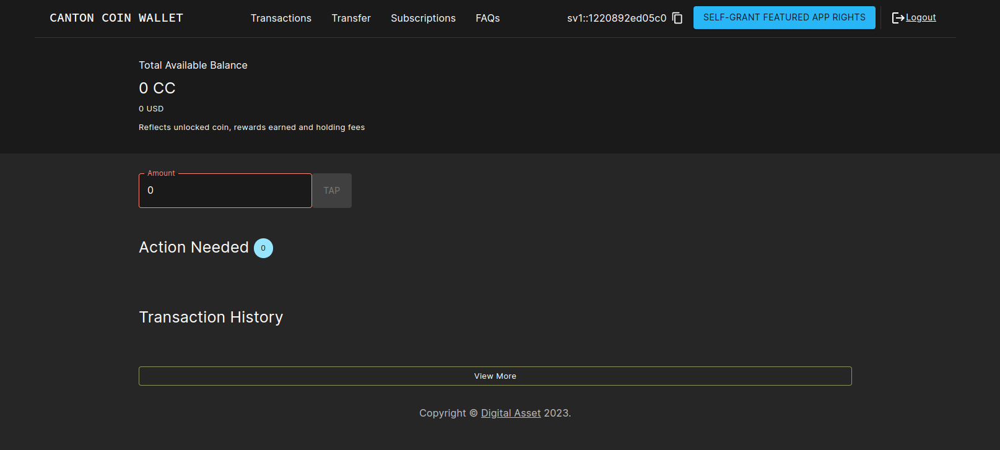
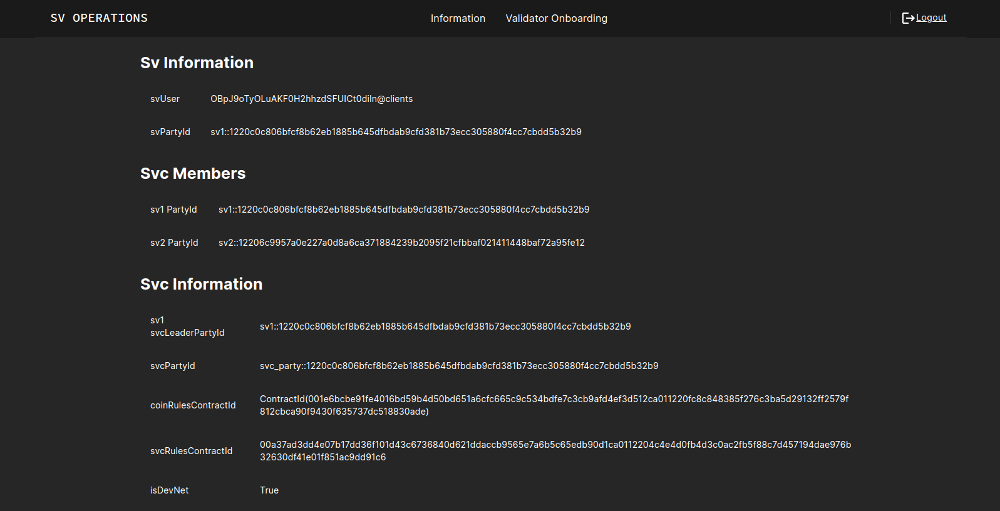

.. _sv-helm:

Kubernetes-Based Deployment of a Super Validator node
=====================================================

This section describes deploying a Super Validator (SV) node in kubernetes using Helm
charts.  The Helm charts deploy a complete node and connect it to a
target cluster. We currently operate two clusters: `TestNet` which is upgraded weekly with a stable release,
and `DevNet` which is upgraded nightly with a nightly dev release. Please use `TestNet` unless you
have a specific reason not to, as `DevNet` may be unstable, and will also introduce breaking changes on
a daily basis.

Requirements
------------

1) Access to the following two Artifactory repositories:

    a. `Canton Network Docker repository <https://digitalasset.jfrog.io/ui/native/canton-network-docker>`_
    b. `Canton Network Helm repository <https://digitalasset.jfrog.io/ui/native/canton-network-helm/>`_

2) A running Kubernetes cluster in which you have administrator access to create and manage namespaces.
3) A development workstation with the following:

    a. ``kubectl`` - At least v1.26.1
    b. ``helm`` - At least v3.11.1

4) You should have an SV key pair generated and approved by Digital Asset.
See instructions in the :ref:`Generating an SV identity section <sv-identity>`.

5) You should have completed the self hosted validator setup,
   including Auth 0 setup. Dedicated instructions can be found in the :ref:`Self-Hosted Validator section <self_hosted_validator>`

Preparing a Cluster for Installation
------------------------------------

Ensure that your local helm installation has access to the Digital Asset Helm chart repository:

.. code-block:: bash

    helm repo add canton-network-helm \
        https://digitalasset.jfrog.io/artifactory/api/helm/canton-network-helm \
        --username ${ARTIFACTORY_USER} \
        --password ${ARTIFACTORY_PASSWORD}

Create the three application namespaces within Kubernetes and ensure they have image pull credentials for fetching images from the Digital Asset Docker image repository:

.. code-block:: bash

    for ns_name in docs sv-1; do
        kubectl create ns ${ns_name}

        kubectl create secret docker-registry docker-reg-cred \
            --docker-server=digitalasset-canton-network-docker.jfrog.io \
            --docker-username=${ARTIFACTORY_USER} \
            --docker-password=${ARTIFACTORY_PASSWORD} \
            --docker-email=${ARTIFACTORY_USER_EMAIL} \
            -n ${ns_name}

        kubectl patch serviceaccount default -n ${ns_name} \
            -p '{"imagePullSecrets": [{"name": "docker-reg-cred"}]}'
    done

.. _helm-sv-auth0:

Configuring an Auth0 Tenant
---------------------------

An SV node currently requires the following to exist in your Auth0 tenant:

- An API with audience `https://canton.network.global`  (this is currently the only audience supported. In the future, this will be made customizable.)
- Two machine-to-machine applications, for the validator and for the sv-app. Both should be authorized for the API defined above.
- One single-page-application for the wallet web UI, with allowed callback, logout URLs, web origins, and CORS origins configured to the wallet UI URL for your SV's validator. If you're using the ingress configuration of this runbook, that would be `https://wallet.sv-1.svc.YOUR_CLUSTER_URL`.

The following two secrets will instruct the participant to create service users for your validator and sv apps:

.. code-block:: bash

    kubectl create --namespace sv-1 secret generic cn-app-sv1-validator-ledger-api-auth \
        "--from-literal=ledger-api-user=${CLIENT_ID_OF_VALIDATOR_AUTH0_APP}@clients"

    kubectl create --namespace sv-1 secret generic cn-app-sv1-ledger-api-auth \
        "--from-literal=ledger-api-user=${CLIENT_ID_OF_SV_AUTH0_APP}@clients"

For technical reasons, please also create the following dummy secrets (a requirement that will be removed in the near future):

.. code-block:: bash

    kubectl create --namespace sv-1 secret generic cn-app-scan-ledger-api-auth "--from-literal=ledger-api-user=dummy"
    kubectl create --namespace sv-1 secret generic cn-app-directory-ledger-api-auth "--from-literal=ledger-api-user=dummy"
    kubectl create --namespace sv-1 secret generic cn-app-svc-ledger-api-auth "--from-literal=ledger-api-user=dummy"

The SV app is configured with a secret as follows:

.. code-block:: bash

    kubectl create --namespace sv-1 secret generic cn-app-sv-ledger-api-auth \
        "--from-literal=ledger-api-user=${CLIENT_ID_OF_SV_AUTH0_APP}@clients" \
        "--from-literal=url=https://${YOUR_AUTH0_TENANT}.us.auth0.com/.well-known/openid-configuration" \
        "--from-literal=client-id=${CLIENT_ID_OF_SV_AUTH0_APP}" \
        "--from-literal=client-secret=${SECRET_OF_SV_AUTH0_APP}"

The validator requires the following three secrets, the first one for the backend, the other two for the web UIs.
Note one can also use the same client id for both UI by setting the same ``client-id`` parameter when generating both secrets.

.. code-block:: bash

    kubectl create --namespace sv-1 secret generic cn-app-validator-ledger-api-auth \
        "--from-literal=ledger-api-user=${CLIENT_ID_OF_VALIDATOR_AUTH0_APP}@clients" \
        "--from-literal=url=https://${YOUR_AUTH0_TENANT}.us.auth0.com/.well-known/openid-configuration" \
        "--from-literal=client-id=${CLIENT_ID_OF_VALIDATOR_AUTH0_APP}" \
        "--from-literal=client-secret=${SECRET_OF_VALIDATOR_AUTH0_APP}"

    kubectl create --namespace sv-1 secret generic cn-app-wallet-ui-auth \
        "--from-literal=url=https://${YOUR_AUTH0_TENANT}.us.auth0.com" \
        "--from-literal=client-id=${CLIENT_ID_OF_WALLET_WEB_UI_APP}"

    kubectl create --namespace sv-1 secret generic cn-app-sv-ui-auth \
        "--from-literal=url=https://${YOUR_AUTH0_TENANT}.us.auth0.com" \
        "--from-literal=client-id=${CLIENT_ID_OF_SV_WEB_UI_APP}"

Installing the Software
-------------------------

Install the Helm charts needed to start an SV node connected to the cluster.
To make these commands work, you will need to meet a few
preconditions. The first is that there needs to be an environment
variable defined to refer to the version of the Helm charts necessary
to connect to this environment:

|chart_version_set|

There should also be a file, ``participant-values.yaml``, that refers to
the domain in the cluster to which you are connecting. As in other
sections of this runbook, please replace ``TARGET_CLUSTER`` with
``dev`` or ``test`` per the cluster to which you are connecting. The
``participant-values.yaml`` file also contains an additional configuration
block for specifying the Auth0 instance. This will need to be updated
to match your configuration.

.. code-block:: yaml

    postgres: postgres
    globalDomain:
      alias: global
      url: http://TARGET_CLUSTER.network.canton.global:5008
    auth:
      jwksEndpoint: "https://YOUR_AUTH0_TENANT.us.auth0.com/.well-known/jwks.json"
      targetAudience: "https://canton.network.global"

An SV node includes a validator app so you also need to configure
that. Create a file called ``validator-values.yaml`` with the
following content.

.. code-block:: yaml

    participantAddress: "participant"
    svSponsorPort: "5014"
    svSponsorAddress: "https://TARGET_CLUSTER.network.canton.global"
    scanPort: "5012"
    scanAddress: "https://TARGET_CLUSTER.network.canton.global"
    # Replace SV_WALLET_USER_ID with the user id in your IAM that you want to use to log into
    # the wallet as the SV party:
    validatorWalletUser: "SV_WALLET_USER_ID"
    clusterUrl: "TARGET_CLUSTER.network.canton.global"
    auth:
      audience: https://canton.network.global
      jwksUrl: https://YOUR_INSTANCE_NAME.us.auth0.com/.well-known/jwks.json

The authentication credentials should be defined in a file named
``sv-values.yaml``. If you haven't done so yet, please first follow the instructions in
the :ref:`Generating an SV Identity<sv-identity>` section to obtain and register a name and keypair for your SV.

.. code-block:: yaml

    joinWithKeyOnboarding:
      sponsorApiPort: 5014
      sponsorApiUrl: "https://TARGET_CLUSTER.network.canton.global"
      svcApiAddress: "TARGET_CLUSTER.network.canton.global"
      keyName: ... key name goes here ...
      publicKey: ... public key goes here ...
      privateKey: ... private key goes here ...
    auth:
      audience: https://canton.network.global
      jwksUrl: https://YOUR_INSTANCE_NAME.us.auth0.com/.well-known/jwks.json

With this file in place, you can execute the following helm commands
in sequence. It's generally a good idea to wait until each deployment
reaches a stable state prior to moving on to the next step.

.. code-block:: bash

    helm repo update
    helm install docs canton-network-helm/cn-docs -n docs --version ${CHART_VERSION}
    helm install postgres canton-network-helm/cn-postgres -n sv-1 --version ${CHART_VERSION}
    helm install participant canton-network-helm/cn-participant -n sv-1 --version ${CHART_VERSION} -f participant-values.yaml
    helm install validator canton-network-helm/cn-validator -n sv-1 --version ${CHART_VERSION} -f validator-values.yaml
    helm install sv-1 canton-network-helm/cn-sv-node -n sv-1 --version ${CHART_VERSION} -f sv-values.yaml

Once this is running, you should be able to inspect the state of the
cluster and observe pods running in each of the three new
namespaces. A typical query might look as follows:

.. code-block:: bash

    $ kubectl get pods --all-namespaces |grep -v kube-system
    NAMESPACE         NAME                                                       READY   STATUS    RESTARTS      AGE
    cluster-ingress   external-proxy-998cb664c-k7dfb                             1/1     Running   0             37m
    docs              docs-688ccd855b-hsntm                                      1/1     Running   0             81m
    docs              gcs-proxy-5ffcb46f7f-79lfv                                 1/1     Running   0             81m
    sv-1              sv-app-7658c9fdd4-58xm6                                    1/1     Running   0             91m
    sv-1              sv-web-ui-84b6d7994c-w67rp                                 1/1     Running   0             91m
    sv-1              validator-app-b7fd68479-w4992                              1/1     Running   0             43m
    sv-1              wallet-web-ui-54c9ddbb8-nvkmp                              1/1     Running   0             43m
    sv-1              participant-6fdff7fc4-vzg8c                                3/3     Running   1 (72m ago)   72m
    sv-1              postgres-0                                                 1/1     Running   0             120m

Note also that ``Pod`` restarts may happen during bringup,
particualrly if all helm charts are deployed at the same time. The
``cn-sv-node`` cannot start until ``participant`` is running and
``participant`` cannot start until ``postgres`` is running.

Configuring the Cluster Ingress
===============================

Internet ingress configuration is often specific to the network configuration and scenario of the cluster being configured. To illustrate the basic requirements of a Canton Network ingress, we have provided a Helm chart that configures the above cluster for external network access.

Requirements:
-------------

cert-manager must be available in the cluster (See `cert-manager documentation <https://cert-manager.io/docs/installation/helm/>`_)

Installation Instructions:
--------------------------

Create a cluster-ingress namespace with image pull permissions from the Artifactory docker repository:

.. code-block:: bash

    kubectl create ns cluster-ingress

    kubectl create secret docker-registry docker-reg-cred \
        --docker-server=digitalasset-canton-network-docker.jfrog.io \
        --docker-username=${ARTIFACTORY_USER} \
        --docker-password=${ARTIFACTORY_PASSWORD} \
        --docker-email=${ARTIFACTORY_USER_EMAIL} \
        -n cluster-ingress

    kubectl patch serviceaccount default -n cluster-ingress \
        -p '{"imagePullSecrets": [{"name": "docker-reg-cred"}]}'

Ensure that there is a cert-manager certificate available in a secret
named ``cn-net-tls``.  An example of a suitable certificate
definition:

.. code-block:: yaml

    apiVersion: cert-manager.io/v1
    kind: Certificate
    metadata:
    name: cn-certificate
    namespace: cluster-ingress
    spec:
        dnsNames:
        - cn-cluster.YOUR_DOMAIN.com
        - '*.cn-cluster.YOUR_DOMAIN.com'
        - '*.validator1.cn-cluster.YOUR_DOMAIN.com'
        - '*.splitwell.cn-cluster.YOUR_DOMAIN.com'
        - '*.svc.cn-cluster.YOUR_DOMAIN.com'
        - '*.sv-1.svc.cn-cluster.YOUR_DOMAIN.com'
        issuerRef:
            name: letsencrypt-production
        secretName: cn-net-tls

The ingress configuration is specified in a YAML file with the
following contents. (externalIPRanges can be extended with additional
IP addresses you would like to allow to connect to your cluster). The
instructions below expect this file to be named ``ingress-values.yaml``

.. code-block:: yaml

    enableIngressModes: sv-external
    cluster:
        networkSettings:
            externalIPRanges:
                - "35.194.81.56/32"
                - "35.198.147.95/32"
                - "35.189.40.124/32"
                - "34.132.91.75/32"
        ipAddress: "YOUR_CLUSTER_IP"

On GCP you can get the cluster IP from ``gcloud compute addresses list``.

Install the Ingress Helm Chart:

.. code-block:: bash

    helm install cluster-ingress canton-network-helm/cn-cluster-ingress \
        -n cluster-ingress \
        -f ingress-values.yaml

.. _helm-sv-wallet-ui:

Logging into the wallet UI
--------------------------

After you deploy your ingress, open your browser at
https://wallet.sv-1.svc.YOUR_DOMAIN.com and login using the
credentials for the user that you configured as
``validatorWalletUser`` earlier. You will be able to see your balance
increase as mining rounds advance every 2.5 minutes and you will see
``sv_reward_collected`` entries in your transaction history.
Once logged in one should see the transactions page.

Logging into the SV UI
----------------------

Open your browser at https://sv.sv-1.svc.YOUR_DOMAIN.com to login to the SV Operations user interface.
You can use the credentials of the ``validatorWalletUser`` to login. These are the same credentials you used for the wallet login above. Note that only Super validators will be able to login.
Once logged in one should see a page with some SV collective information.

