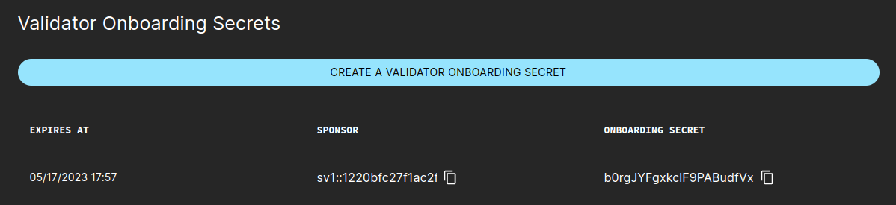

.. _sv_operations:

SV Operations
=============

These sections give an overview of some of the functionalities enabled through your SV node.

.. _generate_onboarding_secret:

Generate a validator onboarding secret
---------------------------------------

If you want to onboard a new validator, you can obtain an onboarding secret directly from the SV web UI.

To generate this key you need to :ref:`login into the SV web UI <local-sv-web-ui>` and navigate to the `Validator Onboarding` tab. In that tab, click on the button to create the secret
and copy the last generated `onboarding secret`.

Using the secret, you can now create ``validator-onboarding-conf`` by replacing it in the template below and specifying the URL of
your SV there, as it will be the onboarding sponsor of the new validator (e.g. *https://sv.sv.svc.your_domain.com/api/v0/sv/*):

::

    canton {
      validator-apps {
        validatorApp {
          onboarding = {
            sv-client.admin-api.url = "http://<SV_API_URL>"
            secret = "<ONBOARDING_SECRET>"
          }
        }
      }
    }

Using that configuration file, you can now follow the self-hosted :ref:`validator instructions to spin up another validator <self_hosted_validator>`.
