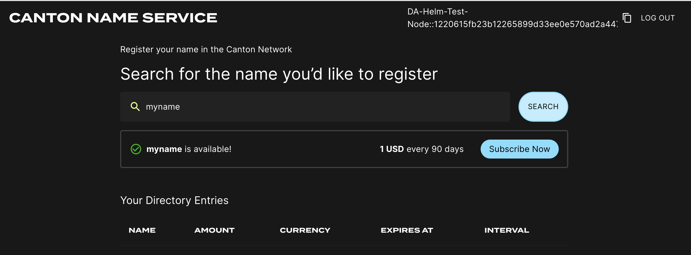

.. _k8s_validator:

Kubernetes-Based Deployment of a Validator node
===============================================

This section describes how to deploy a standalone validator node in Kubernetes using Helm charts. The Helm charts deploy a validator node along with associated wallet and directory UIs, and connect it to a target cluster.

Digital Asset currently operates two Canton Network clusters: `TestNet` and `DevNet`. Both upgrade weekly. `DevNet` is usually on the latest release. `TestNet` follows it on a one-week delay, and has some `DevNet`-only features disabled. Please use `DevNet` unless you have a specific reason not to.

Note that there is not yet data retention from release to release in either
`DevNet` or `TestNet`. This will change as the models and API's
stabilize, but for now, each release should be a full release from
scratch. No data should be retained when an environment is updated.

.. _validator_prerequisites:

Requirements
------------

1) Access to the following two Artifactory repositories:

    a. `Canton Network Docker repository <https://digitalasset.jfrog.io/ui/native/canton-network-docker>`_
    b. `Canton Network Helm repository <https://digitalasset.jfrog.io/ui/native/canton-network-helm/>`_

2) A running Kubernetes cluster in which you have administrator access to create and manage namespaces.
3) A development workstation with the following:

    a. ``kubectl`` - At least v1.26.1
    b. ``helm`` - At least v3.11.1

4) Your cluster either needs to be connected to the GCP DA Canton
   VPN or you need a static egress IP. In the latter case,
   please provide that IP address to your contact at Digital Asset to
   add it to the firewall rules.

5) Please download the release artifacts containing the sample Helm value files, from here: |bundle_download_link|, and extract the bundle:

.. parsed-literal::

  tar xzvf |version|\_cn-node-0.1.0-SNAPSHOT.tar.gz

.. _validator-identity-token:

Preparing a Cluster for Installation
------------------------------------

In the following, you will need your Artifactory credentials from
https://digitalasset.jfrog.io/ui/user_profile. Based on that, set the following environment variables.

====================== ==========================================================================================
Name                   Value
---------------------- ------------------------------------------------------------------------------------------
ARTIFACTORY_USER       Your Artifactory user name shown at the top right.
ARTIFACTORY_PASSWORD   Your Artifactory Identity token. If you don't have one you can generate one on your profile page.
====================== ==========================================================================================

Ensure that your local helm installation has access to the Digital Asset Helm chart repository:

.. code-block:: bash

    helm repo add canton-network-helm \
        https://digitalasset.jfrog.io/artifactory/api/helm/canton-network-helm \
        --username ${ARTIFACTORY_USER} \
        --password ${ARTIFACTORY_PASSWORD}

Create the application namespace within Kubernetes and ensure it has image pull credentials for fetching images from the Digital Asset Artifactory repository used for Docker images.

.. code-block:: bash

    kubectl create ns validator

    kubectl create secret docker-registry docker-reg-cred \
        --docker-server=digitalasset-canton-network-docker.jfrog.io \
        --docker-username=${ARTIFACTORY_USER} \
        --docker-password=${ARTIFACTORY_PASSWORD} \
        -n validator

    kubectl patch serviceaccount default -n validator \
        -p '{"imagePullSecrets": [{"name": "docker-reg-cred"}]}'

Preparing for Validator Onboarding
----------------------------------

Ensure that your validator onboarding secret ``VALIDATOR_SECRET`` is set in the namespace you created earlier. The value should be provided by the SV sponsoring the onboarding of your validator.

.. code-block:: bash

    kubectl create secret generic cn-app-validator-onboarding-validator \
        "--from-literal=secret=${VALIDATOR_SECRET}" \
        -n validator

.. _helm-validator-auth:

Configuring Authentication
--------------------------

For security, the various components that comprise your Validator node need to be able to authenticate themselves to each other,
as well as be able to authenticate external UI and API users.
We use JWT access tokens for authentication and expect these tokens to be issued by an (external) `OpenID Connect <https://openid.net/connect/>`_ (OIDC) provider.
You must:

1. Set up an OIDC provider in such a way that both backends and web UI users are able to obtain JWTs in a supported form.

2. Configure your backends to use that OIDC provider.

.. _helm-validator-auth-requirements:

OIDC Provider Requirements
++++++++++++++++++++++++++

This section provides pointers for setting up an OIDC provider for use with your Validator node.
Feel free to skip directly to :ref:`helm-validator-auth0` if you plan to use `Auth0 <https://auth0.com>`_ for your Validator node's authentication needs.

Your OIDC provider must be reachable [#reach]_ at a well known (HTTPS) URL.
In the following, we will refer to this URL as ``OIDC_AUTHORITY_URL``.
Both your Validator node and any users that wish to authenticate to a web UI connected to your Validator node must be able to reach the ``OIDC_AUTHORITY_URL``.
We require your OIDC provider to provide a `discovery document <https://openid.net/specs/openid-connect-discovery-1_0.html>`_ at ``OIDC_AUTHORITY_URL/.well-known/openid-configuration``.
We furthermore require that your OIDC provider exposes a `JWK Set <https://datatracker.ietf.org/doc/html/rfc7517>`_ document.
In this documentation, we assume that this document is available at ``OIDC_AUTHORITY_URL/.well-known/jwks.json``.

For machine-to-machine (Validator node component to Validator node component) authentication,
your OIDC provider must support the `OAuth 2.0 Client Credentials Grant <https://tools.ietf.org/html/rfc6749#section-4.4>`_ flow.
This means that you must be able to configure (`CLIENT_ID`, `CLIENT_SECRET`) pairs for all Validator node components that need to authenticate to others.
Currently, this is the validator app backend - which needs to authenticate to the Validator node's Canton participant.
The `sub` field of JWTs issued through this flow must match the user ID configured as `ledger-api-user` in :ref:`helm-validator-auth-secrets-config`.
In this documentation, we assume that the `sub` field of these JWTs is formed as ``CLIENT_ID@clients``.
If this is not true for your OIDC provider, pay extra attention when configuring ``ledger-api-user`` values below.

For user-facing authentication - allowing users to access the various web UIs hosted on your Validator node,
your OIDC provider must support the `OAuth 2.0 Authorization Code Grant <https://datatracker.ietf.org/doc/html/rfc6749#section-4.1>`_ flow
and allow you to obtain client identifiers for the web UIs your Validator node will be hosting.
Currently, these are the Wallet web UI and the Directory web UI.
You might be required to whitelist a range of URLs on your OIDC provider, such as "Allowed Callback URLs", "Allowed Logout URLs", "Allowed Web Origins", and "Allowed Origins (CORS)".
If you are using the ingress configuration of this runbook, the correct URLs to configure here are
``https://wallet.validator.YOUR_HOSTNAME`` (for the Wallet web UI) and
``https://directory.validator.YOUR_HOSTNAME`` (for the Directory web UI).
An identifier that is unique to the user must be set via the `sub` field of the issued JWT.
On some occasions, this identifier will be used as a user name for that user on your Validator node's Canton participant.
In :ref:`helm-validator-install`, you will be required to configure a user identifier as the ``validatorWalletUser`` -
make sure that whatever you configure there matches the contents of the `sub` field of JWTs issued for that user.

*All* JWTs issued for use with your Validator node:

- must be signed using the RS256 signing algorithm

In the future, your OIDC provider might additionally be required to issue JWTs with a ``scope`` explicitly set to ``daml_ledger_api``
(when requested to do so as part of the OAuth 2.0 authorization code flow).

Summing up, your OIDC provider setup must provide you with the following configuration values:

======================= ===========================================================================
Name                    Value
----------------------- ---------------------------------------------------------------------------
OIDC_AUTHORITY_URL      The URL of your OIDC provider for obtaining the ``openid-configuration`` and ``jwks.json``.
VALIDATOR_CLIENT_ID     The client id of the Auth0 app for the validator app backend
VALIDATOR_CLIENT_SECRET The client secret of the Auth0 app for the validator app backend
WALLET_UI_CLIENT_ID     The client id of the Auth0 app for the wallet UI.
DIRECTORY_UI_CLIENT_ID  The client id of the Auth0 app for the directory UI.
======================= ===========================================================================

We are going to use these values, exported to environment variables named as per the `Name` column, in :ref:`helm-validator-auth-secrets-config` and :ref:`helm-validator-install`.

By default, all audience values are configured to be ``https://canton.network.global``.
Once you can confirm that your setup is working correctly using this (simple) default,
we recommend that you configure dedicated audience values that match your deployment and URLs.
You can configure audiences of your choice for the participant ledger API and the validator backend API.
We will refer to these using the following configuration values:

==================================== ===========================================================================
Name                                 Value
------------------------------------ ---------------------------------------------------------------------------
OIDC_AUTHORITY_LEDGER_API_AUDIENCE   The audience for the participant ledger API. e.g. ``https://ledger_api.example.com``
OIDC_AUTHORITY_VALIDATOR_AUDIENCE    The audience for the validator backend API. e.g. ``https://validator.example.com/api``
==================================== ===========================================================================

In case you are facing trouble with setting up your (non-Auth0) OIDC provider,
it can be beneficial to skim the instructions in :ref:`helm-validator-auth0` as well, to check for functionality or configuration details that your OIDC provider setup might be missing.

.. [#reach] The URL must be reachable from the Canton participant and validator app running in your cluster, as well as from all web browsers that should be able to interact with the wallet and directory UIs.

    .. TODO(#2052) use a unique audience for each app

.. _helm-validator-auth0:

Configuring an Auth0 Tenant
+++++++++++++++++++++++++++

To configure `Auth0 <https://auth0.com>`_ as your validator's OIDC provider, perform the following:

1. Create an Auth0 tenant for your validator
2. Create an Auth0 API that controls access to the ledger API:

    a. Navigate to Applications > APIs and click "Create API". Set name to ``Daml Ledger API``,
       set identifier to ``https://canton.network.global``.
       Alternatively, if you would like to configure your own audience, you can set the identifier here. e.g. ``https://ledger_api.example.com``.
    b. Under the Permissions tab in the new API, add a permission with scope ``daml_ledger_api``, and a description of your choice.
    c. On the Settings tab, scroll down to "Access Settings" and enable "Allow Offline Access", for automatic token refreshing.

3. (Optional) If you want to configure a different audience to your APIs, you can do so by creating new Auth0 APIs with an identifier set to the audience of your choice. For example,

    a. Create another API by setting name to ``Validator App API``,
       set identifier for the Validator backend app e.g. ``https://validator.example.com/api``.

4. Create an Auth0 Application for the validator backend:

    a. In Auth0, navigate to Applications -> Applications, and click the "Create Application" button.
    b. Name it ``Validator app backend``, choose "Machine to Machine Applications", and click Create.
    c. Choose the ``Daml Ledger API`` API you created in step 2 in the "Authorize Machine to Machine Application" dialog and click Authorize.

5. Create an Auth0 Application for the wallet web UI.

    a. In Auth0, navigate to Applications -> Applications, and click the "Create Application" button.
    b. Choose "Single Page Web Applications", call it ``Wallet web UI``, and click Create.
    c. Determine the URL for your validator's wallet UI.
       If you're using the ingress configuration of this runbook, that would be ``https://wallet.validator.YOUR_HOSTNAME``.
    d. In the Auth0 application settings, add the SV URL to the following:

       - "Allowed Callback URLs"
       - "Allowed Logout URLs"
       - "Allowed Web Origins"
       - "Allowed Origins (CORS)"
    e. Save your application settings.

6. Create an Auth0 Application for the directory web UI.
   Repeat all steps described in step 5, with following modifications:

   - In step b, use ``Directory web UI`` as the name of your application.
   - In steps c and d, use the URL for your validator's *directory* UI.
     If you're using the ingress configuration of this runbook, that would be ``https://directory.validator.YOUR_HOSTNAME``.

Please refer to Auth0's `own documentation on user management <https://auth0.com/docs/manage-users>`_ for pointers on how to set up end-user accounts for the two web UI applications you created.
Note that you will need to create at least one such user account for completing the steps in :ref:`helm-validator-install` - for being able to log in as your Validator node's administrator.
You will be asked to obtain the user identifier for this user account.
It can be found in the Auth0 interface under User Management -> Users -> your user's name -> user_id (a field right under the user's name at the top).

We will use the environment variables listed in the table below to refer to aspects of your Auth0 configuration:

================================== ===========================================================================
Name                               Value
---------------------------------- ---------------------------------------------------------------------------
OIDC_AUTHORITY_URL                 ``https://AUTH0_TENANT_NAME.us.auth0.com``
OIDC_AUTHORITY_LEDGER_API_AUDIENCE The optional audience of your choice for Ledger API. e.g. ``https://ledger_api.example.com``
VALIDATOR_CLIENT_ID                The client id of the Auth0 app for the validator app backend
VALIDATOR_CLIENT_SECRET            The client secret of the Auth0 app for the validator app backend
WALLET_UI_CLIENT_ID                The client id of the Auth0 app for the wallet UI.
DIRECTORY_UI_CLIENT_ID             The client id of the Auth0 app for the directory UI.
================================== ===========================================================================

The ``AUTH0_TENANT_NAME`` is the name of your Auth0 tenant as shown at the top left of your Auth0 project.
You can obtain the client ID and secret of each Auth0 app from the settings pages of that app.

.. _helm-validator-auth-secrets-config:

Configuring Authentication on your Validator
++++++++++++++++++++++++++++++++++++++++++++

We are now going to configure your Validator node software based on the OIDC provider configuration values your exported to environment variables at the end of either :ref:`helm-validator-auth-requirements` or :ref:`helm-validator-auth0`.
(Note that some authentication-related configuration steps are also included in :ref:`helm-validator-install`.)

The validator app backend requires the following secret.

.. code-block:: bash

    kubectl create --namespace validator secret generic cn-app-validator-ledger-api-auth \
        "--from-literal=ledger-api-user=${VALIDATOR_CLIENT_ID}@clients" \
        "--from-literal=url=${OIDC_AUTHORITY_URL}/.well-known/openid-configuration" \
        "--from-literal=client-id=${VALIDATOR_CLIENT_ID}" \
        "--from-literal=client-secret=${VALIDATOR_CLIENT_SECRET}"
        # Optional. uncomment it if you want to set audience for ledger API
        # "--from-literal=audience=${OIDC_AUTHORITY_LEDGER_API_AUDIENCE}"

To setup the wallet and directory UI, create the following two secrets.

.. code-block:: bash

    kubectl create --namespace validator secret generic cn-app-wallet-ui-auth \
        "--from-literal=url=${OIDC_AUTHORITY_URL}" \
        "--from-literal=client-id=${WALLET_UI_CLIENT_ID}"

    kubectl create --namespace validator secret generic cn-app-directory-ui-auth \
        "--from-literal=url=${OIDC_AUTHORITY_URL}" \
        "--from-literal=client-id=${DIRECTORY_UI_CLIENT_ID}"

.. _helm-validator-install:

Installing the Software
-----------------------

Configuring the Helm Charts
+++++++++++++++++++++++++++

To install the Helm charts needed to start a Validator node connected to the
cluster, you will need to meet a few preconditions. The first is that
there needs to be an environment variable defined to refer to the
version of the Helm charts necessary to connect to this environment:

|chart_version_set|

Please modify the file ``cn-node-0.1.0-SNAPSHOT/examples/sv-helm/participant-values.yaml`` as follows:

- Replace ``TARGET_CLUSTER`` in the `globalDomain.url` entry with |cn_cluster|, per the cluster to which you are connecting.
- If you want to configure the audience for the participant, replace ``OIDC_AUTHORITY_LEDGER_API_AUDIENCE`` in the `auth.targetAudience` entry with audience for the ledger API. e.g. ``https://ledger_api.example.com``.
- Update the `auth.jwksUrl` entry to point to your auth provider's JWK set document by replacing ``OIDC_AUTHORITY_URL`` with your auth provider's OIDC URL, as explained above.
- If you are running on a version of Kubernetes earlier than 1.24, set `enableHealthProbes` to `false` to disable the gRPC liveness and readiness probes.
- Add `db.volumeSize` and `db.volumeStorageClass` to the values file adjust persistant storage size and storage class if necessary. (These values default to 20GiB and `standard-rwo`)
- Optionally, you might want to modify the `postgresPassword` entry setting it to a secure value. If you do that, remember to change it in ``cn-node-0.1.0-SNAPSHOT/examples/sv-helm/postgres-values.yaml`` too.

To configure the validator app, please modify the file ``cn-node-0.1.0-SNAPSHOT/examples/sv-helm/validator-values.yaml`` as follows:

- Replace all instances of ``TARGET_CLUSTER`` with |cn_cluster|, per the cluster to which you are connecting.
- If you want to configure the audience for the Validator app backend API, replace ``OIDC_AUTHORITY_VALIDATOR_AUDIENCE`` in the `auth.audience` entry with audience for the Validator app backend API. e.g. ``https://validator.example.com/api``.
- If you want to configure the audience for the Ledger API, replace ``OIDC_AUTHORITY_LEDGER_API_AUDIENCE`` in the `auth.ledgerApiAudience` entry with audience for the Ledger API. e.g. ``https://ledger_api.example.com``.
- Replace ``OPERATOR_WALLET_USER_ID`` with the user ID in your IAM that you want to use to log into the wallet as the validator operator party. Note that this should be the full user id, e.g., ``auth0|43b68e1e4978b000cefba352``, *not* only the suffix ``43b68e1e4978b000cefba352``
- Update the `auth.jwksUrl` entry to point to your auth provider's JWK set document by replacing ``OIDC_AUTHORITY_URL`` with your auth provider's OIDC URL, as explained above.
- Replace `persistence.password` with the value you set in ``cn-node-0.1.0-SNAPSHOT/examples/sv-helm/postgres-values.yaml``.

You also need to specify a URL for the an existing SV that will sponsor the onboarding of your validator. To do so, please update the file ``cn-node-0.1.0-SNAPSHOT/examples/sv-helm/standalone-validator-values.yaml`` by replacing ``SPONSOR_SV_URL`` with this URL, e.g. ``https://sv.sv-1.svc.dev.network.canton.global``

.. _validator-participant-identities-restore:

Restoring from an existing Particiant Identities Backup
+++++++++++++++++++++++++++++++++++++++++++++++++++++++

If you are restoring from an existing :ref:`participant identities backup <participant-identities-backup>`, you need to create another secret containing that dump. Here
we are assuming you've stored the dump in a file called ``participant-identities-dump.json`` in the current directory.

.. code-block:: bash

    kubectl create --namespace validator secret generic participant-identities-dump \
        "--from-file=content=participant-identities-dump.json"

You also need to configure the participant to not initialize automatically by uncommenting the following section in your ``participant-values.yaml``.

.. literalinclude:: ../../../../../apps/app/src/pack/examples/sv-helm/participant-values.yaml
    :start-after: PARTICIPANT_BOOTSTRAP_START
    :end-before: PARTICIPANT_BOOTSTRAP_END

Note that restoring from a participant identities backup will only result in a functional participant if no participant with the same identity has ever been connected to the network (more specifically: to the global CN domain) since the network was last reset.
This implies that you can only restore from the same participant identities backup once per network deployment.
Also note that restoring from a participant identities backup is only possible if the participant is fresh and uninitialized, i.e., its database is completely empty.

.. _validator-helm-charts-install:

Installing the Helm Charts
++++++++++++++++++++++++++

With these files in place, you can execute the following helm commands
in sequence. It's generally a good idea to wait until each deployment
reaches a stable state prior to moving on to the next step.

.. code-block:: bash

    helm repo update
    helm install postgres canton-network-helm/cn-postgres -n validator --version ${CHART_VERSION} -f cn-node-0.1.0-SNAPSHOT/examples/sv-helm/postgres-values.yaml --wait
    helm install participant canton-network-helm/cn-participant -n validator --version ${CHART_VERSION} -f cn-node-0.1.0-SNAPSHOT/examples/sv-helm/participant-values.yaml -f cn-node-0.1.0-SNAPSHOT/examples/sv-helm/standalone-participant-values.yaml --wait
    helm install validator canton-network-helm/cn-validator -n validator --version ${CHART_VERSION} -f cn-node-0.1.0-SNAPSHOT/examples/sv-helm/validator-values.yaml -f cn-node-0.1.0-SNAPSHOT/examples/sv-helm/standalone-validator-values.yaml --wait

Once this is running, you should be able to inspect the state of the
cluster and observe pods running in the new
namespace. A typical query might look as follows:

.. code-block:: bash

    $ kubectl get pods -n validator
    NAMESPACE         NAME                                  READY   STATUS             RESTARTS        AGE
    validator         directory-web-ui-5bf489db78-bdn2j     1/1     Running            0               24m
    validator         participant-8988dfb54-m9655           1/1     Running            0               26m
    validator         postgres-0                            1/1     Running            0               37m
    validator         validator-app-f8c74d5dd-zf9j4         1/1     Running            0               24m
    validator         wallet-web-ui-69d85cdb99-fnj7q        1/1     Running            0               24m

Note also that ``Pod`` restarts may happen during bringup,
particularly if all helm charts are deployed at the same time. For example, the
``participant`` cannot start until ``postgres`` is running.

.. _helm-validator-ingress:

Configuring the Cluster Ingress
-------------------------------

The following routes should be configured in your cluster ingress
controller.

* ``https://wallet.validator.<YOUR_HOSTNAME>`` should be routed to service ``wallet-web-ui`` in the ``validator`` namespace
* ``https://wallet.validator.<YOUR_HOSTNAME>/api/validator`` should be routed to ``/api/validator`` at port 5003 of service ``validator-app`` in the ``validator`` namespace
* ``https://directory.validator.<YOUR_HOSTNAME>`` should be routed to service ``directory-web-ui`` in the ``validator`` namespace
* ``https://directory.validator.<YOUR_HOSTNAME>/api/json-api/*`` should be routed to port 7575 in service ``participant`` in the ``validator`` namespace. Note that the path should be stripped and only the suffix under ``*`` should end up at the pod.

Internet ingress configuration is often specific to the network configuration and scenario of the
cluster being configured. To illustrate the basic requirements of a Validator node ingress, we have
provided a Helm chart that configures the above cluster according to the routes above, as detailed in the sections below.

Requirements
++++++++++++

In order to install the reference charts, the following must be satisfied in your cluster:

* cert-manager must be available in the cluster (See `cert-manager documentation <https://cert-manager.io/docs/installation/helm/>`_)
* istio should be installed in the cluster (See `istio documentation <https://istio.io/latest/docs/setup/>`_)

Installation Instructions
+++++++++++++++++++++++++

Create a `cluster-ingress` namespace with image pull permissions from the Artifactory docker repository:

.. code-block:: bash

    kubectl create ns cluster-ingress

    kubectl create secret docker-registry docker-reg-cred \
        --docker-server=digitalasset-canton-network-docker.jfrog.io \
        --docker-username=${ARTIFACTORY_USER} \
        --docker-password=${ARTIFACTORY_PASSWORD} \
        -n cluster-ingress

    kubectl patch serviceaccount default -n cluster-ingress \
        -p '{"imagePullSecrets": [{"name": "docker-reg-cred"}]}'

Ensure that there is a cert-manager certificate available in a secret
named ``cn-net-tls``.  An example of a suitable certificate
definition:

.. code-block:: yaml

    apiVersion: cert-manager.io/v1
    kind: Certificate
    metadata:
       name: cn-certificate
       namespace: cluster-ingress
    spec:
        dnsNames:
        - '*.validator.YOUR_HOSTNAME'
        issuerRef:
            name: letsencrypt-production
        secretName: cn-net-tls

Create a file named ``istio-gateway-values.yaml`` with the following content
(Tip: on GCP you can get the cluster IP from ``gcloud compute addresses list``):

.. code-block:: yaml

    service:
        loadBalancerIP: "YOUR_CLUSTER_IP"
        loadBalancerSourceRanges:
            - "35.194.81.56/32"
            - "35.198.147.95/32"
            - "35.189.40.124/32"
            - "34.132.91.75/32"

And install it to your cluster:

.. code-block:: bash

    helm repo add istio https://istio-release.storage.googleapis.com/charts
    helm repo update
    helm install istio-ingress istio/gateway -n cluster-ingress -f istio-gateway-values.yaml

A reference Helm chart that installs a gateway that uses this service is also provided.
To install it, run the following (assuming environment variable `YOUR_HOSTNAME` set to to your hostname):

.. code-block:: bash

    helm install cluster-gateway canton-network-helm/cn-istio-gateway -n cluster-ingress --version ${CHART_VERSION} --set cluster.hostname=$YOUR_HOSTNAME

This gateway terminates tls using the secret that you configured above, and exposes raw http traffic in its outbound port 443.
Istio VirtualServices can now be created to route traffic from there to the required pods within the cluster.
Another reference Helm chart is provided for that, which can be installed using:

.. code-block:: bash

    helm install cluster-ingress-validator canton-network-helm/cn-cluster-ingress-runbook -n cluster-ingress --version ${CHART_VERSION} --set cluster.hostname=$YOUR_HOSTNAME --set cluster.svNamespace=validator --set cluster.hostPrefix="" --set withSv=false --set withScan=false --set withDomainNode=false

.. _helm-validator-wallet-ui:

Logging into the wallet UI
--------------------------

After you deploy your ingress, open your browser at
https://wallet.validator.YOUR_HOSTNAME and login using the
credentials for the user that you configured as
``validatorWalletUser`` earlier.
Once logged in one should see the transactions page.

.. image:: images/wallet_home.png
  :width: 600
  :alt: After logged in into the wallet UI

.. _helm_validator_testnet_cc_grant:

(Testnet-only) Granting coin to the validator for traffic purchases
-------------------------------------------------------------------

On testnet, your validator party will need an initial coin grant to be able to purchase traffic.
After logging into the wallet UI in the previous section, note that the party ID is displayed in
the top right of the UI (e.g. ``validator_validator_service_user::12204f9f94b7369e027544927703efcdf0f03cb15bd26ac53c784c627b63bdf8f041``).

An SV (say your sponsor) will need to transfer coin to this party. They can do this through their wallet UI.

.. _helm-validator-directory-web-ui:

Logging into the directory UI
-----------------------------

You can open your browser at
https://directory.validator.YOUR_HOSTNAME and login using the
credentials for the user that you configured as
``validatorWalletUser`` earlier. You will be able to register a name on the
Canton Name Service.

.. _validator-continuity:

Transitioning Across Network Resets
-----------------------------------

To ensure that coin balances associated with your validator node are preserved across a `TestNet` reset.
Please consult the :ref:`relevant section above <validator-participant-identities-restore>` on how to restore from an existing participant identities backup.

Note that coin balances are currently not persisted across `DevNet` resets.
Participant identities can still be restored across `DevNet` resets, using the steps referenced above,
but doing so will yield no benefit in terms of recovered coin balances.
It can still be useful for testing, of course.
