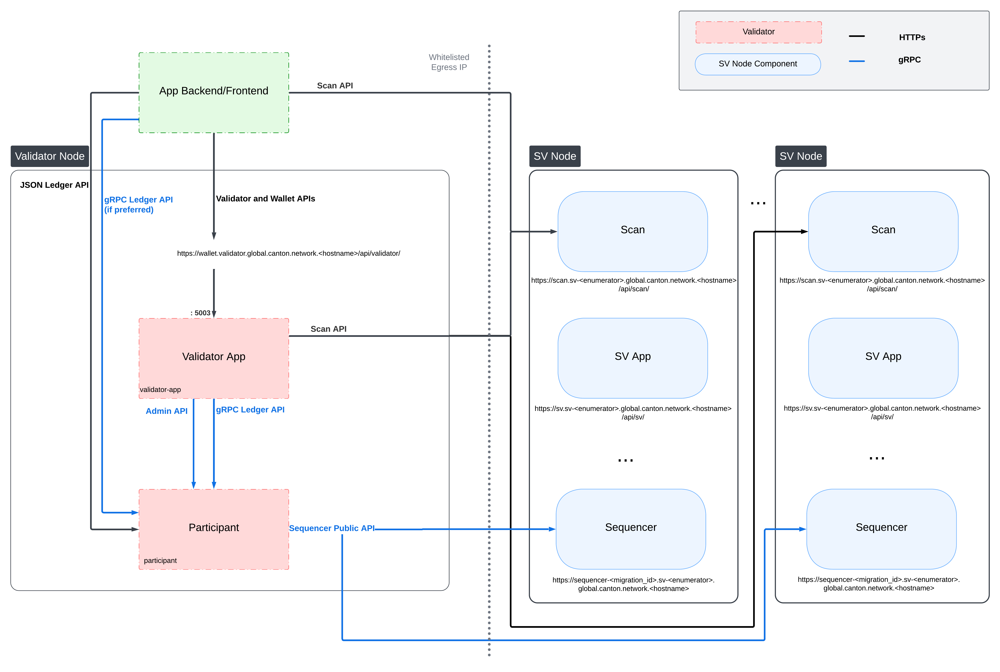

..
   Copyright (c) 2024 Digital Asset (Switzerland) GmbH and/or its affiliates. All rights reserved.
..
   SPDX-License-Identifier: Apache-2.0

.. _app_dev_ledger_api:

Ledger API
==========

As can be seen from the :ref:`validator-network-diagram` shown below, the Ledger API is
served by the Canton Participant node running as part of a Validator Node.

..
   _LucidChart link: https://lucid.app/lucidchart/cc18d86e-95aa-4a20-9677-160599132a3e/edit?viewport_loc=-2531%2C-3450%2C4045%2C2266%2C0_0&invitationId=inv_f7bcd7ba-780d-4887-8c24-973cc757b06e

Use the following documentation to learn how to use the Ledger API:
https://docs.digitalasset.com/build/3.4/explanations/ledger-api.

