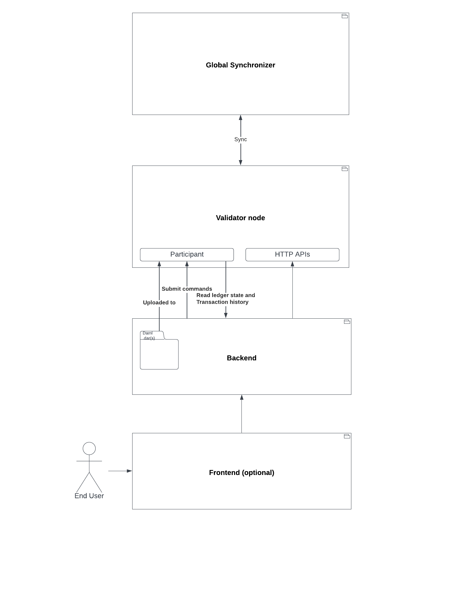

..
   Copyright (c) 2024 Digital Asset (Switzerland) GmbH and/or its affiliates. All rights reserved.
..
   SPDX-License-Identifier: Apache-2.0

Daml Apps
=========

It is often useful to sub-divide Daml apps into "proper Daml apps" that define their own .dars and Daml workflows;
and the "Daml app extensions" that improve on the automation of Daml workflows of other proper Daml apps.

An example of a proper Daml app would be Splice Amulet whose workflows are defined in the splice-amulet.dar
and whose automation and higher-level API access is provided by the wallet app included in a validator node.

An example of a "Daml app extension" would be a traffic faucet that runs as a side-car to a validator node
and serves an HTTP API for third-parties to request traffic for their validator node to simplify on-boarding.
Such a faucet would likely not use direct Ledger API access to exercise the AmuletRules_BuyMemberTraffic choice,
but instead use the higher-level API provided by the wallet app on the validator node.

You can refer to the `Official Daml documentation <https://docs.daml.com/>`_ to learn more about Daml.
Refer to :ref:`app_dev_daml_api` for the Splice packages.

Architecture
++++++++++++

A "proper" Daml App is composed of:

- Daml models
- A validator node, including the validator app and a Canton participant
- App backends
- App frontends (unless the application is backend-only)

        - End user uses Frontend
        - Frontend communicates with Backend
        - Backend contains dars which get uploaded to the validator node's participant.
          It also uses the participant for command submission and the validator app's API.
        - The validator app synchronizes with the Global Synchronizer.

A "Daml App extension" wouldn't have any Daml models nor a validator node,
but it would provide its own backend and possibly its own frontend.

You can find a detailed description of useful APIs in:

- :ref:`app_dev_ledger_api`
- :ref:`app_dev_validator_api`
- :ref:`app_dev_scan_api`

Ledger Ingestion
++++++++++++++++

An application will need to process data from the ledger. For example, to execute off-ledger workflows or to update search
engines. The easiest way to process the data from the ledger is to use `PQS <https://docs.daml.com/query/pqs-user-guide.html>`_.
It makes the ledger available to be queried by SQL.
This enables users to query the state and history of the ledger, while minimizing the demand on the participant node.
