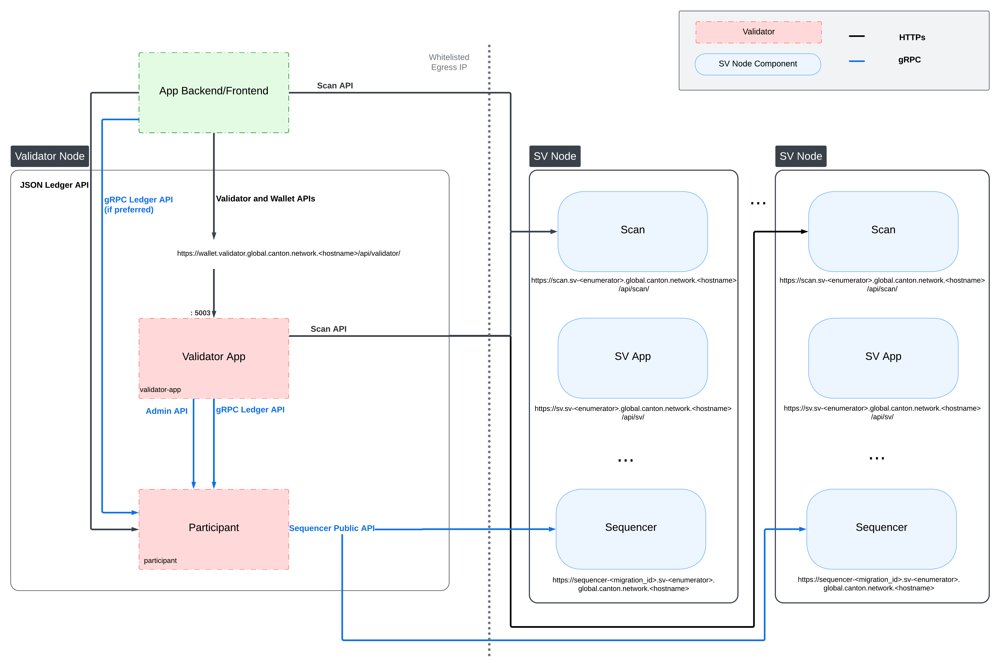

..
   Copyright (c) 2024 Digital Asset (Switzerland) GmbH and/or its affiliates. All rights reserved.
..
   SPDX-License-Identifier: Apache-2.0

.. _splice_app_apis:

Splice HTTP APIs
================

.. _app_dev_http_apis:

There are two sets of HTTP APIs exposed by Splice applications, as can be seen
in the diagram below:

..
   _LucidChart link: https://lucid.app/lucidchart/cc18d86e-95aa-4a20-9677-160599132a3e/edit?viewport_loc=-2531%2C-3450%2C4045%2C2266%2C0_0&invitationId=inv_f7bcd7ba-780d-4887-8c24-973cc757b06e

* The :ref:`app_dev_scan_api` are exposed by the Scan App of SV nodes and
  provides access to the view of the ledger and its infrastructure as seen by all SV Nodes.
  Use https://sync.global/sv-network/ to discover the Scan API URLs for
  DevNet, TestNet, and MainNet.

* The :ref:`app_dev_validator_api` are exposed by the Validator App of a Validator Node and
  serves to manage the Validator Node and the Splice Wallets of parties hosted
  locally on the Validator Node.

The Ledger API is not part of Splice, and thus not documented here. See :ref:`app_dev_ledger_api` for details on how to use the Ledger API.

Some of the Splice apps also define additional HTTP APIs that are considered internal and are subject to change without notice.
If you do need some of them for your app, please create an issue on https://github.com/hyperledger-labs/splice,
so that you can align with the Splice team on the API, your needs, and the required stability guarantees.

.. toctree::
   :hidden:

   ../scan_api/index
   ../validator_api/index

.. _app_dev_openapi_conventions:

OpenAPI Conventions
-------------------

The HTTP APIs of Splice apps are documented using `OpenAPI specifications <https://www.openapis.org/>`_.
You can download the OpenAPI specification for Splice's applications here: |openapi_download_link|.

API Stability
~~~~~~~~~~~~~

Endpoints in the files named ``APP-external`` are intended for external
consumption and are intended to stay backwards compatible across
releases. At this point, there might be some cases where backwards
compatibility is broken as we are still in early stages of
development. Any breaking changes in ``external`` APIs will be
documented in the release notes.

Endpoints in the files named ``APP-internal`` do not have any backwards compatibility guarantees.

Contract Payload Encoding
~~~~~~~~~~~~~~~~~~~~~~~~~

The ``Contract`` schema defined in ``common.yaml`` includes the
``payload`` of the given contract. This payload is encoded using the
same `schema used by the HTTP JSON API <https://docs.daml.com/json-api/lf-value-specification.html>`_.

.. _app-auth:

Authentication
---------------

Accessing Splice App APIs requires a JWT of the form:

.. code-block:: json

    {
      "sub": "ledgerApiUserId",
      "aud": "audience-of-app"
    }

The subject must be the ledger API user requests should be submitted
at, e.g., if you want to operate as the validator operator this is the
``ledger-api-user`` configured in your validator config.

The audience must be the audience specified in the ``auth`` section of your app.
The token must be signed with the specified algorithm and configuration.

E.g., for the config below the audience must be ``https://example.com`` and it must be
signed with an RS256 key that is found at the given `JWKS URL <https://datatracker.ietf.org/doc/html/rfc7517>`_.

.. code-block::

   canton {
     validator-apps {
       validator {
         auth {
           audience = "https://example.com"
           algorithm = "rs-256"
           jwks-url = "https://example.com/.well-known/jwks.json"
         }
         ...
       }
     }
   }

The token must be passed as an `OAuth2 Bearer token <https://datatracker.ietf.org/doc/html/rfc6750#section-2.1>`_, i.e., in an Authorization header of the form:

.. code-block::

   Authorization: Bearer yourtoken

Requests always operate on the primary party of the user specified as the subject in the token.

Port Configuration
-------------------

All Splice apps expose HTTP APIs,
which are typically served by a reverse proxy on a well-known URL.

In case you do need to access them directly, their
port is configured under ``admin-api.port``, e.g., this config file would expose
the validator API on port 5003:

.. code-block::

   canton {
     validator-apps {
       validator {
         admin-api.port = 5003
         ...
       }
     }
   }

