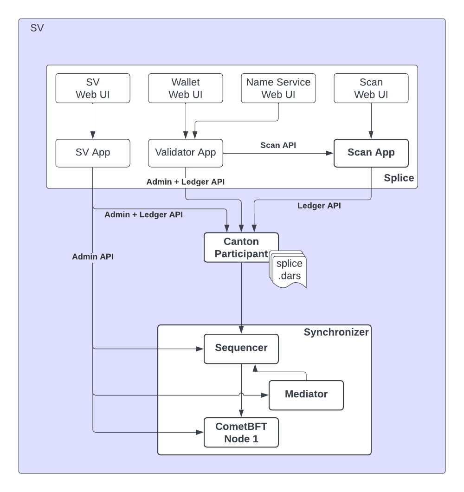

..
   Copyright (c) 2024 Digital Asset (Switzerland) GmbH and/or its affiliates. All rights reserved.
..
   SPDX-License-Identifier: Apache-2.0

.. _app_dev_scan_api:

Scan API
========
The Scan App is part of a :term:`CN Supervalidator` (SV) node.
The Scan App is shown in the context of an SV node in the following diagram:

The Scan App stores the transaction history, and active contract set as seen by SVs, as well as reference data,
for instance how to connect to the Global Synchronizer and which packages to use.

The Scan App ingests updates from the SV Participant node, reconstructs ACS snapshots from the updates and stores this data in
a schema that is optimized for several querying scenarios. The Scan API provides access to this data.

The Scan API can be used to integrate third-party apps with the Scan App component of the SV nodes
constituting the Global Synchronizer.
Examples of such third-party apps are network analytic apps, block explorer apps, or financial accounting integrations.

The Scan App subscribes to the SV participant as the DSO (Decentralized Synchronizer Operations) Daml party, so it only observes sub transactions that involve that party.
This includes CC (Canton Coin) transfers and governance operations but excludes most other things.
In particular, any custom Daml app that does not interact with CC will be excluded.

You can directly connect to a Scan API hosted by a single SV, or you can read from multiple Scan APIs and compare the results.

The validator node contains a :ref:`validator-api-scan-proxy` that
provides :term:`BFT` reads to Scan APIs hosted by Super Validators.

The Scan API is grouped in the following categories:

* :ref:`scan_bulk_data_api`: A comprehensive API that provides access to the exact and full history of updates and ACS snapshots as recorded on the SV participant node.
* :ref:`scan_global_synchronizer_connectivity_api`
* :ref:`scan_global_synchronizer_operations_api`
* :ref:`scan_cc_reference_data_api`
* :ref:`scan_current_state_api`
* :ref:`scan_aggregates_api`

Please see the :ref:`scan_openapi` for the full API reference.

.. toctree::
   :hidden:

   scan_bulk_data_api
   scan_global_synchronizer_connectivity_api
   scan_global_synchronizer_operations_api
   scan_cc_reference_data_api
   scan_current_state_api
   scan_aggregates_api
   scan_openapi
