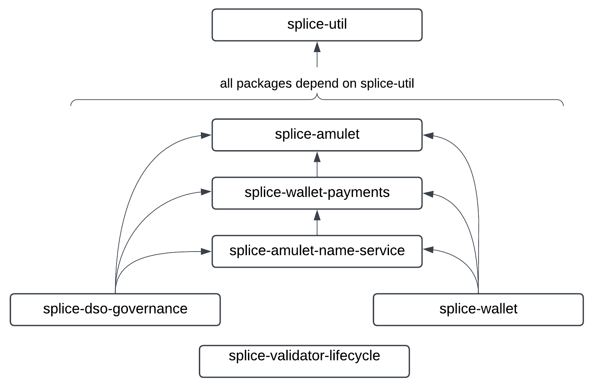

..
   Copyright (c) 2024 Digital Asset (Switzerland) GmbH and/or its affiliates. All rights reserved.
..
   SPDX-License-Identifier: Apache-2.0

.. _architecture:

Architecture
============

.. todo:: add more architecture docs (possibly starting with the architecture currently in the scan bulk api docs)

Daml Code Architecture
----------------------

Package Structure
~~~~~~~~~~~~~~~~~

The Daml code implementing Canton Coin (CC), the Canton Name Service (CNS), and Global Synchronizer governance is implemented in seven packages:

- ``splice-util``: implements utility functions used across the other packages
- ``splice-amulet``: implements CC
- ``splice-amulet-name-service``: implements CNS
- ``splice-dso-governance``: implements Global Synchronizer governance, and decentralized CC and CNS automation
- ``splice-validator-lifecycle``: implements the workflows required for an SV node to onboard a validator
- ``splice-wallet-payments``: implements CC specific payment workflows
- ``splice-wallet``: implements the splice-wallet specific workflows for peer-to-peer transfers of CC and for delegating the automation for traffic-top-ups, sweeping, and batched transfer execution to a validator operator.

You can find their Daml docs in the :ref:`app_dev_daml_api` section.

.. note::
   ``splice-wallet-payments`` implements both a pay-with-CC workflow and a CC subscription workflow.
   The latter is deprecated, and but still used to pay for CNS entries.
   The former is expected to be replaced with the asset-generic DVP workflows from the
   `CN token standard <https://lists.sync.global/g/cip-discuss/message/5>`_ in the near future.
   Analogously, the CC-specific peer-to-peer transfer workflow implemented in
   ``splice-wallet`` is is expected to be replaced by the peer-to-peer transfer
   from the CN token standard.

   The benefits of replacing these with workflows from the CN token standard are:

   - they will work for any asset, not just CC
   - the Daml interfaces used in the CN token standard make it much easier to consume upgrades to the ``splice`` Daml packages
   - the workflows work across different wallet implementations, not just the splice-wallet

.. todo::
   - TODO(#552): update the text above and below with the changes from the token-standard

Decentralized Transaction Validation and Automation
~~~~~~~~~~~~~~~~~~~~~~~~~~~~~~~~~~~~~~~~~~~~~~~~~~~

CC, CNS, and Global Synchronizer governance are implemented in a decentralized fashion to tolerate up to ``f`` faulty or dishonest SV nodes
for ``f = numSvNodes - t`` and confirmation threshold ``t = ceiling (numSvNodes * 2.0 / 3.0)``.

The implementation uses three key techniques to achieves this Byzantine fault tolerance:

- **DSO party**: it sets up a decentralized Daml party, called the DSO party, with
  confirmation threshold ``t`` and hosted on all SV nodes.
- **on-ledger confirmations**: it requires explicit on-ledger confirmations from ``t`` SV nodes for
  exercising choices with off-ledger input in the name of the DSO party.
- **decentralized automation**: all SV nodes run automation code that attempts to exercise choices
  required to be executed by the DSO party. The choices are either
  executed directly if they do not require off-ledger input, or they are exercised indirectly
  by creating the corresponding confirmation if they require off-ledger input.
  The automation exercises choices in a timely fashion, so that the skew between
  the target time and the actual time is bounded on average.
- **median-based voting**: agreement on conversion rates and like configuration parameters
  is achieved using median-based voting, where every SV operator publishes their
  desired value on-ledger and the DSO party uses the median of these values.

Thus CC and CNS users that are willing to assume that no more than ``f`` SV
nodes are dishonest can rely on the following guarantees:

- **valid transactions**: every transaction that requires confirmation from the DSO party is
  `valid <https://docs.daml.com/concepts/ledger-model/ledger-integrity.html#valid-ledgers>`_.
- **timely automation**: actions required to be taken by the DSO party are taken in a timely fashion.
- **predictable fees and configuration values**: fees and configuration values are reasonably
  predictable as they represent the *aggregate preferences* of ~2/3 of SV
  operators, which can be assumed to be acting in their own best interest.

The guarantee of valid transactions is particularly important for CC and CNS users, as it is used
to decouple the concerns of implementing decentralized automation and governance from the concern
of implementing the tokenomics and business logic of CC and CNS.

All code other than ``splice-dso-governance`` and ``splice-validator-lifecycle``
is written under the assumption that the DSO party behaves as an honest provider
of the CC and CNS applications. We define what this means in the sections below.

This approach of factoring out decentralization concerns using a decentralized
party greatly simplifies the code, and enables factoring the code as shown
in the package dependency graph:

.. lucid source: https://lucid.app/lucidchart/56764ae0-5825-4954-8b32-5252fee68c83/edit?view_items=jtb1hIHIHQ.b%2Caob1j2gGJbO6%2C~nb1w3ZzYDEX%2C~nb1UCgmyOoP%2C.nb1RL6YG0cU%2C0nb1iiXrpiZV%2Cbob1Litjb35P%2Cupb1ES3znlkq%2CYqb1yBW27IwR%2CSqb1Gzq1Qdhe%2CSvb1wMBpn1h1%2CBsb12LHXmO23%2Ctsb1X_HZkrot%2Cwsb1pJJd-eSV%2CArb1DDz7GjdK%2C3qb1_eqEDJGy%2C~qb1zOH1WoYX&invitationId=inv_ae352c99-988b-4288-81c1-bbb36ec36a4f

DSO Party Requirements for CC
~~~~~~~~~~~~~~~~~~~~~~~~~~~~~

The high-level requirement on the DSO party for CC is to ensure that the total
amount of CC in circulation (as represented by the set of all active ``Amulet`` contracts for that DSO party) follows the tokenomics described in the
`Canton Coin whitepaper
<https://www.digitalasset.com/hubfs/Canton%20Network%20Files/Documents%20(whitepapers%2C%20etc...)/Canton%20Coin_%20A%20Canton-Network-native%20payment%20application.pdf>`_.

This requirement is satisfied by the Daml code in the ``splice-amulet`` package
under the following assumptions on the actions of the DSO party
(we recommend reading them jointly with the source code):

1. There is exactly one ``AmuletRules`` and ``ExternalPartyAmuletRules`` contract.

2. The choice ``AmuletRules_Bootstrap_Rounds`` is called exactly once as part of network bootstrapping and ``isDevNet`` is set to ``false``.

3. On-ledger confirmations from ``t`` SV nodes are used for exercising the following choices with the specified constraints:

   - ``AmuletRules_MiningRound_StartIssuing`` is called with an
     ``OpenMiningRoundSummary`` contains the totals of all activity records
     associated with the round.

   - ``AmuletRules_AddFutureAmuletConfigSchedule``, ``AmuletRules_RemoveFutureAmuletConfigSchedule``, and
     ``AmuletRules_UpdateFutureAmuletConfigSchedule`` are only called as the result of a vote
     accepted by at least ``t`` SV operators.

   - ``ValidatorLicense_Withdraw`` is only called as the result of a vote accepted by at least ``t`` SV operators.

4. The ``AmuletRules_Mint`` choice is never called outside the ``splice-amulet`` package.

5. All choices in ``splice-amulet`` granted to the DSO party and not mentioned
   in assumptions 3 or 4 are exercised as soon as possible and without any
   additional constraints on their arguments, except for:

   - ``AmuletRules_AdvanceOpenMiningRounds`` is called with the ``amuletPrice`` parameter set to the median of the
     votes on the dollar-to-CC conversion rate set by the SV nodes.

6. The only ``create`` and ``archive`` commands for ``splice-amulet`` templates that are executed by the DSO party
   *outside* of the choices defined in ``splice-amulet`` are:

   - create and archive ``AmuletRules`` is only used to directly update the
     `configSchedule` field in the ``AmuletRules`` contract. Any change to the schedule has been
     accepted by at least ``t`` SV nodes.

   - create and archive ``FeaturedAppRight`` is used to feature or unfeature a particular app provider
     party. Any such action has been voted on by at least ``t`` SV nodes.

   - create ``SvRewardCoupon`` is only used for round numbers for which there is
     an active ``OpenMiningRound`` contract whose ``opensAt`` time is past.

   - create ``ValidatorLicense`` is called at most once per ``validator`` party

   - create ``TransferCommandCounter``: is called at most once per ``sender`` party to create
     their ``TransferCommandCounter`` contract in a lazy fashion.

Note that these assumptions are satisfied by the code in
``splice-dso-governance`` and the automation code run by the SV nodes.

CNS Party Requirements for CNS
~~~~~~~~~~~~~~~~~~~~~~~~~~~~~~

There is no whitepaper for CNS that defines the high-level requirements for how it is expected to work,
which is why we define them here. They are:

#. entries names are unique
#. entries are never archived before they expire
#. the owner of an entry can always renew them before they expire
#. anybody can purchase an entry for name that is not yet allocated
#. expired entries are archived

The split of the implementation between ``splice-amulet-name-service`` and ``slice-dso-governance``
follows the same pattern as the one explained for CC above. We refer the reader to the
Daml code in these two packages for more details.
