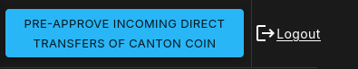

..
   Copyright (c) 2024 Digital Asset (Switzerland) GmbH and/or its affiliates. All rights reserved.
..
   SPDX-License-Identifier: Apache-2.0

.. _preapprovals:

Canton Coin Preapprovals
~~~~~~~~~~~~~~~~~~~~~~~~

Contrary to other assets like Eth or Bitcoin, Canton Coin requires a
party to explicitly agree to hold Canton Coin. This includes explicitly
agreeing to any incoming transfers.

Parties that are ok with accepting incoming Canton Coin transfers from
any sender, can setup a ``TransferPreapproval``. This allows any party
to send Canton Coin to the party that setup the
``TransferPreapproval``. Note that this only applies to transfers of
Canton Coin but not to other assets. Other assets may provide their
own variant of a preapproval which needs to be setup separately or
they may require approval of each incoming transfer individually.

To ensure that the super validators don't have to store and serve
``TransferPreapprovals`` contracts for parties that are no longer
active or malicious parties cannot spam them, a preapproval has a
limited lifetime until it expires and a fee must be burned
proportional to the lifetime when creating the preapproval. The fee is
controlled by the super validators through the
``transferPreapprovalFee`` parameter. The current value can be
observed in CC Scan at |gsf_scan_url|/dso and defaults to $1/year.

Each preapproval has two parties: The ``receiver`` party that approves
incoming transfers and the ``provider`` party. The provider party is
responsible for paying the fee and renewing the preapproval when it
gets close to its expiry date. In return, the ``provider`` party will
be the app provider on all incoming transfers that use this
preapproval and get the app rewards for it. The ``provider`` party
must not necessarily be hosted on the same node as the ``receiver``
party although that is the most common setup in practice.

Setting up Preapprovals
-----------------------

For parties not using external signing, the preapproval can be created
by the user in the in their splice wallet UI through the button next to the logout button:

For parties using external signing, the most common way of doing so is
for the validator operator to create a ``ExternalPartySetupProposal``
contract. The external party then signs a transaction that exercises
``ExternalPartySetupProposal_Accept``. This creates both the
``ValidatorRight`` contract required for validator reward minting for
the external party and the ``TransferPreapproval`` contract with the
provider set to the validator operator party. The validator exposes
the endpoints ``/v0/admin/external-party/setup-proposal`` to create
the proposal and then
``/v0/admin/external-party/setup-proposal/prepare-accept`` and
``/v0/admin/external-party/setup-proposal/submit-accept`` to prepare
and submit the signed acceptance from the external party. Refer to the
:ref:`API docs <validator-api-external-signing>` for details. If you
want a different setup in terms of who should be the provider, you may
need to build your own setup Daml contracts and create them through
the ledger API instead of using the validator APIs.

Note the :ref:`limit on the number of parties <party_scaling>` when
setting up preapprovals with the provider set as the validator
operator.

The validator APIs always create a preapproval with an expiry date of 90 days in the future.

.. _preapproval_renewal:

Expiry and Renewal of Preapprovals
----------------------------------

As explained above, preapprovals always have an expiry date. If that
date is reached and the preapproval has not been renewed, it can no
longer be used for transfers and automation run by the super
validators will eventually archive the contract.

Preapprovals that have the validator operator party as a provider,
will automatically be renewed for another 90 days through automation
in the validator app when expiry is less than 30 days away.

If you have set up a preapproval with a different party as the
provider, you need to setup your own renewal automation that
periodically exercises the ``TransferPreapproval_Renew`` choice.

Cancellation of Preapprovals
----------------------------

Preapprovals can be revoked by both the receiver and the provider
through the ``TransferPreapproval_Cancel`` choice.

There is currently no support for this in the splice wallet UI but for
preapprovals with the validator operator as the provider, a ``DELETE``
request to
``/v0/admin/transfer-preapprovals/by-party/{receiver-party}`` can be
used by the validator operator. Refer to the :ref:`API docs
<validator-api-external-signing>` for details.

Transferring through a Preapproval
----------------------------------

The splice wallet UI will automatically default to using a preapproval
for a transfer if the receiver has one setup.

If you are working through APIs instead, in particular for external parties,
the preferred way of exercising a Canton Coin transfer is through the
Token Standard APIs which will also use a preapproval where
possible. Refer to the `CIP <https://github.com/global-synchronizer-foundation/cips/blob/main/cip-0065/cip-0065.md>`_
and the `token standard reference CLI <https://github.com/hyperledger-labs/splice/blob/main/token-standard/cli/src/commands/transfer.ts>`_
for examples of how to use it.

Lastly, the legacy external signing APIs for non-standard Canton Coin
transfers on the validator
``/v0/admin/external-party/transfer-preapproval/prepare-send`` and
``/v0/admin/external-party/transfer-preapproval/submit-send`` can also
be used. Refer to the :ref:`API docs
<validator-api-external-signing>` for details.
