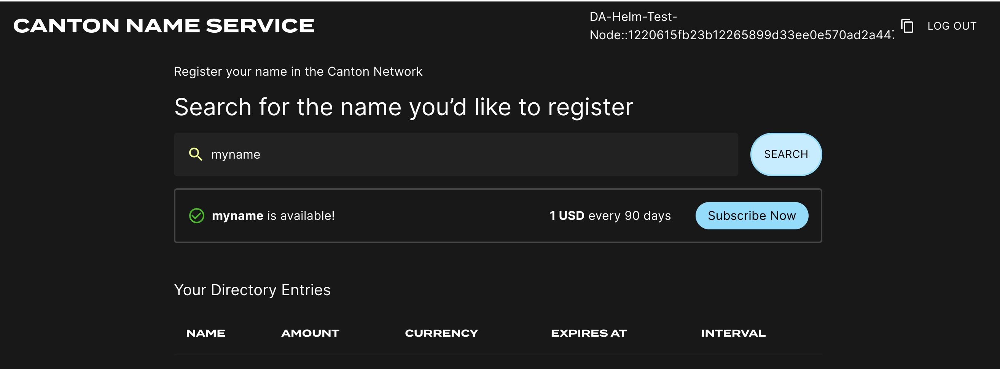

..
   Copyright (c) 2024 Digital Asset (Switzerland) GmbH and/or its affiliates. All rights reserved.
..
   SPDX-License-Identifier: Apache-2.0

.. _sv-helm:

Kubernetes-Based Deployment of a Super Validator node
=====================================================

This section describes deploying a Super Validator (SV) node in kubernetes using Helm
charts.  The Helm charts deploy a complete node and connect it to a
target cluster.

Requirements
------------

1) A running Kubernetes cluster in which you have administrator access to create and manage namespaces.
2) A development workstation with the following:

    a. ``kubectl`` - At least v1.26.1
    b. ``helm`` - At least v3.11.1

3) Your cluster needs a static egress IP. After acquiring that, propose to the other SVs to add it to the IP allowlist.

4) Please download the release artifacts containing the sample Helm value files, from here: |bundle_download_link|, and extract the bundle:

.. parsed-literal::

  tar xzvf |version|\_splice-node.tar.gz

5) Please inquire if the global synchronizer (domain) on your target network has previously undergone a :ref:`synchronizer migration <sv-upgrades>`.
   If it has, please record the current migration ID of the synchronizer.
   The migration ID is 0 for the initial synchronizer deployment and is incremented by 1 for each subsequent migration.

.. code-block:: bash

   export MIGRATION_ID=0

.. include:: ../common/backup_suggestion.rst

.. _sv-identity:

Generating an SV identity
-------------------------

SV operators are identified by a human-readable name and an EC public key.
This identification is stable across deployments of the Global Synchronizer.
You are, for example, expected to reuse your SV name and public key between (test-)network resets.

Use the following shell commands to generate a keypair in the format expected by the SV node software: ::

  # Generate the keypair
  openssl ecparam -name prime256v1 -genkey -noout -out sv-keys.pem

  # Encode the keys
  public_key_base64=$(openssl ec -in sv-keys.pem -pubout -outform DER 2>/dev/null | base64 | tr -d "\n")
  private_key_base64=$(openssl pkcs8 -topk8 -nocrypt -in sv-keys.pem -outform DER 2>/dev/null | base64 | tr -d "\n")

  # Output the keys
  echo "public-key = \"$public_key_base64\""
  echo "private-key = \"$private_key_base64\""

  # Clean up
  rm sv-keys.pem

..
  Based on `scripts/generate-sv-keys.sh`

These commands should result in an output similar to ::

  public-key = "MFkwEwYHKoZIzj0CAQYIKoZIzj0DAQcDQgAE1eb+JkH2QFRCZedO/P5cq5d2+yfdwP+jE+9w3cT6BqfHxCd/PyA0mmWMePovShmf97HlUajFuN05kZgxvjcPQw=="
  private-key = "MEECAQAwEwYHKoZIzj0CAQYIKoZIzj0DAQcEJzAlAgEBBCBsFuFa7Eumkdg4dcf/vxIXgAje2ULVz+qTKP3s/tHqKw=="

Store both keys in a safe location.
You will be using them every time you want to deploy a new SV node, i.e., also when deploying an SV node to a different deployment of the Global Synchronizer and for redeploying an SV node after a (test-)network reset.

The `public-key` and your desired *SV name* need to be approved by a threshold of currently active SVs in order for you to be able to join the network as an SV.
For `DevNet` and the current early version of `TestNet`, send the `public-key` and your desired SV name to your point of contact at Digital Asset (DA) and wait for confirmation that your SV identity has been approved and configured at existing SV nodes.

.. todo:: adjust wording above to the fact the MainNet is live

Preparing a Cluster for Installation
------------------------------------

Create the application namespace within Kubernetes.

.. code-block:: bash

    kubectl create ns sv

.. _helm-sv-auth:

Configuring Authentication
--------------------------

For security, the various components that comprise your SV node need to be able to authenticate themselves to each other,
as well as be able to authenticate external UI and API users.
We use JWT access tokens for authentication and expect these tokens to be issued by an (external) `OpenID Connect <https://openid.net/connect/>`_ (OIDC) provider.
You must:

1. Set up an OIDC provider in such a way that both backends and web UI users are able to obtain JWTs in a supported form.

2. Configure your backends to use that OIDC provider.

.. _helm-sv-auth-requirements:

OIDC Provider Requirements
++++++++++++++++++++++++++

This section provides pointers for setting up an OIDC provider for use with your SV node.
Feel free to skip directly to :ref:`helm-sv-auth0` if you plan to use `Auth0 <https://auth0.com>`_ for your SV node's authentication needs.
That said, we encourage you to move to an OIDC provider different from Auth0 for the long-term production deployment of your SV,
to avoid security risks resulting from a majority of SVs depending on the same authentication provider
(which could expose the whole network to potential security problems at this provider).

Your OIDC provider must be reachable [#reach]_ at a well known (HTTPS) URL.
In the following, we will refer to this URL as ``OIDC_AUTHORITY_URL``.
Both your SV node and any users that wish to authenticate to a web UI connected to your SV node must be able to reach the ``OIDC_AUTHORITY_URL``.
We require your OIDC provider to provide a `discovery document <https://openid.net/specs/openid-connect-discovery-1_0.html>`_ at ``OIDC_AUTHORITY_URL/.well-known/openid-configuration``.
We furthermore require that your OIDC provider exposes a `JWK Set <https://datatracker.ietf.org/doc/html/rfc7517>`_ document.
In this documentation, we assume that this document is available at ``OIDC_AUTHORITY_URL/.well-known/jwks.json``.

For machine-to-machine (SV node component to SV node component) authentication,
your OIDC provider must support the `OAuth 2.0 Client Credentials Grant <https://tools.ietf.org/html/rfc6749#section-4.4>`_ flow.
This means that you must be able to configure (`CLIENT_ID`, `CLIENT_SECRET`) pairs for all SV node components that need to authenticate to others.
Currently, these are the validator app backend and the SV app backend - both need to authenticate to the SV node's Canton participant.
The `sub` field of JWTs issued through this flow must match the user ID configured as `ledger-api-user` in :ref:`helm-sv-auth-secrets-config`.
In this documentation, we assume that the `sub` field of these JWTs is formed as ``CLIENT_ID@clients``.
If this is not true for your OIDC provider, pay extra attention when configuring ``ledger-api-user`` values below.

For user-facing authentication - allowing users to access the various web UIs hosted on your SV node,
your OIDC provider must support the `OAuth 2.0 Authorization Code Grant <https://datatracker.ietf.org/doc/html/rfc6749#section-4.1>`_ flow
and allow you to obtain client identifiers for the web UIs your SV node will be hosting.
Currently, these are the SV web UI, the Wallet web UI and the CNS web UI.
You might be required to whitelist a range of URLs on your OIDC provider, such as "Allowed Callback URLs", "Allowed Logout URLs", "Allowed Web Origins", and "Allowed Origins (CORS)".
If you are using the ingress configuration of this runbook, the correct URLs to configure here are
``https://sv.sv.YOUR_HOSTNAME`` (for the SV web UI) ,
``https://wallet.sv.YOUR_HOSTNAME`` (for the Wallet web UI) and
``https://cns.sv.YOUR_HOSTNAME`` (for the CNS web UI).
An identifier that is unique to the user must be set via the `sub` field of the issued JWT.
On some occasions, this identifier will be used as a user name for that user on your SV node's Canton participant.
In :ref:`helm-sv-install`, you will be required to configure a user identifier as the ``validatorWalletUser`` -
make sure that whatever you configure there matches the contents of the `sub` field of JWTs issued for that user.

*All* JWTs issued for use with your SV node:

- must be signed using the RS256 signing algorithm.

In the future, your OIDC provider might additionally be required to issue JWTs with a ``scope`` explicitly set to ``daml_ledger_api``
(when requested to do so as part of the OAuth 2.0 authorization code flow).

Summing up, your OIDC provider setup must provide you with the following configuration values:

======================= ===========================================================================
Name                    Value
----------------------- ---------------------------------------------------------------------------
OIDC_AUTHORITY_URL      The URL of your OIDC provider for obtaining the ``openid-configuration`` and ``jwks.json``.
VALIDATOR_CLIENT_ID     The client id of your OIDC provider for the validator app backend
VALIDATOR_CLIENT_SECRET The client secret of your OIDC provider for the validator app backend
SV_CLIENT_ID            The client id of your OIDC provider for the SV app backend
SV_CLIENT_SECRET        The client secret of your OIDC provider for the SV app backend
WALLET_UI_CLIENT_ID     The client id of your OIDC provider for the wallet UI.
SV_UI_CLIENT_ID         The client id of your OIDC provider for the SV UI.
CNS_UI_CLIENT_ID        The client id of your OIDC provider for the CNS UI.
======================= ===========================================================================

We are going to use these values, exported to environment variables named as per the `Name` column, in :ref:`helm-sv-auth-secrets-config` and :ref:`helm-sv-install`.

When first starting out, it is suggested to configure all three JWT token audiences below to the same value: ``https://canton.network.global``.

Once you can confirm that your setup is working correctly using this (simple) default,
we strongly recommend that you configure dedicated audience values that match your deployment and URLs.
This will help you to avoid potential security issues that might arise from using the same audience for all components.

You can configure audiences of your choice for the participant ledger API, the validator backend API, and the SV backend API.
We will refer to these using the following configuration values:

==================================== ===========================================================================
Name                                 Value
------------------------------------ ---------------------------------------------------------------------------
OIDC_AUTHORITY_LEDGER_API_AUDIENCE   The audience for the participant ledger API. e.g. ``https://ledger_api.example.com``
OIDC_AUTHORITY_VALIDATOR_AUDIENCE    The audience for the validator backend API. e.g. ``https://validator.example.com/api``
OIDC_AUTHORITY_SV_AUDIENCE           The audience for the SV backend API. e.g. ``https://sv.example.com/api``
==================================== ===========================================================================

Your IAM may also require a scope to be specified when the SV, validator and scan backend request a token for the ledger API. We will refer to that using the following configuration value:

==================================== ===========================================================================
Name                                 Value
------------------------------------ ---------------------------------------------------------------------------
OIDC_AUTHORITY_LEDGER_API_SCOPE      The scope for the participant ledger API. Optional
==================================== ===========================================================================

In case you are facing trouble with setting up your (non-Auth0) OIDC provider,
it can be beneficial to skim the instructions in :ref:`helm-sv-auth0` as well, to check for functionality or configuration details that your OIDC provider setup might be missing.

.. [#reach] The URL must be reachable from the Canton participant, validator app and SV app running in your cluster, as well as from all web browsers that should be able to interact with the SV and wallet UIs.

    .. TODO(DACH-NY/canton-network-internal#502) use a unique audience for each app

.. _helm-sv-auth0:

Configuring an Auth0 Tenant
+++++++++++++++++++++++++++

To configure `Auth0 <https://auth0.com>`_ as your SV's OIDC provider, perform the following:

1. Create an Auth0 tenant for your SV
2. Create an Auth0 API that controls access to the ledger API:

    a. Navigate to Applications > APIs and click "Create API". Set name to ``Daml Ledger API``,
       set identifier to ``https://canton.network.global``.
       Alternatively, if you would like to configure your own audience, you can set the identifier here. e.g. ``https://ledger_api.example.com``.
    b. Under the Permissions tab in the new API, add a permission with scope ``daml_ledger_api``, and a description of your choice.
    c. On the Settings tab, scroll down to "Access Settings" and enable "Allow Offline Access", for automatic token refreshing.

3. Create an Auth0 Application for the validator backend:

    a. In Auth0, navigate to Applications -> Applications, and click the "Create Application" button.
    b. Name it ``Validator app backend``, choose "Machine to Machine Applications", and click Create.
    c. Choose the ``Daml Ledger API`` API you created in step 2 in the "Authorize Machine to Machine Application" dialog and click Authorize.

4. Create an Auth0 Application for the SV backend.
   Repeat all steps described in step 3, using ``SV app backend`` as the name of your application.

5. Create an Auth0 Application for the SV web UI:

    a. In Auth0, navigate to Applications -> Applications, and click the "Create Application" button.
    b. Choose "Single Page Web Applications", call it ``SV web UI``, and click Create.
    c. Determine the URL for your validator's SV UI.
       If you're using the ingress configuration of this runbook, that would be ``https://sv.sv.YOUR_HOSTNAME``.
    d. In the Auth0 application settings, add the SV URL to the following:

       - "Allowed Callback URLs"
       - "Allowed Logout URLs"
       - "Allowed Web Origins"
       - "Allowed Origins (CORS)"
    e. Save your application settings.

6. Create an Auth0 Application for the wallet web UI.
   Repeat all steps described in step 5, with following modifications:

   - In step b, use ``Wallet web UI`` as the name of your application.
   - In steps c and d, use the URL for your SV's *wallet* UI.
     If you're using the ingress configuration of this runbook, that would be ``https://wallet.sv.YOUR_HOSTNAME``.

7. Create an Auth0 Application for the CNS web UI.
   Repeat all steps described in step 5, with following modifications:

   - In step b, use ``CNS web UI`` as the name of your application.
   - In steps c and d, use the URL for your SV's *CNS* UI.
     If you're using the ingress configuration of this runbook, that would be ``https://cns.sv.YOUR_HOSTNAME``.

8. (Optional) Similarly to the ledger API above, the default audience is set to ``https://canton.network.global``.
    If you want to configure a different audience to your APIs, you can do so by creating new Auth0 APIs with an identifier set to the audience of your choice. For example,

    a. Navigate to Applications > APIs and click "Create API". Set name to ``SV App API``,
       set identifier for the SV backend app API e.g. ``https://sv.example.com/api``.
    b. Create another API by setting name to ``Validator App API``,
       set identifier for the Validator backend app e.g. ``https://validator.example.com/api``.

Please refer to Auth0's `own documentation on user management <https://auth0.com/docs/manage-users>`_ for pointers on how to set up end-user accounts for the two web UI applications you created.
Note that you will need to create at least one such user account for completing the steps in :ref:`helm-sv-install` - for being able to log in as your SV node's administrator.
You will be asked to obtain the user identifier for this user account.
It can be found in the Auth0 interface under User Management -> Users -> your user's name -> user_id (a field right under the user's name at the top).

We will use the environment variables listed in the table below to refer to aspects of your Auth0 configuration:

================================== ===========================================================================
Name                               Value
---------------------------------- ---------------------------------------------------------------------------
OIDC_AUTHORITY_URL                 ``https://AUTH0_TENANT_NAME.us.auth0.com``
OIDC_AUTHORITY_LEDGER_API_AUDIENCE The optional audience of your choice for Ledger API. e.g. ``https://ledger_api.example.com``
VALIDATOR_CLIENT_ID                The client id of the Auth0 app for the validator app backend
VALIDATOR_CLIENT_SECRET            The client secret of the Auth0 app for the validator app backend
SV_CLIENT_ID                       The client id of the Auth0 app for the SV app backend
SV_CLIENT_SECRET                   The client secret of the Auth0 app for the SV app backend
WALLET_UI_CLIENT_ID                The client id of the Auth0 app for the wallet UI.
SV_UI_CLIENT_ID                    The client id of the Auth0 app for the SV UI.
CNS_UI_CLIENT_ID                   The client id of the Auth0 app for the CNS UI.
================================== ===========================================================================

The ``AUTH0_TENANT_NAME`` is the name of your Auth0 tenant as shown at the top left of your Auth0 project.
You can obtain the client ID and secret of each Auth0 app from the settings pages of that app.

.. _helm-sv-auth-secrets-config:

Configuring Authentication on your SV Node
++++++++++++++++++++++++++++++++++++++++++

We are now going to configure your SV node software based on the OIDC provider configuration values your exported to environment variables at the end of either :ref:`helm-sv-auth-requirements` or :ref:`helm-sv-auth0`.
(Note that some authentication-related configuration steps are also included in :ref:`helm-sv-install`.)

The following kubernetes secret will instruct the participant to create a service user for your SV app (omit the scope if it is not needed in your setup).

.. code-block:: bash

    kubectl create --namespace sv secret generic splice-app-sv-ledger-api-auth \
        "--from-literal=ledger-api-user=${SV_CLIENT_ID}@clients" \
        "--from-literal=url=${OIDC_AUTHORITY_URL}/.well-known/openid-configuration" \
        "--from-literal=client-id=${SV_CLIENT_ID}" \
        "--from-literal=client-secret=${SV_CLIENT_SECRET}" \
        "--from-literal=audience=${OIDC_AUTHORITY_LEDGER_API_AUDIENCE}"
        "--from-literal=scope=${OIDC_AUTHORITY_LEDGER_API_SCOPE}"

The validator app backend requires the following secret (omit the scope if it is not needed in your setup).

.. code-block:: bash

    kubectl create --namespace sv secret generic splice-app-validator-ledger-api-auth \
        "--from-literal=ledger-api-user=${VALIDATOR_CLIENT_ID}@clients" \
        "--from-literal=url=${OIDC_AUTHORITY_URL}/.well-known/openid-configuration" \
        "--from-literal=client-id=${VALIDATOR_CLIENT_ID}" \
        "--from-literal=client-secret=${VALIDATOR_CLIENT_SECRET}" \
        "--from-literal=audience=${OIDC_AUTHORITY_LEDGER_API_AUDIENCE}" \
        "--from-literal=scope=${OIDC_AUTHORITY_LEDGER_API_SCOPE}"

To setup the wallet, CNS and SV UI, create the following two secrets.

.. code-block:: bash

    kubectl create --namespace sv secret generic splice-app-wallet-ui-auth \
        "--from-literal=url=${OIDC_AUTHORITY_URL}" \
        "--from-literal=client-id=${WALLET_UI_CLIENT_ID}"

    kubectl create --namespace sv secret generic splice-app-sv-ui-auth \
        "--from-literal=url=${OIDC_AUTHORITY_URL}" \
        "--from-literal=client-id=${SV_UI_CLIENT_ID}"

    kubectl create --namespace sv secret generic splice-app-cns-ui-auth \
        "--from-literal=url=${OIDC_AUTHORITY_URL}" \
        "--from-literal=client-id=${CNS_UI_CLIENT_ID}"

Configuring your CometBFT node
------------------------------

Every SV node also deploys a CometBFT node. This node must be configured to join the existing Global Synchronizer BFT chain.
To do that, you first must generate the keys that will identify the node.

.. _cometbft-identity:

Generating your CometBFT node keys
++++++++++++++++++++++++++++++++++
To generate the node config you use the CometBFT docker image provided through Github Container Registry (|docker_repo_prefix|).

Use the following shell commands to generate the proper keys:

.. parsed-literal::

  # Create a folder to store the config
  mkdir cometbft
  cd cometbft
  # Init the node
  docker run --rm -v "$(pwd):/init" |docker_repo_prefix|/cometbft:|version| init --home /init
  # Read the node id and keep a note of it for the deployment
  docker run --rm -v "$(pwd):/init" |docker_repo_prefix|/cometbft:|version| show-node-id --home /init

Please keep a note of the node ID printed out above.

In addition, please retain some of the configuration files generated, as follows (you might need to change the permissions/ownership for them as they are accessible only by the root user): ::

  cometbft/config/node_key.json
  cometbft/config/priv_validator_key.json

Any other files can be ignored.

.. _helm-cometbft-secrets-config:

Configuring your CometBFT node keys
+++++++++++++++++++++++++++++++++++

The CometBFT node is configured with a secret, based on the output from :ref:`Generating the CometBFT node identity <cometbft-identity>`
The secret is created as follows, with the `node_key.json` and `priv_validator_key.json` files representing the files generated as part of the node identity:

.. code-block:: bash

    kubectl create --namespace sv secret generic cometbft-keys \
        "--from-file=node_key.json=node_key.json" \
        "--from-file=priv_validator_key.json=priv_validator_key.json"

.. _helm-cometbft-state-sync:

Configuring CometBFT state sync
+++++++++++++++++++++++++++++++

.. warning::

   CometBFT state sync introduces a dependency on the sponsoring node
   for fetching the state snapshot on startup and therefore a single
   point of failure. It should only be enabled when joining a new node
   to a chain that has already been running for a while.  In all other
   cases including for a new node after it has completed
   initialization and after network resets, state sync should be
   disabled.

CometBFT has a feature called state sync that allows a new peer to catch up quickly by reading a snapshot of data at or near the head of
the chain and verifying it instead of fetching and replaying every block. (See `CometBFT documentation <https://docs.cometbft.com/v0.34/core/state-sync>`_).
This leads to drastically shorter times to onboard new nodes at the cost of new nodes having a truncated block history.
Further, when the chain has been pruned, state sync needs to be enabled on new nodes in order to bootstrap them successfully.

There are 3 main configuration parameters that control state sync in CometBFT:

- `rpc_servers` - The list of CometBFT RPC servers to connect to in order to fetch snapshots
- `trust_height` - Height at which you should trust the chain
- `trust_hash` - Hash corresponding to the trusted height

A CometBFT node installed using our helm charts (see :ref:`helm-sv-install`) with the default values set in
``splice-node/examples/sv-helm/cometbft-values.yaml`` automatically uses state sync for bootstrapping
if:

- it has not been explicitly disabled by setting `stateSync.enable` to `false`
- the block chain is mature enough for at least 1 state snapshot to have been taken i.e.
  the height of the latest block is greater than or equal to the configured interval between snapshots

The snapshots are fetched from your onboarding sponsor which exposes its CometBFT RPC API at `https://sv.sv-X.TARGET_HOSTNAME:443/cometbft-rpc/`.
This can be changed by setting `stateSync.rpcServers` accordingly. The `trust_height` and `trust_hash` are computed dynamically via an initialization script
and setting them explicitly should not be required and is not currently supported.

.. _helm-sv-bft-sequencer-connections:

Configuring BFT Sequencer Connections
-------------------------------------

By default, SV participants use BFT sequencer connections to interact with the Global Synchronizer, i.e.,
they maintain connections to a random subset of all sequencers (most of which typically operated by other SVs)
and perform reads and writes in the same :term:`BFT` manner used by regular validators.
In principle, this mode of operation is more robust than using a single connection to the sequencer operated by the SV itself.
However, bugs in the BFT sequencer connection logic or severe instability of other SVs's sequencers can make it prudent to temporarily switch back to using a single sequencer connection.

To do so, SV operators must perform the following steps.

Step 1. In ``sv-validator-values.yaml``, add the following.

.. code-block:: yaml

    synchronizer:
      connectionType: "trust-single"
      url: "SEQUENCER_PUBLIC_URI" # domain.sequencerPublicUrl from sv-values.yaml

Step 2. In ``validator-values.yaml``, add the following or an equivalent :ref:`config override <configuration_ad_hoc>`:

.. code-block:: yaml

    additionalEnvVars:
        - name: ADDITIONAL_CONFIG_NO_BFT_SEQUENCER_CONNECTION
          value: "canton.validator-apps.validator_backend.disable-sv-validator-bft-sequencer-connection = true"

Step 3. In ``sv-values.yaml``, add the following or an equivalent :ref:`config override <configuration_ad_hoc>`:

.. code-block:: yaml

    additionalEnvVars:
        - name: ADDITIONAL_CONFIG_NO_BFT_SEQUENCER_CONNECTION
          value: "canton.sv-apps.sv.bft-sequencer-connection = false"

The default behavior is restored by undoing above changes.

To confirm the current configuration of your SV participant,
open a :ref:`Canton console <console_access>` to it and execute ``participant.synchronizers.config("global")``.
In case BFT sequencer connections are disabled, this should return a single sequencer connection in an output similar to the following:

.. parsed-literal::

    @ participant.synchronizers.config("global")
    res1: Option[SynchronizerConnectionConfig] = Some(
      value = SynchronizerConnectionConfig(
        synchronizer = Synchronizer \'global\',
        sequencerConnections = SequencerConnections(
          connections = Sequencer \'DefaultSequencer\' -> GrpcSequencerConnection(sequencerAlias = Sequencer \'DefaultSequencer\', endpoints = http://global-domain-0-sequencer:5008),
          sequencer trust threshold = 1,
          submission request amplification = SubmissionRequestAmplification(factor = 1, patience = 10s)
        ),
        manualConnect = false,
        timeTracker = SynchronizerTimeTrackerConfig(minObservationDuration = 30m)
      )
    )

Alternatively, you can also search your participant logs for a ``DEBUG``-level entry such as
``Connecting to synchronizer with config: SynchronizerConnectionConfig(...)``,
which contains the same information.

.. _helm-sv-postgres:

Installing Postgres instances
-----------------------------

The SV node requires 4 Postgres instances: one for the sequencer, one for the mediator,
one for the participant, and one for the CN apps. While they can all use the same instance,
we recommend splitting them up into 4 separate instances for better operational flexibility,
and also for better control over backup processes.

We support both Cloud-hosted Postgres instances and Postgres instances running in the cluster.

Creating k8s Secrets for Postgres Passwords
+++++++++++++++++++++++++++++++++++++++++++

All apps support reading the Postgres password from a Kubernetes secret.
Currently, all apps use the Postgres user ``cnadmin``.
The password can be setup with the following command, assuming you set the environment variables ``POSTGRES_PASSWORD_XXX`` to secure values:

.. code-block:: bash

    kubectl create secret generic sequencer-pg-secret \
        --from-literal=postgresPassword=${POSTGRES_PASSWORD_SEQUENCER} \
        -n sv
    kubectl create secret generic mediator-pg-secret \
        --from-literal=postgresPassword=${POSTGRES_PASSWORD_MEDIATOR} \
        -n sv
    kubectl create secret generic participant-pg-secret \
        --from-literal=postgresPassword=${POSTGRES_PASSWORD_PARTICIPANT} \
        -n sv
    kubectl create secret generic apps-pg-secret \
        --from-literal=postgresPassword=${POSTGRES_PASSWORD_APPS} \
        -n sv

Postgres in the Cluster
+++++++++++++++++++++++

If you wish to run the Postgres instances as pods in your cluster, you can use the `splice-postgres` Helm chart to install them:

.. parsed-literal::

    helm install sequencer-pg |helm_repo_prefix|/splice-postgres -n sv --version ${CHART_VERSION} -f splice-node/examples/sv-helm/postgres-values-sequencer.yaml --wait
    helm install mediator-pg |helm_repo_prefix|/splice-postgres -n sv --version ${CHART_VERSION} -f splice-node/examples/sv-helm/postgres-values-mediator.yaml --wait
    helm install participant-pg |helm_repo_prefix|/splice-postgres -n sv --version ${CHART_VERSION} -f splice-node/examples/sv-helm/postgres-values-participant.yaml --wait
    helm install apps-pg |helm_repo_prefix|/splice-postgres -n sv --version ${CHART_VERSION} -f splice-node/examples/sv-helm/postgres-values-apps.yaml --wait

Cloud-Hosted Postgres
+++++++++++++++++++++

If you wish to use cloud-hosted Postgres instances, please configure and initialize each of them as follows:

- Use Postgres version 14
- Create a database called ``cantonnet`` (this is a dummy database that will not be filled with actual data; additional databases will be created as part of deployment and initialization)
- Create a user called ``cnadmin`` with the password as configured in the kubernetes secrets above

Note that the default Helm values files used below assume that the Postgres instances are deployed using the Helm charts above,
thus are accessible at hostname sequencer-pg, mediator-pg, etc. If you are using cloud-hosted Postgres instances,
please override the hostnames under `persistence.host` with the IP addresses of the Postgres instances.
To avoid conflicts across migration IDs,
you will also need to ensure that `persistence.databaseName` is unique per component (participant, sequencer, mediator) and migration ID.

.. _helm-sv-install:

Installing the Software
-----------------------

Configuring the Helm Charts
+++++++++++++++++++++++++++

To install the Helm charts needed to start an SV node connected to the
cluster, you will need to meet a few preconditions. The first is that
there needs to be an environment variable defined to refer to the
version of the Helm charts necessary to connect to this environment:

|chart_version_set|

An SV node includes a CometBFT node so you also need to configure
that. Please modify the file ``splice-node/examples/sv-helm/cometbft-values.yaml`` as follows:

- Replace all instances of ``TARGET_CLUSTER`` with |splice_cluster|, per the cluster to which you are connecting.
- Replace all instances of ``TARGET_HOSTNAME`` with |da_hostname|, per the cluster to which you are connecting.
- Replace all instances of ``MIGRATION_ID`` with the migration ID of the global synchronizer on your target cluster. Note that ``MIGRATION_ID`` is also used within port numbers in URLs here!
- Replace ``YOUR_SV_NAME`` with the name you chose when creating the SV identity (this must be an exact match of the string for your SV to be approved to onboard)
- Replace ``YOUR_COMETBFT_NODE_ID`` with the id obtained when generating the config for the CometBFT node
- Replace ``YOUR_HOSTNAME`` with the hostname that will be used for the ingress
- Add `db.volumeSize` and `db.volumeStorageClass` to the values file adjust persistent storage size and storage class if necessary. (These values default to 20GiB and `standard-rwo`)
- Uncomment the appropriate `nodeId`, `publicKey` and `keyAddress` values in the `sv1` section as per the cluster to which you are connecting.

.. _helm-configure-global-domain:

Please modify the file ``splice-node/examples/sv-helm/participant-values.yaml`` as follows:

- Replace all instances of ``MIGRATION_ID`` with the migration ID of the global synchronizer on your target cluster.
- Replace ``OIDC_AUTHORITY_LEDGER_API_AUDIENCE`` in the `auth.targetAudience` entry with audience for the ledger API. e.g. ``https://ledger_api.example.com``. If you are not ready to use a custom audience, you can use the suggested default ``https://canton.network.global``.
- Update the `auth.jwksUrl` entry to point to your auth provider's JWK set document by replacing ``OIDC_AUTHORITY_URL`` with your auth provider's OIDC URL, as explained above.
- If you are running on a version of Kubernetes earlier than 1.24, set `enableHealthProbes` to `false` to disable the gRPC liveness and readiness probes.
- Add `db.volumeSize` and `db.volumeStorageClass` to the values file adjust persistant storage size and storage class if necessary. (These values default to 20GiB and `standard-rwo`)
- Replace ``YOUR_NODE_NAME`` with the name you chose when creating the SV identity.

Please modify the file ``splice-node/examples/sv-helm/global-domain-values.yaml`` as follows:

- Replace all instances of ``MIGRATION_ID`` with the migration ID of the global synchronizer on your target cluster.
- Replace ``YOUR_SV_NAME`` with the name you chose when creating the SV identity.

Please modify the file ``splice-node/examples/sv-helm/scan-values.yaml`` as follows:

- Replace all instances of ``MIGRATION_ID`` with the migration ID of the global synchronizer on your target cluster.

An SV node includes a validator app so you also need to configure
that. Please modify the file ``splice-node/examples/sv-helm/validator-values.yaml`` as follows:

- Replace ``TRUSTED_SCAN_URL`` with the URL of the Scan you host. If you are using the ingress configuration of this runbook, you can use ``"http://scan-app.sv:5012"``.
- If you want to configure the audience for the Validator app backend API, replace ``OIDC_AUTHORITY_VALIDATOR_AUDIENCE`` in the `auth.audience` entry with audience for the Validator app backend API. e.g. ``https://validator.example.com/api``.
- If you want to configure the audience for the Ledger API, set the ``audience`` field in the `splice-app-sv-ledger-api-auth` k8s secret with the audience for the Ledger API. e.g. ``https://ledger_api.example.com``.
- Replace ``OPERATOR_WALLET_USER_ID`` with the user ID in your IAM that you want to use to log into the wallet as the SV party. Note that this should be the full user id, e.g., ``auth0|43b68e1e4978b000cefba352``, *not* only the suffix ``43b68e1e4978b000cefba352``
- Replace ``YOUR_CONTACT_POINT`` by the same contact point that you used in ``sv-values.yaml``.
  this, set it to an empty string.
- Update the `auth.jwksUrl` entry to point to your auth provider's JWK set document by replacing ``OIDC_AUTHORITY_URL`` with your auth provider's OIDC URL, as explained above.
- If your validator is not supposed to hold any CC, you should disable the wallet by setting `enableWallet` to `false`.
  Note that if the wallet is disabled, you shouldn't install the wallet or CNS UIs, as they won't work.

Additionally, please modify the file ``splice-node/examples/sv-helm/sv-validator-values.yaml`` as follows:

- Replace all instances of ``TARGET_HOSTNAME`` with |da_hostname|, per the cluster to which you are connecting.
- Replace all instances of ``MIGRATION_ID`` with the migration ID of the global synchronizer on your target cluster.

The private and public key for your SV are defined in a K8s secret.
If you haven't done so yet, please first follow the instructions in
the :ref:`Generating an SV Identity<sv-identity>` section to obtain
and register a name and keypair for your SV. Replace
``YOUR_PUBLIC_KEY`` and ``YOUR_PRIVATE_KEY`` with the ``public-key``
and ``private-key`` values obtained as part of generating your SV
identity.

.. code-block:: bash

    kubectl create secret --namespace sv generic splice-app-sv-key \
        --from-literal=public=YOUR_PUBLIC_KEY \
        --from-literal=private=YOUR_PRIVATE_KEY

For configuring your sv app, please modify the file ``splice-node/examples/sv-helm/sv-values.yaml`` as follows:

- Replace all instances of ``TARGET_HOSTNAME`` with |da_hostname|, per the cluster to which you are connecting.
- Replace all instances of ``MIGRATION_ID`` with the migration ID of the global synchronizer on your target cluster.
- If you want to configure the audience for the SV app backend API, replace ``OIDC_AUTHORITY_SV_AUDIENCE`` in the ``auth.audience`` entry with audience for the SV app backend API. e.g. ``https://sv.example.com/api``.
- Replace ``YOUR_SV_NAME`` with the name you chose when creating the SV identity (this must be an exact match of the string for your SV to be approved to onboard)
- Update the ``auth.jwksUrl`` entry to point to your auth provider's JWK set document by replacing ``OIDC_AUTHORITY_URL`` with your auth provider's OIDC URL, as explained above.
- Please set ``domain.sequencerPublicUrl`` to the URL to your sequencer service in the SV configuration. If you are using the ingress configuration of this runbook, you can just replace ``YOUR_HOSTNAME`` with your host name.
- Please set ``scan.publicUrl`` to the URL to your Scan app in the SV configuration. If you are using the ingress configuration of this runbook, you can just replace ``YOUR_HOSTNAME`` with your host name.
- It is recommended to :ref:`configure pruning <sv-pruning>` .
- Replace ``YOUR_CONTACT_POINT`` by a slack user name or email address that can be used by node operators to contact you in case there are issues with your node. If you do not want to share
  this, set it to an empty string.
- If you would like to redistribute all or part of the SV rewards with other parties, you can fill up the ``extraBeneficiaries`` section with the desired parties and the percentage of the reward that corresponds to them.
  Note that the party you register must be known on the network for the reward coupon issuance to succeed.
  Furthermore, that party must be hosted on a validator node for its wallet to collect the SV reward coupons. That collection will happen automatically if the wallet is running.
  If it is not running during the time that the reward coupon can be collected, the corresponding reward is marked as unclaimed, and stored in an DSO-wide unclaimed reward pool.
  The ``extraBeneficiaries`` can be changed with just a restart of the SV app.
- Optionally, uncomment the line for ``initialAmuletPrice`` and set it to your desired amulet price.
  This will create an amulet price vote from your SV with the configured price when onboarded.
  If not set, no vote will be cast. This can always be done later manually from the SV app UI.

If you are redeploying the SV app as part of a :ref:`synchronizer migration <sv-upgrades>`, in your ``sv-values.yaml``:

- set ``migrating`` to ``true``
- set ``legacyId`` to the value of migration ID before incremented (``MIGRATION_ID`` - 1)

.. literalinclude:: ../../../apps/app/src/pack/examples/sv-helm/sv-values.yaml
    :language: yaml
    :start-after: MIGRATION_START
    :end-before: MIGRATION_END

Please modify the file ``splice-node/examples/sv-helm/info-values.yaml`` as follows:

- Replace ``TARGET_CLUSTER`` with |splice_cluster|
- Replace ``MD5_HASH_OF_ALLOWED_IP_RANGES`` with the MD5 hash of the ``allowed-ip-ranges.json`` file corresponding to the |splice_cluster| network.
- Replace ``MD5_HASH_OF_APPROVED_SV_IDENTITIES`` with the MD5 hash of the ``approved-sv-id-values.yaml`` file corresponding to the |splice_cluster| network.
- Replace ``MIGRATION_ID`` with the migration ID of the global synchronizer on your target cluster.
- Replace all instances of ``CHAIN_ID_SUFFIX`` with the chain ID suffix of the |splice_cluster| network.
- Uncomment ``staging`` synchronizer and ``legacy`` synchronizer sections if you are using them.
- Replace ``STAGING_SYNCHRONIZER_MIGRATION_ID`` with the migration ID of the staging synchronizer on your target cluster.
- Replace ``STAGING_SYNCHRONIZER_VERSION`` with the version of the staging synchronizer on your target cluster.
- Replace ``LEGACY_SYNCHRONIZER_MIGRATION_ID`` with the migration ID of the legacy synchronizer on your target cluster.
- Replace ``LEGACY_SYNCHRONIZER_VERSION`` with the version of the legacy synchronizer on your target cluster.

The `configs repo <https://github.com/global-synchronizer-foundation/configs>`_ contains recommended values for configuring your SV node. Store the paths to these YAML files in the following environment variables:

1. ``SV_IDENTITIES_FILE``: The list of SV identities for your node to auto-approve as peer SVs. Locate and review the ``approved-sv-id-values.yaml`` file corresponding to the network to which you are connecting.
2. ``UI_CONFIG_VALUES_FILE``: The file is located at ``configs/ui-config-values.yaml``, and is the same for all networks.

These environment variables will be used below.

.. _helm-install:

Installing the Helm Charts
++++++++++++++++++++++++++

With these files in place, you can execute the following helm commands
in sequence. It's generally a good idea to wait until each deployment
reaches a stable state prior to moving on to the next step.

Install the Canton and CometBFT components:

.. parsed-literal::

    helm install global-domain-${MIGRATION_ID}-cometbft |helm_repo_prefix|/splice-cometbft -n sv --version ${CHART_VERSION} -f splice-node/examples/sv-helm/cometbft-values.yaml --wait
    helm install global-domain-${MIGRATION_ID} |helm_repo_prefix|/splice-global-domain -n sv --version ${CHART_VERSION} -f splice-node/examples/sv-helm/global-domain-values.yaml --wait
    helm install participant-${MIGRATION_ID} |helm_repo_prefix|/splice-participant -n sv --version ${CHART_VERSION} -f splice-node/examples/sv-helm/participant-values.yaml --wait

Note that we use the migration ID when naming Canton components.
This is to support operating multiple instances of these components side by side as part of a :ref:`synchronizer migration <sv-upgrades>`.

Install the SV node apps (replace ``helm install`` in these commands with ``helm upgrade`` if you are following :ref:`sv-upgrades-deploying-apps`):

.. parsed-literal::

    helm install sv |helm_repo_prefix|/splice-sv-node -n sv --version ${CHART_VERSION} -f splice-node/examples/sv-helm/sv-values.yaml -f ${SV_IDENTITIES_FILE} -f ${UI_CONFIG_VALUES_FILE} --wait
    helm install scan |helm_repo_prefix|/splice-scan -n sv --version ${CHART_VERSION} -f splice-node/examples/sv-helm/scan-values.yaml -f ${UI_CONFIG_VALUES_FILE} --wait
    helm install validator |helm_repo_prefix|/splice-validator -n sv --version ${CHART_VERSION} -f splice-node/examples/sv-helm/validator-values.yaml -f splice-node/examples/sv-helm/sv-validator-values.yaml -f ${UI_CONFIG_VALUES_FILE} --wait

Install the INFO app, which is used to provide information about the SV node and its configuration:

.. parsed-literal::

    helm install info |helm_repo_prefix|/splice-info -n sv --version ${CHART_VERSION} -f splice-node/examples/sv-helm/info-values.yaml

Once everything is running, you should be able to inspect the state of the
cluster and observe pods running in the new
namespace. A typical query might look as follows:

.. code-block:: bash

    $ kubectl get pods -n sv
    NAME                                         READY   STATUS    RESTARTS      AGE
    apps-pg-0                                    2/2     Running   0             14m
    ans-web-ui-5cf76bfc98-bh6tw                  2/2     Running   0             10m
    global-domain-0-cometbft-c584c9468-9r2v5     2/2     Running   2 (14m ago)   14m
    global-domain-0-mediator-7bfb5f6b6d-ts5zp    2/2     Running   0             13m
    global-domain-0-sequencer-6c85d98bb6-887c7   2/2     Running   0             13m
    info-9fb7bc859-27226                         2/2     Running   0             10m
    mediator-pg-0                                2/2     Running   0             14m
    participant-0-57579c64ff-wmzk5               2/2     Running   0             14m
    participant-pg-0                             2/2     Running   0             14m
    scan-app-b8456cc64-stjm2                     2/2     Running   0             10m
    scan-web-ui-7c6b5b59dc-fjxjg                 2/2     Running   0             10m
    sequencer-pg-0                               2/2     Running   0             14m
    sv-app-7f4b6f468c-sj7ch                      2/2     Running   0             13m
    sv-web-ui-67bfbdfc77-wwvp9                   2/2     Running   0             13m
    validator-app-667445fdfc-rcztx               2/2     Running   0             10m
    wallet-web-ui-648f86f9f9-lffz5               2/2     Running   0             10m

Note also that ``Pod`` restarts may happen during bringup,
particularly if all helm charts are deployed at the same time. The
``splice-sv-node`` cannot start until ``participant`` is running and
``participant`` cannot start until ``postgres`` is running.

.. _sv-network-diagram:

SV Network Diagram
------------------

..
   _LucidChart link: https://lucid.app/lucidchart/5d842236-5892-48cc-ad52-48f487998703/edit?viewport_loc=-5153%2C-3378%2C6108%2C3582%2C0_0&invitationId=inv_21f447be-632c-462e-abdd-2e2e29547d9f

.. image:: images/sv-network-diagram.png
  :width: 600
  :alt: SV Network Diagram

.. _helm-sv-ingress:

Configuring the Cluster Ingress
-------------------------------

Hostnames and URLs
++++++++++++++++++

The SV operators have decided to follow the following convention for all SV hostnames and URLs:

- For DevNet, all hostnames should be in the format ``<service-name>.sv-<enumerator>.dev.global.canton.network.<companyTLD>``,
  where:

  - ``<service-name>`` is the name of the service, e.g., ``sv``, ``wallet``, ``scan``
  - ``<enumerator>`` is a unique number for each SV node operated by the same organization, starting at 1,
    e.g. ``sv-1`` for the first node operated by an organization.
  - ``<companyTLD>`` is the top-level domain of the company operating the SV node, e.g.
    ``digitalasset.com`` for Digital Asset.
- For TestNet, all hostnames should similarly be in the format ``<service-name>.sv-<enumerator>.test.global.canton.network.<companyTLD>``.
- For MainNet, all hostnames should be in the format all hostnames should be in the format ``<service-name>.sv-<enumerator>.global.canton.network.<companyTLD>``
  (note that for MainNet, the name of the network, e.g. dev/test/main is ommitted from the hostname).

Note that the reference ingress charts provided below do not fully satisfy these requirements,
as they ommit the ``enumerator`` part of the hostname.

Ingress Configuration
+++++++++++++++++++++

An IP whitelisting json file ``allowed-ip-ranges.json`` is maintained for each relevant network (DevNet, TestNet, MainNet) in the
`private SV configs repo <https://github.com/global-synchronizer-foundation/configs-private>`_.
This file contains other clusters' egress IPs that require access to your SV's components. For example, it contains IPs belonging to peer super-validators and validators.

.. warning::

  To keep the attack surface on your SV deployment and the Global Synchronizer small,
  please ensure that only traffic from trusted IPs -
  IPs from the whitelist file and any IPs that you manually verified and explicitly trust yourself -
  can reach your SV deployment.

Each SV is required to configure their cluster ingress to allow traffic from these IPs to be operational.

* ``https://wallet.sv.<YOUR_HOSTNAME>`` should be routed to service ``wallet-web-ui`` in the ``sv`` namespace.
* ``https://wallet.sv.<YOUR_HOSTNAME>/api/validator`` should be routed to ``/api/validator`` at port 5003 of service ``validator-app`` in the ``sv`` namespace.
* ``https://sv.sv.<YOUR_HOSTNAME>`` should be routed to service ``sv-web-ui`` in the ``sv`` namespace.
* ``https://sv.sv.<YOUR_HOSTNAME>/api/sv`` should be routed to ``/api/sv`` at port 5014 of service ``sv-app`` in the ``sv`` namespace.
* ``https://scan.sv.<YOUR_HOSTNAME>`` should be routed to service ``scan-web-ui`` in the ``sv`` namespace.
* ``https://scan.sv.<YOUR_HOSTNAME>/api/scan`` should be routed to ``/api/scan`` at port 5012 in service ``scan-app`` in the ``sv`` namespace.
* ``https://scan.sv.<YOUR_HOSTNAME>/registry`` should be routed to ``/registry`` at port 5012 in service ``scan-app`` in the ``sv`` namespace.
* ``global-domain-<MIGRATION_ID>-cometbft.sv.<YOUR_HOSTNAME>:26<MIGRATION_ID>56`` should be routed to port 26656 of service ``global-domain-<MIGRATION_ID>-cometbft-cometbft-p2p`` in the ``sv`` namespace using the TCP protocol.
  Please note that cometBFT traffic is purely TCP. TLS is not supported so SNI host routing for these traffic is not possible.
* ``https://cns.sv.<YOUR_HOSTNAME>`` should be routed to service ``ans-web-ui`` in the ``sv`` namespace.
* ``https://cns.sv.<YOUR_HOSTNAME>/api/validator`` should be routed to ``/api/validator`` at port 5003 of service ``validator-app`` in the ``sv`` namespace.
* ``https://sequencer-<MIGRATION_ID>.sv.<YOUR_HOSTNAME>`` should be routed to port 5008 of service ``global-domain-<MIGRATION_ID>-sequencer`` in the ``sv`` namespace.
* ``https://info.sv.<YOUR_HOSTNAME>`` should be routed to service ``info`` in the ``sv`` namespace. This endpoint should be publicly accessible without any IP restrictions.

.. warning::

  To keep the attack surface on your SV deployment and the Global Synchronizer small,
  please disallow ingress connections to all other services in your SV deployment.
  It should be assumed that opening up *any* additional port or service represents a security risk that needs to be carefully evaluated on a case-by-case basis.

Internet ingress configuration is often specific to the network configuration and scenario of the
cluster being configured. To illustrate the basic requirements of an SV node ingress, we have
provided a Helm chart that configures the above cluster according to the routes above, as detailed in the sections below.

Your SV node should be configured with a url to your ``global-domain-sequencer`` so that other validators can subscribe to it.

Make sure your cluster's ingress is correctly configured for the sequencer service and can be accessed through the provided URL.
To check whether the sequencer is accessible, we can use the command below with the `grpcurl tool <https://github.com/fullstorydev/grpcurl>`_ :

.. code-block:: bash

    grpcurl <sequencer host>:<sequencer port> grpc.health.v1.Health/Check

If you are using the ingress configuration of this runbook, the ``<sequencer host>:<sequencer port>`` should be ``sequencer-MIGRATION_ID.sv.YOUR_HOSTNAME:443``
Please replace ``YOUR_HOSTNAME`` with your host name and ``MIGRATION_ID`` with the migration ID of the synchronizer that the sequencer is part of.

If you see the response below, it means the sequencer is up and accessible through the URL.

.. code-block:: bash

    {
      "status": "SERVING"
    }

Requirements
++++++++++++

In order to install the reference charts, the following must be satisfied in your cluster:

* cert-manager must be available in the cluster (See `cert-manager documentation <https://cert-manager.io/docs/installation/helm/>`_)
* istio should be installed in the cluster (See `istio documentation <https://istio.io/latest/docs/setup/>`_)

**Example of Istio installation:**

.. code-block:: bash

    helm repo add istio https://istio-release.storage.googleapis.com/charts
    helm repo update
    helm install istio-base istio/base -n istio-system --set defaults.global.istioNamespace=cluster-ingress --wait
    helm install istiod istio/istiod -n cluster-ingress --set global.istioNamespace="cluster-ingress" --set meshConfig.accessLogFile="/dev/stdout"  --wait

Installation Instructions
+++++++++++++++++++++++++

Create a `cluster-ingress` namespace:

.. code-block:: bash

    kubectl create ns cluster-ingress

Ensure that there is a cert-manager certificate available in a secret
named ``cn-net-tls``.  An example of a suitable certificate
definition:

.. code-block:: yaml

    apiVersion: cert-manager.io/v1
    kind: Certificate
    metadata:
       name: cn-certificate
       namespace: cluster-ingress
    spec:
        dnsNames:
        - '*.sv.YOUR_HOSTNAME'
        issuerRef:
            name: letsencrypt-production
        secretName: cn-net-tls

Create a file named ``istio-gateway-values.yaml`` with the following content
(Tip: on GCP you can get the cluster IP from ``gcloud compute addresses list``):

.. code-block:: yaml

    service:
        loadBalancerIP: "YOUR_CLUSTER_IP"
        loadBalancerSourceRanges:
            - "35.194.81.56/32"
            - "35.198.147.95/32"
            - "35.189.40.124/32"
            - "34.132.91.75/32"

And install it to your cluster:

.. code-block:: bash

    helm install istio-ingress istio/gateway -n cluster-ingress -f istio-gateway-values.yaml

Create Istio Gateway resources in the `cluster-ingress` namespace. Save the following to a file named `gateways.yaml`,
with the following modifications:

- Replace ``YOUR_HOSTNAME`` with the actual hostname of your SV node
- The second gateway (cn-apps-gateway) exposes ports for three migration IDs (0, 1, and 2) for the CometBFT apps of the SV node.
  If a higher migration ID is reached, expand that list using the same pattern.

.. code-block:: yaml

    apiVersion: networking.istio.io/v1alpha3
    kind: Gateway
    metadata:
      name: cn-http-gateway
      namespace: cluster-ingress
    spec:
      selector:
        app: istio-ingress
        istio: ingress
      servers:
      - port:
          number: 443
          name: https
          protocol: HTTPS
        tls:
          mode: SIMPLE
          credentialName: cn-net-tls # name of the secret created above
        hosts:
        - "*.YOUR_HOSTNAME"
        - "YOUR_HOSTNAME"
      - port:
          number: 80
          name: http
          protocol: HTTP
        tls:
          httpsRedirect: true
        hosts:
        - "*.YOUR_HOSTNAME"
        - "YOUR_HOSTNAME"
    ---
    apiVersion: networking.istio.io/v1alpha3
    kind: Gateway
    metadata:
      name: cn-apps-gateway
      namespace: cluster-ingress
    spec:
      selector:
        app: istio-ingress
        istio: ingress
      servers:
      - port:
          number: 26016
          name: cometbft-0-1-6-gw
          protocol: TCP
        hosts:
          # We cannot really distinguish TCP traffic by hostname, so configuring to "*" to be explicit about that
          - "*"
      - port:
          number: 26116
          name: cometbft-1-1-6-gw
          protocol: TCP
        hosts:
          - "*"
      - port:
          number: 26216
          name: cometbft-2-1-6-gw
          protocol: TCP
        hosts:
          - "*"

And apply them to your cluster:

.. code-block:: bash

    kubectl apply -f gateways.yaml -n cluster-ingress

The http gateway terminates tls using the secret that you configured above, and exposes raw http traffic in its outbound port 443.
Istio VirtualServices can now be created to route traffic from there to the required pods within the cluster.
A reference Helm chart is provided for that, which can be installed after

1. replacing ``YOUR_HOSTNAME`` in ``splice-node/examples/sv-helm/sv-cluster-ingress-values.yaml`` and
2. setting ``nameServiceDomain`` in the same file to ``"cns"``

using:

.. parsed-literal::

    helm install cluster-ingress-sv |helm_repo_prefix|/splice-cluster-ingress-runbook -n sv --version ${CHART_VERSION} -f splice-node/examples/sv-helm/sv-cluster-ingress-values.yaml

Configuring the Cluster Egress
-------------------------------

Below is a complete list of destinations for outbound traffic from the Super Validator node.
This list is useful for an SV that wishes to limit egress to only allow the minimum necessary outbound traffic.
``M`` will be used a shorthand for ``MIGRATION_ID``.
The tables below are wide - you might need to scroll vertically to see the rightmost columns.

Connectivity to the following destinations is required throughout operation to ensure the robustness of the ordering layer and scan:

====================== ================================================================================================ ========= ==============
Destination            Url                                                                                              Protocol  Source pod
---------------------- ------------------------------------------------------------------------------------------------ --------- --------------
CometBft P2P           CometBft p2p IPs and ports 26<M>16, 26<M>26, 26<M>36, 26<M>46, 26<M>56                           TCP       global-domain-<M>-cometbft
All SV Scans           all returned from https://scan.sv-1.<TARGET_HOSTNAME>/api/scan/v0/scans                          HTTPS     scan-app
====================== ================================================================================================ ========= ==============

Connectivity from the local scan app to the scan instances of all other SVs is required so that the scan app can backfill its data in a :term:`BFT` fashion.
It might also be required in the future to support the operation of the ordering layer (post CometBFT).
To get a list of all current scan instances, you can query the ``/api/scan/v0/scans`` endpoint on any scan instances known to you.
For example using the sponsor's scan instance (and with some optional post-processing using `jq <https://jqlang.org/>`_):

.. code-block:: bash

    curl https://scan.sv-1.<TARGET_HOSTNAME>/api/scan/v0/scans | jq -r '.scans.[].scans.[].publicUrl'

.. _helm-sv-wallet-ui:

In addition to above destinations,
the SV node must be able to reach its onboarding sponsor and all scan instances for onboarding to the network:

====================== ================================================================================================ ========= ==============
Destination            Url                                                                                              Protocol  Source pod
---------------------- ------------------------------------------------------------------------------------------------ --------- --------------
Sponsor SV             sv.sv-1.<TARGET_HOSTNAME>:443                                                                    HTTPS     sv-app
CometBft JSON RPC      sv.sv-1.<TARGET_HOSTNAME>:443/api/sv/v0/admin/domain/cometbft/json-rpc                           HTTPS     global-domain-<M>-cometbft
Sponsor SV Sequencer   sequencer-<M>.sv-1.<TARGET_HOSTNAME>:443                                                         HTTPS     participant-<M>
Sponsor SV Scan        scan.sv-1.<TARGET_HOSTNAME>:443                                                                  HTTPS     validator-app
====================== ================================================================================================ ========= ==============

Note that you need to substitute both ``<TARGET_HOSTNAME>`` and ``sv-1`` in the above table to match the address of your SV onboarding sponsor.
Note also that the address for the CometBft JSON RPC is configured in ``cometbft-values.yaml`` (under ``stateSync.rpcServers``).
Any onboarded SV can act as an SV onboarding sponsor.

In general, connectivity to the sponsor SV (outside of scan) is only required during SV onboarding.
Connectivity to the sponsor SV sequencer is required also for a limited transition time after onboarding
during which the newly onboarded SV sequencer is not ready for use yet
(60 seconds with the current Global Synchronizer configuration).

Logging into the wallet UI
--------------------------

After you deploy your ingress, open your browser at
https://wallet.sv.YOUR_HOSTNAME and login using the
credentials for the user that you configured as
``validatorWalletUser`` earlier. You will be able to see your balance
increase as mining rounds advance every 2.5 minutes and you will see
``sv_reward_collected`` entries in your transaction history.
Once logged in one should see the transactions page.

.. image:: images/wallet_home.png
  :width: 600
  :alt: After logged in into the wallet UI

.. _helm-ans-web-ui:

Logging into the CNS UI
-----------------------------

You can open your browser at
https://cns.sv.YOUR_HOSTNAME and login using the
credentials for the user that you configured as
``validatorWalletUser`` earlier. You will be able to register a name on the
Canton Name Service.

.. _local-sv-web-ui:

Logging into the SV UI
----------------------

Open your browser at https://sv.sv.YOUR_HOSTNAME to login to the SV Operations user interface.
You can use the credentials of the ``validatorWalletUser`` to login. These are the same credentials you used for the wallet login above. Note that only Super validators will be able to login.
Once logged in one should see a page with some SV collective information.

.. image:: images/sv_home.png
  :width: 600
  :alt: After logged in into the sv UI

The SV UI presents also some useful debug information for the CometBFT node. To see it, click on the "CometBFT Debug Info" tab.
If your CometBFT is configured correctly, and it has connectivity to all other nodes, you should see ``n_peers`` that is equal to the size of the DSO, excluding your own node,
and you should see all peer SVs listed as peers (their human-friendly names will be listed in the ``moniker`` fields).

.. _sv-ui-global-domain:

The SV UI also presents the status of your global synchronizer node. To see it, click on the "Domain Node Status" tab.

.. _helm-scan-web-ui:

Observing the Canton Coin Scan UI
---------------------------------

The Canton Coin Scan app is a public-facing application that provides summary information regarding Canton Coin activity on the network.
A copy of it is hosted by each Super Validator. Open your browser at https://scan.sv.YOUR_HOSTNAME to see your instance of it.

Note that after spinning up the application, it may take several minutes before data is available (as it waits to see a mining round opening and closing).
In the top-right corner of the screen, see the message starting with "The content on this page is computed as of round:".
If you see a round number, then the data in your scan app is up-to-date.
If, instead, you see "??", that means that the backend is working, but does not yet expose any useful information. It should turn into a round number within a few minutes.
A "--" as a round number indicates a problem. It may be very temporary while the data is being fetched from the backend, but if it persists for more than that,
please inspect the browser logs and reach out to Digital Asset support as needed.

Note that as of now, each instance of the Scan app backend aggregates only Canton Coin activity occuring while the app is up and ingesting ledger updates.
This will be changed in future updates, where the Scan app will guarantee correctness against all data since network start.
At that point, data in different instances of the Scan app (hosted by different Super Validators) will always be consistent.
This allows the public to inspect multiple Scan UIs and compare their data, so that they do not need to trust a single Super Validator.

.. todo:: update the above paragraph with an explanation of backfilling, and checking when it is complete

Following an Amulet Conversion Rate Feed
----------------------------------------

Each SV can chose the amulet conversion rate they want to set in their
SV UI. The conversion rate for each mining round is then chosen as the
median of the conversion rate published by all SVs.

Instead of manually updating the conversion rate through the SV UI, it
is also possible to configure the SV app to follow the conversion rate
feed provided by a given publisher.

To do so, add the following to the :ref:`environment variables <helm_additional_env_vars>` of your SV app:

This will automatically pick up the conversion rate from
``#splice-amulet-name-service:Splice.Ans.AmuletConversionRateFeed:AmuletConversionRateFeed``
contracts published by the party ``publisher::namespace`` and set the
SV's config to the latest rate from the publisher. If the published
rate falls outside of the accepted range, a warning is logged and the published rate is clamped to the configured range.

Note that SVs must wait ``voteCooldownTime`` (a governance parameter
that defaults to 1min) between updates to their rate. Therefore updates made
by the publisher will not propagate immediately.

.. code::

  - name: ADDITIONAL_CONFIG_FOLLOW_AMULET_CONVERSION_RATE_FEED
    value: |
      canton.sv-apps.sv.follow-amulet-conversion-rate-feed {
        publisher = "publisher::namespace"
        accepted-range = {
          min = 0.01
          max = 100.0
        }
      }
