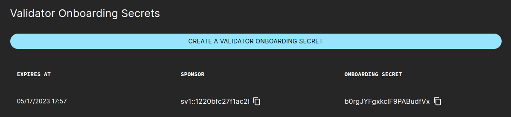

..
   Copyright (c) 2024 Digital Asset (Switzerland) GmbH and/or its affiliates. All rights reserved.
..
   SPDX-License-Identifier: Apache-2.0

.. _sv_operations:

SV Operations
=============

These sections give an overview of some of the functionalities enabled through your SV node
as well as general information useful to SV node operators.

.. _sv_security_notice:

Security Notice
---------------

.. include:: ../common/sv_extra_dars_notice.rst

For more information on hardening your SV node, see :ref:`sv-security`.

.. _generate_onboarding_secret:

Generate a validator onboarding secret
--------------------------------------

If you want to onboard a new validator, you can obtain a one-time use onboarding secret directly from the SV web UI.

The onboarding secret expires after 48 hours.

To generate this key you need to :ref:`login into the SV web UI <local-sv-web-ui>` and navigate to the `Validator Onboarding` tab. In that tab, click on the button to create the secret
and copy the last generated `onboarding secret`.

Using the secret, the validator operator can follow :ref:`this instruction to prepare for validator onboarding <validator-onboarding>`.

.. _sv-identities-overview:

Identities used by SV nodes on different layers
-----------------------------------------------

This section gives a brief overview over some of the most important identities associated with a single SV node,
and for each type of identity: its role and relevance for quorums (if any), under what circumstance it can be reused,
and the implications of losing it (e.g., by loss or compromise of relevant cryptographic keys).

Each identity is relevant on different layers, or within different subsystems, of the Canton & Global Synchronizer software stack.
We strive to reduce coupling between layers, so that in general it is possible to rotate identities independently of each other.

SV identity
+++++++++++

- Used for identifying your node *before* it was onboarded to the system. See :ref:`sv-identity`.

- Established SVs will confirm onboarding requests by SVs that can authenticate themselves with regards to an approved SV identity.

- An SV identity can be reused for multiple onboardings, as long as it's approved by a quorum of established SVs and,
  for non-DevNet clusters, no SV with the same name is already onboarded.

- An operator that has lost control over their SV identity will not be able to onboard SVs
  until a quorum of established SV operators have approved a new identity under the control of that operator.

Participant identities
++++++++++++++++++++++

- Used for securing Daml workflows and for determining an SV's ``svPartyId``,
  which is used for various DSO governance flows as well as for receiving SV rewards.
  For general information on Canton and Daml identities see the `Canton documentation on Identity Management <https://docs.daml.com/canton/usermanual/identity_management.html>`_.
- Participant identities are important for multiple types of quorums

  - Quorums for confirming Daml transactions as the DSO party (>⅓ of onboarded SVs)
  - Quorums for administering the domain topology on behalf of the DSO party (>⅔ of onboarded SVs once activated)
  - Quorums for confirmation-based DSO Daml workflows (>⅔ of onboarded SVs; on DevNet instead usually >½)

  .. TODO(DACH-NY/canton-network-node#7746): remove "once activated"

- In general, participant identities *can't* be reused on the same global synchronizer,
  i.e., without the network being reset/redeployed.

- Loss of control over a participant namespace implies loss of control over the coin balances for all parties hosted under that namespace.
  On a network level, loss of a participant namespace constitutes an SV failure and reduces the overall fault tolerance buffer,
  until the respective SV is offboarded from the DSO.

CometBFT node identities
++++++++++++++++++++++++

- Used within the CometBFT network spanned by SVs for operating the global synchronizer.
  See :ref:`cometbft-identity`.

- The CometBFT validator key is used in CometBFT quorums (>⅔ of SVs),
  which are required for advancing the CometBFT blockchain and changing the CometBFT configuration and validator set.

- Reusing CometBFT node identities can cause (transient) instability in the CometBFT network and is therefore not recommended.

- Compromise of CometBFT key material constitutes an SV failure and reduces the overall fault tolerance buffer.
  For recovering, it is sufficient for an SV operator to set up a new CometBFT node (with a fresh identity)
  and make sure that it is correctly registered by their SV app backend
  (e.g., by amending the configuration of their SV app backend and restarting it).

Updating the reward weight of an SV
-----------------------------------

The following steps are required to update the reward weight of an SV:

#. Receive from the SV owners an agreed-upon update to the SV weights.

#. If the SV whose weight is being adjusted defined `extraBeneficiaries` (as described in :ref:`sv-helm`),
   they will have to update them accordingly. Namely:

   - On weight increases they should add a new entry with the extra weight, as otherwise any leftovers will go to the SV party.

   - On weight decreases, the last extra beneficiary will have their weight capped.

#. Note that you can and usually should update the extra-beneficiaries config before the weight change takes effect.
   The extra entries at the end will just be ignored.

#. Start a governance vote. To do so, create a new vote request in the SV web UI under the `Governance` tab.
   Select the "Update SV Reward Weight" name, then select the SV member and specify the new reward weight.

#. Wait for the vote request to get approved and executed.
   Once that happens, the DSO info tab will show the updated reward weight,
   and the SV will earn rewards according to the new weight moving forward.

#. Make sure that the changed reward is also reflected on `the configs repository <https://github.com/global-synchronizer-foundation/configs>`_.
   Otherwise, the old value would become effective again in the event of an onboarding and reonboarding.

.. _sv-determining-traffic-parameters:

Determining good synchronizer traffic parameters
------------------------------------------------

SVs are responsible for deciding on suitable :ref:`synchronizer traffic parameters <traffic_parameters>`.
In the following we describe ways for determining good values for some of these parameters.

Determining the cost of a single CC transfer
++++++++++++++++++++++++++++++++++++++++++++

As per Canton Improvement Proposal `cip-0042 <https://github.com/global-synchronizer-foundation/cips>`_,
the ``extraTrafficPrice`` should be set so that the cost of a standard CC transfer is 1 USD.
Actual traffic costs change depending on factors such as the size of the DSO (number of SVs) and the Canton protocol version
(so can change also on major upgrades).
It is therefore recommended for SVs to measure current costs periodically and adjust traffic parameters accordingly.

One way to determine the current :ref:`traffic consumption <traffic_accounting>` (in bytes)
of a CC transfer is to initiate a CC transfer and observe sequencer logs corresponding to it.
Based on the assumption that TestNet has the same configuration and DSO size as MainNet,
it is sufficient to conduct this measurement on TestNet.
The suggested specific steps are as follows:

.. this was on TestNet on Feb 24, from validator1 to splitwell

1. Pick two non-SV validators that you control - one will host the sending party the other the receiving party.
   They must be different to not skew the measurement results.
   Control of the recipient is required only to accept the transfer.
2. Initiate a CC transfer from a party hosted on the chosen sender validator to
   a single receiver party hosted on the chosen receiver validator.
   Accept the transfer on the receiver side.
3. Inspect your `validator-app` logs on the `sender` side to confirm that the final transaction of the transfer was
   (a) not batched together with another coin operation and
   (b) had a single coin input.
   You can confirm both of these conditions by looking at the matching log entry of the form:

   .. parsed-literal::

     executing batch AmuletOperationBatch(
       nonMergeOperations = AmuletOperation(
         from = tid:80afc8ae63defcb7a636d2cd23e38c0d,
         op = CO_CompleteAcceptedTransfer(ContractId(00ebc78671f4b5f688d8245a1e0c6c72f378c0c90c7ca574a3c3a615489f3ca15dca1012208d8f9eb3ffe0d0a05b207e2bc3fb3f3e7d31c0b594eaefcfd486411386de775c)),
         priority = Low
       ),
       priority = Low
     ) with inputs Vector(InputAmulet(ContractId(002ace5687dc7f82cb0ca80d2b349a39b1127ffd01db2cd7172053fef88308e6faca1012202646cd3cbb31c78314c3ef22657d4ba6f7f096e90167dcd0d71eba565fa35844)))

   Use  the ``trace-id`` from this log enty's metadata
   (**not** the ``tid`` in view here but from the dedicated ``trace-id`` field on the log entry JSON)
   to confirm that this log entry matches your transfer
   (by searching your logs by the ``trace-id`` to find for entries that contain the full ``AcceptedTransferOffer``, for example).
   Note in this example that (a) there is a single operation in the executed bach and (b) the operation has a single input.
   If this is not true for the transfer you initiated, go back to step 2 and initiate a new transfer,
   as batching or multi-input transfers will skew the measurement results.
4. Search your `validator-app` logs on the `sender` for the ``trace-id`` visible in the previous step.
   The goal is to tie the action here to a ``trace-id`` on the Canton side.
   Search for a log entry of the following form:

   .. parsed-literal::

     Request (tid:43fd8ad332ca637b0c7c1509b2bdf715) com.daml.ledger.api.v2.CommandService/SubmitAndWaitForTransactionTree to participant-1:5001: sending request

   The ``tid`` in this log entry is the ``trace-id`` that you're looking for.
   It will be different from the ``trace-id`` in the log entry metadata
   (that you used to link this log entry to the transfer operation visible above).

5. Search your SV's `sequencer` logs for the ``trace-id`` from the previous step.
   You want to use a log filter along the lines of (all rules here should be concatenated with logical "AND"s):

   .. parsed-literal::

     resource.labels.container_name="sequencer"
     jsonPayload.logger_name="c.d.c.s.t.TrafficConsumedManager:sequencer=sequencer"
     jsonPayload."trace-id"="43fd8ad332ca637b0c7c1509b2bdf715"

6. The resulting log lines contain traffic consumption information about the sender and receiver participants,
   but also about all SV participants.
   (SV participants are stakeholders to all CC transfers.)
   To determine only the traffic consumption of the sender and receiver participants,
   you must filter for the participant IDs of the sender and receiver.
   A simple approach to achieve the correct filtering is to
   filter for parts of the party suffixes of the sender and receiver parties,
   as the suffix (namespace) of a party will typically be identical to that of the participants hosting the party.
   Filtering the resulting log lines for the participant IDs corresponding to the sender and receiver,
   you should get log lines similar to the following:

   .. parsed-literal::

     Consumed 16147 for PAR::sender::...
     Consumed 711 for PAR::receiver::...
     Consumed 1450 for PAR::sender::...

7. Sum up the numbers in the log lines to get the total traffic consumed for the last leg of a CC transfer.
   In this example, the total traffic consumed would be 17597 bytes for the sender and 711 bytes for the receiver.

8. Divide 1 MB by the total traffic consumed for the sender to get the fee that this CC transfer should have incurred in USD
   as per cip-0042.
   In the example given here the cost should have been configured at ``1,000,000 / 6344 = 56.83`` USD / MB,
   i.e., ``extraTrafficPrice = 56.83``.

Considerations around the read scaling factor
+++++++++++++++++++++++++++++++++++++++++++++

For determining a good value for the ``readVsWriteScalingFactor``, consider the following constraints:

Lower bound
^^^^^^^^^^^

The price charged for read traffic should cover the cost for Internet egress and compute incurred for the delivery of messages.
Consider the following example calculation:

- Based on a review of egress cost across major cloud providers, let's assume an average cost of 0.10 USD / GB.
- Let's assume that compute costs will be covered by 10x the egress costs, so 1 USD / GB for compute and 1.1 USD / GB in total.
- Validators read from sequencers in a :term:`BFT` manner, so that, with ``n`` SVs and under normal conditions,
  ``2f+1 = 2 * floor((n-1)/3) + 1`` sequencers will deliver the same message to the same (validator) recipient.
  Let the synchronizer size be ``n = 16`` SVs; then the read amplification factor is 11
  and the cost of message delivery to a single recipient 12.1 USD / GB.
- Let the current ``extraTrafficPrice`` be 60.0 USD / MB, i.e., 60,000 USD / GB.
- The ``readVsWriteScalingFactor`` should be set to a factor of at least ``12.1 / 60,000`` to cover the cost,
  which is around 2 basis points; i.e., ``readVsWriteScalingFactor >= 2``.

Note that for simplicity we assumed here that all recipients are validator participants that use sequencers in the default BFT manner.
This calculation furthermore assumes that messages must be delivered to recipients only once -
an assumption that holds as long as validators and SVs are non-faulty and recipients are not currently recovering from a backup
(which necessitates a replay of some messages).

Upper bound
^^^^^^^^^^^

The delivery of messages is clearly less expensive than their ordering and persistence,
so the ``readVsWriteScalingFactor`` should be clearly below 100%.
That said: There is no good reason to significantly overcharge for message delivery.

.. _sv_ops_ignored_rewards_party_ids:

Ignoring party IDs of stale validators in reward expiry automation
------------------------------------------------------------------

.. note::

  This section describes a workaround that is expected to become unnecessary with improvements
  packaged in Canton 3.4 (Splice > 0.4).

Due to a current limitation, rewards expiry automation that is part of the SV app
(more specifically the ``ExpireRewardCouponsTrigger``) can become faulty
(log warnings or errors, fail to make progress on expiring rewards)
when the following set of conditions applies:

- There was a recent upgrade of core Daml packages, most notably ``amulet``.
- Some validators have not upgraded to a sufficiently recent version of Splice and are therefore unable to apply the Daml upgrade locally
  (and vet the new package versions).

In a nutshell, the expiry automation will fail to expire rewards in such a scenario that are linked to parties hosted on an outdated validator.
To resolve this issue, **each** SV operator is currently asked to follow the following steps on **each Daml upgrade** in the network
(up until the fundamental limitations behind this issue have been resolved in Splice; expected with the upgrade to Canton 3.4):

1. Shortly before the Daml upgrade becomes effective:
   Each SV pauses their ``ExpireRewardCouponsTrigger`` trigger by extending ``.additionalEnvVars`` in ``sv-values.yaml`` in the following way:

   .. code-block:: yaml

      additionalEnvVars:
        - name: ADDITIONAL_CONFIG_PAUSED_EXPIRY_TRIGGER
          value: |
            canton.sv-apps.sv.automation.paused-triggers += "org.lfdecentralizedtrust.splice.sv.automation.delegatebased.ExpireRewardCouponsTrigger"

2. Shortly after the Daml upgrade becomes effective:
   One SV operator :ref:`constructs a party exclusion config <sv_ops_ignored_rewards_party_ids_determine>`,
   confirms its correctness and shares it with the group of all operators.
3. Each SV operator adopts the party exclusion config and resume the ``ExpireRewardCouponsTrigger`` trigger by reverting the change from step 1.
   If ``.additionalEnvVars`` in ``sv-values.yaml`` was empty before step 1, it is now expected to look similar to the following:

   .. code-block:: yaml

      additionalEnvVars:
        - name: ADDITIONAL_CONFIG_IGNORED_EXPIRY_PARTY_IDS
          value: |
            canton.sv-apps.sv {
              automation.ignored-expired-rewards-party-ids = [ "party1::12345", "party2:57890" ]
            }

Updates to the party exclusion config are possible at future points in time,
e.g., in case validators that were previously outdated eventually upgrade to a sufficiently recent Splice version.

.. _sv_ops_ignored_rewards_party_ids_determine:

Determining parties to ignore
+++++++++++++++++++++++++++++

The process to determine the right parties to ignore is advanced and likely to involve some trial-and-error.
It is sufficient for a single operator to perform this work and arrive at a suitable config.

In the following we list complimentary approaches for building the list of parties.

Prerequisite steps:

1. Wait until the new Daml upgrade has already become effective.
2. Pick a round that was open shortly after the Daml upgrade became effective (to aid database queries); we will denote this round as ``UPGRADE_ROUND`` in the following.
3. Resume the expiry trigger (accepting that it will fail until you have completed the ignore list).
4. Set ``delegatelessAutomationExpiredRewardCouponBatchSize: 1`` in your ``sv-values.yaml``.

Based on that:

- You can wait until the trigger fails, then investigate which parties are involved in the failing transaction and add these to the set of parties to ignore.
- For a more quick feedback loop, you can attempt queries against the SV app (postgres) database.
  For example, you can list receivers of rewards that were not expired since the Daml upgrade:

  .. code-block:: sql

      select distinct(reward_party) from dso_acs_store where reward_round < UPGRADE_ROUND;

  Note however that this query overapproximates the set of parties to ignore, so you might need to remove some parties again later.

- If one of the parties you want to ignore is an SV, you most likely want to ignore the beneficiary of that SV instead
  (or even better - talk to the SV's operator to make sure their beneficiary upgrades to a more recent version).
- Once you are confident in the set of parties to ignore, remove the ``delegatelessAutomationExpiredRewardCouponBatchSize`` override and confirm that the
  trigger has a 100% success rate and does not log any warnings or errors.
- If outdated validators eventually follow up on upgrading, their parties should be removed again from the ignore list to allow the
  archival of expired rewards (both old and new) as well as to avoid blocking the archival of closed mining rounds.
  The following database query shows expired rewards that were generated *after* the Daml upgrade,
  which is an indicator that the hosting validator has upgraded and so these parties should not be ignored anymore:

  .. code-block:: sql

     select m.template_id_qualified_name, m.reward_party, min(m.reward_round) from (
       select c.reward_party, c.reward_round, c.template_id_qualified_name from dso_acs_store c
       join dso_acs_store r
       on r.mining_round = c.reward_round
       and r.mining_round > UPGRADE_ROUND
       and r.template_id_qualified_name = 'Splice.Round:ClosedMiningRound'
     ) as m group by (template_id_qualified_name, reward_party);
