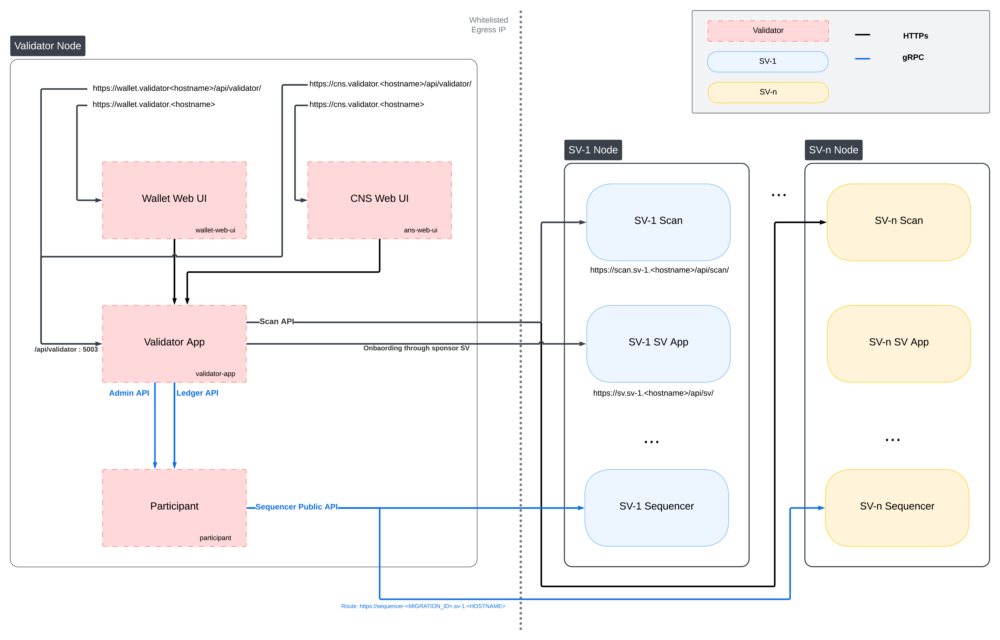
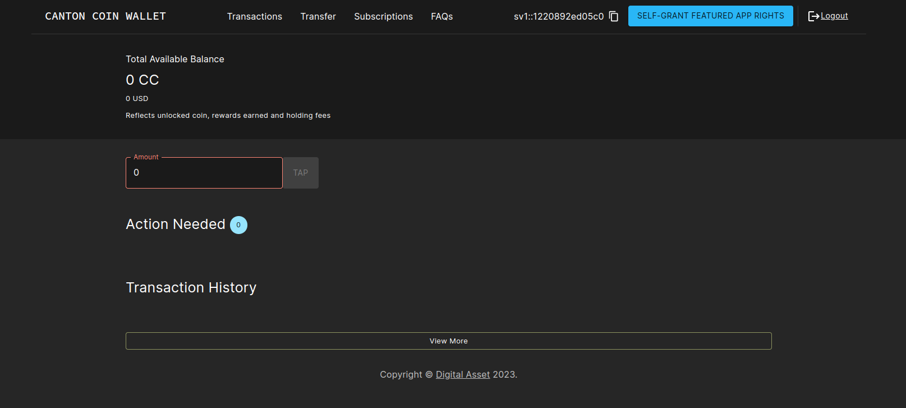
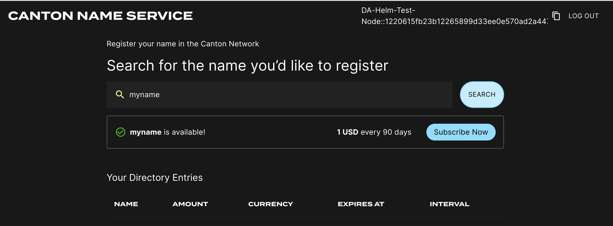

..
   Copyright (c) 2024 Digital Asset (Switzerland) GmbH and/or its affiliates. All rights reserved.
..
   SPDX-License-Identifier: Apache-2.0

.. _k8s_validator:

Kubernetes-Based Deployment of a Validator node
===============================================

This section describes how to deploy a standalone validator node in Kubernetes using Helm charts. The Helm charts deploy a validator node along with associated wallet and CNS UIs, and connect it to a global synchronizer.

.. _validator_prerequisites:

Requirements
------------

1) A running Kubernetes cluster in which you have administrator access to create and manage namespaces.
2) A development workstation with the following:

    a. ``kubectl`` - At least v1.26.1
    b. ``helm`` - At least v3.11.1

3) Your cluster needs a static egress IP. After acquiring that, provide it to your SV sponsor who will propose
   adding it to the IP allowlist to the other SVs.

4) Please download the release artifacts containing the sample Helm value files, from here: |bundle_download_link|, and extract the bundle:

.. parsed-literal::

  tar xzvf |version|\_splice-node.tar.gz

.. include:: ../common/backup_suggestion.rst

.. include:: required_network_parameters.rst

TRUSTED_SCAN_URL
    The scan URL of an SV that you trust and that is reachable by your validator, often your SV sponsor. This should be of the form |generic_scan_url|,
    e.g., for the Global Synchronizer Foundation SV it is |gsf_scan_url|.

Additional parameters describing your own setup as opposed to the connection to the network are described below.

.. _validator-network-diagram:

Validator Network Diagram
-------------------------

..
   _LucidChart link: https://lucid.app/lucidchart/46af6ed2-25b8-4608-88f7-66fc19674fce/edit?viewport_loc=-5217%2C-3874%2C6157%2C3382%2C0_0&invitationId=inv_fc3a3c02-e9fd-4ca9-9388-8defdfaa7153

.. _validator-identity-token:

Preparing a Cluster for Installation
------------------------------------

Create the application namespace within Kubernetes.

.. code-block:: bash

    kubectl create ns validator

.. note::

    The validator deployment assumes one validator per namespace.
    If you wish to run multiple validators in the same cluster, please create a separate namespace for each.

.. _validator-http-proxy-helm:

HTTP Proxy configuration
------------------------

If you need to use an HTTP forward proxy for egress in your environment, you need to set ``https.proxyHost`` and ``https.proxyPort``
in ``additionalJvmOptions`` in the validator and participant helm charts to use the HTTP proxy for outgoing connections:

.. code-block:: yaml

  additionalJvmOptions: |
    -Dhttps.proxyHost=your.proxy.host
    -Dhttps.proxyPort=your_proxy_port

Replace ``your.proxy.host`` and ``your_proxy_port`` with the actual host and port of your HTTP proxy.
You can set ``https.nonProxyHosts`` as well to prevent proxying for particular addresses.
Proxy authentication is currently not supported.

.. _validator-postgres-auth:

Configuring PostgreSQL authentication
-------------------------------------

The PostgreSQL instance that the helm charts create, and all apps that depend on it, require the user's password to be set through Kubernetes secrets.
Currently, all apps use the Postgres user ``cnadmin``.
The password can be setup with the following command, assuming you set the environment variable ``POSTGRES_PASSWORD`` to a secure value:

.. todo:: call out the option of using a managed postgres instance

.. code-block:: bash

    kubectl create secret generic postgres-secrets \
        --from-literal=postgresPassword=${POSTGRES_PASSWORD} \
        -n validator

.. _validator-onboarding:

Preparing for Validator Onboarding
----------------------------------

Ensure that your validator onboarding secret ``ONBOARDING_SECRET`` is set in the namespace you created earlier.

.. code-block:: bash

    kubectl create secret generic splice-app-validator-onboarding-validator \
        "--from-literal=secret=${ONBOARDING_SECRET}" \
        -n validator

.. _helm-validator-auth:

Configuring Authentication
--------------------------

For security, the various components that comprise your Validator node need to be able to authenticate themselves to each other,
as well as be able to authenticate external UI and API users.
We use JWT access tokens for authentication and expect these tokens to be issued by an (external) `OpenID Connect <https://openid.net/connect/>`_ (OIDC) provider.
You must:

1. Set up an OIDC provider in such a way that both backends and web UI users are able to obtain JWTs in a supported form.

2. Configure your backends to use that OIDC provider.

The validator supports non-authenticated deployments as well, but this is strongly discouraged for production deployments.
If you wish to run without authentication, please refer to the notes in :ref:`helm-validator-no-auth`.

.. _helm-validator-auth-requirements:

OIDC Provider Requirements
++++++++++++++++++++++++++

This section provides pointers for setting up an OIDC provider for use with your Validator node.
Feel free to skip directly to :ref:`helm-validator-auth0` if you plan to use `Auth0 <https://auth0.com>`_ for your Validator node's authentication needs.

These docs focus on Auth0, and are being continuously tested and maintained. Other OIDC providers can be used, and are in active use by various community members, who have contributed some notes and examples in `Okta and Keycloak community authored examples </community/oidc-config-okta-keycloak.html>`.

Your OIDC provider must be reachable [#reach]_ at a well known (HTTPS) URL.
In the following, we will refer to this URL as ``OIDC_AUTHORITY_URL``.
Both your Validator node and any users that wish to authenticate to a web UI connected to your Validator node must be able to reach the ``OIDC_AUTHORITY_URL``.
We require your OIDC provider to provide a `discovery document <https://openid.net/specs/openid-connect-discovery-1_0.html>`_ at ``OIDC_AUTHORITY_URL/.well-known/openid-configuration``.
We furthermore require that your OIDC provider exposes a `JWK Set <https://datatracker.ietf.org/doc/html/rfc7517>`_ document.
In this documentation, we assume that this document is available at ``OIDC_AUTHORITY_URL/.well-known/jwks.json``.

For machine-to-machine (Validator node component to Validator node component) authentication,
your OIDC provider must support the `OAuth 2.0 Client Credentials Grant <https://tools.ietf.org/html/rfc6749#section-4.4>`_ flow.
This means that you must be able to configure (`CLIENT_ID`, `CLIENT_SECRET`) pairs for all Validator node components that need to authenticate themselves to other components.
Currently, this is the validator app backend - which needs to authenticate to the Validator node's Canton participant.
The `sub` field of JWTs issued through this flow must match the user ID configured as ``ledger-api-user`` in :ref:`helm-validator-auth-secrets-config`.
In this documentation, we assume that the `sub` field of these JWTs is formed as ``CLIENT_ID@clients``.
If this is not true for your OIDC provider, pay extra attention when configuring ``ledger-api-user`` values below.

For user-facing authentication - allowing users to access the various web UIs hosted on your Validator node,
your OIDC provider must support the `OAuth 2.0 Authorization Code Grant <https://datatracker.ietf.org/doc/html/rfc6749#section-4.1>`_ flow
and allow you to obtain client identifiers for the web UIs your Validator node will be hosting.
Currently, these are the Wallet web UI and the CNS web UI.
You might be required to whitelist a range of URLs on your OIDC provider, such as "Allowed Callback URLs", "Allowed Logout URLs", "Allowed Web Origins", and "Allowed Origins (CORS)".
If you are using the ingress configuration of this runbook, the correct URLs to configure here are
``https://wallet.validator.YOUR_HOSTNAME`` (for the Wallet web UI) and
``https://cns.validator.YOUR_HOSTNAME`` (for the CNS web UI).

``YOUR_HOSTNAME`` is a placeholder that you need to replace with the actual domain name or IP address of the server hosting your services.

An identifier that is unique to the user must be set via the `sub` field of the issued JWT.
On some occasions, this identifier will be used as a user name for that user on your Validator node's Canton participant.
In :ref:`helm-validator-install`, you will be required to configure a user identifier as the ``validatorWalletUser`` -
make sure that whatever you configure there matches the contents of the `sub` field of JWTs issued for that user.

*All* JWTs issued for use with your Validator node:

- must be signed using the RS256 signing algorithm

In the future, your OIDC provider might additionally be required to issue JWTs with a ``scope`` explicitly set to ``daml_ledger_api``
(when requested to do so as part of the OAuth 2.0 authorization code flow).

Summing up, your OIDC provider setup must provide you with the following configuration values:

======================= ===========================================================================
Name                    Value
----------------------- ---------------------------------------------------------------------------
OIDC_AUTHORITY_URL      The URL of your OIDC provider for obtaining the ``openid-configuration`` and ``jwks.json``.
VALIDATOR_CLIENT_ID     The client id of your OIDC provider for the validator app backend.
VALIDATOR_CLIENT_SECRET The client secret of your OIDC provider for the validator app backend.
WALLET_UI_CLIENT_ID     The client id of your OIDC provider for the wallet UI.
CNS_UI_CLIENT_ID        The client id of your OIDC provider for the CNS UI.
======================= ===========================================================================

We are going to use these values, exported to environment variables named as per the `Name` column, in :ref:`helm-validator-auth-secrets-config` and :ref:`helm-validator-install`.

When first starting out, it is suggested to configure both JWT token audiences below to the same value: ``https://canton.network.global``.

Once you can confirm that your setup is working correctly using this (simple) default,
we recommend that you configure dedicated audience values that match your deployment and URLs.
This is important for security to avoid tokens for your validators on one network be usable for your validators on another network.
You can configure audiences of your choice for the participant ledger API and the validator backend API.
We will refer to these using the following configuration values:

==================================== ===========================================================================
Name                                 Value
------------------------------------ ---------------------------------------------------------------------------
OIDC_AUTHORITY_LEDGER_API_AUDIENCE   The audience for the participant ledger API. e.g. ``https://ledger_api.example.com``
OIDC_AUTHORITY_VALIDATOR_AUDIENCE    The audience for the validator backend API. e.g. ``https://validator.example.com/api``
==================================== ===========================================================================

Your IAM may also require a scope to be specified when the validator backend requests a token for the ledger API. We will refer to that using the following configuration value:

==================================== ===========================================================================
Name                                 Value
------------------------------------ ---------------------------------------------------------------------------
OIDC_AUTHORITY_LEDGER_API_SCOPE      The scope for the participant ledger API. Optional
==================================== ===========================================================================

In case you are facing trouble with setting up your (non-Auth0) OIDC provider,
it can be beneficial to skim the instructions in :ref:`helm-validator-auth0` as well, to check for functionality or configuration details that your OIDC provider setup might be missing.

.. [#reach] The URL must be reachable from the Canton participant and validator app running in your cluster, as well as from all web browsers that should be able to interact with the wallet and CNS UIs.

    .. TODO(DACH-NY/canton-network-internal#502) use a unique audience for each app

.. _helm-validator-auth0:

Configuring an Auth0 Tenant
+++++++++++++++++++++++++++

To configure `Auth0 <https://auth0.com>`_ as your validator's OIDC provider, perform the following:

1. Create an Auth0 tenant for your validator
2. Create an Auth0 API that controls access to the ledger API:

    a. Navigate to Applications > APIs and click "Create API". Set name to ``Daml Ledger API``,
       set identifier to ``https://canton.network.global``.
       Alternatively, if you would like to configure your own audience, you can set the identifier here. e.g. ``https://ledger_api.example.com``.
    b. Under the Permissions tab in the new API, add a permission with scope ``daml_ledger_api``, and a description of your choice.
    c. On the Settings tab, scroll down to "Access Settings" and enable "Allow Offline Access", for automatic token refreshing.

3. (Optional) If you want to configure a different audience to your APIs, you can do so by creating new Auth0 APIs with an identifier set to the audience of your choice. For example,

    a. Create another API by setting name to ``Validator App API``,
       set identifier for the Validator backend app e.g. ``https://validator.example.com/api``.

4. Create an Auth0 Application for the validator backend:

    a. In Auth0, navigate to Applications -> Applications, and click the "Create Application" button.
    b. Name it ``Validator app backend``, choose "Machine to Machine Applications", and click Create.
    c. Choose the ``Daml Ledger API`` API you created in step 2 in the "Authorize Machine to Machine Application" dialog and click Authorize.

5. Create an Auth0 Application for the wallet web UI.

    a. In Auth0, navigate to Applications -> Applications, and click the "Create Application" button.
    b. Choose "Single Page Web Applications", call it ``Wallet web UI``, and click Create.
    c. Determine the URL for your validator's wallet UI.
       If you're using the ingress configuration of this runbook, that would be ``https://wallet.validator.YOUR_HOSTNAME``.
    d. In the Auth0 application settings, add the URL of the validator wallet to the following:

       - "Allowed Callback URLs"
       - "Allowed Logout URLs"
       - "Allowed Web Origins"
       - "Allowed Origins (CORS)"
    e. Save your application settings.

6. Create an Auth0 Application for the CNS web UI.
   Repeat all steps described in step 5, with following modifications:

   - In step b, use ``CNS web UI`` as the name of your application.
   - In steps c and d, use the URL for your validator's *CNS* UI.
     If you're using the ingress configuration of this runbook, that would be ``https://cns.validator.YOUR_HOSTNAME``.

Please refer to Auth0's `own documentation on user management <https://auth0.com/docs/manage-users>`_ for pointers on how to set up end-user accounts for the two web UI applications you created.
Note that you will need to create at least one such user account for completing the steps in :ref:`helm-validator-install` - for being able to log in as your Validator node's administrator.
You will be asked to obtain the user identifier for this user account.
It can be found in the Auth0 interface under User Management -> Users -> your user's name -> user_id (a field right under the user's name at the top).

We will use the environment variables listed in the table below to refer to aspects of your Auth0 configuration:

================================== ===========================================================================
Name                               Value
---------------------------------- ---------------------------------------------------------------------------
OIDC_AUTHORITY_URL                 ``https://AUTH0_TENANT_NAME.us.auth0.com``
OIDC_AUTHORITY_LEDGER_API_AUDIENCE The optional audience of your choice for Ledger API. e.g. ``https://ledger_api.example.com``
VALIDATOR_CLIENT_ID                The client id of the Auth0 app for the validator app backend
VALIDATOR_CLIENT_SECRET            The client secret of the Auth0 app for the validator app backend
WALLET_UI_CLIENT_ID                The client id of the Auth0 app for the wallet UI
CNS_UI_CLIENT_ID                   The client id of the Auth0 app for the CNS UI
================================== ===========================================================================

The ``AUTH0_TENANT_NAME`` is the name of your Auth0 tenant as shown at the top left of your Auth0 project.
You can obtain the client ID and secret of each Auth0 app from the settings pages of that app.

.. _helm-validator-auth-secrets-config:

Configuring Authentication on your Validator
++++++++++++++++++++++++++++++++++++++++++++

We are now going to configure your Validator node software based on the OIDC provider configuration values you exported to environment variables at the end of either :ref:`helm-validator-auth-requirements` or :ref:`helm-validator-auth0`.
(Note that some authentication-related configuration steps are also included in :ref:`helm-validator-install`)

The validator app backend requires the following secret (omit the scope if it is not needed in your setup)

.. code-block:: bash

    kubectl create --namespace validator secret generic splice-app-validator-ledger-api-auth \
        "--from-literal=ledger-api-user=${VALIDATOR_CLIENT_ID}@clients" \
        "--from-literal=url=${OIDC_AUTHORITY_URL}/.well-known/openid-configuration" \
        "--from-literal=client-id=${VALIDATOR_CLIENT_ID}" \
        "--from-literal=client-secret=${VALIDATOR_CLIENT_SECRET}" \
        "--from-literal=audience=${OIDC_AUTHORITY_LEDGER_API_AUDIENCE}" \
        "--from-literal=scope=${OIDC_AUTHORITY_LEDGER_API_SCOPE}"

To setup the wallet and CNS UI, create the following two secrets.

.. code-block:: bash

    kubectl create --namespace validator secret generic splice-app-wallet-ui-auth \
        "--from-literal=url=${OIDC_AUTHORITY_URL}" \
        "--from-literal=client-id=${WALLET_UI_CLIENT_ID}"

    kubectl create --namespace validator secret generic splice-app-cns-ui-auth \
        "--from-literal=url=${OIDC_AUTHORITY_URL}" \
        "--from-literal=client-id=${CNS_UI_CLIENT_ID}"

.. _helm-validator-no-auth:

Running without Authentication
++++++++++++++++++++++++++++++

.. warning::

  Running without authentication is highly insecure. Anyone with access to the wallet UI,
  or to the validator in any other way, may log in to your wallet as a user of their choice,
  or otherwise transact on-ledger on your behalf. For any production use, you should configure
  proper authentication as described in the sections above.

In order to run the validator without authentication, add ``disableAuth: true`` to both
``splice-node/examples/sv-helm/validator-values.yaml`` and ``splice-node/examples/sv-helm/participant-values.yaml``.
Note that you must disable auth in both places, otherwise the validator will not be able to connect to the participant.

When running without authentication, the username of the validator administrator
is `administrator`.

.. _helm-validator-install:

Installing the Software
-----------------------

Configuring the Helm Charts
+++++++++++++++++++++++++++

To install the Helm charts needed to start a Validator node connected to the
cluster, you will need to meet a few preconditions. The first is that
there needs to be an environment variable defined to refer to the
version of the Helm charts necessary to connect to this environment:

|chart_version_set|

Please modify the file ``splice-node/examples/sv-helm/participant-values.yaml`` as follows:

- Replace ``OIDC_AUTHORITY_LEDGER_API_AUDIENCE`` in the `auth.targetAudience` entry with audience for the ledger API. e.g. ``https://ledger_api.example.com``. If you are not ready to use a custom audience, you can use the suggested default ``https://canton.network.global``.
- Update the `auth.jwksUrl` entry to point to your auth provider's JWK set document by replacing ``OIDC_AUTHORITY_URL`` with your auth provider's OIDC URL, as explained above.
- If you are running on a version of Kubernetes earlier than 1.24, set `enableHealthProbes` to `false` to disable the gRPC liveness and readiness probes.

If you are using the provided postgres helm chart, modify ``splice-node/examples/sv-helm/postgres-values-validator-participant.yaml`` as follows:

- Add ``db.volumeSize`` and ``db.volumeStorageClass`` to the values file adjust persistant storage size and storage class if necessary. (These values default to 20GiB and ``standard-rwo``)

Additionally, please modify the file ``splice-node/examples/sv-helm/standalone-participant-values.yaml`` as follows:

- Replace ``MIGRATION_ID`` with the migration ID of the global synchronizer on the network you are connecting to (devnet/testnet/mainnet).

To configure the validator app, please modify the file ``splice-node/examples/sv-helm/validator-values.yaml`` as follows:

- Replace ``TRUSTED_SCAN_URL`` with a URL of a Scan you host or trust that is reachable by your Validator. For example, the GSF scan URL, |gsf_scan_url|
  (This Scan instance will be used for obtaining additional Scan URLs for BFT Scan reads.)
- If you want to configure the audience for the Validator app backend API, replace ``OIDC_AUTHORITY_VALIDATOR_AUDIENCE`` in the `auth.audience` entry with audience for the Validator app backend API. e.g. ``https://validator.example.com/api``.
- If you want to configure the audience for the Ledger API, set the ``audience`` field in the `splice-app-validator-ledger-api-auth` k8s secret with the audience for the Ledger API. e.g. ``https://ledger_api.example.com``.
- Replace ``OPERATOR_WALLET_USER_ID`` with the user ID in your IAM that you want to use to log into the wallet as the validator operator party. Note that this should be the full user id, e.g., ``auth0|43b68e1e4978b000cefba352``, *not* only the suffix ``43b68e1e4978b000cefba352``
- Replace ``YOUR_CONTACT_POINT`` by a slack user name or email address that can be used by node operators to contact you in case there are issues with your node. Note that this contact information will be publicly visible. If you do not want to share contact information, you can put an empty string.
- Update the `auth.jwksUrl` entry to point to your auth provider's JWK set document by replacing ``OIDC_AUTHORITY_URL`` with your auth provider's OIDC URL, as explained above.

If you want to only connect to a single trusted scan at ``TRUSTED_SCAN_URL`` but not obtain additional Scan URLs for BFT Scan reads,
you can uncomment the following and set ``nonSvValidatorTrustSingleScan`` to ``true``.
This does mean that you depend on that single SV and if it is broken or malicious you will be unable to use the network so usually you want to default to not enabling this.

.. literalinclude:: ../../../apps/app/src/pack/examples/sv-helm/validator-values.yaml
    :language: yaml
    :start-after: TRUSTED_SINGLE_SCAN_START
    :end-before: TRUSTED_SINGLE_SCAN_END

If you want to connect to the decentralized synchronizer via only a single trusted sequencer,
you can uncomment the following and set ``useSequencerConnectionsFromScan`` to ``false``. Also replace ``TRUSTED_SYNCHRONIZER_SEQUENCER_URL`` with the publicly accessible URL of the trusted sequencer,
e.g., |gsf_sequencer_url| for the sequencer operated by the GSF.
This does mean that you depend on that single SV and if it is broken or malicious you will be unable to use the network so usually you want to default to not enabling this.

.. literalinclude:: ../../../apps/app/src/pack/examples/sv-helm/validator-values.yaml
    :language: yaml
    :start-after: TRUSTED_SINGLE_SEQUENCER_START
    :end-before: TRUSTED_SINGLE_SEQUENCER_END

Additionally, please modify the file ``splice-node/examples/sv-helm/standalone-validator-values.yaml`` as follows:

- Replace ``MIGRATION_ID`` with the migration ID of the global synchronizer on the network you are connecting to.
- Replace ``SPONSOR_SV_URL`` with the URL of the SV that provided you your secret.
- Replace ``YOUR_VALIDATOR_PARTY_HINT`` with the desired name for your
  validator operator party. It must be of the format
  ``<organization>-<function>-<enumerator>``.
- Replace ``YOUR_VALIDATOR_NODE_NAME`` with the name you want your validator node to be represented as on the network. Usually you can use the same value as for your ``validatorPartyHint``.

If you are redeploying the validator app as part of a :ref:`synchronizer migration <validator-upgrades>`, you will also need to set ``migrating`` to ``true`` in your ``standalone-validator-values.yaml``:

.. literalinclude:: ../../../apps/app/src/pack/examples/sv-helm/standalone-validator-values.yaml
    :language: yaml
    :start-after: MIGRATION_START
    :end-before: MIGRATION_END

Finally, please download the UI config values file from
https://github.com/global-synchronizer-foundation/configs/blob/main/configs/ui-config-values.yaml
and add the values from it to your ``standalone-validator-values.yaml``.

.. _validator-helm-charts-install:

Installing the Helm Charts
++++++++++++++++++++++++++

With these files in place, you can execute the following helm commands
in sequence. It's generally a good idea to wait until each deployment
reaches a stable state prior to moving on to the next step.

.. parsed-literal::

    helm install postgres |helm_repo_prefix|/splice-postgres -n validator --version ${CHART_VERSION} -f splice-node/examples/sv-helm/postgres-values-validator-participant.yaml --wait
    helm install participant |helm_repo_prefix|/splice-participant -n validator --version ${CHART_VERSION} -f splice-node/examples/sv-helm/participant-values.yaml -f splice-node/examples/sv-helm/standalone-participant-values.yaml --wait
    helm install validator |helm_repo_prefix|/splice-validator -n validator --version ${CHART_VERSION} -f splice-node/examples/sv-helm/validator-values.yaml -f splice-node/examples/sv-helm/standalone-validator-values.yaml --wait

Once this is running, you should be able to inspect the state of the
cluster and observe pods running in the new
namespace. A typical query might look as follows:

.. code-block:: bash

    $ kubectl get pods -n validator
    NAMESPACE         NAME                                  READY   STATUS             RESTARTS        AGE
    validator         ans-web-ui-5bf489db78-bdn2j           1/1     Running            0               24m
    validator         participant-8988dfb54-m9655           1/1     Running            0               26m
    validator         postgres-0                            1/1     Running            0               37m
    validator         validator-app-f8c74d5dd-zf9j4         1/1     Running            0               24m
    validator         wallet-web-ui-69d85cdb99-fnj7q        1/1     Running            0               24m

Note also that ``Pod`` restarts may happen during bringup,
particularly if all helm charts are deployed at the same time. For example, the
``participant`` cannot start until ``postgres`` is running.

.. _helm-validator-ingress:

Configuring the Cluster Ingress
-------------------------------

The following routes should be configured in your cluster ingress
controller.

====================== ============ ===========================================================================
Services               Port         Routes
---------------------- ------------ ---------------------------------------------------------------------------
``wallet-web-ui``                   ``https://wallet.validator.<YOUR_HOSTNAME>``
``validator-app``      5003         ``https://wallet.validator.<YOUR_HOSTNAME>/api/validator``
``ans-web-ui``                      ``https://cns.validator.<YOUR_HOSTNAME>``
``validator-app``      5003         ``https://cns.validator.<YOUR_HOSTNAME>/api/validator``
``participant``        7575         ``https://<YOUR_HOSTNAME>/api/json-api`` (optional, not required by the validator itself but if you want to access the ledger API yourself. You can change the route freely)
====================== ============ ===========================================================================

* ``https://wallet.validator.<YOUR_HOSTNAME>`` should be routed to service ``wallet-web-ui`` in the ``validator`` namespace
* ``https://wallet.validator.<YOUR_HOSTNAME>/api/validator`` should be routed to ``/api/validator`` at port 5003 of service ``validator-app`` in the ``validator`` namespace
* ``https://cns.validator.<YOUR_HOSTNAME>`` should be routed to service ``ans-web-ui`` in the ``validator`` namespace
* ``https://cns.validator.<YOUR_HOSTNAME>/api/validator`` should be routed to ``/api/validator`` at port 5003 of service ``validator-app`` in the ``validator`` namespace

.. warning::

  To keep the attack surface on your validator deployment small,
  please disallow ingress connections to all other services in your validator deployment.
  It should be assumed that opening up *any* additional port or service represents a security risk that needs to be carefully evaluated on a case-by-case basis.
  In addition, it is recommended to restrict access to above services to a limited number of explicitly trusted IP address ranges.

Internet ingress configuration is often specific to the network configuration and scenario of the
cluster being configured. To illustrate the basic requirements of a Validator node ingress, we have
provided a Helm chart that configures ingress according to the routes above using Istio, as detailed in the sections below.

Requirements
++++++++++++

In order to install the reference charts, the following must be satisfied in your cluster:

* *cert-manager* must be available in the cluster (See `cert-manager documentation <https://cert-manager.io/docs/installation/helm/>`_)
* *istio* should be installed in the cluster (See `istio documentation <https://istio.io/latest/docs/setup/>`_)

*Note that their deployments are often platform-dependent and good documentations on how to set them up can be found online.*

**Example of Istio installation:**

.. code-block:: bash

    helm repo add istio https://istio-release.storage.googleapis.com/charts
    helm repo update
    helm install istio-base istio/base -n istio-system --set defaults.global.istioNamespace=cluster-ingress --wait
    helm install istiod istio/istiod -n cluster-ingress --set global.istioNamespace="cluster-ingress" --set meshConfig.accessLogFile="/dev/stdout"  --wait

Installation Instructions
+++++++++++++++++++++++++

Create a `cluster-ingress` namespace:

.. code-block:: bash

    kubectl create ns cluster-ingress

Ensure that there is a cert-manager certificate available in a secret
named ``cn-net-tls``.  An example of a suitable certificate
definition:

.. code-block:: yaml

    apiVersion: cert-manager.io/v1
    kind: Certificate
    metadata:
       name: cn-certificate
       namespace: cluster-ingress
    spec:
        dnsNames:
        - '*.validator.YOUR_HOSTNAME'
        issuerRef:
            name: letsencrypt-production
        secretName: cn-net-tls

Create a file named ``istio-gateway-values.yaml`` with the following content
(Tip: on GCP you can get the cluster IP from ``gcloud compute addresses list``):

.. code-block:: yaml

    service:
        loadBalancerIP: "YOUR_CLUSTER_IP"
        loadBalancerSourceRanges:
            - "35.194.81.56/32"
            - "35.198.147.95/32"
            - "35.189.40.124/32"
            - "34.132.91.75/32"

And install it to your cluster:

.. code-block:: bash

    helm install istio-ingress istio/gateway -n cluster-ingress -f istio-gateway-values.yaml

Create an Istio Gateway resource in the `cluster-ingress` namespace. Save the following to a file named `gateway.yaml`,
and replace ``YOUR_HOSTNAME`` with the actual hostname you want to use for your validator node
(and has a DNS record pointing to the cluster IP you configured above):

.. code-block:: yaml

    apiVersion: networking.istio.io/v1alpha3
    kind: Gateway
    metadata:
      name: cn-http-gateway
      namespace: cluster-ingress
    spec:
      selector:
        app: istio-ingress
        istio: ingress
      servers:
      - port:
          number: 443
          name: https
          protocol: HTTPS
        tls:
          mode: SIMPLE
          credentialName: cn-net-tls # name of the secret created above
        hosts:
        - "*.YOUR_HOSTNAME"
        - "YOUR_HOSTNAME"
      - port:
          number: 80
          name: http
          protocol: HTTP
        tls:
          httpsRedirect: true
        hosts:
        - "*.YOUR_HOSTNAME"
        - "YOUR_HOSTNAME"

And apply it to your cluster:

.. code-block:: bash

    kubectl apply -f gateway.yaml -n cluster-ingress

This gateway terminates tls using the secret that you configured above, and exposes raw http traffic in its outbound port 443.
Istio VirtualServices can now be created to route traffic from there to the required pods within the cluster.
A reference Helm chart is provided for that, which can be installed after

1. replacing ``YOUR_HOSTNAME`` in ``splice-node/examples/sv-helm/validator-cluster-ingress-values.yaml`` and
2. setting ``nameServiceDomain`` in the same file to ``"cns"``

using:

.. parsed-literal::

    helm install cluster-ingress-validator |helm_repo_prefix|/splice-cluster-ingress-runbook -n validator --version ${CHART_VERSION} -f splice-node/examples/sv-helm/validator-cluster-ingress-values.yaml

.. _helm-validator-wallet-ui:

Logging into the wallet UI
--------------------------

After you deploy your ingress, open your browser at
https://wallet.validator.YOUR_HOSTNAME and login using the
credentials for the user that you configured as
``validatorWalletUser`` earlier.
Once logged in one should see the transactions page.

.. todo:: explain the config sections below in a way that makes them also accessible to the Docker compose users

.. _helm_validator_topup:

Configuring automatic traffic purchases
---------------------------------------

By default your node will be configured to automatically purchase :ref:`traffic <traffic>` on a pay-as-you-go basis
(see :ref:`automatically purchase traffic <traffic_topup>`).
To disable or tune to your needs, edit the following section in the validator-values.yaml file:

.. literalinclude:: ../../../apps/app/src/pack/examples/sv-helm/standalone-validator-values.yaml
    :language: yaml
    :start-after: CONFIGURING_TOPUP_START
    :end-before: CONFIGURING_TOPUP_END

.. include:: ../common/traffic_topups.rst

.. todo::
    * show error message that people will see while the traffic purchase fails due to insufficient funds;
      it is currentlye here: :ref:`error-insufficient-funds`
    * link to the option to disable automatic top-ups, and call out the option of using third-party traffic providers

Configuring sweeps and auto-accepts of transfer offers
------------------------------------------------------

You can optionally configure the validator to automatically create transfer offers
to other parties on the network whenever the balance of certain parties that it hosts
exceeds a certain threshold. To do so, uncomment and fill in the following section
in the ``validator-values.yaml`` file:

.. literalinclude:: ../../../apps/app/src/pack/examples/sv-helm/validator-values.yaml
    :language: yaml
    :start-after: SWEEP_START
    :end-before: SWEEP_END

Whenever the balance of `<senderPartyID>` exceeds `maxBalanceUSD`, the validator
will automatically create a transfer offer to `<receiverPartyId>`, for an amount that
leaves `minBalanceUSD` in the sender's wallet. Note that you will need to know the
party IDs of both the sender and receiver, which can be copied from the wallet UIs
of the respective users (in the top right corner). This therefore needs to be applied
to the Helm chart in a second step after the initial deployment, once the party IDs are known.

Similarly, you can configure the validator to automatically accept transfer offers
from certain parties on the network. To do so, uncomment and fill in the following section
in the ``validator-values.yaml`` file:

.. literalinclude:: ../../../apps/app/src/pack/examples/sv-helm/validator-values.yaml
    :language: yaml
    :start-after: AUTO_ACCEPT_START
    :end-before: AUTO_ACCEPT_END

Whenever the validator receives a transfer offer from `<senderPartyID>` to `<receiverPartyId>`,
it will automatically accept it. Similarly to sweeps, party IDs must be known in order to
apply this configuration.

.. _helm-validator-ans-web-ui:

Logging into the CNS UI
-----------------------------

You can open your browser at
https://cns.validator.YOUR_HOSTNAME and login using the
credentials for the user that you configured as
``validatorWalletUser`` earlier. You will be able to register a name on the
Canton Name Service.

.. _validator_participant_pruning:

Participant Pruning
-------------------

By default, participants preserve all history (it is not preserved
across :ref:`major upgrades <validator-upgrades>` though). However, this leads to
gradually growing databases and can slow down certain queries, in
particular, queries for the active contract set on the ledger API.

To mitigate that, it is possible to enable participant pruning which
will remove all history beyond a specified retention point and only
preserve the active contract set.

Note that this only affects the participant stores. The CN apps
(Validator, SV and Scan) are unaffected by enabling this, so e.g., the
history in your wallet will never be pruned.

Below you can see an example of the pruning config that you need to
add to ``validator-values.yaml`` to retain only the history for the
last 48h.

Note that if your node is down for longer than the pruning
window (48 hours in the example above), your node will most probably get corrupted,
as the apps race catching up with the participant's attempts to keep pruning.
It is therefore advisable to set the pruning window to a value that you are
comfortable with in terms of guaranteeing uptime of your node. Setting it to
30 days is in general a reasonable choice, as the sequencers currently are also
pruned after 30 days, so you will not be able to catch up with the network after
a longer downtime anyway (see :ref:`Disaster Recovery <validator_dr>` for disaster
recovery guidelines).

Refer to the Canton documentation for more details on participant pruning:

* https://docs.daml.com/ops/pruning.html
* https://docs.daml.com/canton/usermanual/pruning.html

.. literalinclude:: ../../../apps/app/src/pack/examples/sv-helm/validator-values.yaml
    :language: yaml
    :start-after: PARTICIPANT_PRUNING_SCHEDULE_START
    :end-before: PARTICIPANT_PRUNING_SCHEDULE_END

Configuring init containers
---------------------------

If you need to configure init containers on the participant or validator deployments, you can use the following helm
values for ``splice-participant`` or ``splice-validator``:

.. code-block:: yaml

    # if you want to disable the default postgres init container:
    persistence:
      enablePgInitContainer: false

    # if you want additional init containers:
    extraInitContainers:
      - name: my-extra-container
        image: busybox
        command: [ "sh", "-c", "echo 'example extra container'" ]

.. _helm-validator-volume-ownership:

Working around volume ownership issues
--------------------------------------

The containers in the ``splice-validator`` chart run as non-root users (specifically, user:group 1001:1001) for security reasons.
The pod mounts volumes for use by the containers, and these volumes need to be owned by the user that the containers run as.
The Helm chart uses an ``fsGroup`` `security context <https://kubernetes.io/docs/tasks/configure-pod-container/security-context/>`_ to ensure that the mounted volumes are owned by the correct user.
In certain environments, however, this does not work as expected and the mounted volumes are owned by root.
If you encounter this issue, you can work around it by creating init containers that change the ownership of the mounted volumes to the correct user.

For example, for the `/domain-upgrade-dump` volume (required for synchronizer upgrades),
you can add the following to your ``validator-values.yaml`` file:

.. code-block:: yaml

    extraInitContainers:
        - name: chown-domain-upgrade-dump
          image: busybox:1.37.0
          command: ["sh", "-c", "chown -R 1001:1001 /domain-upgrade-dump"]
          volumeMounts:
            - name: domain-upgrade-dump-volume
              mountPath: /domain-upgrade-dump

A similar workaround will be required for mounting a usable `/participant-bootstrapping-dump`
(required when recovering from identities backup).
