# Network Health

This document describes how to analyse network health and track down
potential issues. It is intended to serve as guidance to anyone
investigating alerts or support requests.

## Background

There are 6 layers that all need to function for a network of 3f+1 SVs to be healthy overall:

1. CometBFT (2f+1 need to work)
2. Sequencers (2f+1 need to work because otherwise the SV’s participant and mediator behind them are not healthy, for each validator f+1 need to work for its participant to advance)
4. Mediators (f+1 need to work for all transactions)
3. Participants (2f+1 need to work for any transaction with the DSO as a confirmer)
5. SV apps (2f+1 need to work for rounds to advance, however transactions even with DSO confirmer can go through without SV apps functioning)
6. Scan (f+1 need to work for each validator to be able to read data through explicit disclosure and perform amulet operations)


## Alerting

There are two main alerts that indicate issues in overall network health.

### CometBFT alerts

CometBFT has two main alerts:

#### Missing voting power

Results in an error like

```
We're missing 3 voting power from a total of 10. We can tolerate f = 3.
```

Note that the alerts will never go above `f` because it requires a completed block to determine `f`.
So while this alert itself does not yet mean cometbft is broken, it means it is very urgent to get some SVs back online.

#### Cometbft Height Not Advancing

This one is fairly self explanatory. CometBFT has completely stopped which means no messages are sequenced
and the domain is dead.

### SV Status Reports

SV status reports are contracts created periodically by automation in the SV app. They have the DSO as a signatory so
require confirmation from 2f+1 SV participants. They include the time at which the SV created it as well as
a high-level view of the SV’s state including cometbft height, domain time and latest mining round.

The alerts are usually of the form

```
 SV Status - Unexpected Mining Round Lag
 Unexpected mining round lag 14 in SV status reports for publisher Liberty-City-Ventures
```

```
SV Status -  Node falling behind
 Domain Time progressing too slowly
 The SVs' Liberty-City-Ventures status reports for mediator  shows that their node is falling behind wrt processing messages from the domain
```

```
SV Status - Unexpected CometBFT Lag
 1 CometBFT lag in SV status reports for Cumberland-2
 The SV status reports observed by the DSO report a lag of 1.
```

Note that this is based on the last submitted status report. So e.g. CometBFT lag likely just means the SV was unable
to submit a status report but its CometBFT node might be healthy.

## Alert Investigations

### CometBFT Issues

A good starting point is the [CometBFT dashboard](https://grafana.dev.global.canton.network.digitalasset.com/d/UJyurCTWz/cometbft?orgId=1) (adjust cluster as needed).
This allows you to easily see when the blocks stopped advancing/voting power dropped and if it maybe resumed already since the alert.

However, to pin down the cause, the primary
point of investigation is to figure out which SV’s CometBFT nodes are
not working.

The [CometBFT Network Status](https://grafana.dev.global.canton.network.digitalasset.com/d/ddsuu1wnxwetcd/cometbft-network-status?orgId=1)
dashboard can be of use here. It should allow you to quickly check if our SV CometBFT nodes are able to communicate to the nodes of other SVs
(identified by their CometBFT peer IDs). You can then compare this with the output of `cncluster list_sv_cometbft_addresses` that provides a
mapping between SV names and CometBFT peer IDs.

If the dashboard does not prove useful, looking for warnings and errors in the logs can often be a good next step. If this also does not
bring up anything useful, the best option is to check the CometBFT state directly:

```
curl -fsSL -X POST -H 'Content-Type: application/json' --data '{"id": 0, "method": "consensus_state"}' "https://sv.sv-2.${GCP_CLUSTER_HOSTNAME}/api/sv/v0/admin/domain/cometbft/json-rpc" | jq
{
  "jsonrpc": "2.0",
  "id": 0,
  "result": {
    "round_state": {
      "height/round/step": "2440268/0/6",
      "start_time": "2024-04-29T19:17:36.514261937Z",
      "proposal_block_hash": "7752232C9AB54E330E9295F7DA19711A9D3F29EFA4D4035C8E244DC4BFBCE5FB",
      "locked_block_hash": "7752232C9AB54E330E9295F7DA19711A9D3F29EFA4D4035C8E244DC4BFBCE5FB",
      "valid_block_hash": "7752232C9AB54E330E9295F7DA19711A9D3F29EFA4D4035C8E244DC4BFBCE5FB",
      "height_vote_set": [
        {
          "round": 0,
          "prevotes": [
            "Vote{0:04A57312179F 2440268/00/SIGNED_MSG_TYPE_PREVOTE(Prevote) 7752232C9AB5 D2FF326B45C8 @ 2024-04-29T19:17:36.187416088Z}",
            "Vote{1:0647E4FF2790 2440268/00/SIGNED_MSG_TYPE_PREVOTE(Prevote) 7752232C9AB5 81F62B5B6D06 @ 2024-04-29T19:17:36.174594733Z}",
            "Vote{2:21265AA58174 2440268/00/SIGNED_MSG_TYPE_PREVOTE(Prevote) 7752232C9AB5 6CF5EC174CFF @ 2024-04-29T19:17:36.160860612Z}",
            "Vote{3:351AEABD93FD 2440268/00/SIGNED_MSG_TYPE_PREVOTE(Prevote) 7752232C9AB5 7D5B45689128 @ 2024-04-29T19:17:36.161535183Z}",
            "nil-Vote",
            "nil-Vote",
            "Vote{6:8A931AB5F957 2440268/00/SIGNED_MSG_TYPE_PREVOTE(Prevote) 7752232C9AB5 AB78BBEA18EC @ 2024-04-29T19:17:36.17485306Z}",
            "Vote{7:8F5568E5F8C7 2440268/00/SIGNED_MSG_TYPE_PREVOTE(Prevote) 7752232C9AB5 27E0605C15BE @ 2024-04-29T19:17:36.176494594Z}",
            "nil-Vote",
            "Vote{9:DE36D23DE022 2440268/00/SIGNED_MSG_TYPE_PREVOTE(Prevote) 7752232C9AB5 408506DCBD78 @ 2024-04-29T19:17:36.1736552Z}",
            "nil-Vote",
            "Vote{11:FEB534EB73B0 2440268/00/SIGNED_MSG_TYPE_PREVOTE(Prevote) 7752232C9AB5 81B2C81312E1 @ 2024-04-29T19:17:36.150638635Z}",
            "Vote{12:FFF137F42421 2440268/00/SIGNED_MSG_TYPE_PREVOTE(Prevote) 7752232C9AB5 52966778D454 @ 2024-04-29T19:17:36.186975293Z}"
          ],
          "prevotes_bit_array": "BA{13:xxxx__xx_x_xx} 9/13 = 0.69",
          "precommits": [
            "nil-Vote",
            "nil-Vote",
            "nil-Vote",
            "nil-Vote",
            "nil-Vote",
            "nil-Vote",
            "Vote{6:8A931AB5F957 2440268/00/SIGNED_MSG_TYPE_PRECOMMIT(Precommit) 7752232C9AB5 D72C9C6BE3C9 @ 2024-04-29T19:17:36.207720456Z}",
            "nil-Vote",
            "nil-Vote",
            "nil-Vote",
            "nil-Vote",
            "nil-Vote",
            "nil-Vote"
          ],
          "precommits_bit_array": "BA{13:______x______} 1/13 = 0.08"
        }
      ],
      "proposer": {
        "address": "FEB534EB73B0A760E3DDEC31BBA72236C56D4C2E",
        "index": 11
      }
    }
  }
}
```

In that output you can see which nodes you have received prevotes and precommits for. The main information we are
trying to get out of here is the missing nodes. So check which nodes are missing, e.g., 4,5,8,10 in the example above.

You can then compare this to the output of `cncluster list_sv_cometbft_addresses` to identify the names of those SVs.
In this example, this would be LCV, GSF,SBI and Orb-1  (the following also currently requires port-forwarding
permissions, which only the Splice engineering team has).

```
moritz@moritz-p5570 ~/c/c/c/d/devnet > cncluster list_sv_cometbft_addresses sv-1
warning: Found legacy stack files in state store:
  - sv-runbook.test
Please run 'pulumi state upgrade' to migrate them to the new format.
Set PULUMI_SELF_MANAGED_STATE_NO_LEGACY_WARNING=1 to disable this warning.
[
  {
    "index": 0,
    "pub_key": "BVSM9/uPGLU7lJj72SUw1a261z2L6Yy2XKLhpUvbxqE=",
    "address": "04A57312179F1E0C93B868779EE4C7FAC41666F0",
    "sv": "Digital-Asset-Eng-2"
  },
  {
    "index": 1,
    "pub_key": "3THHBw4jecCGOeh1UdbSHfH54BVjFjqKhrJnrXAOglM=",
    "address": "0647E4FF27908B8B874C2647536AC986C9EA0BAB",
    "sv": "DA-Helm-Test-Node"
  },
  {
    "index": 2,
    "pub_key": "NL+FXX3gWko1P5HYlrQVbzwYXjr9vrGFPp4i2IGm/H4=",
    "address": "21265AA58174AAC55C6914323C453BD4162D240D",
    "sv": "Cumberland-2"
  },
  {
    "index": 3,
    "pub_key": "dTDhjsx8wo1fYva7xklSkc46Vur3N2E3TJQELA+Ov5o=",
    "address": "351AEABD93FD5474515EC533351274A12A97C071",
    "sv": "Fiutur"
  },
  {
    "index": 4,
    "pub_key": "8+K9vIR/cNqB2ItcKLcYrqE8eOVFyoexxad/XJQr3fA=",
    "address": "45B5DE16A88D4A2F30A7CB610CC39CE86E6DF105",
    "sv": "Liberty-City-Ventures-Dev-Net"
  },
  {
    "index": 5,
    "pub_key": "QVQx/OAJP/xvle7+sMNSKnOfNfqcmuxyR/Ob2w24PLs=",
    "address": "4D8CD9043C77141F3C3D5A179A4C92193C3F2F4C",
    "sv": "Global-Synchronizer-Foundation"
  },
  {
    "index": 6,
    "pub_key": "gpkwc1WCttL8ZATBIPWIBRCrb0eV4JwMCnjRa56REPw=",
    "address": "8A931AB5F957B8331BDEF3A0A081BD9F017A777F",
    "sv": "Digital-Asset-2"
  },
  {
    "index": 7,
    "pub_key": "oMmulkB4shGQRMsHrBkFgi7JM9UsVN0ffqSZ6HiQOcs=",
    "address": "8F5568E5F8C7F95FA86BEEDCC6E4EE640F3FDA93",
    "sv": "Digital-Asset-1"
  },
  {
    "index": 8,
    "pub_key": "12GfyR5a/2F1buayWs+zO82NebzvcbvvH3ZhTWRMaBQ=",
    "address": "9CF584AC1D1F0A8661F9BC7E072B99265AD393D6",
    "sv": "SBI-Holdings"
  },
  {
    "index": 9,
    "pub_key": "2umZdUS97a6VUXMGsgKJ/VbQbanxWaFUxK1QimhlEjo=",
    "address": "DE36D23DE022948A11200ABB9EE07F049D17D903",
    "sv": "Digital-Asset-Eng-4"
  },
  {
    "index": 10,
    "pub_key": "r3dDS6Hzx/60Owu+NpICV6XLQlluaZaY2Y7TvvJ34IE=",
    "address": "F7B4EEC10A2EC419520420648D0A953827E79FC1",
    "sv": "Orb-1-LP"
  },
  {
    "index": 11,
    "pub_key": "HoP8tqccXEPVrNKFnIzp6ijsjetm48uv/ibBbAxey2s=",
    "address": "FEB534EB73B0A760E3DDEC31BBA72236C56D4C2E",
    "sv": "Cumberland"
  },
  {
    "index": 12,
    "pub_key": "dxm4n1MRP/GuSEkJIwbdB4zVcGAeacohFKNtbKK8oRA=",
    "address": "FFF137F42421B0257CDC8B2E41F777B81A081E80",
    "sv": "Digital-Asset-Eng-3"
  }
]
```

If it includes our own nodes, check the logs of that specific
node. Otherwise, the main course of action involves pinging the
unvailable SVs and asking them to check their nodes and provide logs that we can analyze.

### SV Status Issues

As described above, SV status report alerts indicate that at least some SVs are unable to submit their status reports.
The first point of investigation is to check whether this is a network wide issue and no SV can submit their status reports
or whether it affects only some SVs.

This is easiest to do using the
[SV Status Report Dashboard](https://grafana.dev.global.canton.network.digitalasset.com/d/caffa6f7-c421-4579-a839-b026d3b76826/sv-status-reports?orgId=1)
(adjust cluster as needed).

An SV local issue shows up as one SV’s report creation time not advancing while other SVs report creation time is still advancing.
In the screenshot below you can see Cumberland-2 not advancing for a while while for other SVs the report creation time does advance.

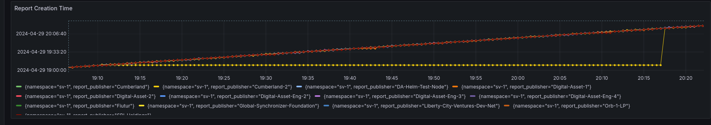

In this screenshot on the other hand, all SVs are not advancing.

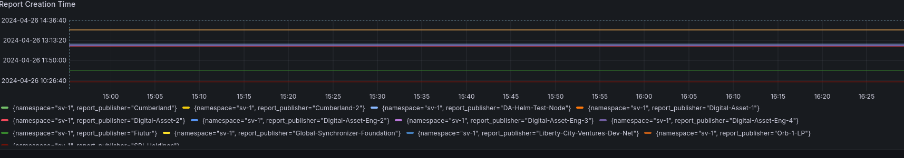

Note that the metric is exposed from our SV app so if our SV app is down, we won't see any metrics.

Depending on whether it is a network-wide issue or an SV local issue, investigations procees slightly differently:

#### SV Local Issues

For an SV local issue, the main thing to investigae is whether just the SV app is broken or whether the underlying Canton components might also be broken.

As a general rule, when a component is (suspected to be) failing, look for the earliest error message you can find in its logs.
(Filter the logs by severity `>= WARNING`.)
Sometimes a single error can completely brick a component, with no relevant follow-up log messages, so be sure to look sufficiently far back in time.

The easiest way of checking this is to check the periodic acknowledgements from their participant and mediator. This is a message each node
sends out to acknowledge that it has seen messages up to a certain timestamp. This allows both to see whether the node is active at all (i.e. has it stopped sending out acknowledgements) and whether it as lagging behind.

The acknowlegdements can be seen in the [global domain catchup dashboard](https://grafana.dev.global.canton.network.digitalasset.com/d/ca9df344-c699-4efe-83c2-5fb2639d96d9/global-domain-catchup?orgId=1&refresh=30s&var-DS=prometheus&var-namespace=sv-1&var-migration=All&var-member=All) (tip: you can filter by the ID of the sender at the top).
Particularly useful are the lag and the catchup speed which let you estimate how long it will take for a node to catchup.

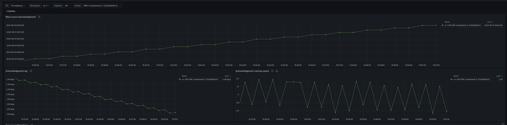


If you need more detailed information, you can also look at the sequencer logs.
For example, in the logs below you can see SBI acknowledging timestamp `2024-04-29T05:06:06.692783Z` at `2024-04-29 05:35:41.170` so it is roughly lagging 30min behind but the participant is active. A delay of a few seconds is expected, anything larger than a minute will mean that this participant is unable to confirm
transactions because it sees the confirmation only after the configured `confirmationResponseTimeout`.

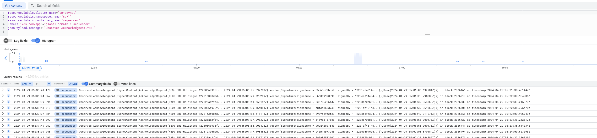

If you do see a lag, you want to check:

1. Is it catching up at all or just completely stuck / not completing any acknowledgements? If it is completely stuck, the reason might be a fatal error in the participant. Scan the participant logs for errors and warnings (see general rule above).

2. Has there been a sudden traffic spike that might have overloaded their sequencer? This is easiest to do using the [sequencer traffic dashboard](https://grafana.dev.global.canton.network.digitalasset.com/d/fdjrxql2alblsd/sequencer-traffic?orgId=1) (adjust cluster as needed). E.g., here we can see a spike starting at 6:50

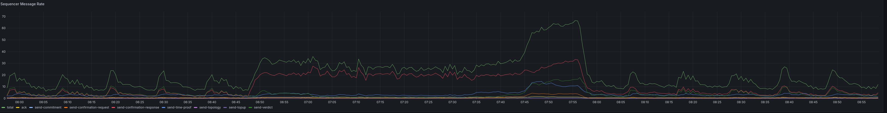
3. Are they catching up faster than realtime, i.e., do their acknowledgements advance within 10 minutes by more than 10 minutes and they will eventually catch up or do they fall further and further behind. E.g., in the screenshot here we can see that within 10 minutes, the acknowledgements only advance from `2024-04-29T05:02:33.813218Z` to `2024-04-29T05:04:32.392203Z` so SBI is falling further and further behind. Note that even if they can eventually catch up, we likely want to follow up with them to make sure they improve performance of our nodes.

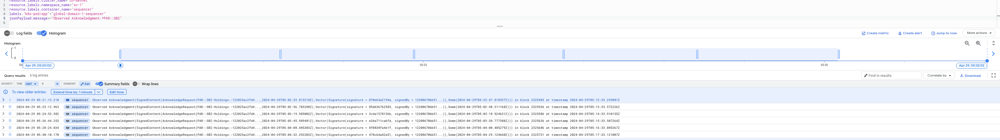

It is often also useful to compare this to the domain catchup metrics of our own nodes to see if the overload was specific to their node. This is best done using the [sequencer client delay](https://grafana.dev.global.canton.network.digitalasset.com/d/ca9df344-c699-4efe-83c2-5fb2639d96c9/global-domain-catchup?orgId=1&refresh=30s&var-DS=prometheus&var-namespace=sv-1&from=now-12h&to=now&viewPanel=1) graph in the domain catchup dashboard.

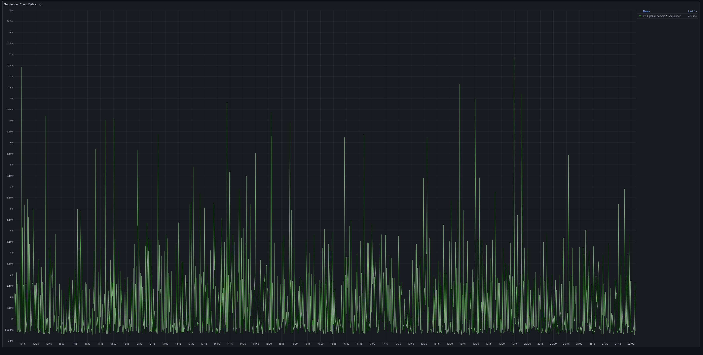

If the SV appears to be up2date according to acknowledgements but you do not
see status reports, check if you see other transactions from it. This is easiest
by anaylzing the `Ingested transaction` logs from our SV app. You should see among other things
reward coupon creations and confirmations for round operations.

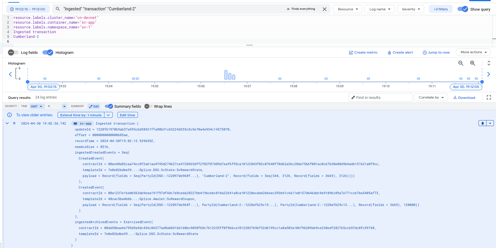

If you do see them, the SV app itself is active
but there might be an issue specific to submitting status reports. One possible cause of this can be
the mediator being unavailable since that is queried when submitting a status report. You can check that by looking at the traffic submitted by that mediator in the [sequencer traffic dashboard](https://grafana.dev.global.canton.network.digitalasset.com/d/fdjrxql2alblsd/sequencer-traffic?orgId=1&from=1714363043128&to=1714373918128). In the example here, Cumberland-2's mediator was unavailable and did not submit anything.

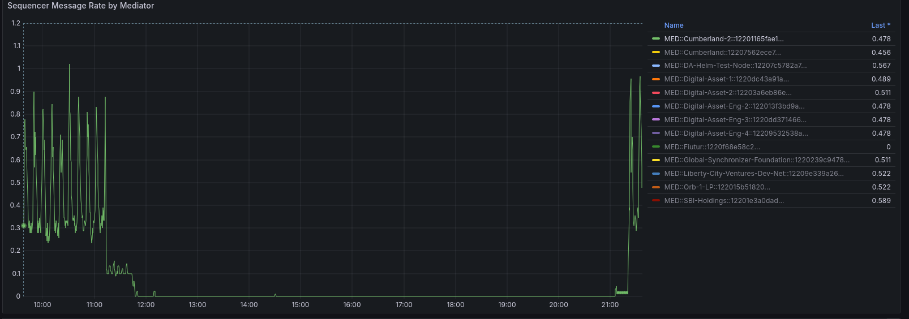

#### Network Wide Issues

Network wide issues can come from any of the layers involved in the daml transaction of submitting a status report:

1. CometBFT is not producing new blocks.
2. Sequencers are either unable to submit to CometBFT or unable to read from it.
3. Participants are unable to submit to sequencers.
4. Participants are unable to read the confirmation request.
5. Participants are unable to submit confirmation requests.
6. Mediators are unable to read the confirmation request.
7. Mediators don't get enough confirmations before `confirmationResponseTimeout`
8. Sequencers do not receive enough mediator responses before `mediatorResponseTimeout`
9. SV apps are not submitting status reports

CometBFT can easily be identified as blocks not advancing as described above so we focus on the other sections here.

A good way of starting here is from the top: Find a log of our SV app trying to submit a status report. Then trace through the logs
and figure out where it might get stuck. The logs can easily get overwhelming so as a starting point it is often useful to filter it down to only the different
Canton phases. For a successful transaction you will see all 7 phases.

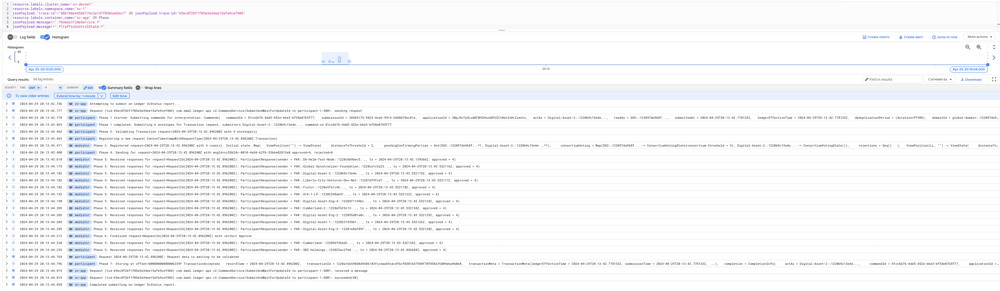

The primary cause of failure is usually a mediator timeout because it receives an insufficient number of confirmations.
In the following screenshot, you can see Cumberland-2 not confirming.

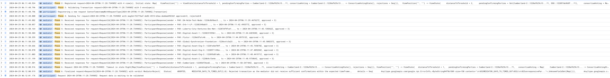

Once you pinned down the SV, you can again check their acknowledgements to see if their nodes are active at all and lagging behind or completely dead.

Other failure types are usually more rare and require case by case analysis based on the logs.

##### Recap: Canton phases

1. Participant submits
2. Mediator receives confirmation request
3. Participant receives confirmation request
4. Participant submits confirmation
5. Mediator receives confirmation
6. Mediator reaches verdict
7. Participant receives transaction accepted/rejected.
